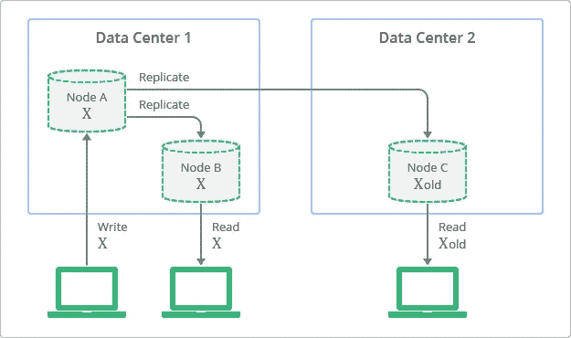

# 解释关于关系数据库和非 SQL 数据库的流行神话

> 原文：<https://medium.com/capital-one-tech/popular-myths-about-relational-no-sql-databases-explained-60c0e1c3c87a?source=collection_archive---------2----------------------->

## 2020 年，关系数据库和非 SQL 数据库的哪些说法不再正确？

网上有很多文章比较了关系数据库和非 SQL 数据库的传统特征。所以这里就不再赘述了。本文旨在揭示关系数据库和非 SQL 数据库的追赶游戏；相互学习和实施一些最佳实践。

当关系数据库最初在 20 世纪 70 年代设计时，存储非常昂贵。因此，关系数据库是在考虑单一机器的情况下构建的，并旨在用于需要强制执行 [ACID](https://mariadb.com/resources/blog/acid-compliance-what-it-means-and-why-you-should-care/) 合规性的适当结构化数据。同样，由于存储昂贵，数据被标准化到几个表中，没有任何冗余空间。

随着越来越多的公司在 21 世纪开始数字化，数据收集和存储需求不断增长，关系数据库显然无法为非结构化或半结构化数据提供必要的灵活性。它们不能很好地适应不断增长的需求，并且是影响可用性的单点故障。此外，由于数据规范化和对象到关系数据转换的额外开销，它们的性能很低。

为了解决这些缺点，在存储变得越来越便宜的时候，非 SQL 数据库开始出现。他们通过放松 ACID 合规性并遵循所谓的 [BASE 合规性](https://neo4j.com/blog/acid-vs-base-consistency-models-explained/)，提供了半结构化或非结构化数据所需的灵活性。它们还通过将数据分布在多台机器上，为海量数据存储需求提供了巨大的可伸缩性。为了实现高可用性，他们遵循“最终一致性”，即可用性(即使是陈旧的数据)优先于与最新数据的一致性。

然而，非 SQL 数据库获得广泛采用还需要一段时间。由于对数据结构和最终一致性的宽松政策，许多需要结构和强一致性的应用程序并不适合非 SQL 数据库。对于拥有使用关系数据库构建的遗留应用程序的人来说，将它们移植到 No-SQL 并不容易。此外，这些数据库的分布式特性也增加了复杂性。与各种非 SQL 数据库相关的学习曲线意味着不太懂技术的用户无法探索这一类别的广度和提供的好处。

在过去的几年中，开源数据库背后的动力为开发人员社区考虑每种数据库类型中提供的最佳实践并努力克服一些缺点铺平了道路。此外，托管云解决方案在构建服务方面投入了大量资金，以实现可扩展性、可用性、性能和安全性的最佳结果；这使得数据库维护和管理更加容易。

因此，用来决定何时使用关系数据库或非 SQL 数据库的一些标准已经改变，应该重新验证它们是否仍然适用。

下面，我将试图澄清一些与关系数据库和非 SQL 数据库相关的神话。

# 关于关系数据库的神话

## 1.关系数据库不提供快速读取性能或规模

如果您有一个大量读取的应用程序，现代关系数据库允许您设置读取副本，并围绕复制如何发生进行配置(同步与异步)。这使得应用程序不断增长的读取流量能够通过负载平衡跨多个读取副本分布。可配置的读取副本数量因数据库而异。此外，借助 [AWS RDS](https://aws.amazon.com/rds/) 等托管解决方案，扩展计算、内存和存储变得更加容易，并且实现扩展时不会出现停机。

这里的信息是评估您的具体使用情形，并确定需要多少个读取副本来满足您的应用程序不断增长的需求，以及多大的大小才足够。不要盲目地排除关系数据库，假设它们根本不可伸缩，因为它们对于读取是可伸缩的。

*注意:使用异步复制来读取副本，可以获得快速的写入性能，但必须处理与最终读取一致性相关的折衷。同步复制会产生即时一致性，但会降低写入性能。*

## 2.关系数据库的可用性不高

可用性是指无论何时需要，无论出现故障或基础设施中断等情况，数据始终可供应用程序使用。可用性通常由正常运行时间(T4)来衡量。您可能听说过术语 RTO(恢复时间目标)，即在发生中断的情况下，需要多长时间才能恢复。RTO 越小，可用性越高。

有了像 [AWS RDS](https://aws.amazon.com/rds/) 这样的托管解决方案，关系数据库的可用性在多 A-Z 部署中变得非常高。如果主数据库关闭，或者与主数据库的连接失败，或者服务器/数据中心崩溃，AWS RDS 可以自动故障转移到不同 A-Z 中的备用数据库，而无需应用程序进行任何更改。这个故障转移过程可能需要几分钟时间(如果使用 [AWS Aurora](https://aws.amazon.com/rds/aurora/) 甚至更短)。

对于非云解决方案，这可能涉及设置一个主副本架构，并使用解决方案来检测主服务器故障和故障转移到备用服务器(使其成为新的主服务器)。此故障转移过程可能需要几个小时。

这里的信息是评估您的用例是否可以接受这样的停机时间，并且在没有分析的情况下不排除关系数据库。

## 3.关系数据库不支持各种数据类型和结构

传统的关系数据库只支持某些标准的数据类型，如整数、字符串、布尔、长整型等。然而，像 [PostgreSQL](https://www.compose.com/articles/what-postgresql-has-over-other-open-source-sql-databases/) 这样的数据库在本质上是对象关系的，它让你能够在数据库中表示一个类似结构的对象。数据不需要在传统的关系数据库风格中被规范化，需要多个具有连接的表来表示该结构。它们还支持适用于存储几何、网络地址、文本搜索、货币和数组类型数据的多种数据类型。您也可以定义自己的自定义数据类型。由于支持以 JSONB 格式存储数据，PostgreSQL 为非结构化数据提供了灵活性，并实现了更快的数据检索。

# 关于非 SQL 数据库的神话

## 1.非 SQL 数据库或非关系数据库不能用于存储实体之间的关系

当有人说非 SQL 或非关系数据库时，并不意味着它们不表示或不能表示实体之间的关系。它们肯定是这样的，但是不需要采用规范化的表/列格式。在下面的例子中，你可以看到文档层次结构中关系表达方式的对比。

*例如:关系中的规范化结构与非 SQL 中的层次结构*

## 2.否-SQL 数据库对于关键应用程序用例不可靠，因为它们最终是一致的

最初，非 SQL 数据库实现了最终一致性，以提供高可用性和快速写入性能。权衡包括应用程序接受暂时读取陈旧数据的风险，并最终被赶上或丢失数据。

然而，现在的非 SQL 数据库允许您在最终一致性和强一致性之间进行选择。您还可以配置在提交事务之前需要确认多少个副本(通常称为仲裁)。

*例如:非 SQL 数据库的最终一致性*

*“Conceptual Depiction of Replication with Eventual Consistency” (https://cloud.google.com/datastore/docs/articles/balancing-strong-and-eventual-consistency-with-google-cloud-datastore) by Google Cloud (https://cloud.google.com/) is licensed under CC BY 4.0 (https://creativecommons.org/licenses/by/4.0/)*

## 3.否-SQL 数据库为所有场景提供了更好的性能

一般来说，非 SQL 数据库确实提供了更好的读取性能，因为它们是为您的数据结构(键值、图形、文档等)定制的。

然而，还是有一些细微的差别。

**答:数据库设计**:获得最佳性能在很大程度上依赖于理解常用的应用程序数据访问模式，然后基于这些模式设计数据库。一个糟糕的数据库设计，尽管选择了正确的非 SQL 数据库，也不会产生好的结果。此外，如果您向非 SQL 数据库发出这些标准应用程序访问模式之外的特殊查询，性能将不会很理想。

**b .分片**:使用非 SQL 数据库的主要好处之一是它可以使用一种叫做 [**分片**](/@jeeyoungk/how-sharding-works-b4dec46b3f6) 的分布式架构技术高效地扩展到高流量负载，这种技术也被称为**水平扩展**机制。与为服务器增加 CPU/RAM/磁盘空间的传统方法(垂直扩展)不同，分片以分布式方式将数据存储在多台机器上。当流量增加时，通过增加碎片数量(集群中的机器数量)，数据库会根据负载自动进行自我调整。然而，我们需要注意选择错误的分片密钥可能导致的热点。数据可能会不均匀地分布在各个碎片上，并且所有负载可能会严重集中在某些碎片上，从而无法产生最佳性能。

这里的信息是，对您的用例使用错误的非 SQL 数据库，或者不正确地使用它将不会得到积极的结果。在一些特定的场景中，非 SQL 数据库可以提供更好的性能，但并不是对所有情况都是如此。

## 4.不，SQL 数据库只能用于海量数据需求

虽然当您的数据不断生成并且您有大量存储需求时，没有 SQL 数据库确实是一个很好的选择，但是当它们有较小的数据存储需求时，不应该排除没有 SQL 数据库。借助云中的“按使用量付费”定价模式，您不会因为选择非 SQL 数据库来处理少量数据而有任何损失。

## 5.没有 SQL 意味着没有模式

没有 SQL 数据库能让您灵活地存储非结构化或半结构化数据。但是，如果您愿意，您仍然可以在需要的地方实施模式。像 [MongoDB](https://docs.mongodb.com/manual/core/schema-validation/) 这样以 JSON 格式存储数据的数据库，允许您使用 JSON 模式执行验证。您可以配置是否希望这些验证在插入或更新期间导致接受或拒绝文档，以及它们如何应用于现有文档。

正如您所看到的，关系数据库和非 SQL 数据库在克服它们的一些缺点方面已经取得了很大的进步，并且已经开始相互学习。虽然它们仍然非常不同，解决不同的问题，但随着时间的推移，很多事情都发生了变化。这种跨数据库家族的融合应该迫使我们重新考虑我们的数据库选择。我们不排除某些基于市场人气或传统性状历史对比的数据库。因为这些信息在 2020 年可能不像以前那样重要了。

*最初发表于*[T5【https://www.capitalone.com】](https://www.capitalone.com/tech/software-engineering/relational-and-nosql-database-myths/)*。*

*披露声明:2020 资本一。观点是作者个人的观点。除非本帖中另有说明，否则 Capital One 不隶属于所提及的任何公司，也不被这些公司认可。使用或展示的所有商标和其他知识产权是其各自所有者的财产。*