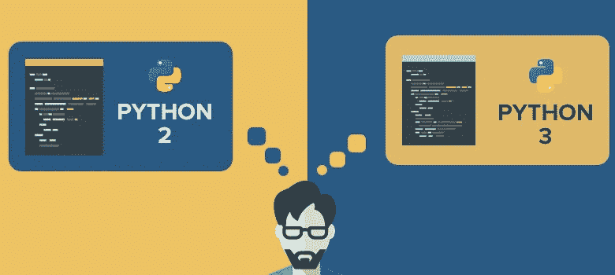
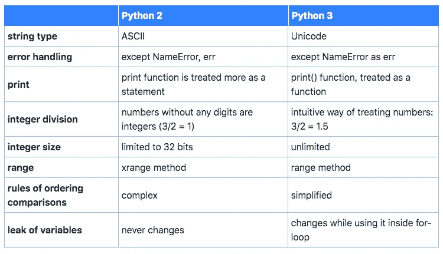

# 将 Python 2.7 代码移植到 Python 3。X

> 原文：<https://medium.com/quick-code/porting-python-2-7-to-python-3-x-b1506966e5a3?source=collection_archive---------8----------------------->

## **Python 开发者从 Python 2.7 到 Python 3.x 的轻松迁移指南**

Porting from Python 2.7 to Python 3.x

2008 年 12 月，Python 软件基金会发布了 3.0 版，引入了重大变化来改进 Python。由于发布后许多人不想升级他们的项目，开发人员已经支持这两个版本一段时间了，以免伤害用户的感情。

尽管在代码移植上花了很多时间，但许多人还没有这样做。同时，支持两个版本耗费了大量的时间和精力，阻碍了开发人员对 Python 3.0 的进一步改进。

这就是为什么 [Python 基金会决定宣布](https://www.python.org/psf/press-release/pr20191220/):

> ***敦促用户迁移到受支持的 Python 3 版本，以便从其众多改进中受益，并避免 2020 年 4 月后 Python 2.x 中的潜在安全漏洞。***

*这就是需要专业 Python 开发人员&软件架构师帮助的地方。*

## 代码移植的原因

Python 3。x 为开发人员和商业人士提供了许多好的选择:

*   大型社区支持。
*   默认情况下，标准库改进是可用的。
*   检测和修复错误的简化过程。
*   现代技术的支持:人工智能，大数据，机器学习。

## 如果我不移植代码会发生什么？

如果您或您的供应商在 Python 2 中发现安全问题，志愿者中没有人会帮助修复它，因为这个版本不再受支持。除了安全问题，您将无法使用:

1.  对异步 I/O (asyncio)的本机支持；
2.  新 MRO；
3.  f 字符串语法；
4.  @ dataclasses
5.  新包装；
6.  赋值表达式；
7.  键入批注；

以及其他[好的 Python 3 特性](https://docs.python.org/3.9/whatsnew/3.9.html)！

## 如何将 Python 2 移植到 Python 3

阻碍轻松迁移到 Python 3.0 的最大挑战是与版本 2.0 的向后不兼容。这意味着代码 Python 2.x 在 Python 3.0 上运行时总是会返回错误。动态 Python 标准化使得从 Python 2 到 Python 3 的机械迁移变得困难。

**升级 Python 版本需要做什么:**

**1。选择策略。**根据您的目标，您的供应商可以帮助您选择适合您项目的定制策略。其中最常见的可能是代码重写，以 Python 2.0 版本支持结束，转而支持 Python 3.0，或者将项目移植到 Python 3.0，而不添加新的 Python 2.0 特性。

**2。理解 Python 2 和 3 的主要区别。**

source: [Updating Python 2 to Python 3 | Painless Migration Guide](https://jellyfish.tech/updating-python-2-to-python-3/?utm_source=medium&utm_medium=publication&utm_campaign=python-migration)

**3。审核代码。**没有代码审计，任何升级、现代化或改进都是不可能的，因为它帮助开发人员定义可能的问题、瓶颈，并在需要时重建系统架构以提高性能。

**4。确保良好的测试覆盖率。**在一个完美的世界中，代码移植的每一个主要步骤都应该伴随着单元测试，以确保代码符合它的所有功能。良好的测试覆盖允许在开发阶段直接检测问题，这使得修复 bug 更加容易。

**5。使用 CI/CD 概念。**由[持续集成&交付](https://www.atlassian.com/continuous-delivery/principles/continuous-integration-vs-delivery-vs-deployment)概念保证的迭代发布有助于交付更好的代码，使整个应用程序更好地工作。

**6。开始在生产中使用 Python 3。**

**7。删除 Python 2 兼容性代码。**

## 结果

将 Python 代码从 2.0 移植到 3.0 的一系列操作类似于传统现代化的[过程](https://jellyfish.tech/software-modernization-case-study/?utm_source=medium&utm_medium=publication&utm_campaign=python-migration)。开发团队应该根据全面的计划谨慎行事，并正确估计风险。

如果没有专门的开发团队，移植 Python 代码仍然是一个挑战，但在大多数情况下，结果是值得的。

*考虑 Python 迁移？最好与有类似案例的* [*技术合作伙伴*](https://jellyfish.tech/?utm_source=medium&utm_medium=guest_post&utm_campaign=python_migration) *核实一下，以确定它给你的业务带来(或没有带来)的价值，然后再采取措施更新你的 Python 版本。*