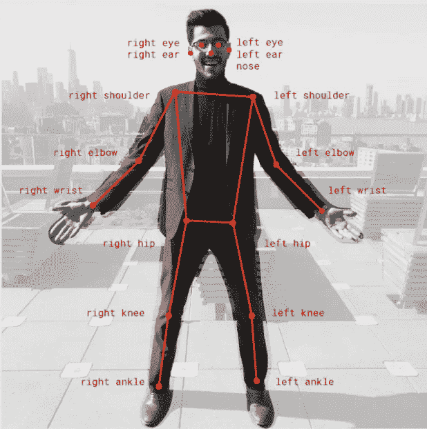

# PoseNet:手势检测的入口

> 原文：<https://medium.com/globant/posenet-your-gateway-to-gesture-detection-a15d0ed0ae40?source=collection_archive---------0----------------------->

您是否想过这些年来我们都是如何提供反馈的？

我们通常会写一张便条并把它放在一个邮箱里，我们会拨打他们的反馈电话，或者通过电子邮件向他们发送我们的建议。

如果你有机会观看我们 Globant UI 工程工作室的年度旗舰活动，“UI Next 的 **UI”，你会看到我们制作的一个应用程序，帮助我们的客人使用手势提供反馈。**

我们看一个小视频来一窥究竟。

Feedback Form

我们还开发了另一款类似的应用，名为**深蹲计算器**。它有助于计算一个人在笔记本电脑前深蹲的时间。

Squats Calculator

使这成为可能的是一个名为 PoseNet 的库，它构建在 TensorFlow 平台之上。

给你一个简单的描述， **TensorFlow** 是一个机器学习的开源平台，它为你提供了一个完整的工具生态系统来构建这些 ML 应用。

PoseNet 为我们提供了检测用户手势所需的预训练模型。这些预先训练好的模型在我们的浏览器中运行，这就是 PoseNet 与其他 API 依赖库的区别。因此，我们不必将我们的私人数据发送到后端服务器。隐私保护是 PoseNet 优于其他 API 依赖库的地方。

此外，任何人只要有一台配有摄像头的台式机或手机，就可以在他们的网络浏览器中体验这项技术。我们不需要一些庞大的类似服务器的资源来识别这些手势。我们可以用普通机器最少的东西来应付。

> **pose net 到底为我们做了什么？**

顾名思义，它估计对我们构成了威胁。

> 姿势估计是指计算机视觉技术，它可以检测我们通过网络摄像头提供的图像和视频中的人物，以便它能够为我们确定我们的肘部、手腕或任何其他身体关节在图像中的位置。

下图展示了 PoseNet 如何实时估计用户的关键点或姿势。

PoseNet 给了我们总共 **17 个可以利用的姿势要点**，从我们的眼睛和耳朵到膝盖和脚踝。

17 Pose key-points

> **如果我们提供给 PoseNet 的图像不够清晰怎么办？**

PoseNet 给出了它能够识别图像或图像中特定关键点的准确度的置信度分数。

Confidence Score

如上图所示，人 1 的置信度为 0.8，而视觉不太清晰的人 2 的置信度相对较低，为 0.7。这被表示为一个 JSON 响应。

“ ***得分*** ”表示该人或特定关键点的置信度得分。“***x***’&’***y***”表示该特定关键点在图像中的各自坐标。

PoseNet Response

如果你有什么想法，想继续写代码，你可以从[这里](https://github.com/tensorflow/tfjs-models/tree/master/posenet/demos)克隆代码，然后转到 camera.js 文件。

在这个文件中，您可以看到下面的代码片段，其中发生了实际的响应操作。这是你发挥创造力的地方。

## **我们从 PoseNet 收到的是一条原始的 JSON 信息，但是我们如何可视化这 17 个关键点和置信度得分，并作为开发人员使用它们，取决于我们自己。**

## 让我们以此为基础构建一些东西，帮助人们的日常生活！

**参考&信用链接**

 [## 用 TensorFlow.js 实现浏览器中的实时人体姿态估计

### Dan Oved，谷歌创意实验室的自由创意技术专家，NYU ITP 大学的研究生。编辑和…

medium.com](/tensorflow/real-time-human-pose-estimation-in-the-browser-with-tensorflow-js-7dd0bc881cd5)  [## 张量流/tfjs-模型

### 这个包包含一个名为 PoseNet 的独立模型，以及一些演示，用于运行实时姿态估计…

github.com](https://github.com/tensorflow/tfjs-models/tree/master/posenet)