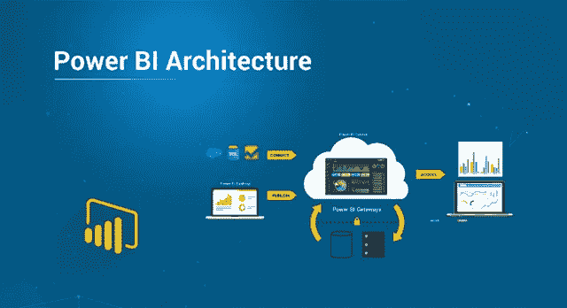
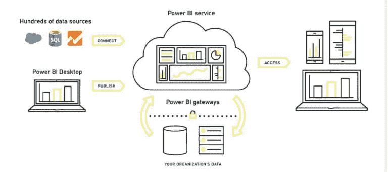
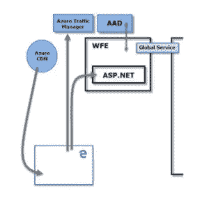
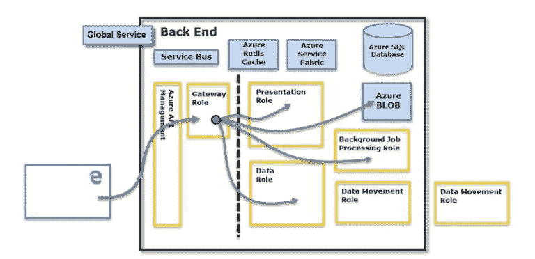

# Power BI 架构以及数据存储安全性

> 原文：<https://medium.com/edureka/power-bi-architecture-270bdd8b5e25?source=collection_archive---------2----------------------->

Power BI Architecture — Edureka

Power BI 是微软的数据可视化、报告和分析工具及服务的总称。Power BI 可以从各种来源导入数据，并组织它们来运行查询、构建报告仪表板和数据可视化。Power BI 有一组可用于不同平台和用途的组件。在本文中，我们将了解以下主题:

*   什么是微软 Power BI 架构？

1.  Web 前端集群

2.后端集群

*   数据存储安全性
*   用户认证
*   数据和修复安全性

那么，让我们开始这篇 Power BI 架构教程吧。

# 什么是微软 Power BI 架构？

Power BI 架构是基于 Azure 构建的服务。Azure 是微软的云计算基础设施和平台。

该服务设计基于两个集群——在线前端(Web 前端)集群和后端集群。Web 前端集群负责对 ability bismuth 服务的初始关联和认证，并且一旦被记录，后端集群处理所有产生的用户交互。

**Power BI gateway** 将内部数据源连接到 Power BI 桌面或 Power BI 云服务，以获得用于报告和分析的连续数据。

Power BI 架构使用**Azure Active Directory(AAD)**来存储和管理用户身份。它还管理知识和数据受害者 **Azure BLOB** 和 **Azure SQL** 信息的存储。

## Web 前端集群:Power BI 架构

Web 前端负责初始连接、客户端身份验证和请求路由到 Power BI 中最近的数据中心。Power BI 使用 **Azure 流量管理器(ATM)** 将用户流量定向到最近的数据中心，该数据中心由试图连接到 Power BI 进行身份验证流程并下载静态内容和文件的客户端的**域名系统(DNS)** 记录确定。Power BI 还使用**Azure Content Delivery Network(CDN)**根据地理位置高效地向用户分发必要的静态内容和文件。

## 后端集群:Power BI 架构

后端集群管理 Power BI 服务中的可视化、用户仪表板、数据集、报告、数据存储、数据连接和数据刷新。

所有数据都存储在 Azure BLOB 存储和用户 Azure 存储帐户中，并由 Azure Active Directory 进行身份验证。

# 数据存储安全性

Power BI 体系结构使用两个主要存储库来存储和管理知识。

从用户上传的数据通常被发送到 Azure BLOB 存储，每个人的数据作为系统本身的工件保存在 Azure SQL 信息中。

后端集群图像中的线(如前一部分虚线左侧所示)阐明了 square 度量的用户可访问的唯一 2 个元素与 square 度量的系统仅可访问的角色之间的边界。

一旦关联文档用户连接到服务，消费者的关联和任何请求都由**网关角色**接受和管理，最终由 **Azure API 管理处理。**

然后，它代表用户与服务的其余部分进行交互。此外，一旦消费者试图查看仪表板，网关角色接受该请求，然后单独向**演示角色**发送邀请函，以检索浏览器呈现仪表板所需的信息。

# 用户认证

用户通过用于建立其 Power BI Services 帐户的电子邮件地址登录服务。

Power BI 用户的体系结构因为有效用户名而登录电子邮件，每当用户试图访问一条信息时，该用户名被传递给资源。有效用户名被映射到一个**用户主体名称(UPN)** ，所有与 windows 域帐户相关联的解析都应用于它。

对于使用工作电子邮件登录 Power BI 架构的组织(如 username@mail.com)，有效的用户名到 UPN 的映射非常容易。对于无法使用工作电子邮件登录 Power BI 体系结构的组织，AAD 和内部凭据之间的映射将强制对其进行目录同步。

架构的平台安全包括多租户环境安全和网络安全，因此，能够提供额外的基于 AAD 的安全措施。

# 数据和修复安全性

如本文前面所述，本地 Active Directory 服务器使用用户的 Power BI 体系结构登录来映射到凭证的 UPN。然而，重要的是要注意到用户对他们的分享承担责任。如果连接到数据源的用户牺牲其凭据并共享支持该数据的报表，则共享仪表板的用户不能被授予对该报表的访问权限。

一个例外是与**SQL Server associate analysis Services 的连接。**对底层报告或数据集的访问会启动对试图访问报告的用户的身份验证。并且如果用户具有访问信息的备用凭证，则可以单独授予访问权。

所以，这就是微软 Power BI 架构教程。希望你喜欢这个解释。

如果你想查看更多关于人工智能、DevOps、道德黑客等市场最热门技术的文章，你可以参考 Edureka 的官方网站。

请留意本系列中的其他文章，它们将解释 Power BI 的各个其他方面。

> *1。* [*异能匕教程*](/edureka/power-bi-tutorial-ed9619113223)
> 
> *2。* [*电力 BI 仪表盘*](/edureka/power-bi-dashboard-fe37c2b9292c)
> 
> *3。* [*电力匕桌面*](/edureka/power-bi-desktop-42c867c712ca)
> 
> *4。*[*PowerBI KPI*](/edureka/power-bi-kpi-c256a3749da5)
> 
> *5。* [*电力毕报道*](/edureka/power-bi-reports-c64ee557e346)
> 
> 6 *。* [*要诀使之富有冲击力&互动力量 BI 报道*](/edureka/power-bi-reports-c64ee557e346)
> 
> *7。* [*DAX 中的力量 BI*](/edureka/power-bi-dax-basics-27008f4f7978)
> 
> *8。* [*MSBI vs 权力毕*](/edureka/msbi-vs-power-bi-ef5dab26c463)
> 
> *9。* [*电力 BI 开发人员工资*](/edureka/power-bi-developer-salary-1ce0577f1013)

*原载于 2019 年 9 月 9 日*[*https://www.edureka.co*](https://www.edureka.co/blog/power-bi-architecture/)*。*