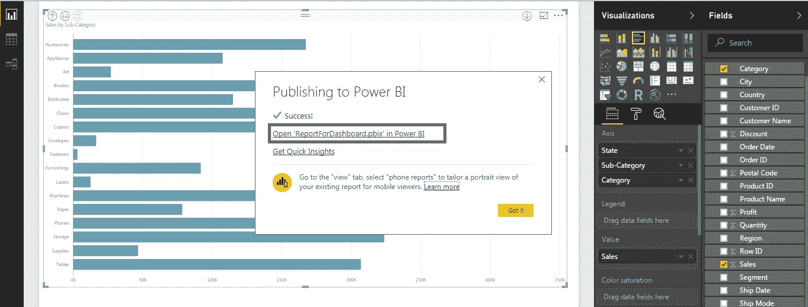

# Power BI 仪表板—在 Power BI 中创建仪表板

> 原文：<https://medium.com/edureka/power-bi-dashboard-fe37c2b9292c?source=collection_archive---------0----------------------->

Power BI Dashboard — Edureka

在这篇关于 Power BI Dashboard 的文章中，我们将重点介绍如何创建一个仪表板，并使用它来获得更好的数据洞察力。如果你是电力 BI 的新手，想要对电力 BI 有所了解，你可以通过我的[**以前的文章**](/edureka/power-bi-tutorial-ed9619113223) 来帮助你了解并开始使用电力 BI。

因此，让我们按照以下顺序开始阅读这篇 Power BI dashboard 文章:

1.  什么是 Power BI？
2.  Power BI 中的报告
3.  Power BI 仪表板
4.  仪表板与报告
5.  在 Power BI 中创建仪表板

# 什么是 Power BI？

Power BI 是微软提供的商业分析服务。它提供了具有自助 BI 功能的交互式可视化。终端用户可以自己创建报告和控制面板。这意味着他们不必依赖信息技术人员或数据库管理员。

Power BI 还为您提供基于云的 BI 服务，称为“Power BI 服务”，以及基于桌面的界面，称为“Power BI 桌面”。它提供数据仓库功能，包括数据准备、数据发现和交互式仪表板。2016 年 3 月，微软在其 Azure 云平台上发布了一项名为 Power BI 的附加服务。使用它，人们可以轻松地交付报告、分析数据，并使用 Power BI 执行各种 ETL 操作。

Power BI 网关允许您将 SQL Server 数据库、分析服务和许多其他数据源连接到您的仪表板。报告门户嵌入了 Power BI 报告和仪表盘，为您提供统一的体验。

与此同时，我已经多次使用“报告”和“仪表板”这两个术语。在这个 Power BI dashboard 博客的下一部分，让我们试着逐一理解这些术语。

# Power BI 中的报告

Power BI 报告只不过是一个数据集的多视角视图，它以可视化方式呈现了该数据集的不同发现和见解。一个报告可以是单个可视化，也可以是充满可视化的页面。

可视化可以固定到仪表板，如果您选择固定的可视化，它将从固定的位置打开报告。需要记住的重要一点是，报告是基于单个数据集的。

报告中的可视化表现了大量的信息。这些可视化不是静态的，您可以选择添加和删除数据，更改可视化类型，并在探索见解和寻找答案的过程中应用过滤器。像仪表板一样，报告是高度交互式的、高度可定制的，并且可视化随着底层数据的变化而更新。

下图显示了示例报告的外观。

# Power BI 仪表板

Power BI 仪表板是一个单独的页面，通常称为画布，它使用可视化来讲述一个故事。因为它被限制在一个页面中，所以一个设计良好的仪表板只包含这个故事中最重要的元素。

仪表板上可见的可视化效果称为平铺。这些单幅图块通过报告固定在仪表板上。仪表板上的可视化来自报告，每个报告都基于一个数据集。事实上，看待仪表板的一种方式是将其视为底层报告和数据集的入口点。选择可视化会将您带到用于创建它的报告(和数据集)。

仪表板是监视您的业务、寻找答案以及一目了然地查看您最重要的指标的一种极好的方式。仪表板上的可视化可能来自一个或多个底层数据集，也可能来自一个或多个底层报告。控制面板结合了内部数据和云数据，无论数据位于何处，都可以提供整合的视图。

仪表板不仅仅是一张漂亮的图片，它是高度交互式和高度可定制的。切片会随着基础数据的变化而更新。

人们经常混淆仪表板和报告，因为它们也是充满可视化效果的画布。但是有一些主要的区别。让我们借助下表来看看这些差异。

# 仪表板与报告

# 在 Power BI 中创建仪表板

Power BI dashboard 的使用可以通过一个示例得到最好的理解，在这个示例中，数据集具有不同的数据类型，每种数据类型都有可能揭示有价值的业务洞察力。让我们考虑一个零售超市的使用案例，从区域销售、单店交易、产品类别、消费者细分、销售数据、折扣率和利润等数据中发掘洞察力。

如果您从业务角度考虑上述用例，您可能需要以下几点的答案:

*   哪个地区比其他地区更有利可图
*   关注哪些客户群
*   寻找细分市场以减少投资。

为了获得上述观点的洞察力，你需要以不同的方式处理数据，目的是提高企业的生产力和盈利能力。现在让我们试着理解使用超市数据集我们能得到什么样的见解

1.  超级商场的整体销售和业绩:第一个合理的步骤是了解超级商场在一段时间内的业绩。为此，我们需要每个季度来自*不同地区*的*销售*数据。我们还需要了解与其他地区相比，哪个地区更赚钱或更亏损。
2.  **不同州的表现:**了解了地区层面的利润和亏损后，我们可以在州和地区层面创建*【销售额与利润】*的*散点图*，分别以销售额和利润为 X 轴和 Y 轴。这些状态可以被映射以理解不同的场景。例如，一家企业可以决定在一个销售额较少但利润较高的州加大投资。如果销售额增加但利润下降，另一个州可能会亮起红灯。
3.  **不同客户群的表现:**对于企业来说，了解哪个客户群在不同地区推动销售和利润增长也是至关重要的。例如，带有客户细分和销售/利润视图的饼图可以帮助企业制定未来战略——哪个细分市场应该是主要关注领域，例如 B2B 消费者细分市场可能会以非常少的销售数量获得最大的利润——显然，在这个特定的地区存在着扩大 B2B 细分市场的巨大机会。
4.  **按类别划分的收入:**在特定地区和客户群中，我们可以获得特定产品类别的数据，以及它们之间的比较情况(在销售额和利润方面)。如果厨房电器比清洁设备产生更好的利润，这是一个有价值的洞察力，可以影响未来的计划。

因此，让我们来看看是否可以使用 Power BI dashboard 更好地可视化这些数据。但在此之前，我将创建一个包含所有可视化效果的报告，因此我可以将这些可视化效果固定在仪表板上。如果您希望与我一起创建这些报告，您可以单击此 [***链接***](https://goo.gl/3W3xYL) 下载 Power BI desktop，我们将使用该界面进行可视化。

那么让我们开始吧，好吗？

下图显示了 Power BI 桌面界面的外观。我们在界面的左上角有三个选项卡。第一个选项卡是“报告”选项卡，默认情况下可见，我们将使用它来创建报告。接下来是数据选项卡，用于查看导入的数据集。最后一个选项卡是 relations 选项卡，它给出了数据集中不同变量之间的关系，如果它们定义得很好的话。

您可以轻松地将数据集导入 Power BI。这可以通过点击*获取数据*选项卡来完成。屏幕的右上角有*可视化*标签。它下面列出的所有不同种类的可视化都可以用来满足您的需求。在 V *isualizations* 选项卡旁边有一个*字段*选项卡，它给出了您的数据集拥有的所有字段。

我已经导入了超市数据集。您可以使用此 [***链接***](https://goo.gl/xwFa4B) 下载数据集。导入数据集后，界面将为您提供加载或编辑数据的选项，如下图所示。

一旦我们导入了数据集，您就可以开始可视化数据了。使用 Power BI，您所要做的就是*选择*可视化，然后将所需的字段拖放到可视化模板上进行查看。请参考下图。我选择了一个地图表示，并将 state 字段拖放到地图上。

我的目的是让你理解关于 Power BI 界面的基础知识。我相信它们很容易理解。因此，让我们继续我们的用例，并尝试像前面讨论的那样可视化数据。

# 总销售额和利润

正如你在下面的截图中看到的，我已经使用了地图表示，并给它“州”和“利润”字段作为输入。可视化给了我们国家级的“利润领袖”，这是由更大的泡沫代表的。

您可以继续保存这个可视化，甚至立即发布它。相反，我会为所有单独的可视化添加一个额外的页面，然后发布完整的报告。这将使将这些可视化固定到 Power BI 仪表板变得容易，并且还可以防止您在一个页面中使用多个可视化。

这很容易做到，只需点击屏幕底部左侧的加号，您的新页面就添加好了。我会这样做，并创建下一个可视化。

我选择了一个线形图来显示“利润”、“销售额”和“订单日期”字段。可视化创建完成后，我将表示的时间线从“每年”改为“每季度”，这可以通过点击屏幕右上角的导航来完成。同样参考下图。

从上图中可以看出，第二季度后销售额已经上升。这些可视化是交互式的。如果您在图表上移动鼠标指针，它将显示统计信息，如上图所示。

# 不同状态的性能

在下面的可视化中，我创建了一个散点图，X 轴表示销售额，Y 轴表示利润。我选择 sum 作为销售和利润轴的合计。

这种可视化可以帮助我们将状态划分为三个业务战略重点领域——保留、发展和撤资。右上角的高销售额和高利润的州目前处于有利地位，企业希望在未来保持这一地位。中线右侧的州可以被企业视为机会，其中销售额的增加将有助于增加企业利润——制定战略。最后，低销售额和低利润或高销售额但低利润的州绝对不是企业应该集中撤资的地区。这对于制定商业投资策略有很大帮助。

下图显示了散点图。

# 不同客户群的表现

有了地区和州级别的可见性，我们现在可以了解哪个消费者细分市场正在推动销售和利润，并确定要关注哪个细分市场(客户、公司和家庭办公室)。

例如，我们可以看到，在中部地区，尽管消费者细分市场贡献了 50%的销售额，但其利润份额却很低。然而，企业部门的利润份额要高得多，但销售贡献却较低。毫无疑问，企业应该把重点放在增加企业销售贡献上，这可以影响企业的盈利能力。

## **按类别划分的创收**

下一个合乎逻辑的步骤是在产品类别级别获得洞察力。我们可以了解哪种产品在特定地区和消费者细分市场的销售额和利润更高。或者各种产品类别在销售和利润方面的表现。

在 Power BI 中，您可以向数据中添加多个过滤器，以获得您想要的准确洞察力。您可以单击可视化左上角的向下钻取选项来更改数据的表示。对于我们的超市数据集，您可以使用钻取选项按州、类别和子类别查看销售额，以满足您的需求。

到目前为止，我们已经介绍了 Power BI 数据可视化的基础知识。我们可以从现有的数据中发掘出更多的洞见。我敦促你继续尝试其他的视觉化，这可能有助于解开那些我可能已经错过的洞见。

就这个 Power BI dashboard 博客而言，现在让我们保存这个文件并创建一个仪表板。第一步是将我们的工作保存为报告。在下一张图中，我已经做到了。

一旦您保存了文件，您应该继续发布您的报告。屏幕右上角有*发布*选项。请参考下图。

一旦您发布了博客，您将会看到一个带有链接的弹出窗口，如果您单击该链接，它会将您重定向到一个网页，其中包含您发布到 web 的报告。

下图显示了一个已发布的报告。

您可以将报表中的视觉效果固定到仪表板上。首先，你需要选择一个视觉。完成后，您可以单击固定可视符号，将可视内容固定到您的仪表板上。请参考下图。

单击“锁定视觉”选项后，将会打开以下选项卡。您可以将视觉效果固定到现有仪表板，也可以创建新仪表板。我已经创建了一个新的仪表板，然后将视觉效果固定到它上面。

下图显示了锁定可视化效果后它在仪表板上的外观。

现在，我将把我们创建的所有视觉效果添加到仪表板中。请参考下图。您可以调整仪表板上的视觉效果，以满足您的需求。

Power BI 仪表板为您提供以下功能:

*   添加磁贴
*   使用指标
*   查看相关内容
*   设为特色
*   订阅
*   分享
*   视角
*   用 Power BI 问答问一个问题。

让我们逐一看看 Power BI dashboard 的这些功能:

您可以向现有仪表板添加单幅图块。平铺可以是图像、网页内容、文本框或视频。

*仪表板使用指标*为您提供每日浏览量、总份额等信息。参考下图。

您可以将您的仪表板设置为特色仪表板，订阅相关仪表板以获取更新，甚至共享您的仪表板。为了共享您的仪表板，您可以点击*共享*选项，并输入收件人的电子邮件 Id。我已经开始共享仪表盘了。请参考下图。

有了 Power BI Q & A(问答)，你可以提出问题，用自然语言查询得到即时答案。只需在*左上角的*标签中输入您的问题或关键词，您就会得到答案。但是，您键入的关键字应该出现在数据集中。下图按利润显示了芝加哥的销售额。

*关于 Power BI Dashboard 的文章到此结束。我希望这篇文章对你有所帮助，并增加了你的知识价值。*

如果你想查看更多关于人工智能、DevOps、道德黑客等市场最热门技术的文章，那么你可以参考 [Edureka 的官方网站。](https://www.edureka.co/blog/?utm_source=medium&utm_medium=content-link&utm_campaign=power-bi-dashboard)

请留意本系列中的其他文章，它们将解释 Power BI 的各个其他方面。

> 1.[有影响力的小技巧&互动电力 BI 报告](/edureka/power-bi-reports-c64ee557e346)
> 
> 2. [Power BI 桌面](/edureka/power-bi-desktop-42c867c712ca)
> 
> 3. [PowerBI KPI](/edureka/power-bi-kpi-c256a3749da5)
> 
> 4.[电力 BI 报告](/edureka/power-bi-reports-c64ee557e346)
> 
> 5.[电源 BI 教程](/edureka/power-bi-tutorial-ed9619113223)
> 
> 6. [DAX in Power BI](/edureka/power-bi-dax-basics-27008f4f7978)
> 
> 7. [MSBI vs 权力毕](/edureka/msbi-vs-power-bi-ef5dab26c463)
> 
> 8.[电力 BI 开发人员工资](/edureka/power-bi-developer-salary-1ce0577f1013)
> 
> 9.[电力 BI 架构](/edureka/power-bi-architecture-270bdd8b5e25)

*原载于 2017 年 9 月 3 日 www.edureka.co***。**