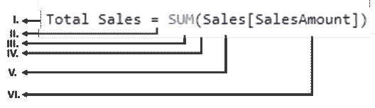

# 了解如何在 Power BI 中编写 DAX

> 原文：<https://medium.com/edureka/power-bi-dax-basics-27008f4f7978?source=collection_archive---------0----------------------->


Power BI DAX — Edureka

这个博客基本上是为刚接触 ***Power BI 桌面*** 的用户设计的，旨在给你一个快速简单的公式语言 ***数据分析表达式(DAX)*** 的演示。如果你熟悉 ***MS Excel*** 或 ***SQL*** 中的函数，那么***Power BI DAX****中的很多公式都会出现类似你的情况。*

*   *DAX 是什么？*
*   *它是如何工作的？*

1.  *句法*
2.  *语境*
3.  *功能*

*   *计算列和度量值*

1.  *计算列*
2.  *措施*
3.  *计算列与度量值*

*   *Power BI DAX 中的函数类型*

1.  *聚合函数*
2.  *计数函数*
3.  *日期时间函数*
4.  *数学函数*
5.  *逻辑函数*
6.  *信息功能*
7.  *文本功能*

*   *使用 Power BI DAX 创建您的第一个测量*

# *DAX 是什么？*

*因此，使用 Power BI 桌面创建报告非常容易，可以立即显示有价值的见解。*

*但是，如果您需要分析所有不同日期范围内所有产品类别的增长百分比，该怎么办呢？或者，你需要计算你的公司相对于市场巨头的年增长？*

*学习 DAX 将帮助你最大限度地利用你的 ***图表和可视化*** ，解决实际的商业问题。*

******

*Power BI DAX 包括一个超过 200 个函数、操作符和构造的库。它的库提供了巨大的灵活性，可以为任何数据分析需求创建计算结果的方法。*

# *它是如何工作的？*

*首先，让我给你解释一下这是如何工作的。在很大程度上，我们将围绕三个基本概念来构建我们对 Power BI DAX 的理解:、 ***上下文*** ***功能*** 。*

*当然，这里还有其他重要的概念，但是理解这三个概念将为你建立技能提供最好的基础。*

## *句法*

****语法*** 由组成公式的各种组件以及公式的编写方式组成。看看这个简单的 DAX 公式。*

*当试图理解 DAX 公式时，将每个元素分解成你每天都在思考和使用的语言通常会很有帮助。因此，该公式包括以下语法元素:*

**

*****总销售额**是度量名称。***

*****二。****等号运算符(=)** 表示公式的开始。***

*****三世。** **SUM** 将列中的所有数字相加， **Sales【销售额】**。***

*****四。**有这些**括号** **()** 将包含一个或多个参数的表达式括起来。所有函数都需要至少一个参数。***

*****五、**销售额是引用的表。***

*****六。**一个**参数**将一个值传递给一个函数。被引用的列**【销售额】**是一个参数，SUM 函数通过它知道它必须对哪一列进行合计。***

***简单地说，您可以将它理解为， **" *对于名为“总销售额”的度量值，计算(=)Sales 表中[SalesAmount ]列中值的总和******

***强大的 bi dax 编辑器包括一个建议功能，通过向你建议正确的元素来帮助你创建语法正确的公式。***

## ***语境***

******上下文*** 是 3 个 DAX 概念中最重要的一个。当一个人谈到上下文时，这可能指两种类型之一； ***行上下文*** 和 ***过滤上下文*** 。***

***在谈到*度量*时，主要使用**行上下文**最容易被认为是当前行。每当公式中有一个函数应用筛选器来标识表中的单个行时，它都适用。***

*****过滤上下文**比行上下文更难理解。您可以很容易地将过滤器上下文视为在计算中应用的一个或多个过滤器。行上下文中不存在筛选器上下文。相反，它是前者的补充。看下面的 DAX 公式。***

***该公式包括以下语法元素:***

******

*****一、**措施名称**门店销售**。***

*****二。****等号运算符(=)** 表示公式的开始。***

*****III。****计算**函数计算一个表达式，作为一个参数。***

*****四。**括号 **()** 将包含一个或多个参数的表达式括起来。***

*****五、**一个度量**【总销售额】**在同一个表中作为一个表达式。***

*****六。**逗号(，)将第一个表达式参数与过滤器参数分开。***

*****七。**完全限定的引用列**频道【频道名称】**是我们的行上下文。该列中的每一行都指定了一个渠道、商店、在线等。***

*****八世。**特定值，**存储**用作过滤器。这是我们的过滤上下文。***

******此公式确保*********总销售额仅针对 Channel[ChannelName]列中值为“Store”的行进行计算，作为一个筛选器。*********

## ****功能****

*******函数*** 是预定义的、结构化的、有序的公式。他们使用传递给他们的参数进行计算。这些参数可以是数字、文本、逻辑值或其他函数。****

# ****计算列和度量值****

****在这篇博客中，我们将关注在*测量*和*计算栏*中的计算中使用的幂 BI DAX 公式。****

## ****计算列****

****在 Power BI 桌面上创建数据模型时，可以通过创建新列来扩展表。列的内容由 DAX 表达式定义，逐行计算或在表中当前行的上下文中计算。****

****但是，在 DAX 的数据模型中，所有计算列都占用内存空间，并且是在表处理期间计算的。****

****这种行为有助于获得更好的用户体验，但它使用了宝贵的 RAM，因此在生产中是一个坏习惯，因为每个中间计算都存储在 RAM 中，浪费了宝贵的空间。****

## ****措施****

****在 DAX 模型中还有另一种定义计算的方法，如果您需要对聚合值而不是逐行进行操作，这种方法会很有用。这些计算是测量。DAX 的需求之一是需要在表中定义一个度量。但是，该度量并不真正属于表。因此，您可以将度量从一个表移动到另一个表，而不会失去其功能。****

## ****计算列与度量值****

****度量值和计算列都使用 DAX 表达式。区别在于评价的语境。度量值是在报表或 DAX 查询中计算的单元格的上下文中计算的，而计算列是在它所属的表中的行级别计算的。****

****即使它们看起来相似，计算列和度量值之间也有很大的差异。计算列的值是在数据刷新期间计算的，并使用当前行作为上下文；它不依赖于报告中的用户交互。****

****因此，每当您想要执行以下操作时，都必须定义一个计算列；****

*   ****将计算结果放在切片器中，或者在数据透视表的行或列中查看结果(相对于值区域)，或者在图表的轴中查看结果，或者将结果用作 DAX 查询中的筛选条件。****
*   ****定义一个严格绑定到当前行的表达式。例如，Price * Quantity 不能计算两列的平均值或总和。****
*   ****对文本或数字进行分类。例如，度量值的范围。****

****度量对当前上下文定义的数据聚合进行操作，这取决于报表中应用的筛选器，如数据透视表中的切片器、行和列选择，或者应用于图表的轴和筛选器。****

****因此，每当您想要显示反映用户选择的结果计算值时，都必须定义一个度量，例如；****

*   ****当你计算特定数据的利润百分比时。****
*   ****当您计算某个产品相对于所有产品的比率，但保留按年份和地区的筛选器时。****

# ****Power BI DAX 中的函数类型****

## ****部****

****此 DAX 函数返回列中或两个标量表达式之间的最小数值。****

******语法******

****`MIN(<column>)`****

******示例******

****`=MIN([ResellerMargin])`****

## ****迈纳****

****此 DAX 函数返回列中的最小值，包括任何逻辑值和表示为文本的数字。****

******语法******

****`MINA(<column>)`****

******示例******

****`=MINA(([PostalCode])`****

## ****疯丫头****

****此 DAX 函数返回通过对表中每一行的表达式求值而得到的最小数值。****

******语法******

****`MINX(<table>, < expression evaluated for each row>)`****

******例子******

```
**=MINX( FILTER(InternetSales, InternetSales[SalesTerritoryKey] = 5), InternetSales[Freight] + InternetSales[TaxAmt])**
```

## ****马克斯(男子名ˌ等于 Maximilian)****

****此 DAX 函数返回列中的最大值，包括任何逻辑值和表示为文本的数字。****

******语法******

****`MAX(<column>)`****

******例子******

****`=MAX([ResellerMargin])`****

## ****MAXA****

****此 DAX 函数返回列中的最大值，包括任何逻辑值和表示为文本的数字。****

******语法******

****`MAXA(<column>)`****

******示例******

****`=MAXA(([PostalCode])`****

## ****MAXX****

****此 DAX 函数返回通过对表中每一行的表达式求值而得到的最大数值。****

******语法******

****`MAXX(<table>, < expression evaluated for each row>)`****

******示例******

```
**=MAXX( FILTER(InternetSales, InternetSales[SalesTerritoryKey] = 5), InternetSales[**
```

## ****总和****

****这个 DAX 函数将一列中的所有数字相加。****

******语法******

****`SUM(<column>)`****

******示例******

****`=SUM(Sales[Amt])`****

## ****平均的****

****此 DAX 函数返回列中值的算术平均值。****

******语法******

****`AVERAGE(<column>)`****

******例子******

****`=AVERAGE(InternetSales[ExtendedSalesAmount])`****

# ****SUMX****

****此 DAX 函数返回对表中每一行计算的表达式的总和。****

******语法******

****`SUMX(<table>, <expression evaluated for each row>)`****

******例子******

****`=SUMX(FILTER(InternetSales, InternetSales[SalesTerritoryID]=5),[Freight])`****

## ****平均 x****

## ****此 DAX 函数计算对表求得的一组表达式的算术平均值。****

******语法******

****`AVERAGEX(<table>, <expression evaluated for each row>)`****

******示例******

****`=AVERAGEX(InternetSales, InternetSales[Freight]+ InternetSales[TaxAmt])`****

# ****2.计数函数****

## ****区别计数****

****这是一个 DAX 函数，用于返回列中项目的非重复计数。因此，如果同一个项目有多个编号，该函数将把它计为一个项目。****

******语法******

****`DISTINCTCOUNT(<column>)`****

******示例******

****`=DISTINCTCOUNT(ResellerSales_USD[SalesOrderNumber])`****

## ****数数****

****这是一个 DAX 函数，用于返回列中的项目计数。因此，如果同一个项目有多个编号，该函数将把它计为单独的项目，而不是单个项目。****

******语法******

****`COUNT(<column>)`****

******示例******

****`=COUNT([ShipDate])`****

## ****COUNTA****

****这是一个 DAX 函数，用于返回非空列中的项目计数。****

******语法******

****`COUNTA(<column>)`****

******例子******

****`=COUNTA('Reseller'[Phone])`****

## ****计数器****

****这是一个 DAX 函数，它计算指定表或由表达式定义的表中的行数。****

******语法******

****`COUNTROWS(<table>)`****

******示例******

****`=COUNTROWS('Orders')`****

## ****计数空白****

****这是一个计算一列中空白单元格数量的 DAX 函数。****

******语法******

****`COUNTBLANK(<column>)`****

******示例******

****`=COUNTBLANK(Reseller[BankName])`****

# ****3.日期时间函数****

## ****日期****

****这个 DAX 函数以日期-时间格式返回指定的日期。****

******语法******

****`DATE(<year>, <month>, <day>)`****

******例子******

****`=DATE(2019,12,17)`****

## ****小时****

****此 DAX 函数以 0 到 23(上午 12:00 到晚上 11:00)的数字形式返回指定的小时。****

******语法******

****`HOUR(<datetime>)`****

******示例******

****`=HOUR('Orders'[TransactionTime])`****

## ****今天****

****这个 DAX 函数返回当前日期。****

******语法******

****`TODAY()`****

## ****现在****

****此 DAX 函数以日期-时间格式返回当前日期和时间。****

******语法******

****`NOW()`****

## ****EOMONTH****

****此 DAX 函数以日期时间格式返回指定月数之前或之后的最后一天的日期。****

******语法******

****`EOMONTH(<start_date>, <months>)`****

******示例******

****`=EOMONTH("March 3, 2008",1.5)`****

# ****4.数学函数****

## ****防抱死制动装置****

****这个 DAX 函数返回给定数字的绝对值。****

******语法******

****`ABS(<number>)`****

******例子******

****`=ABS([DealerPrice]-[ListPrice])`****

## ****经历****

****这个 DAX 函数返回 e 的给定幂的值。****

******语法******

****`EXP(<number>)`****

******示例******

****`=EXP([Power])`****

## ****事实****

****这个 DAX 函数返回一个数的阶乘。****

******语法******

****`FACT(<number>)`****

******示例******

****`=FACT([Values])`****

## ****LN****

****这个 DAX 函数返回给定数字的自然对数。****

******语法******

****`LN(<number>)`****

******示例******

****`=LN([Values])`****

## ****原木****

****这个 DAX 函数返回以给定数字为底的对数。****

******语法******

****`LOG(<number>,<base>)`****

******例子******

****`All the following return the same result, 2.`****

****`=LOG(100,10)`****

****`=LOG(100)`****

****`=LOG10(100)`****

## ****产品改进(Product Improve)****

****这个 DAX 函数返回圆周率的值。****

******语法******

****`PI()`****

## ****力量****

****这个 DAX 函数返回第一个参数的值乘以第二个参数的幂。****

******语法******

****`POWER(<number>, <power>)`****

******示例******

****`=POWER(5,2)`****

## ****商****

****此 DAX 函数执行除法，返回商的整数部分。****

******语法******

****`QUOTIENT(<dividend>, <divisor>)`****

******示例******

****`=QUOTIENT(5,2)`****

## ****符号****

****这个 DAX 函数返回一个给定数字的符号。****

******语法******

****`SIGN(<number>)`****

******例子******

****`=SIGN( ([Sale Price] - [Cost Price]) )`****

## ****平方根计算****

****这个 DAX 函数返回给定数字的平方根。****

******语法******

****`SQRT(<number>)`****

******示例******

****`=SQRT(25)`****

# ****5.逻辑函数****

## ****和****

****这个 DAX 函数对两个表达式执行逻辑 AND(合取)。对于和，要返回 true，必须满足指定的两个条件。****

******语法******

****`AND(<logical argument1>,<logical argument2>)`****

******示例******

****`=IF(AND(10 > 9, -10 < -1), "All true", "One or more false"`****

****`Because both conditions, passed as arguments, to the AND function are true, the formula returns "All True".`****

## ****运筹学****

****这个 DAX 函数对两个表达式执行逻辑 OR(析取)。要使或返回 true，必须满足指定的两个条件中的任何一个。****

******语法******

****`OR(<logical argument1>,<logical argument2>)`****

******示例******

****`=IF(OR(10 > 9, -10 >-1), "True", "False"`****

****`Because one of the conditions, passed as arguments, to the OR function is true, the formula returns "True".`****

## ****不****

****这个 DAX 函数对给定的表达式执行逻辑 NOT(否定)运算。****

******语法******

****`NOT(<logical argument>)`****

******例子******

****`=NOT([CalculatedColumn1])`****

****`For each row in Calculated Column1, the NOT function returns the logical opposite of the given value.`****

## ****如果****

****此 DAX 函数测试一系列输入，寻找满足参数中指定条件的输入。****

******语法******

****`IF(logical_test>,<value_if_true>, value_if_false)`****

******示例******

****`=IF([Calls]<200,"low",IF([Calls]<300,"medium","high"))`****

## ****IFERROR****

****此 DAX 函数计算表达式，如果表达式返回错误，则返回指定的值。****

******语法******

****`IFERROR(value, value_if_error)`****

******示例******

****`=IFERROR(25/0,9999)`****

# ****6.信息功能****

## ****ISBLANK****

****这个 DAX 函数在检查一个值是否为空后返回 TRUE 或 FALSE。****

******语法******

****`ISBLANK(<value>)`****

******示例******

```
**=IF( ISBLANK('CalculatedMeasures'[PreviousYearTotalSales]) , BLANK() , ( 'CalculatedMeasures'[Total Sales]-'CalculatedMeasures'[PreviousYearTotalSales] ) /'CalculatedMeasures'[PreviousYearTotalSales])**
```

## ****ISNUMBER****

****这个 DAX 函数在检查一个值是否是数字后返回 TRUE 或 FALSE。****

******语法******

****`ISNUMBER(<value>)`****

******例子******

****`=IF(ISNUMBER(0), "Is number", "Is Not number")`****

## ****ISTEXT****

****这个 DAX 函数在检查一个值是否是文本后返回 TRUE 或 FALSE。****

******语法******

****`ISTEXT(<value>)`****

******示例******

****`=IF(ISTEXT("text"), "Is Text", "Is Non-Text")`****

## ****is 上下文****

****这个 DAX 函数在检查一个值是否为非文本后返回 TRUE 或 FALSE。****

******语法******

****`ISNONTEXT(<value>)`****

******示例******

****`=IF(ISNONTEXT("text"), "Is Non-Text", "Is Text")`****

## ****ISERROR****

****这个 DAX 函数在检查一个值是否是错误后返回 TRUE 或 FALSE。****

******语法******

****`ISERROE(<value>)`****

******示例******

```
**=IF( ISERROR( SUM('ResellerSales_USD'[SalesAmount_USD]) /SUM('InternetSales_USD'[SalesAmount_USD]) ) , BLANK() , SUM('ResellerSales_USD'[SalesAmount_USD]) /SUM('InternetSales_USD'[SalesAmount_USD]) )**
```

# ****7.文本功能****

## ****连锁的****

****这个 DAX 函数将两个文本字符串连接成一个。****

******语法******

****`CONCATENATE(<text1>, <text2>)`****

******例子******

****`=CONCATENATE("Hello ", "World")`****

## ****CONCATENATEX****

****此 DAX 函数是针对表中的每一行计算的表达式的结果。****

******语法******

****`CONCATENATEX(<table>, <expression>, [delimiter])`****

******示例******

****`=CONCATENATEX(Employees, [FirstName] & “ “ & [LastName], “,”)`****

## ****固定的；不变的****

****此 DAX 函数将数字舍入到指定的小数位数，并以文本形式返回结果。****

******语法******

****`FIXED(<number>, <decimals>, <no_commas>)`****

******示例******

****`=FIXED([PctCost],3,1)`****

## ****替换****

****此 DAX 函数根据您指定的字符数，用不同的文本字符串替换文本字符串的一部分。****

******语法******

****`REPLACE(<old_text>, <start_num>, <num_chars>, <new_text>)`****

******示例******

****`=REPLACE('New Products'[Product Code],1,2,"OB")`****

## ****搜索****

****此 DAX 函数返回第一次找到特定文本字符串的字符数。****

******语法******

****`SEARCH(<find_text>, <within_text>[, [<start_num>][, <NotFoundValue>]])`****

******举例******

****`=SEARCH("n","printer")`****

****`The formula returns 4 because "n" is the fourth character in the word "printer."`****

## ****上面的****

****这个 DAX 函数返回一个全大写的文本字符串。****

******语法******

****`UPPER (<text>)`****

******示例******

****`=UPPER(['New Products'[Product Code])`****

# ****使用 Power BI DAX 创建您的第一个测量****

******先决条件:**你需要打开 ***这个给定权限的 BI 桌面文件*** 。****

****因为我假设这将是你的第一次，所以我会写得很详细，让你跟随。****

1.  ****在**报表视图**的字段列表中，右键单击**销售**表，后面是**新度量**。****
2.  ****通过在*公式栏*中键入新的度量名称**上一季度销售额**，替换**度量**。****
3.  ****在这个公式中，你要使用**计算**函数。所以，在等号后面，键入前几个字母 **CAL** ，然后双击想要使用的函数。****
4.  ******计算函数至少有两个参数。**第一个是要计算的表达式，第二个是一个*过滤器*。****
5.  ****在左**括号** **(** 用于**计算**函数)之后，键入 **SUM** 后跟另一个左括号 **(** 以将参数传递给 **SUM** 函数。****
6.  ****开始键入 **Sal** ，然后选择**Sales【Sales amount】**，后面是右括号 **)** 。这是我们的**计算**函数的第一个表达式参数。****
7.  ****键入一个**逗号(，)**后跟一个空格以指定第一个过滤器，然后键入 **PREVIOUSQUARTER** 。这将是我们的过滤器。****
8.  ****您将使用**前一季度**时间智能功能过滤前一季度的**总和**结果。****
9.  ****在左括号**(对于 PREVIOUSQUARTER 函数为**)后，键入 **Calendar[DateKey]** 。****
10.  ******PREVIOUSQUARTER** 函数有一个参数，即包含连续日期范围的列。在我们的例子中，这是日历表中的**日期键**列。****
11.  ****确保传递给 PREVIOUSQUARTER 的参数和 CALCULATE 函数都被关闭，方法是键入两个闭括号**)**。****
12.  ****您的公式现在应该看起来像下面这样；
    **上一季度销售额= CALCULATE(SUM(Sales[Sales amount]))，Previous Quarter(Calendar[DateKey])******
13.  ****单击公式栏中的复选标记或按 Enter 键以验证公式。****

****一旦你把它添加到你的模型中，瞧！您刚刚使用 DAX 创建了一个度量，而且不是一个简单的度量。****

****这个公式的作用是**根据报表中应用的过滤器计算上一季度的总销售额。******

****因此，让我们假设我们必须将**销售额**和我们新的**上一季度销售额**放在一个图表中，然后添加**年份**和**季度**作为*切片器，*我们将得到类似下面的结果；****

********

*****现在，您已经对 Power BI DAX 中的概念有了基本的了解，您可以开始创建自己的 DAX 度量公式了。事实上，学习起来可能有点棘手，但是 DAX 已经存在好几年了，网上有很多可用的资源。通读这篇博客并做一点实验后，你可以学习通过 Power BI DAX 找到商业解决方案。如果你想查看更多关于人工智能、DevOps、道德黑客等市场最热门技术的文章，你可以参考 Edureka 的官方网站。*****

****请留意本系列中的其他文章，它们将解释 Power BI 的各个其他方面。****

> *****1。* [*动力匕仪表盘*](/edureka/power-bi-dashboard-fe37c2b9292c)****
> 
> *****2。* [*电源匕桌面*](/edureka/power-bi-desktop-42c867c712ca)****
> 
> *****3。*[*PowerBI KPI*](/edureka/power-bi-kpi-c256a3749da5)****
> 
> *****4。* [*电力 BI 报告*](/edureka/power-bi-reports-c64ee557e346)****
> 
> *****5。* [*异能 BI 教程*](/edureka/power-bi-tutorial-ed9619113223)****
> 
> *****6。*****
> 
> *****7。*[*vs 权力毕*](/edureka/msbi-vs-power-bi-ef5dab26c463)****
> 
> *****8。* [*电力 BI 开发者工资*](/edureka/power-bi-developer-salary-1ce0577f1013)****
> 
> *****9。* [*权力匕架构*](/edureka/power-bi-architecture-270bdd8b5e25)****

*****原载于 2019 年 5 月 15 日*[*https://www.edureka.co*](https://www.edureka.co/blog/power-bi-dax-basics/)*。*****