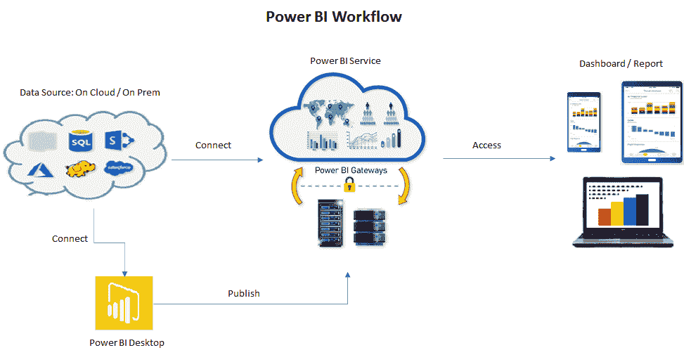
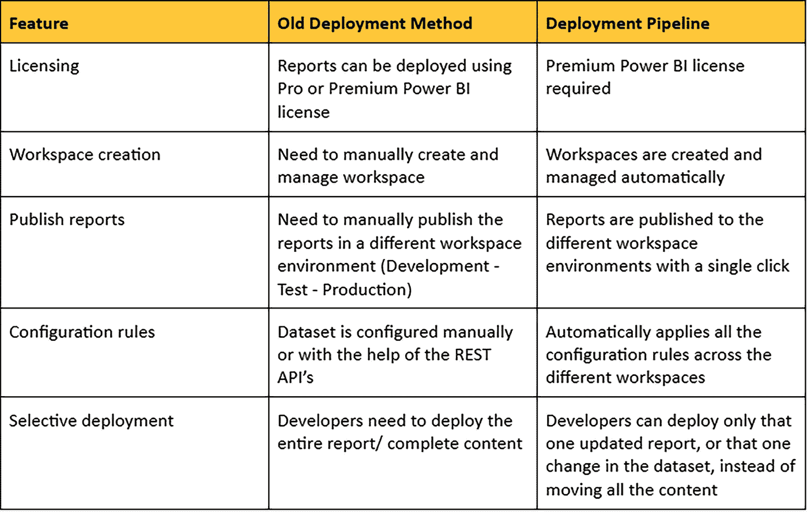

# Power BI 部署管道一览

> 原文：<https://medium.com/globant/power-bi-deployment-pipeline-at-a-glance-8c4701efc515?source=collection_archive---------0----------------------->

## Power BI 部署管道使 BI 团队能够为其 Power BI 内容构建一个高效且可重用的发布流程。

Image by Microsoft via [Deployment Pipeline](https://docs.microsoft.com/en-us/power-bi/create-reports/deployment-pipelines-get-started)

本文将介绍 Power BI，如何在 Power BI 中部署管道特性，以及 Power BI 部署管道相对于旧部署方法的优势。要继续阅读本文，您应该对 Power BI 有一个基本的了解，并对 Power BI 服务中的工作区有一个简要的了解。首先，让我们了解一下 Power BI 的基础知识。

## **微软 Power BI**

[Power BI](https://powerbi.microsoft.com/en-us/) 它是软件服务、应用程序和连接器的集合，这些软件服务、应用程序和连接器协同工作，转换来自不同来源的数据，并构建交互式仪表盘和报告。

Power BI 由几个协同工作的元素组成:

*   一款名为 [**Power BI 桌面**](https://docs.microsoft.com/en-us/power-bi/fundamentals/desktop-what-is-desktop) 的 Windows 桌面应用。
*   在线 SaaS ( *软件即服务*)服务称为 [**电力 BI 服务**](https://docs.microsoft.com/en-us/power-bi/fundamentals/power-bi-service-overview) 。
*   power BI[**Windows、iOS、Android 设备的移动应用**](https://docs.microsoft.com/en-us/power-bi/consumer/mobile/mobile-apps-for-mobile-devices) 。

Power BI 桌面、服务和移动应用旨在让您以最有效地为您和您的角色服务的方式创建、共享和消费业务见解。

## **电力 BI 工作流程**

下图将有助于理解 Power BI 在[数据源](https://docs.microsoft.com/en-us/power-bi/connect-data/power-bi-data-sources)、Power BI 服务和[仪表板](https://docs.microsoft.com/en-us/power-bi/create-reports/service-dashboards)方面的基本工作流程。

Power BI 从连接到 Power BI Desktop 中的数据源并构建报告开始。Power BI Desktop 通常用于创建报告，这些报告最终将发布到 Power BI 服务，在该服务中可以构建仪表板并在组织内共享。

**在 Power BI 中部署内容的旧方法**

Power BI Service 有一个“[工作区](https://docs.microsoft.com/en-us/power-bi/fundamentals/service-basic-concepts#:~:text=Workspaces are used to collaborate,more about the new workspaces.)的概念，您可以在这里创建仪表板、报告和[分页报告](https://docs.microsoft.com/en-us/power-bi/paginated-reports/paginated-reports-report-builder-power-bi)的集合，并与工作区内的任何人进行协作。

*   最初，仪表板和报告包含在同一个工作区中，或者高级 BI 管理员需要创建单独的工作区，定义用于 BI 项目生命周期管理的***【开发、测试】******生产*** 。
*   Power BI REST API 用于将完整的内容从一个工作区/环境迁移到另一个工作区/环境。
*   当前与部署数据集、报告和控制面板相关的耗时且容易出错的生命周期流程。
*   然后，设计人员/开发人员可以与同事共享工作空间。他们还可以将仪表板和报告的集合捆绑到一个应用程序中，并将其分发给整个社区、他们的组织或特定的人或组。

## **Power BI 中的部署模型**

Power BI 平台的设计使得报告/仪表板几乎可以在任何可能的地方集成/部署，无论是内部部署还是基于云的部署，甚至是混合部署，即内部部署和云的混合部署。让我们了解一下我们可以在 Power BI 中利用的各种部署模型。

*   **文件共享:**使用 Power BI Desktop 创建报告，并共享/发布到文件共享或文档协作区域/存储库。
*   **SharePoint:** 报告发布/嵌入到 SharePoint 门户。
*   **第三方集成:**报告发布/嵌入到第三方服务器/门户网站。
*   **Power BI 服务:**报告 Power BI 服务中发生的消耗、共享、安全、协作、数据刷新。

## **电源 BI 部署管线**

2020 年 5 月，微软宣布了一项名为部署管道的功能，作为 Power BI 服务的一部分，使 BI 创建者能够管理组织内容的生命周期。BI 团队在 [Power BI Premium](https://docs.microsoft.com/en-us/power-bi/admin/service-premium-what-is) 中管理内容生命周期的新的改进方法。首先，也是最重要的一点，您必须拥有高级订阅，并且工作空间必须在高级容量内进行调整，以利用部署管道。

在 Power BI 服务中，在向用户发布内容之前，您可以使用部署管道工具来测试您的内容。部署管道工具可以帮助您部署报表、仪表板、数据集和分页报表。

为什么 BI 创建者应该使用部署管道？

部署管道是一个高效且可重用的过程，维护开发、测试和生产环境。它很容易使用，只需几分钟就能设置好。只需点击一下鼠标，即可将内容从一个工作区上传到另一个工作区。BI 创建者可以在不同的环境之间逐渐过渡新的或更新的内容。

部署管道消除了手动错误，因为它只有非常有限的用户干预，因为只有元数据上传到下一阶段，这大大减少了内容上传时间。它提供了一个单一的用户界面/导航页面来检查不同环境中的内容，并使用适当的数据连接和权限重新配置数据集。部署管道现在还可以管理[敏感性标签](https://docs.microsoft.com/en-us/power-bi/admin/service-security-sensitivity-label-overview)，使用户能够增强 Power BI 提供的数据安全能力。

在部署期间，我们可以:

*   总是复制并总是重写；例如:视觉效果、瓷砖、图式。
*   从不复制也从不覆盖；例如:数据、URL 或权限。

在部署管道的帮助下，多个团队成员可以更新相同的报告、数据集等。它取消了使用 Power BI Desktop 重新发布报告更新的限制。现在，这可以在团队内部建立一致的体验，以共同管理内容并简化工作区内的更新。

## **管道阶段**

该工具被设计为具有如下三个阶段的流水线

*   开发:这是部署流程的第一阶段。此阶段用于与开发人员合作设计、构建和上传新内容。
*   **测试:**这个阶段是我们测试内容中实现的所需更改的阶段。修改后的内容从开发阶段上传到测试阶段，并与测试人员和评审人员共享。用户倾向于加载和运行数据量较大的测试，测试应用程序，看看它会如何寻找最终用户。
*   **生产:**在对内容进行测试之后，它现在被上传到生产阶段，内容的最终版本将与整个组织的业务用户共享。

## **功能**

让我们来研究一些特性，这些特性使部署管道比旧的部署方法更胜一筹。

## 结论

部署管道工具可帮助您在开发、测试和生产环境中管理 Power BI 内容。单一用户界面，用于检查和管理环境中的变化。这是 Power BI Premium 功能，有关订阅详情，请[单击此处](https://docs.microsoft.com/en-us/power-bi/admin/service-premium-what-is)。

通过利用 Power BI 的部署管道，用户可以监控状态，比较开发阶段之间的内容，并轻松解决差异。如果你想继续探索，你可以浏览微软提供的文章——“[开始部署管道](https://docs.microsoft.com/en-us/power-bi/create-reports/deployment-pipelines-get-started)”。