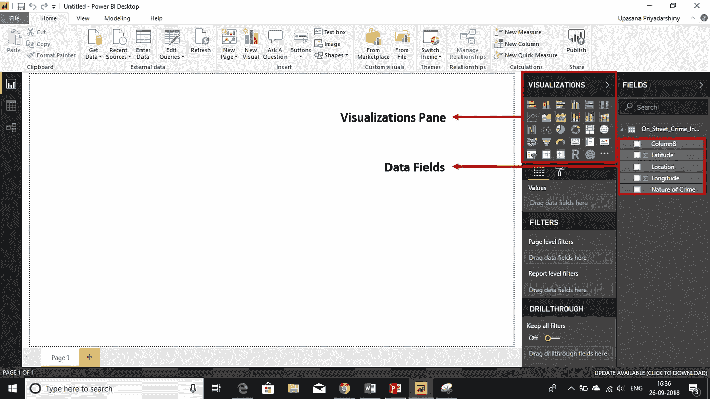

# Power BI Desktop —在 Power BI Desktop 中构建仪表板

> 原文：<https://medium.com/edureka/power-bi-desktop-42c867c712ca?source=collection_archive---------1----------------------->

Power BI Desktop — Edureka

我们生活在数据不断膨胀的时代。哪里有数据，哪里就有分析。任何曾经与数据打交道或有所追求的人都需要有使用一些工具的实践经验。一个这样的工具是微软的 Power BI 桌面。

我想这就是为什么你们都在这里。因为你可能听说过或者读过微软的这个新的终端分析工具。嗯，你来对地方了。希望你喜欢学习这项新技术。

在本 *Power BI Desktop* 教程中，您将学习以下主题:

*   什么是 Power BI？
*   什么是超级商务智能—台式机
*   Power BI —桌面安装
*   将数据集导入 Power BI-Desktop
*   Power BI-Desktop 中的基本视图
*   构建仪表板
*   发布报告

那么，让我们从了解一点关于功率 BI 的知识开始。

# 什么是 Power BI？

它是微软基于云的商业智能服务，为非技术业务用户提供工具，用于**聚合**、**分析**、**数据共享**和**可视化**。

# 什么是 Power BI 桌面？

*Power BI Desktop* 允许您接收、转换、集成和丰富您的数据。Power BI Desktop 连接到您的所有数据源，通过可扩展的仪表板、交互式报告、嵌入式视觉效果等简化数据评估和共享。

在 *Power BI 桌面*上创建报告基本上由 3 个步骤组成:

*   将数据集导入模型
*   体验视觉效果
*   创建报告

你用得越多，你就会掌握得越好。那么，我们开始吧。

# Power BI 桌面安装

这是一个非常简单的过程。你要做的就是:

*   转到**powerbi.com**
*   **产品> >电源 BI 桌面> >下载页面**
*   点击**下载**按钮

你可以先做一个免费用户，然后如果你愿意的话，可以下载一个付费版本。你可以在**定价**页面看到免费用户和付费用户的区别。基本的区别只出现在数据使用能力上。

你可以从这里直接打开你的 *Power BI 桌面*。因此，当打开 *Power BI 桌面*时，您看到的是这些关于构建报告、查询概念等的教程视频。

# 将数据集导入 Power BI Desktop

为了构建仪表板，您要做的第一件事就是连接到数据源。以下是导入数据集时需要遵循的步骤。

*   点击**获取数据**按钮
*   选择要连接的数据源。你有 excel，csv，azure 等。你甚至可以从网页上抓取数据，所以有很多好东西。
*   **将**加载到你的模型中。

# Power BI Desktop 中的基本视图

所以，当您第一次加载数据时，您会看到一个空白屏幕。在左侧，您可以看到这 3 个基本视图。

## 报告视图

在这里，您将创建仪表板。

## 数据视图

在这里，您可以预览您的数据，并根据需要进行更改。您也可以在这里创建新的计算列。

## 关系视图

在这里，您可以看到对象之间的关系。

# Pro-Tip

最好从**数据视图**开始。您基本上可以预览数据的样子。在您实际开始创建仪表板之前，有一些事情需要处理。

## 重命名列

我们正在为用户构建仪表板。所有的命名约定和数据类型都将出现在表面上，我们希望它尽可能具有交互性。

## 删除列

模型中任何不是绝对必要的东西——删除它。因为这将增加模型的大小，并在处理时占用更多的系统资源。

## 隐藏列

您以后出于计算目的需要的列，但用户不一定需要看到，请隐藏它们。隐藏列将呈灰色显示，并且不会出现在报告视图中。

完成所有转换后，您可以直接转到 Power BI 桌面的报告视图。

# 构建仪表板

现在，你准备好开始有趣的部分了。这就是创建仪表板。这很容易共事。所以，如果我想创建一个图表，我所要做的就是选择你的**数据字段**，将它们拖放到上面写着**的地方，将数据字段拖动到这里**。

您可以按照下表帮助您选择最适合任何情况的可视化。

# 发布报告

现在，您已经准备好将其部署到 Power BI 站点。您只需要点击屏幕右上角的**发布**按钮。

既然您已经了解了 *Power BI Desktop* 的所有信息，请继续使用该技术创建全面且强大的可视化报告。

您可以使用这些[样本数据集](https://drive.google.com/drive/folders/1_SSoYp81ziJlPm6Ub4ER6ZX6Ost5Zn7X?usp=sharing)开始 Power BI Desktop 的实验。

*关于 Power BI Desktop 的文章到此结束。我希望你觉得这篇文章内容丰富，增加了你的知识价值。*

如果您想查看更多关于人工智能、DevOps、伦理黑客等市场最热门技术的文章，您可以参考 [Edureka 的官方网站。](https://www.edureka.co/blog/?utm_source=medium&utm_medium=content-link&utm_campaign=power-bi-desktop)

一定要注意本系列的其他文章，这些文章将解释 PowerBI 的其他各个方面。

> 1. [Power BI 仪表盘](/edureka/power-bi-dashboard-fe37c2b9292c)
> 
> 2.[打造影响力的小技巧&互动力 BI 报道](/edureka/power-bi-reports-c64ee557e346)
> 
> 3. [PowerBI KPI](/edureka/power-bi-kpi-c256a3749da5)
> 
> 4.[电力 BI 报告](/edureka/power-bi-reports-c64ee557e346)
> 
> 5.[电源 BI 教程](/edureka/power-bi-tutorial-ed9619113223)
> 
> 6. [DAX in Power BI](/edureka/power-bi-dax-basics-27008f4f7978)
> 
> 7. [MSBI vs 权力毕](/edureka/msbi-vs-power-bi-ef5dab26c463)
> 
> 8.[电力 BI 开发人员工资](/edureka/power-bi-developer-salary-1ce0577f1013)
> 
> 9.[电力 BI 架构](/edureka/power-bi-architecture-270bdd8b5e25)

*原载于 2018 年 9 月 28 日 www.edureka.co**的* [*。*](https://www.edureka.co/blog/power-bi-desktop/)