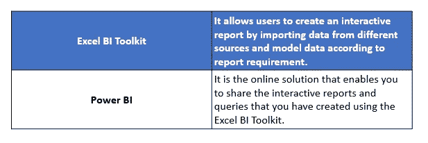
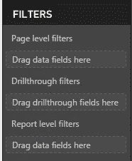
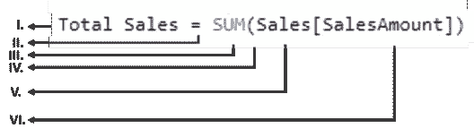
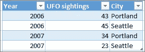

# 2021 年你必须准备的 50 个强力商务智能面试问题

> 原文：<https://medium.com/edureka/power-bi-interview-questions-62df7e5b2b8a?source=collection_archive---------4----------------------->

Power BI Interview Questions — Edureka

在这个 Power BI 面试问题博客中，我们将讨论一些与 Power BI 认证相关的最重要的面试问题，这些问题将帮助你在面试中脱颖而出。

在这篇 Power BI 面试问题文章中，我收集了面试官最常问的问题。这些问题是在咨询了数据分析和可视化领域的顶级行业专家后收集的。

# Power BI 面试问题

所以，下面是**最有可能被面试官问到的 50 大 Power BI 面试问答**。为了方便您访问，我将 Power BI 面试问题分为以下几类:

> 1.一般电源 BI 问题
> 
> 2.指数
> 
> 3.动力中枢
> 
> 4.电源查询
> 
> 5.电源图
> 
> 6.其他问题

# Power BI 面试问题—一般问题

## 1).微软的自助式商业智能解决方案由哪些部分组成？

**答:**微软的自助式商务智能有两个部分

## 2).什么是自助商业智能？

**Ans:自助商业智能(SSBI)**

*   SSBI 是一种数据分析方法，使业务用户能够过滤、细分和分析他们的数据，而无需统计分析、商业智能(BI)方面的深入技术知识。
*   SSBI 让最终用户能够更轻松地访问他们的数据，并创建各种视觉效果来获得更好的业务洞察力。
*   任何对数据有基本了解的人都可以创建报告，以构建直观且可共享的仪表板。

## 3).什么是 Power BI？

回答:Power BI 是一个基于云的数据共享环境。使用 Power Query、Power Pivot 和 Power View 开发报告后，您可以与同事分享您的见解。这就是功率 BI 进入等式的地方。Power BI 在技术上是 SharePoint online 的一个方面，它允许您将 Excel 工作簿加载到云中，并与选定的一组同事共享它们。不仅如此，您的同事还可以与您的报告进行交互，以应用过滤器和切片器来突出显示数据。它们由 Power BI 完成，这是一种分享您来自微软云的分析和见解的简单方式。

Power BI 特性使您能够:

*   与您的同事共享演示文稿和问题。
*   从本地或云中的数据源更新您的 Excel 文件。
*   在多台设备上显示输出。这包括使用 Power BI 应用程序的 PC、平板电脑和支持 HTML 5 的移动设备。
*   使用自然语言处理(或众所周知的问答)来查询您的数据。

## 4).什么是 Power BI 桌面？

**Ans:** Power BI Desktop 是一款免费的桌面应用，可以直接安装在自己的电脑上。Power BI Desktop 通过提供高级数据探索、整形、建模和创建具有高度交互式可视化的报告，与 Power BI 服务紧密协作。您可以将您的工作保存到一个文件中，或者将您的数据和报告直接发布到您的 Power BI 站点，与他人共享。

## 5).Power BI 可以连接哪些数据源？

**答:【Power BI 的数据来源非常广泛，但可以分为以下几类:**

*   **文件**:可以从 Excel(.xlsx、xlxm)、Power BI 桌面文件(。pbix)和逗号分隔值(。csv)。
*   内容包(Content Packs):它是作为一个组存储的相关文档或文件的集合。在 Power BI 中，有两种类型的内容包，首先是来自 Google Analytics、Marketo 或 Salesforce 等服务提供商的内容包，其次是由您组织中的其他用户创建和共享的内容包。
*   **到数据库和其他数据集的连接器**，例如 Azure SQL、数据库和 SQL、服务器分析服务表格数据等。

## 6).Power BI 中的构建模块是什么？

**Ans:** 以下是 Power BI 的构建模块(或)关键组件:

1.  **可视化**:可视化是数据的可视化表示。
    示例:饼图、折线图、并排条形图、地理图顶部源数据的图形展示、树状图等。
2.  **数据集**:数据集是 Power BI 用来创建可视化的数据集合。
    示例:Excel 表、Oracle 或 SQL server 表。
3.  **报告:**报告是一起出现在一个或多个页面上的可视化集合。
    示例:国家、州、城市销售报告、物流绩效报告、产品利润报告等。
4.  **仪表板**:仪表板是多个可视化的单层表示，也就是说，我们可以将一个或多个可视化集成到一个页面层中。
    示例:销售仪表板可以有饼图、地理图和条形图。
5.  **Tiles** : Tile 是报表或仪表板中的单个可视化内容。
    示例:仪表板或报表中的饼图。

## 7).Power BI 报告中有哪些不同类型的过滤器？

**Ans:** Power BI 提供了多种选项来过滤报告、数据和可视化。以下是过滤器类型列表。

*   **视觉级过滤器:**这些过滤器只作用于单个可视化，减少了可视化可以看到的数据量。此外，可视化级别的过滤器可以过滤数据和计算。
*   **页面级过滤器**:这些过滤器在报告页面级工作。同一报表中的不同页面可以有不同的页面级筛选器。
*   **报告级过滤器:**这些过滤器作用于整个报告，过滤报告中包含的所有页面和可视化。

我们知道 Power BI 视觉系统具有交互功能，这使得过滤报告变得轻而易举。视觉交互很有用，但也有一些限制:

*   该筛选器不会保存为报告的一部分。无论何时打开报告，您都可以开始使用可视过滤器，但是无法将过滤器存储在保存的报告中。
*   过滤器总是可见的。有时，您需要一个针对整个报告的筛选器，但是您不希望看到所应用筛选器的任何可视指示。

## 8).Power BI 中有哪些内容包？

**答:**服务内容包是针对热门服务的预建解决方案，是 Power BI 体验的一部分。受支持服务的订户可以从 Power BI 快速连接到他们的帐户，通过为他们预先构建的实时仪表盘和交互式报告查看他们的数据。微软已经发布了热门服务的内容包，如 Salesforce.com、Marketo、Adobe Analytics、Azure Mobile Engagement、CircuitID、comScore Digital Analytix、Quickbooks Online、SQL Sentry 和 tyGraph。

组织内容包为用户、BI 专业人员和系统集成商提供工具来构建他们自己的内容包，以便在他们的组织内共享专门构建的仪表板、报告和数据集。

# Power BI 面试问题— DAX

## 9).DAX 是什么？

**Ans:** 为了对 power pivot 中的数据进行基本的计算和数据分析，我们使用了数据分析表达式(DAX)。它是用于计算计算列和计算字段的公式语言。

*   DAX 处理列值。
*   DAX 不能修改或插入数据。
*   我们可以使用 DAX 创建计算列和度量，但不能使用 DAX 计算行。

## 10).最常用的 DAX 函数是什么？

**Ans:** 下面是一些最常用的 DAX 函数:

*   总和、最小值、最大值、AVG、计数、不同计数
*   IF，AND，OR，SWITCH
*   ISBLANK，ISFILTERED，ISCROSSFILTERED
*   值，全部，过滤，计算，
*   UNION，INTERSECT，EXCEPT，NATURALINNERJOIN，NATURALLEFTEROUTERJOIN，
    summary columns，ISEMPTY，
*   VAR(变量)
*   GEOMEAN，MEDIAN，DATEDIFF

## 11).过滤功能是如何使用的？

**Ans:**FILTER 函数返回一个表，其中的每个源表行都应用了一个过滤条件。FILTER 函数很少单独使用，它通常用作 CALCULATE 等其他函数的参数。

*   FILTER 是一个迭代器，因此会对大型源表的性能产生负面影响。
*   可以应用复杂的筛选逻辑，例如在筛选表达式中引用度量值。筛选器(我的表，[销售度量] > 500)

## 12).CALCULATE 和 CALCULATETABLE 函数有什么特殊或独特之处？

**Ans:** 这些是唯一允许您修改度量或表的过滤上下文的函数。

*   添加到查询的现有过滤器上下文中。
*   覆盖查询中的筛选器上下文。
*   从查询中删除现有的筛选器上下文。

**限制:**

*   筛选参数一次只能对单个列进行操作。
*   过滤器参数不能引用度量。

## 13).分组数据常用的表函数是什么？

**Ans:总结()**

*   SSAS 的主要分组依据功能。
*   推荐的做法是指定 table 和 group by 列，而不是 metrics。您可以使用 ADDCOLUMNS 函数。

**汇总列**

*   SSAS 和 Power BI 桌面的新功能分组；效率更高。
*   指定分组依据列、表和表达式。

## 14).在 DAX 中使用变量有什么好处？

**Ans:** 下面是一些好处:

*   通过声明和评估变量，可以在 DAX 表达式中多次重用该变量，从而避免对源数据库进行额外的查询。
*   变量可以使 DAX 表达式更直观/更符合逻辑地解释。
*   变量的作用范围仅限于它们的度量或查询，不能在度量、查询之间共享，也不能在模型级别定义。

## 15).您将如何通过 DAX 针对非标准日历创建尾随 X 月指标？

**答:**该解决方案将涉及:

1.  用于控制(接管)衡量标准的过滤器上下文的计算功能。
2.  全部删除日期维度上的现有筛选器。
3.  筛选以确定要使用日期维度的哪些行。

或者，可以使用容器:

CALCULATE(FILTER(ALL('DATE '))，…。))

## 16).什么是不同的 Excel BI 加载项？

**答:**以下是 Excel 中最重要的 BI 插件:

*   **超级查询:**帮助查找、编辑、加载外部数据。
*   **Power Pivot:** 主要用于数据建模和分析。
*   **Power View:** 用于设计可视化交互式报表。
*   **力量地图:**它有助于在 3D 地图上显示洞察力。

# Power BI 面试问题— Power Pivot

## 17).什么是权力支点？

**答:** Power Pivot 是 Microsoft Excel 2010 的一个插件，它使您能够将来自多个数据源的数百万行数据导入到一个 Excel 工作簿中。它允许您创建异类数据之间的关系，使用公式创建计算列和度量，构建数据透视表和数据透视图。然后，您可以进一步分析数据，以便在不需要 IT 帮助的情况下做出及时的业务决策。

## 18).Power BI DAX 的语法是什么？

**Ans:*****语法*** 由组成公式的各种组件以及公式的编写方式组成。看看这个简单的 DAX 公式。

当试图理解 DAX 公式时，将每个元素分解成你每天都在思考和使用的语言通常会很有帮助。因此，该公式包括以下语法元素:

**I.** **总销售额**是度量名称。

**二。****等号运算符(=)** 表示公式的开始。

**三。** **SUM** 将列中的所有数字相加，**Sales【Sales amount】**。

**四。**有这些**括号** **()** 将包含一个或多个参数的表达式括起来。所有函数都需要至少一个参数。

**五、** **销售额**是引用的表。

**六。**一个**参数**传递一个值给一个函数。被引用的列**【销售额】**是一个参数，SUM 函数通过该参数知道它必须对哪一列进行合计。

简单地说，您可以将它理解为， **" *对于名为“总销售额”的度量值，计算(=)销售表中[销售额]列中值的总和***

*♠强大的 BI DAX 编辑器包括一个建议功能，通过向您建议正确的元素，帮助您创建语法正确的公式。*

## 19).什么是 Power Pivot 数据模型？

**答:** Power Pivot 是微软 Excel 2010 的一个插件，它可以让你从多个数据源导入数百万行数据到一个 Excel 工作簿中。它允许您创建异类数据之间的关系，使用公式创建计算列和度量，构建数据透视表和数据透视图。然后，您可以进一步分析数据，以便在不需要 IT 帮助的情况下做出及时的业务决策。

## 20).Power Pivot 中使用的 xVelocity 内存分析引擎是什么？

**Ans:**power pivot 背后的主引擎是 xVelocity 内存分析引擎。它可以处理大量数据，因为它将数据存储在列数据库和内存分析中，这样可以更快地处理数据，因为它将所有数据加载到 RAM 内存中。

## 21).Power BI Desktop 和 Power Pivot for Excel 在数据建模方面有哪些不同？

答案:以下是一些不同之处:

*   Power BI Desktop 支持双向交叉筛选关系、安全性、计算表和直接查询选项。
*   Excel 的 Power Pivot 具有单向(一对多)关系，仅计算列，并且仅支持导入模式。无法在 Power Pivot for Excel 中定义安全角色。

## 22).在 power pivot 的数据模型中，两个表之间可以有多个活动关系吗？

**Ans:** 不，我们不能在两个表之间有一个以上的活动关系。但是，两个表之间可以有多个关系，但只有一个活动关系和许多非活动关系。虚线无效，实线有效。

# Power BI 面试问题— Power Query

## 23).什么是电力查询？

**Ans:** Power query 是一个 ETL 工具，用于使用直观的界面对数据进行整形、清理和转换，而无需使用编码。它帮助用户:

*   从文件、数据库、大数据、社交媒体数据等各种来源导入数据。
*   连接和追加来自多个数据源的数据。
*   通过删除和添加数据，根据需要形成数据。

## 24).超级查询的数据目标是什么？

**答:**我们从 power query 获得的输出有两个目的地:

*   加载到工作表的表中。
*   加载到 Excel 数据模型。

## 25).什么是幂查询中的查询折叠？

**Ans:** 查询折叠是将 Power Query/Query Editor 中定义的步骤翻译成 SQL 并由源数据库而不是客户机执行。考虑到客户机上有限的资源，这对处理性能和可伸缩性很重要。

## 26).什么是一些常见的超级查询/编辑器转换？

**Ans:** 更改数据类型、筛选行、选择/删除列、分组、将一列拆分为多列、添加新列等。

## 27).SQL 和 Power 查询/查询编辑器可以一起使用吗？

是的，可以将 SQL 语句定义为用于附加处理/逻辑的超级查询/M 函数的源。这将是一个好的实践，以确保高效的数据库查询被传递到源，并避免客户机和 M 函数的不必要的处理和复杂性。

## 28).什么是查询参数和 Power BI 模板？

**Ans:** 查询参数可用于向本地 Power BI 桌面报告的用户提供提示，以指定他们感兴趣的值。

*   然后，查询和计算可以使用参数选择。
*   PBIX 文件可以导出为模板(PBIT 文件)。
*   模板包含 PBIX 中除数据本身以外的所有内容。

参数和模板可以共享/通过电子邮件发送较小的模板文件，并限制加载到本地 PBIX 文件中的数据量，从而缩短处理时间并改善体验。

## 29).电力查询使用哪种语言？

**Ans:** 在一个名为 M-Code 的幂查询中使用了一种新的编程语言。它易于使用，与其他语言相似。m 代码是区分大小写的语言。

## 30).当 Power Pivot 可以从最常用的来源导入数据时，为什么我们需要 Power Query？

**答:** Power Query 是一个自助式 ETL(提取、转换、加载)工具，作为 Excel 插件运行。它允许用户从各种来源提取数据，将所述数据处理成适合他们需要的形式，并将其加载到 Excel 中。在 Power Pivot 上使用 Power Query 是最理想的，因为它不仅允许您加载数据，还允许您在加载时根据用户的需要操作数据。

# Power BI 面试问题— Power Map

## 31).什么是权力地图？

**答:** Power Map 是一个 Excel 插件，它为您提供了一套强大的工具，帮助您可视化和深入了解具有地理编码组件的大型数据集。它可以通过在阿炳地图上绘制多达一百万个数据点的柱形图、热度图和气泡图来帮助您制作 3D 可视化效果。如果数据带有时间戳，它还可以生成显示数据如何随空间和时间变化的交互式视图。

## 32).在 Power Map 中使用表格的主要要求是什么？

**答:**对于要在电源地图中使用的数据，应该有如下位置数据:

*   纬度/经度对
*   街道、城市、国家/地区、邮政编码和州/省，这些都可以通过 Bing 进行地理定位

对表的主要要求是它包含唯一的行。它还必须包含位置数据，可以是纬度/经度对的形式，尽管这不是必需的。您可以使用地址字段，如街道、城市、国家/地区、邮政编码和州/省，Bing 可以对其进行地理定位。

## 33).权力地图的数据来源是什么？

**答:**数据可以显示在 Excel 中，也可以显示在外部。要准备数据，请确保所有数据都是 Excel 表格格式，其中每一行都代表一条唯一的记录。您的列标题或行标题应该包含文本而不是实际数据，以便 Power Map 在绘制地理坐标时能够正确解释。当您在 Power Map 巡视编辑器窗格中设计巡视时，使用有意义的标签还可以使值和类别字段可用。

要在 Power Map 中使用更准确地表示时间和地理位置的表结构，请在表行中包含所有数据，并在列标题中使用描述性文本标签，如下所示:

如果您希望从外部源加载数据:

1.  在 Excel 中，在**获取外部数据**组中点击**数据** >您想要的连接。
2.  按照启动的向导中的步骤进行操作。
3.  在向导的最后一步，确保选中了**将该数据添加到数据模型**。

# Power BI 面试问题—附加问题

## 34).什么是权力观？

**答:** Power View 是一种数据可视化技术，可以让您创建交互式图表、图形、地图和其他可视化工具，让您的数据栩栩如生。在 Excel、SharePoint、SQL Server 和 Power BI 中可以使用 Power View。

以下页面提供了有关 Power View 中不同可视化效果的详细信息:

*   图表
*   折线图
*   饼图
*   地图
*   瓷砖
*   卡片
*   形象
*   桌子
*   权力观
*   多重可视化
*   气泡图和散点图
*   关键绩效指标(KPI)

## 35).什么是 Power BI Designer？

**答:**这是一个独立的应用程序，我们可以制作电力商业智能报告，然后上传到 Powerbi.com，它不需要 Excel。实际上，它是权力查询、权力中枢和权力观的结合。

## 36).上传到云(Share point 或 Powebi.com)后，我们能否刷新我们的 Power BI 报告？

**答:**是的，我们可以通过数据管理网关(适用于 SharePoint)和 Power BI 个人网关(适用于 Powerbi.com)来刷新我们的报告

## 37).我们发布的报告有哪些不同类型的刷新数据？

**Ans:**Power BI 的刷新主要有四种类型。包刷新、模型或数据刷新、切片刷新和可视化容器刷新。

*   **包刷新**

这将在 Power BI 服务和 OneDrive 或 SharePoint Online 之间同步您的 Power BI 桌面或 Excel 文件。但是，这不会从原始数据源提取数据。Power BI 中的数据集将仅使用 OneDrive 或 SharePoint Online 中的文件内容进行更新。

*   **模型/数据刷新**

它指的是在 Power BI 服务中使用来自原始数据源的数据刷新数据集。这可以通过使用计划刷新或立即刷新来完成。这需要一个用于内部数据源的网关。

*   **图块刷新** 一旦数据发生变化，图块刷新会更新仪表板上图块视觉效果的缓存。这大约每十五分钟发生一次。您也可以通过选择仪表板右上角的**省略号(…)** 并选择**刷新仪表板图块**来强制刷新图块。
*   **可视容器刷新** 一旦数据发生变化，刷新可视容器会更新报表内缓存的报表视觉效果。

## 38).内部是否提供 Power BI？

**答:**不，Power BI 不作为私有内部云服务提供。但是，借助 Power BI 和 Power BI Desktop，您可以安全地连接到自己的内部数据源。使用本地数据网关，您可以实时连接到本地 SQL Server Analysis Services 和其他数据源。您还可以通过集中式网关安排刷新。如果网关不可用，您可以使用 Power BI Gateway-Personal 从内部数据源刷新数据。

## 39).什么是数据管理网关和 Power BI 个人网关？

**Ans:** Gateway 充当本地数据源和 Azure 云服务之间的桥梁。

**个人网关:**

*   仅导入，仅 Power BI 服务，无中央监控/管理。
*   只能一个人使用(个人)；不允许其他人使用此网关。

**内部网关:**

*   支持导入和直接查询。
*   用于开发内容的网关的多个用户。
*   中央监控。

## 40).什么是 Power BI 问答？

答: Power BI Q & A 是一个自然语言工具，可以帮助你查询数据并从中获得你需要的结果。您可以通过在仪表板上的对话框中键入内容来完成此操作，引擎会立即生成一个类似于 Power View 的答案。A 解释了你的问题，并向你展示了它从你的数据中看到了什么。问& A 由服务器和工具、微软研究院和 Bing 团队开发，给你一种真正探索数据的完整感觉。

## 41).Excel experience 可以通过哪些方式与 Power BI 结合使用？

以下是我们利用 Power BI 的一些方法:

1.  用于 Excel 的 Power BI Publisher:

*   可用于固定 Excel 项目(图表、范围、数据透视表)以增强 BI 服务。
*   可用于连接存储在 Power BI 服务中的数据集和报告。

2.Excel 工作簿可以上传到 Power BI，并像 Excel Services 一样在浏览器中查看。

3.Power BI 服务中的 Excel 报表可以像其他报表一样通过内容包共享。

4.Excel 工作簿(模型和表格)可以导出到服务中，以便创建 PBI 报表。

5.Excel 工作簿 Power Pivot 模型可以导入到 Power BI 桌面模型中。

## 42).什么是 Power BI 中的计算列，为什么要使用它们？

**Ans:** 计算列是在模型处理/刷新过程中为给定列的每一行计算的 DAX 表达式，可以像模型中的任何其他列一样使用。

计算列不会被压缩，因此会消耗更多内存并导致查询性能降低。如果应用于大型事实表，它们还会降低处理/刷新性能，并且会使模型更难维护/支持，因为源系统中不存在计算列。

## 43).Power BI 是如何实现数据安全的？

**Ans:** Power BI 可以对模型应用行级安全角色。

*   DAX 表达式应用于在查询时筛选行的表。
*   动态安全性包括在安全角色定义中使用用户名函数。
*   通常在模型中创建一个表，将用户与特定的维度和角色相关联。

## 44).什么是多对多关系，如何在 Power BI 中处理这些关系？

**答:**多对多关系涉及一个反映两个维度组合的桥或连接表(例如医生和病人)。所有可能的组合或者已经发生的那些组合。

*   双向交叉过滤关系可以用在 PBIX 中。
*   Excel 的 Power Pivot 中可以使用交叉过滤功能。
*   可以使用 DAX 来检查并有选择地修改过滤器上下文。

## 45).为什么模型中的一个表可能与其他表没有任何关系？

**答:**我们的模型中没有关系的表主要有两个原因:

1.断开的表格可用于向用户呈现要在切片器中展示和选择的参数值(例如，增长假设。)

*   DAX metrics 可以检索此选择，并将其与其他计算/度量一起使用。

2.断开的表格也可以用作用户界面中指标的占位符。

*   它可能不包含任何数据行，其列可能被隐藏，但所有指标都是可见的。

## 46).Excel 的强大 BI Publisher 是什么？

**答:**您可以使用 Power BI publisher for Excel 来锁定范围、数据透视表和图表以增强 BI。

*   用户可以在 Excel 中管理图块——刷新、删除它们。
*   必须从服务的仪表板中删除固定项目(在 Excel 中删除只会删除连接)。
*   Power BI Publisher for Excel 还可用于从 Excel 连接到 Power BI 服务中托管的数据集。
*   生成一个 Excel 数据透视表，其中包含与 Azure 中数据的连接(ODC 文件)。

发布者在本地机器上安装所有必要的驱动程序以建立连接。

## 47).Power BI 数据集、报告和仪表板之间有什么区别？

**Ans: Dataset:** 用于创建报告和视觉/图块的源。

*   数据模型(PBIX 或 XLSX 的本地)或 Analysis Services 服务器中的模型
*   数据可以在模型内部(导入的)或直接连接到源的查询。

**报告:**包含一个或多个报告页面的单个 Power BI 桌面文件(PBIX)。

*   专为给定数据集(过滤器、格式)的深度交互式分析体验而构建。
*   每个报表至少连接到一个数据集
*   每一页包含一个或多个视觉效果或图块。

**Dashboard:** 来自不同报告的视觉效果或平铺视图的集合，还可以选择一个固定的。

*   旨在聚合来自多个数据集的主要视觉效果和指标。

## 48)Power BI Desktop 中可视互动程序的三个编辑交互选项是什么？

**答:**3 个编辑交互选项是过滤、高亮和无。

**滤镜:**根据一个视觉/图块的滤镜选择，完全过滤另一个视觉/图块。

**高亮:**只高亮显示视觉/磁贴上的相关元素，不相关的项目变灰。

**无:**忽略另一个图块/视觉的过滤器选择。

## 49).与使用 Power BI Desktop 文件的本地数据模型相比，使用实时或直接查询连接(如与 Analysis Services 模型的连接)在报表创作功能方面有哪些区别？

**Ans:** 使用 PBIX 文件(或 Power Pivot 工作簿)的本地数据模型，作者可以完全控制查询、建模/关系、元数据和指标。

通过与 Analysis Services 数据库(多维数据集)的实时连接，用户无法创建新指标、导入新数据、更改指标的格式等—用户只能使用报表画布上可用的可视化、分析和格式。

例如，使用 Power BI to SQL Server 中的直接查询模式，作者可以访问与 SSAS 直接查询模式相同的功能(和限制)。

*   只能使用一个数据源(一台服务器上的一个数据库)，某些 DAX 函数没有优化，并且用户不能使用无法转换为 SQL 语句的查询编辑器函数。

## 50).SSRS 如何与 Power BI 整合？

**答:**以下是 SSRS 与 Power BI 集成的一些方式:

*   某些 SSRS 报告项目(如图表)可以固定到 Power BI 仪表板。
*   单击 Power BI 仪表盘中的图标，用户将看到 SSRS 报告。
*   创建订阅以保持仪表板平铺的刷新。
*   电力 BI 报告很快就能发布到 SSRS 门户网站上

我希望这套 Power BI 面试问答可以帮助你准备面试。万事如意！

如果你想查看更多关于人工智能、DevOps、道德黑客等市场最热门技术的文章，你可以参考 [Edureka 的官方网站。](https://www.edureka.co/blog/?utm_source=medium&utm_medium=content-link&utm_campaign=power-bi-interview-questions)

请留意本系列中的其他文章，它们将解释 PowerBI 的各个方面。

> *1。* [*电力 BI 仪表盘*](/edureka/power-bi-dashboard-fe37c2b9292c)
> 
> *2。* [*权力匕桌面*](/edureka/power-bi-desktop-42c867c712ca)
> 
> *3。* [*PowerBI KPI*](/edureka/power-bi-kpi-c256a3749da5)
> 
> *4。* [*电力 BI 报告*](/edureka/power-bi-reports-c64ee557e346)
> 
> *5。* [*制作有影响力的小技巧&互动电力 BI 报道*](/edureka/power-bi-reports-c64ee557e346)
> 
> *6。* [*达克斯*](/edureka/power-bi-dax-basics-27008f4f7978) 中的权力毕
> 
> 7。 [*MSBI vs 权力匕*](/edureka/msbi-vs-power-bi-ef5dab26c463)
> 
> *8。* [*电力 BI 开发者工资*](/edureka/power-bi-developer-salary-1ce0577f1013)
> 
> *9。* [*电力 BI 架构*](/edureka/power-bi-architecture-270bdd8b5e25)

*原载于 2018 年 6 月 5 日 https://www.edureka.co***。**