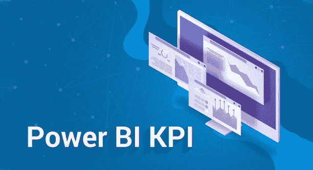
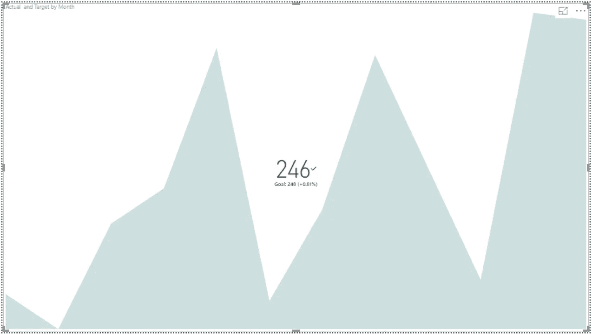
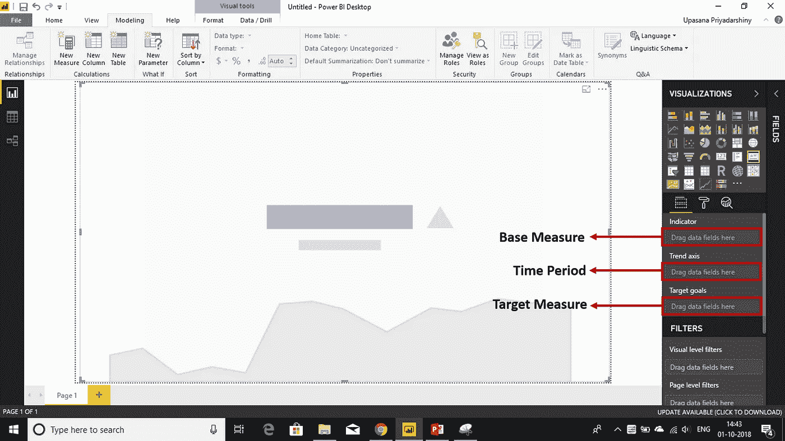
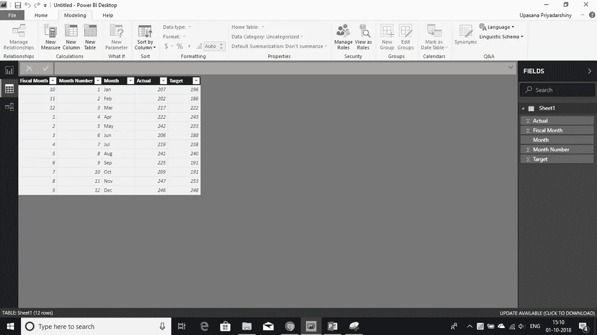
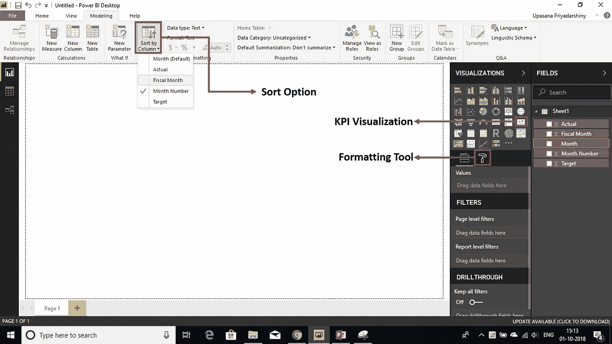
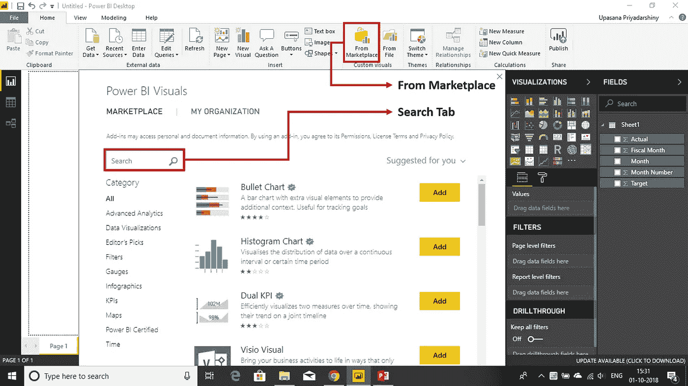
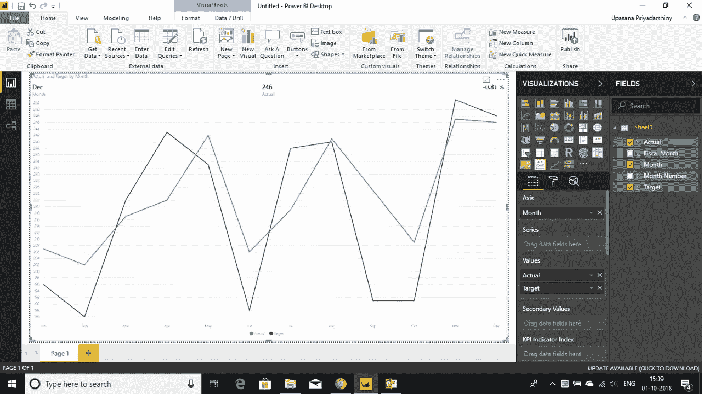
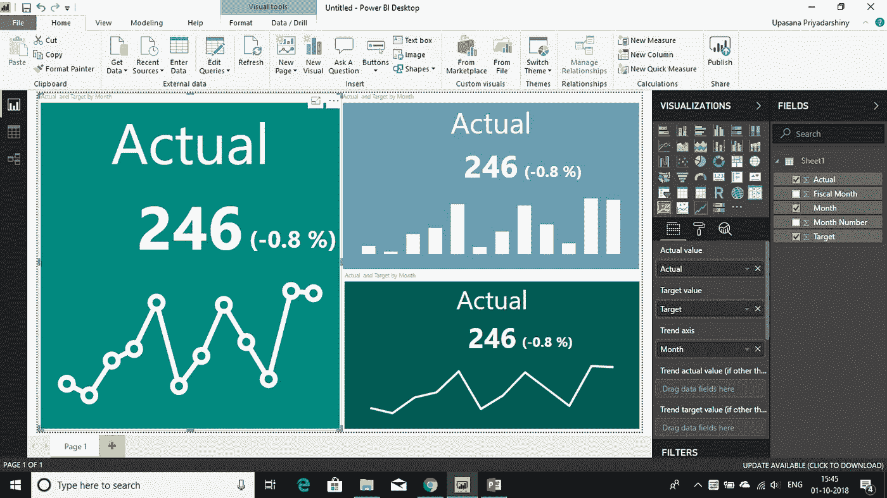
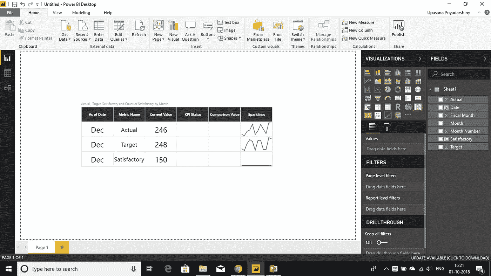
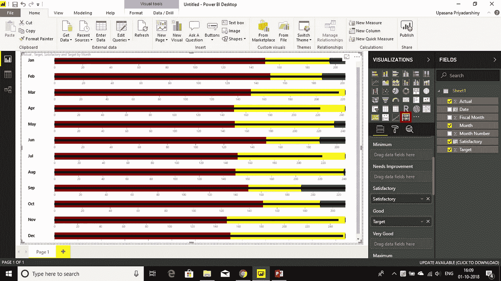

# Power BI KPI —创建 Power BI KPI 视觉效果(关键绩效指标)

> 原文：<https://medium.com/edureka/power-bi-kpi-c256a3749da5?source=collection_archive---------5----------------------->

Power BI KPI — Edureka

每个组织都需要一个视觉线索来传达它朝着目标所取得的进展。Power BI KPI 展示了公司实现其关键业务目标的效率。具体来说，这篇文章将帮助你了解使用 *Power BI KPI* 的全部潜力。

本文将带您了解以下主题:

*   什么是 KPI？
*   何时使用 KPI？
*   KPI 可视化的要求
*   Power BI 桌面中的 KPI 可视化
*   KPI 中的自定义视觉效果

# 什么是 KPI？

组织在多个级别使用 KPI(或关键绩效指标)来评估他们是否成功达到目标。高层 KPI 可能关注企业的整体绩效，而低层 KPI 可能关注销售、营销或生产等部门的流程或员工。

# 何时使用 KPI？

KPI 主要回答 2 个问题:

*   我领先还是落后于什么？
*   我领先或落后了多远？

KPI 基于特定的度量，旨在帮助您根据定义的目标评估度量的当前值和状态。

# KPI 可视化的要求

Power BI KPI 可视化需要评估为一个值的*基础*度量和*目标*度量，以及*阈值*或*目标*。

目前，KPI 数据集需要包含 KPI 的目标值。如果您的数据集不包含，不要担心。您可以通过将目标添加到您的数据模型中来创建目标。

# Power BI 桌面上的 KPI 可视化

挑选一些适合 KPI 的数据。正如您所看到的，我在这里选择的这个有一个**实际销售额**列和一个**目标销售额**列。月份是根据它们通常的顺序以及财政顺序来编号的。

我们将创建一个 KPI 来衡量我们在实现销售目标方面取得的进展。

1.  在**报告视图**中打开报告。
2.  从字段窗格中，选择**实际销售额**并将其放到屏幕上。这将是**指示器**。
3.  同样添加时间段，即**月**。这将代表**趋势**。

现在，您可以转到顶部功能区的**建模**选项，并使用**排序**选项按照您需要的月份顺序进行排序。

4.从**可视化窗格**中选择 **KPI 图标**，将可视化转换为 KPI。

5.现在，您可以将**目标**列添加到**目标**字段。

可选地，通过选择油漆滚筒图标打开**格式化窗格**来格式化 KPI。

*   **指示器:**控制指示器的显示单位和小数位数。
*   **趋势轴:**设置为 On 时，趋势轴显示为 KPI 视觉的背景。
*   **目标:**设置为 On 时，视觉以百分比显示目标和与目标的距离。
*   **颜色编码>方向:**对于较高的值，一些 KPI 被认为*更好*，而对于较低的值，一些被认为*更好*。例如，投资回报(RoI)与等待时间。通常，较高的 RoI 值比较高的等待时间值要好。您可以选择更高的值，也可以更改其颜色设置。

# 注意事项和故障排除

如果您的 KPI 看起来不像给定的图像，您可能需要考虑在将它转换为 KPI 之前，按财政月份或月份编号进行排序。在一些旧版本的 Power BI 中，KPI 没有排序选项，在将可视化转换为 KPI 之前，您需要按财政月进行排序。

现在你已经知道了这个工具的基本工作原理，你可以用它做一些非常聪明的事情。就像您可以在 Power BI 中创建自定义视觉效果一样。

# KPI 中的自定义视觉效果

你可以用 KPI 做很多其他有趣的事情。例如，您可以使用传统 KPI 的许多变体。为此，您只需从 Marketplace 转到**，在**搜索选项卡**中寻找您喜欢的定制视觉效果。或者你甚至可以去 visuals.powerbi.com 做同样的事情。它将出现在您的可视化效果栏上，与其他可视化效果相邻。**

所以，这里有 4 个你不知道你需要的自定义视觉效果。

## **电力关键绩效指标:**

除了多折线图，Power KPI 还为当前日期、值和差异添加了标签。

## **关键绩效指标:**

与传统的 KPI 不同，KPI 指示器以颜色表示状态，比较实际值和目标值。偏差以实际值与目标值的百分比表示。趋势可以用线条或条形图来表示。由用户决定显示数据的粒度。

## **电力 KPI 矩阵:**

Power KPI Matrix 支持 Power BI 中的平衡记分卡，并在一个定制的列表中显示无限数量的指标和 KPI。

## **项目符号图:**

项目符号图可替代仪表板仪表。开发项目符号图是为了解决计量器和仪表的基本问题。项目符号图以单个主要衡量标准为特征，将该衡量标准与一个或多个其他衡量标准进行比较以丰富其含义，并在绩效的定性范围(如差、满意和好)的上下文中显示它。

既然你已经了解了所有关于 *Power BI KPI* 的知识，那就继续并充分利用它吧。借助 Power BI KPI 创建实时、直观的可视化报告。

如果你想查看更多关于人工智能、DevOps、道德黑客等市场最热门技术的文章，那么你可以参考 [Edureka 的官方网站。](https://www.edureka.co/blog/?utm_source=medium&utm_medium=content-link&utm_campaign=power-bi-kpi)

请留意本系列中的其他文章，它们将解释 PowerBI 的各个方面。

> *1。* [*动力 BI 仪表盘*](/edureka/power-bi-dashboard-fe37c2b9292c)
> 
> *2。* [*电力匕桌面*](/edureka/power-bi-desktop-42c867c712ca)
> 
> *3。* [*小技巧做出有影响力的&互动力量毕报道*](/edureka/power-bi-reports-c64ee557e346)
> 
> *4。* [*电力毕报道*](/edureka/power-bi-reports-c64ee557e346)
> 
> *5。* [*异能匕教程*](/edureka/power-bi-tutorial-ed9619113223)
> 
> *6。*[*DAX in Power BI*](/edureka/power-bi-dax-basics-27008f4f7978)
> 
> *7。* [*MSBI vs 权力毕*](/edureka/msbi-vs-power-bi-ef5dab26c463)
> 
> *8。* [*电力 BI 开发人员工资*](/edureka/power-bi-developer-salary-1ce0577f1013)
> 
> *9。* [*电力 BI 架构*](/edureka/power-bi-architecture-270bdd8b5e25)

*原载于 2018 年 10 月 3 日*[*www.edureka.co*](https://www.edureka.co/blog/power-bi-kpi)*。*