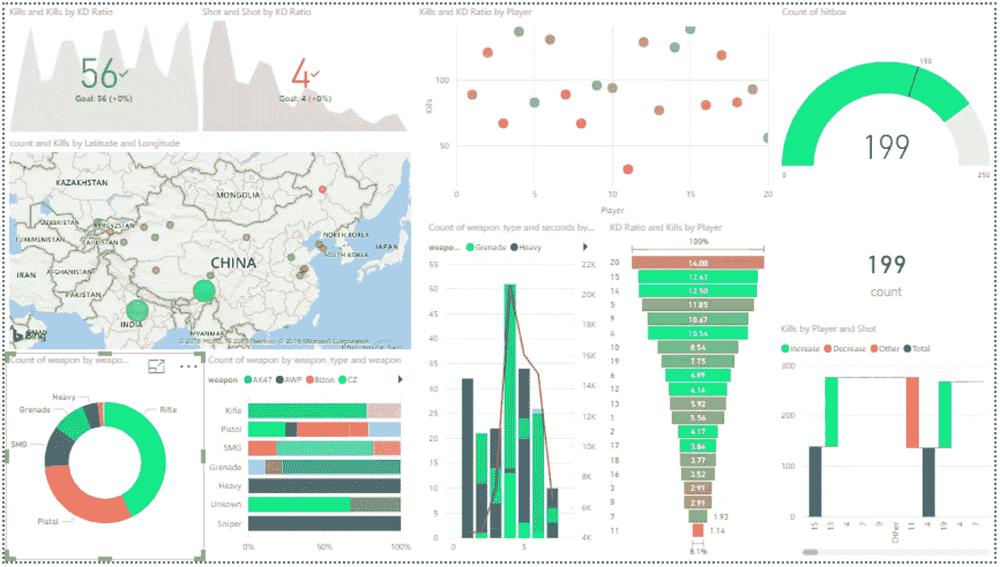
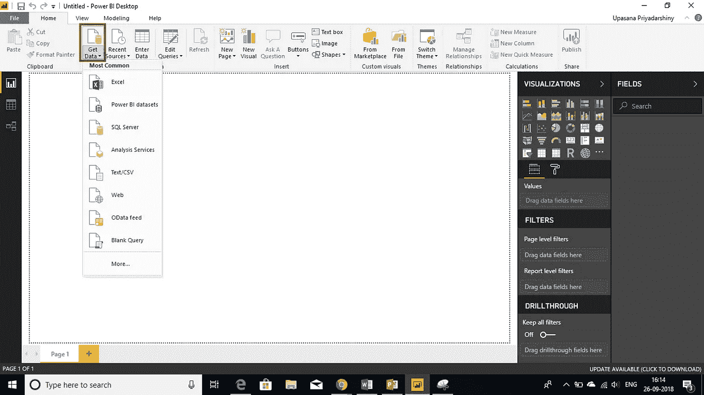
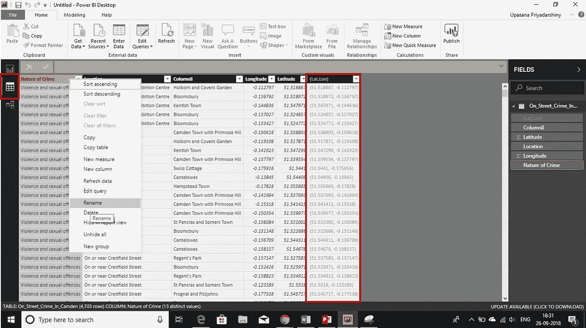
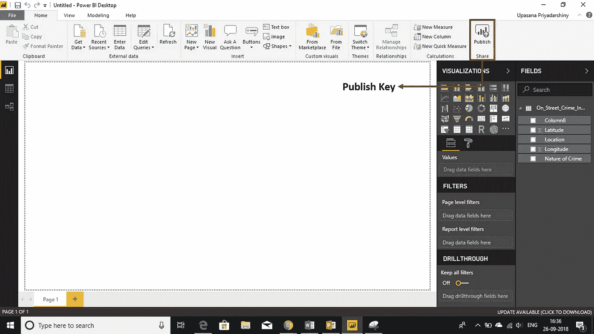

# 制作有影响力的交互式电力商业智能报告的技巧

> 原文：<https://medium.com/edureka/power-bi-reports-c64ee557e346?source=collection_archive---------6----------------------->

Power BI Reports — Edureka

今天，商业智能的概念对极少数人来说是陌生的。更新、更具交互性的 BI 工具每天都在涌现，吸引了许多组织来帮助解决他们的危机。在这种情况下，微软的 *Power BI* 被证明是黄金，主要是因为它旨在帮助每个人分析和可视化他们的数据。甚至非技术业务人员也可以使用这个工具创建交互式*Power BI*报表。本文将重点介绍 Power BI 报告，并涵盖以下主题:**

*   **什么是 Power BI 报告？**
*   **报告与仪表板有何不同？**
*   **什么是 Power BI 报表服务器？**
*   **报表服务器与服务有何不同？**
*   **如何创建关于 Power BI 的报告？**
*   **Power BI —报告移动应用程序**
*   **创建关于 Power BI 的强大报告的提示和技巧**

# **什么是 Power BI 报告？**

**Power BI **报告**是一个数据集的多视角视图，以可视化方式呈现该数据集的不同发现和见解。一个报表可以有一个可视化效果，也可以有充满可视化效果的页面。报告中的可视化表示类似于仪表板，但有不同的用途。**

**这些可视化效果不是静态的。事实上，远非如此，高度交互和高度可定制的可视化随着底层数据的变化而更新。您可以添加和删除数据，更改可视化类型，并在模型中应用过滤器来发现见解和寻找答案。**

****

# **报告与仪表板有何不同？**

**因此，术语“报告”和“仪表板”可以互换使用，但您可以放心，它们不是同义词。下表比较了报表和仪表板的功能。**

****

**因此，基本上，一个报告在许多页面上阐述一个数据集，而一个仪表板在一个页面上汇总多个数据集。**

# **什么是 Power BI 报表服务器？**

**Power BI Report Server 是一个具有 web 门户的内部部署报表服务器，您可以在其中显示和管理报表和 KPI，以及用于创建 Power BI 报表、分页报表、移动报表和 KPI 的工具。**

**它类似于 SQL Server Reporting Services 和 Power BI online service，但方式不同。与 Power BI 服务一样，Power BI 报告服务器托管 Power BI 报告(。PBIX)和 Excel 文件。像 Reporting Services 一样，Power BI Report Server 是内部部署的，并且托管分页的报表。RDL)。您的用户可以通过不同的方式访问这些报告:在 web 浏览器或移动设备中查看，或者作为收件箱中的电子邮件查看。**

**Power BI Report Server 是 Reporting Services 的一个超集:您在 Reporting Services 中可以做的一切，都可以通过 Power BI Report Server 来完成，而且还增加了对 Power BI reports 的支持。**

# **报表服务器与服务有何不同？**

**Power BI 报告服务器与 Power BI 服务有许多共同之处，但也有一些不同之处。下表解释了这一切。**

****

# **如何创建关于 Power BI 的报告？**

**如果你不打算自己创建报告，那么权力 BI 理论就没有多大用处。根据您的角色，您可能会创建供自己使用或与同事共享的报告。无论哪种方式，您都希望学习如何创建和共享报告，或者至少了解如何与报告进行交互。**

**创建报告的方法有很多，在本文中，我们将从使用 Power BI 服务从 Excel 数据集创建一个非常基本的报告开始。**

**如果您已经在 Power BI Desktop 中创建了 Power BI 报告，那么您就差不多可以为 Power BI 报告服务器创建 Power BI 报告了。我建议安装针对 Power BI Report Server 优化的 Power BI Desktop 版本，以便您知道服务器和应用程序始终保持同步。您可以在同一台计算机上安装两个版本的 Power BI Desktop。**

*   **您可以连接到各种数据源。从欢迎屏幕中，选择**获取数据**并导入您想要的文件。**

****

*   **进入**数据视图**，对导入的数据进行必要的修改。**

****

*   **开始设计你的报告。**

****

*   **一旦你认为你已经完成了，那么**将**该报告发布到 Power BI 网站。**

****

# **Power BI 在移动应用程序上报告**

**现在，您可以通过移动应用程序方便地获得 Power BI 报告。Power BI 中的二维码可以将现实世界中的任何东西直接连接到相关的 BI 信息，无需导航或搜索。**

**您可以在 Power BI 服务中为任何报告创建 QR 码，即使是您无法编辑的报告。然后你把二维码放在关键位置。例如，您可以将其粘贴到电子邮件中，或者将其打印出来并粘贴到特定位置。**

## **创建二维码**

1.  **在 Power BI 网站仪表板的右上角，您会看到一个省略号。**
2.  **点击它，你会看到一个选项，上面写着**生成二维码**。**

****

**3.选择该选项，将会生成 QR 码。**

**4.点击**下载**按钮保存二维码。**

****

**与您共享报告的同事可以通过移动设备扫描二维码来访问报告。他们可以使用 Power BI 应用程序中的二维码扫描仪或安装在他们设备上的任何其他二维码扫描仪。他们还可以用 Power BI 为**混合现实应用**扫描报告二维码。**

# **创建关于 Power BI 的强大报告的提示和技巧**

**为了充分利用您的数据，有时您需要一些额外的帮助。因此，在 Microsoft Power BI 桌面中创建报告时，您可以使用以下一些提示和技巧。**

## **提示 1**

**避免为了变化而变化。可视化应该描绘一幅图画，并且易于“阅读”和解释。对于一些数据和可视化，一个简单的图形可视化就足够了。但是其他数据可能需要更复杂的可视化——确保使用标题、标签和其他定制来帮助读者。**

## **提示 2**

**小心使用扭曲现实的图表，如三维图表和不是从零开始的图表。请记住，人脑更难理解圆形。饼图、圆环图、仪表图和其他圆形图表可能看起来很漂亮，但也许有一种不同的视觉效果可以替代？**

## **提示 3**

**一定要很好地对定量数据进行编码。显示数字时不要超过三四个数字。显示小数点左边一两位数字，刻度为千或百万，即 340 万，*不是* 3，400，000。**

## **提示 4**

**尽量避免混淆精度和时间。确保充分理解时间框架。不要将上个月的图表放在一年中特定月份的过滤图表旁边。**

**也要尽量避免在同一尺度上混合大小度量，比如在折线图或条形图上。例如，一个度量单位可以是百万，另一个度量单位可以是千。在如此大的范围内，很难看到以千计的度量的差异。如果你需要混合，选择一个可视化，比如组合图，允许使用第二个轴。**

## **提示 5**

**注意图表是如何排序的。如果您想引起对最高或最低数字的注意，请按度量值排序。如果您希望人们能够在许多其他类别中快速找到某个特定类别，请按坐标轴排序。**

## **提示 6**

**如果少于八个类别，饼图是最好的。因为不能并排比较值，所以在饼图中比较值比在条形图和柱形图中更难。饼图有利于查看部分到整体的关系，而不是比较部分。和仪表图对于显示目标上下文中的当前状态非常有用。**

## **技巧 7**

**按另一列排序。当您在图表轴的幂 BI 中或在切片器或筛选器中使用分类(字符串)值时，默认顺序是字母顺序。如果您需要覆盖这个顺序，例如一周中的几天或几个月，那么您可以告诉 Power BI Desktop 按照不同的列进行排序。**

**需要记住的一个关键点是:数据网格中的斜体*并不*意味着数据类型设置正确，它仅仅意味着数据*不被认为是文本*。**

## **提示 8**

**Power BI 与 Bing 集成在一起，提供默认的地图坐标(这一过程称为**地理编码**)，因此您可以更轻松地创建地图。Bing 使用一些算法和提示来尝试获得正确的位置，但这是最好的猜测。要增加正确地理编码的可能性，您可以这样做。当你创建一个地图时，你经常会看到国家、州和城市。在 Power BI Desktop 中，如果你在地理名称后命名列，这将有助于 Bing 猜测你想要显示什么。**

**例如，如果您有一个美国州名字段，如“加州”和“华盛顿”，Bing 可能会返回 DC 华盛顿的位置，而不是“华盛顿”的华盛顿州。将列命名为“State”将改善地理编码。这同样适用于名为“国家”和“城市”的列。**

**因此，现在您已经知道如何在 Power BI 上创建报告，继续创建漂亮且有影响力的报告吧！**

**如果你想查看更多关于人工智能、DevOps、道德黑客等市场最热门技术的文章，那么你可以参考 [Edureka 的官方网站。](https://www.edureka.co/blog/?utm_source=medium&utm_medium=content-link&utm_campaign=power-bi-reports)**

**请留意本系列中的其他文章，它们将解释 PowerBI 的各个方面。**

> ***1。* [*动力 BI 仪表盘*](/edureka/power-bi-dashboard-fe37c2b9292c)**
> 
> ***2。* [*电力匕桌面*](/edureka/power-bi-desktop-42c867c712ca)**
> 
> ***3。*[*PowerBI KPI*](/edureka/power-bi-kpi-c256a3749da5)**
> 
> ***4。* [*电力毕报道*](/edureka/power-bi-reports-c64ee557e346)**
> 
> ***5。* [*异能匕教程*](/edureka/power-bi-tutorial-ed9619113223)**
> 
> ***6。*[*DAX in Power BI*](/edureka/power-bi-dax-basics-27008f4f7978)**
> 
> ***7。* [*MSBI vs 权力毕*](/edureka/msbi-vs-power-bi-ef5dab26c463)**
> 
> ***8。* [*电力 BI 开发人员工资*](/edureka/power-bi-developer-salary-1ce0577f1013)**
> 
> ***9。* [*电力 BI 架构*](/edureka/power-bi-architecture-270bdd8b5e25)**

***最初于 2018 年 10 月 29 日发表于 www.edureka.co。***