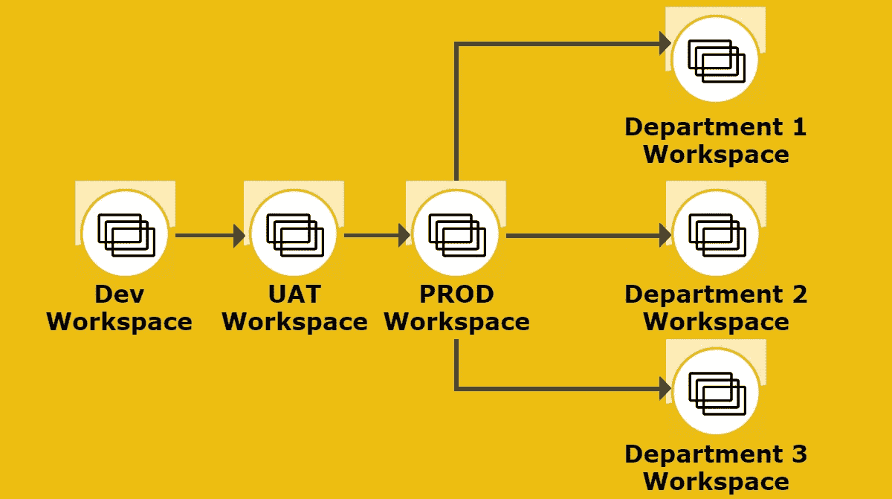
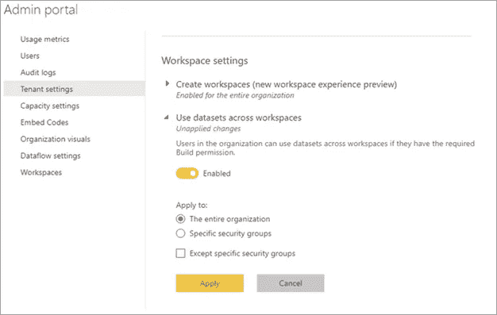

# Power BI —跨多个工作区保护数据并促进自助服务

> 原文：<https://medium.com/version-1/power-bi-securing-data-across-departmental-workspaces-and-facilitating-self-serve-376dae82f419?source=collection_archive---------5----------------------->

*这篇文章讨论了如何在 Power BI 中使用行级安全性来保护数据，同时允许贡献者或更高级别的人员访问工作区。*

当一位同事礼貌地询问我在解决方案设计文档中所写的内容是否正确(因为它与微软文档“冲突”)时，我有点惊讶。

## **我想,“这当然管用”,我以前就这么干过。但是为什么微软的文档没有指出它有！？！？！**

即使在最好的情况下，在权力 BI 安全的浑水中航行对新来者来说也是令人困惑的。但是，对于那些不仅希望使用行级安全性(RLS)保护其数据，还希望允许一些用户在中央数据集上“建立权限”同时又希望:

# **在部门/多个工作空间中分离出小用户群**

# **和**

# **避免每个工作空间中有多个数据集**

## 要求不过分？正确..？

## **好吧，我们来举个例子:**

Example

*   **生产(PROD)工作区包含、报告和一个定义了 RLS 角色的数据集。**
*   **部门的每个工作区共享报告。(带 RLS)**
*   **部门工作空间内的管理员、成员和贡献者被授予对驻留在生产工作空间内的数据集的构建权限。(带 RLS)**

# **行级安全性是否仍然有效？**

## ***好问题！***

如果你按照微软官方文档:

> RLS 角色适用于在工作区中被分配了查看者角色的成员。即使赋予查看者对数据集的生成权限，RLS 仍然适用。例如，如果具有生成权限的查看者使用 Excel 中的分析，他们的数据视图将受到 RLS 的保护。**分配了 Admin、Member 或 Contributor 的工作空间成员拥有数据集的编辑权限，因此 RLS 不适用于他们。**

[*参考*](https://docs.microsoft.com/en-us/power-bi/enterprise/service-admin-rls#using-rls-with-workspaces-in-power-bi)

你可能会认为上面的例子实际上是不可能的，部门管理员、成员和贡献者会看到所有的数据！但是，再想想！以上仅对应于数据集所在的工作空间。如果用户是共享报告或数据集的工作空间的管理员、成员或贡献者，则 RLS 实际上适用，因此数据将通过 RLS 得到保护。

# 所以，是时候扫清道路了…..

# **需要什么？**

## **确保 RLS 仍然适用于工作区的管理员、成员和贡献者。(如上例中部门的工作区)**

*   只读用户需要具备以下条件:分配给部门工作空间的查看者角色，生产工作空间不需要角色，但需要对中心数据集(在生产工作空间内)的读取权限。此外，还需要为用户分配一个行级别的安全角色。
*   希望在其部门工作空间内创建报告的用户(管理员、成员、参与者)需要以下权限:分配给其部门工作空间的管理员、成员、参与者角色，生产工作空间不需要角色，但需要对中心数据集(在生产工作空间内)的读取、构建权限。还可以授予数据集的重新共享权限。此外，还需要为用户分配一个行级别的安全角色。
*   此外，需要为整个组织或构建报告的用户启用以下租户设置！([控制跨工作区数据集的使用](https://docs.microsoft.com/en-us/power-bi/connect-data/service-datasets-admin-across-workspaces)

Dataset Sharing Tenant Setting

## 最终结果？

RLS 不仅仍然适用于部门工作区内具有管理员、成员或贡献者角色的用户的报告，而且当他们在部门工作区内构建报告(使用中央数据集)时 **RLS 仍然适用！！**

# **得分！**

## **…。在你问之前。为什么不用应用程序呢？**

在组织内的部门/团队仍然需要创建报告/自助服务的能力，同时仍然保持数据安全，同时避免数据集重复的情况下…那么上面的场景还是最好的选择！

**关于作者:** [Marco](https://www.linkedin.com/in/marcofrondella) 是[版本 1](https://www.version1.com/) 的数据可视化顾问，为组织提供数据解决方案和可视化专业知识。凭借对高性能 BI 的关注，Marco 帮助确保客户从其数据中获得最佳价值。