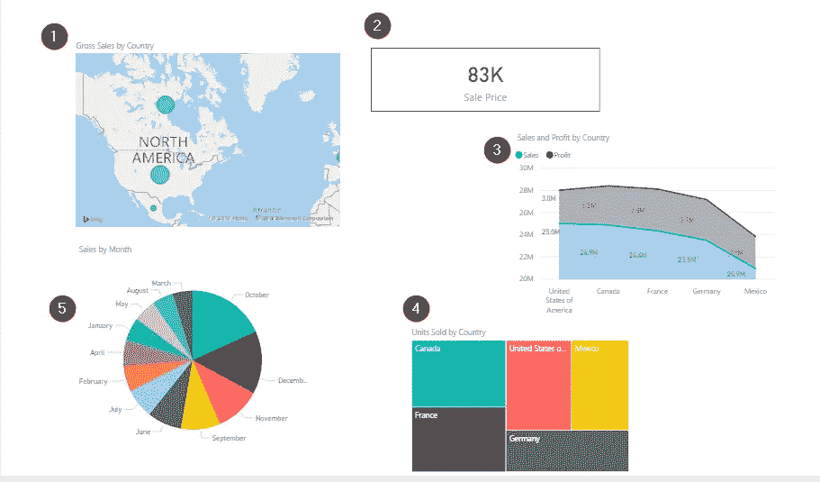
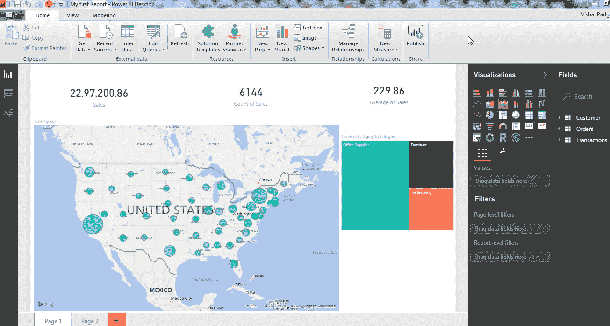

# Power BI 教程-使用 Power BI 桌面以前所未有的方式可视化数据

> 原文：<https://medium.com/edureka/power-bi-tutorial-ed9619113223?source=collection_archive---------2----------------------->

Power BI Tutorial — Edureka

如今，很少有人对商业智能的概念感到陌生。随着每天都有更新的工具出现来帮助解决数据管理的危机，大多数组织已经开始或计划使用商业智能来解决他们的危机。Power BI 是微软最新的 BI 工具，主要目的是帮助每个人分析和可视化他们的数据。本 Power BI 教程将按以下顺序让您全面了解 Power BI:

1.  什么是商业智能，我们为什么需要它？
2.  什么是数据可视化及其重要性？
3.  对电源 BI 的需求
4.  什么是 Power BI？
5.  Power BI 的组件
6.  电力商业智能体系结构
7.  Power BI 的构建模块
8.  使用 Power BI 创建报告
9.  Power BI 用例:Wirepas

让我们从解决最基本的问题开始这篇文章，商业智能到底是什么？

# 什么是商业智能？

在这个时代，商业智能已经成为比大多数趋势技术更大的领域，如果你问 20 个人商业智能是什么意思，你可能会得到 10 个不同的答案。所以让我用最简单的术语来表达，不要失去它的技术性。商业智能(BI)是将原始数据转换成有意义和有用的商业分析信息的一套技术和工具。简而言之，商业智能是一种在正确的时间将正确的数据提供给正确的人的技术，以便他们能够做出更有效的商业决策。

下图显示了商业智能的优势。

多年来，商业智能的过程已经发展并适应于通过涉及更新的工具和技术来帮助解决几乎所有的挑战，同时处理数据。商业智能多年来所经历的变化可以分为三波，因此让我们继续我们的 Power BI 教程，看看这三波。

## **第一波:技术(面向最终用户的 IT)**

在商业智能的第一波浪潮中，最终用户不得不依赖 IT 部门获得数据洞察力。这是因为最终用户不可能自己创建可视化/报告，因为可用的工具需要技术知识。这种对 IT 部门洞察力的依赖导致了更多的工作和时间消耗来完成更新。

## **第二波:自助服务(分析师到最终用户)**

第二波浪潮让分析师们接触到了商业智能。现在，具有一些分析知识的人可以使用 BI 工具。这意味着更多的团队可以访问 BI，更多的人可以获得更好的数据洞察力，这缓解了 IT 团队的角色。

## **第三波:所有人(最终用户)**

第三次浪潮使得访问数据和创建报告变得更加容易，可视化可以获得更好的业务洞察力。Power BI 等工具的引入使这种转变变得容易。现在，任何对数据有基本了解的人都可以创建报告来构建直观且可共享的仪表板。

这是关于 BI 的，现在让我们继续我们的 Power BI 教程，并了解与 BI 相关的另一个重要主题。

# 什么是数据可视化及其重要性？

简而言之，数据可视化只不过是信息/数据的图像或图形表示。它通过以更直观和更有意义的方式交流关键方面，提供了对复杂数据集的见解。数据可视化位于设计学、*传播学、*信息科学的*交汇点*。**

尽管数据可视化被称为 21 世纪研究的关键技能，但它可以追溯到很久以前。它存在于 18 世纪晚期，可以追溯到威廉·普莱费尔发明几何图的时候。1781 年，他的条形图被用来表示苏格兰对 17 个国家的进出口情况。这些条形图构成了对离散定量比较问题的一个纯粹的解决方案。

# 为什么数据可视化很重要？

人类大脑处理信息的方式是，使用图像、图表或图形来理解和可视化大量复杂的数据比通过电子表格或报告更容易。以任何图像为例，我们都知道“一幅图像胜过千言万语”这句话。这是完全正确的，因为图像不仅仅是像素的集合，它们还包含大量信息。视觉形式的信息比阅读文本形式的信息更容易理解。

数据可视化是一种以通用方式表达概念或信息的快速简便的方法。数据可视化有助于:

*   识别关键区域和隐藏模式。
*   获取能够更好地洞察客户的因素。
*   正确分析和关联数据和产品。
*   做适当的预测。

这是关于数据可视化的。接下来，在本文中，我们将了解电源 BI 为何如此重要。

# 对电源 BI 的需求

以下几点使 Power BI 成为数据可视化的主要工具之一。如果不理解这些要点，这篇 Power BI 教程将是不完整的。

## **实时现货趋势:**

Tableau 或 Qlikview 等传统 BI 工具会限制您进行历史分析。通过使用 Power BI，您可以访问实时信息，从而尽早发现趋势。通过这样做，您可以发现问题并提高性能。

## **自动搜索隐藏见解:**

借助 Power BI，您可以使用 *Quick Insights 在几秒钟内自动搜索数据集，寻找隐藏的见解。*用户可以简单地提出问题，Power BI Q & A 会立即回答他们的问题。

## **自定义可视化:**

借助定制的视觉效果，Power BI 允许您以几乎所有可能的方式可视化数据。因此，你并不局限于盒子里的东西。

## **企业就绪:**

借助 Power BI 和 Power BI Desktop，您可以安全地连接到自己的内部数据源。借助本地*数据网关*，您可以实时连接到您的 SQL Server 和其他数据源。它提供了安全、可扩展和可靠的企业级信息技术。

上述原因使得 Power BI 在数据可视化环境中非常重要。让我们继续这个 Power BI 教程，了解什么是 Power BI。

# 什么是 Power BI？

Power BI，这个名字在 BI 市场上已经存在很长时间了。微软团队花了很长时间构建了一个名为 Power BI 的大伞，这个伞结合了强大的可视化、数据分析和基于云的工具。

简而言之，Power BI 是微软提供的一项商业分析服务。它提供了具有自助业务智能功能的交互式可视化，最终用户可以自己创建报告和仪表板，而不必依赖信息技术人员或数据库管理员。

Power BI 还为您提供基于云的 BI 服务，称为“Power BI 服务”，以及基于桌面的界面，称为“Power BI 桌面”。它提供数据仓库功能，包括数据准备、数据发现和交互式仪表板。2016 年 3 月，微软在其 Azure 云平台上发布了一项名为 Power BI 的额外服务，该服务使用户能够轻松分析数据，执行各种 ETL 操作，并使用 Power BI 提交报告。

Power BI 网关允许您将 SQL Server 数据库、分析服务和许多其他数据源连接到您的仪表板。在 Power BI 和报告门户中，嵌入 Power BI 报告和仪表板，为您提供统一的体验。下图显示了 Power BI 的一般工作流程。

现在我们已经理解了什么是 Power BI，让我们在 Power BI 教程的下一个主题中尝试并理解它的重要组件。

# Power BI 的组件

Power BI 包含以下组件:

*   **Power Query:** 可用于搜索、访问和转换公共和/或内部数据源。
*   **Power Pivot** :用于内存分析的数据建模。
*   **Power View:** 您可以使用 Power View 以交互式数据可视化的方式分析、可视化和显示数据。
*   **Power Map:** 它通过交互式地理可视化将数据带入生活。
*   **Power BI 服务:**您可以共享数据视图和工作簿，这些数据视图和工作簿可从内部和基于云的数据源进行刷新。
*   **Power BI Q & A:** 提出问题，用自然语言查询得到即时答案。
*   **数据管理网关:**通过使用该组件，您可以定期刷新数据、显示表格和查看数据馈送。
*   **数据目录**:用户可以使用数据目录轻松发现和重用查询。可以为搜索功能提供元数据。

现在我们已经看到了上面提到的组件。让我们继续这个 Power BI 教程，了解 Power BI 的架构。

# 电力商业智能体系结构

下图显示了 Power BI 的架构。

Power BI 的架构有三个阶段。前两个阶段部分使用 ETL(提取、转换和加载)来处理数据。让我们逐一看看这些阶段:

## 数据集成

一个组织可能需要处理来自不同来源的数据。来自数据源的数据可以是不同的文件格式。数据首先从不同的来源提取，这些来源可以是不同的服务器或数据库等。然后，这些数据以标准格式集成，并存储在一个称为暂存区的公共区域。

## 数据处理

集成的数据还没有做好可视化的准备，因为数据在呈现之前需要处理。这些数据经过预处理或清理。例如，从数据集中删除缺失值或冗余值。清理数据后，将业务规则应用于数据，并将其转换为可呈现的数据。然后将这些数据加载到数据仓库中。

## 数据显示

因此，一旦加载并处理了数据，就可以使用 Power BI 提供的各种可视化工具更好地可视化数据。使用报告、仪表板有助于以更直观的方式呈现数据。这些视觉效果和报告有助于企业最终用户根据洞察做出业务决策。

本文的下一个主题是 Power BI 的构建模块。

# Power BI 的构建模块

您在 Power BI 中所做的一切都可以分解为以下几个组成部分。很好地理解这些构件将有助于您理解概念，并让您创建详细而复杂的报告。

Power BI 的基本构建模块如下:

*   形象化
*   数据集
*   报告
*   仪表板

## 可视化:

数据的可视化表示称为可视化。例如，图表或图形可以用来直观地表示数据。Power BI 为您提供了不同的可视化类型，这些类型会随着时间不断更新。下图显示了一些常用的可视化效果:

1.  地图表示
2.  卡片可视化
3.  堆积面积图
4.  树形地图
5.  圆形分格统计图表

可视化可以很简单，也可以很复杂。然而，可视化的目的是以这样一种方式呈现数据，它给你更多的上下文中的洞察力，否则很难从简单的数据文件中辨别出来。

## 数据集:

我们知道数据集只不过是数据或信息的集合。Power BI 利用这些数据来创建可视化效果。它可以是一个简单的数据集，也可以是许多不同来源的组合，可以对其进行过滤和组合，以提供一个完全不同的数据集。

例如，您可以从许多不同的来源收集数据，如不同的数据库字段、excel 表格和一些电子邮件活动的在线结果，以创建数据集。话虽如此，您可能希望在将数据引入 Power BI 之前对其进行过滤。过滤让您专注于对您重要的数据。下图显示了一个样本数据集。

准备好数据集后，您可以自由地创建可视化效果，并以不同的方式显示数据集的不同部分，这样您就可以获得洞察力。

## 报告:

在一个或多个页面上一起出现的可视化集合是 Power BI 中的报告。它是彼此相关的项目的集合。

如果需要，您可以在多个不同的页面上创建可视化效果，并以最适合您的故事的方式排列它们。下图显示了一个示例报告。

## 仪表板:

Power BI 仪表板是一个单页界面。它通常被称为画布，使用可视化来讲述一个故事。因为它被限制在一个页面中，所以一个设计良好的仪表板只包含这个故事中最重要的元素。您在仪表板上看到的可视化效果称为平铺显示，并从报告中固定到仪表板上。

在 Power BI 中，图块是在报告或仪表板中找到的单个可视化内容。它是一个矩形的盒子，包含了每一个视觉元素。

Power BI 让您可以自由移动或排列图块，因此您可以按照自己想要的方式显示数据，即使是在您创建报告或仪表板时。您可以让瓷砖变大，改变它们的高度或宽度，并按照您想要的方式将它们贴合到其他瓷砖上。

这是关于 Power BI 的构建模块，现在我将进一步介绍 Power BI 教程，演示如何使用 Power BI 创建一个简单的报告。但是，入门的前提条件很少。首先，您需要在系统上安装一个“Power BI Desktop ”,这是一个您可以创建报告的界面。可以免费下载。您可以使用此 [*链接*](https://goo.gl/kNVmzp) 下载 Power BI 桌面。

您将需要使用组织电子邮件 ID 登录，如研究所电子邮件 ID 或您所在组织的电子邮件 ID。创建一个帐户很重要，因为这将使您能够访问 Power BI 服务，这是发布您的报告和创建仪表板所必需的。

下载 Power BI 桌面后。你需要一个数据集来可视化它。我将使用微软创建的财务数据集，它可以使用这个[*链接*](https://goo.gl/Ebgnpu) *下载。*

# 使用 Power BI 创建报告

下图显示了 Power BI 台式机的界面外观。左侧面板中以蓝色突出显示的部分显示了报告、数据和关系工作区。默认情况下，将打开*报告*工作区。这是您创建报告的地方。报告工作区下面是数据工作区，用于查看导入的数据集。最后一个选项卡是 relations 选项卡，它给出了数据集中不同变量之间的关系，如果它们定义得很好的话。在右侧，您将看到可视化效果和外业工作空间。

## 导入数据

因此，让我们将财务数据集导入 Power BI。您可以点击下图中突出显示的 G *et Data* 选项卡，并加载数据以供使用。

我已经添加了*财务*数据集。Power BI 会问你是要加载数据还是编辑数据。我只是简单地加载了它，因为数据集不需要任何编辑。

点击界面左上角的*数据选项卡*即可查看。如果你看过这些数据，你就会明白，这只是关于几个国家及其总体销售情况的简单数据。在屏幕的右上角，您可以看到数据集的所有字段。使用下面的图片作为参考。

## 创建可视化

让我们回到报告工作区，创建一个简单的报告。第一步是选择一个可视化。我会使用聚集柱形图可视化。当您单击所需的可视化时，会在报告工作区中创建一个模板。

既然我们已经选择了可视化，我将在 Y 轴上显示销售额和利润，在 X 轴上显示日期。因为您使用的是 Power BI，所以您不必担心选择轴的复杂性。您只需选择字段，它就会反映在图表中。参考下图。

您甚至可以在可视化界面上拖放字段，更改会立即反映出来。在下图中，我拖动了“利润”字段。

您可以通过拖动边框来调整这些可视化效果的大小，甚至可以通过单击并将其放置在工作区的任何位置来移动图像。

您甚至可以通过点击来改变基于时间线的图形。我已经将上图中销售数据的年度表示法改为月度表示法。见识也完全变了。你可以参考下面的图片来看看这些变化。

在可视化面板下方，有*字段*和*格式*选项卡。通过使用*字段*选项卡，您可以执行统计操作，如计算各种参数的平均值、中值、总和甚至过滤数据。通过使用*格式*选项卡，您可以使用不同的配色方案来使您的可视化更具吸引力和洞察力。下图显示了如何更改可视化中使用的字段的颜色。

我们已经成功地创建了一个可视化。在 Power BI 中创建可视化就像这样简单。我希望到现在为止，你已经能够自己创建可视化了。你甚至可以将你的报告发布到网上。下图显示了如何在 Power BI 中发布报告。

发布报告后，Power BI 会给你一个链接。您可以点击该链接，并在报告发布后查看报告。供您参考，我在一个报告中创建了一些其他的可视化，并将其发布。你可以把这份报告以 GIF 格式附在下面。以下内容已被可视化:

*   表示销售额和利润的簇状柱形图
*   销售总额的国家地图表示
*   销售价格的卡片可视化
*   不同国家出售的单位的树形图。
*   季度销售饼图

当您在 Power BI 桌面上创建这样的报告时，您将获得深入的见解，并可以深入了解统计数据。这可以通过点击可视化中出现的不同字段来实现。

您可以选择适合您需求的视觉效果，并进行相应的实验。有很多可视化方法可以尝试和实验。此外，当谈到可视化时，没有两个人以相同的方式可视化数据，因此您的报告可能会产生不同的结果。这就是如何使用 Power BI 创建和编辑报告的方法。

现在让我们继续前进，看看这个 Power BI 教程的最后一个主题。

# 电线电缆

让我们看一下这个用例，了解一下 *Wirepas* 如何使用 Power BI 快速、轻松、有效地可视化大量传感器收集的数据。

## **关于公司**

Wirepas 专注于为客户提供最可靠、优化和可扩展的设备连接。借助 Wirepas，客户可以数字化其当前的业务流程，并为新的颠覆性模式进行创新。Wirepas 总部位于芬兰坦佩雷，在法国、德国、韩国和美国设有办事处，于 2010 年在坦佩雷成立。

## **挑战**

Wirepas 技术通过其连接服务收集各种数据。每个基于 Wirepas 软件技术的无线设备都可以收集和发送大量数据。这些数据通过多种方式收集，然后存储在数据库中。将这些数据可视化是获得技术跟踪的“事物”的当前状态的概述的关键。Wirepas 需要克服以下障碍:

*   这些数据是从数百万个不同格式的来源收集来的
*   显示为包裹追踪服务收集的大量传感器数据存在困难
*   查找哪个包裹在何时何地
*   包裹的状况如何
*   终端用户如何理解收集的物联网数据

Wirepas 使用 Power BI 克服了上述所有挑战。让我们来看看解决方案。

## **解决方案和交付**

**采集数据**

数据从不同的来源导入，并使用 Power BI 和查询编辑器进行清理。

**使用 Power BI 桌面设计报告**

在导入和清理来自 100 万个传感器的数据后，Power BI 用于设计仪表板，使客户能够获得所有数据的概览，并使他们能够深入了解一个*单个包裹和包裹历史*。

**创建高性能 BI 工作空间**

为了在 Azure 中创建 Power BI 工作区，使用了 Power BI-CLI。当时，没有 UI 可用于在 Azure 中为 Power BI 创建工作区。因此，他们使用 Power BI 命令行工具来管理 Power BI 嵌入式工作区集合。

**在网络应用中嵌入 Power BI**

*Power BI Embedded* 支持开发人员将报告嵌入到几乎所有类型的应用中。这是将报告嵌入网站的最简单的方法。

以下架构用于解决整体问题:

# 结论

对于 Wirepas 来说，这是一个聪明的方法，可以轻松快速地将其 IP 带到云中。整个项目需要有限的通话时间、咨询和实施。

对于博世互联世界来说，这是基于 Azure 和 Power BI Embedded 的复杂数据的简单演示。自研讨会以来，Wirepas 已经赢得了几个新客户，他们正在使用由 Power BI Embedded 提供支持的产品和仪表盘。

如果您需要详细了解这个用例，那么您可以参考这个 [*链接*](https://goo.gl/iZjpNH) *，*，它将引导您到发布实际案例研究的页面。

我们关于 Power BI 教程的文章到此结束。我希望这篇文章对你有所帮助，并增加了你的知识价值。

如果你想查看更多关于人工智能、DevOps、道德黑客等市场最热门技术的文章，你可以参考 Edureka 的官方网站。

请留意本系列中的其他文章，它们将解释 PowerBI 的各个方面。

> *1。* [*动力 BI 仪表盘*](/edureka/power-bi-dashboard-fe37c2b9292c)
> 
> *2。* [*电力匕桌面*](/edureka/power-bi-desktop-42c867c712ca)
> 
> *3。*[*power bi KPI*](/edureka/power-bi-kpi-c256a3749da5)
> 
> *4。* [*电力毕报道*](/edureka/power-bi-reports-c64ee557e346)
> 
> *5。* [*小技巧做出有影响力的&互动力 BI 报道*](/edureka/power-bi-reports-c64ee557e346)
> 
> *6。*[*DAX in Power BI*](/edureka/power-bi-dax-basics-27008f4f7978)
> 
> *7。*[*vs 权力毕*](/edureka/msbi-vs-power-bi-ef5dab26c463)
> 
> *8。* [*电力 BI 开发人员工资*](/edureka/power-bi-developer-salary-1ce0577f1013)
> 
> *9。* [*电力 BI 架构*](/edureka/power-bi-architecture-270bdd8b5e25)

*原载于 2017 年 8 月 1 日*[*www.edureka.co*](https://www.edureka.co/blog/power-bi-tutorial/)*。*