# Power BI 与 Excel:是时候改变您的报告方式了

> 原文：<https://medium.com/quick-code/power-bi-vs-excel-its-time-to-shift-your-reporting-55971b0ba163?source=collection_archive---------1----------------------->

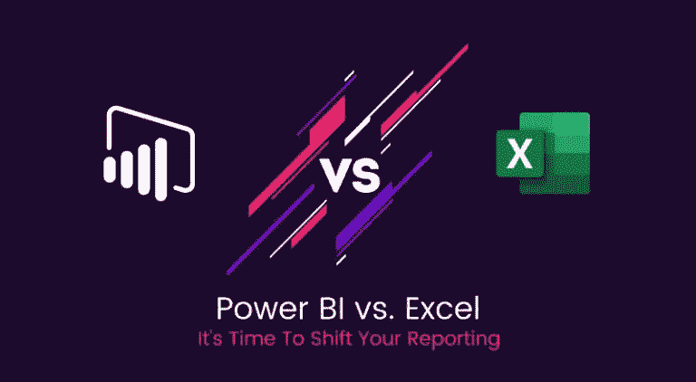

忘记千兆字节吧，如今数据是以千兆字节生成的。

根据 IDC 集团的研究，我们每年生成的数据规模将达到 **44 zettabytes (44 万亿 GB)**。数据分析的重要性在过去几年中显著增加，但仍有大量数据被忽略或未被分析。数据无处不在。公司正在利用数据分析和数据智能功能来发现隐藏的见解，从而帮助公司做出数据驱动的决策。

迄今为止，Microsoft Excel 一直是首选的数据管理和可视化工具。它是商业世界中广泛使用和流行的电子表格应用程序之一。随着数据在从零开始重塑业务中发挥着至关重要的作用，新的工具和技术每天都在引入，以获得大数据的好处。

Power BI 是微软推出的一款广受欢迎的自助式数据可视化工具，它让企业可以轻松地从各种数据源中提取情报。它提供交互式、易于使用且安全的商业分析和情报服务。

**好读**:[10 分钟力量 BI——什么，为什么，谁，怎么理直气壮](/hackernoon/microsoft-power-bi-in-10-minutes-quick-guide-c70a6155bab9)

显而易见，Power BI 配备了现代数据智能功能，提供了比 Excel 更好的洞察力。

下面我们来详细对比一下传统的报表工具和现代的 Power BI。

这篇文章解释了 Power BI 比 Excel 更适合报告的主要原因，以及为什么我们提倡 Power BI 咨询使用数据获得更好的前瞻性结果。

# Power BI 与 Microsoft Excel

## **收集和访问数据的灵活性？无障碍？还是两者都有？谁更好？**

由于无处不在的性质和不断增长的数据量，数据有多种格式。Excel 支持有限的数据源，主要用于对数据进行分析和计算，具有广泛的函数和数学运算。

Excel 2013 提供了广泛的 Power BI 特性和功能，可将数据转化为有意义的信息。这包括对外部数据源的支持，如 SQL 表、多维数据集、Microsoft Azure 数据等。

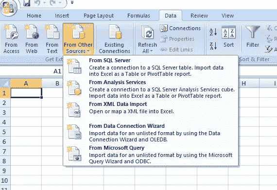

谈到 Power BI，您可以选择任何类型的数据，包括来自任何应用程序或服务、报告、基于云的来源、工作簿、CSV 文件、Excel 或数据库的数据。它还有一个强大的压缩算法，可以轻松访问、分析和存储较大的数据文件。拥有一致和更大数据流的公司正在使用 Power BI 获得他们所提供的产品/服务的 360 度视图。它提供了一套全面的数据连接器。

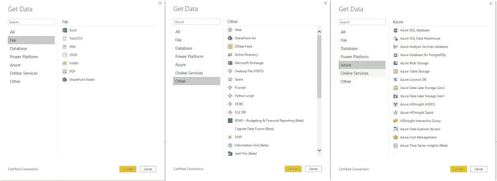

另一方面，Excel 使得处理大型数据集变得困难。很难在当前的基础上添加更多的销售数据或数据集，需要花费更多的时间和精力来获得一个整体的场景。

无论何时发现新数据，都可以将其与 Power BI 集成，而无需链接或重新打开所有内容。这种添加和链接数据集的灵活性降低了开销，因为软件将自动执行数据刷新(您也可以安排数据刷新)并记住数据模式

## 报道和仪表板:力量阿碧是赢家吗？

Power BI 凭借其强大的功能使数据分析和报告变得轻而易举。Power BI 报告在视觉上极具吸引力，易于理解，并提供多角度的见解，有助于更快地做出决策。报告具有高度的交互性和动态性—数据会发生变化，报告中的值也会发生变化。报告可以有一个或多个视图。调整大小、编辑、简单格式化、自然语言查询和过滤使 Power BI 成为数据报告的理想工具之一。

另一方面，Excel 具有表格数据格式，还允许以各种图表格式显示数据。但是，对于较大的数据集，它缺乏清晰度和灵活性。它更适合于简单和结构化的数据模型，对于数据集和报表的作用范围有限。

## 可视化:快速将数据转化为洞察力

这就是 BI 比其他可视化工具更强大的地方。凭借自助服务分析能力、各种[数据可视化](https://www.spec-india.com/tech-in-200-words/what-is-data-visualization)、基于云的服务和安全措施，Power BI 成功地在市场上获得了其他工具的领先地位。

## 为什么要为 BI 提供更好的可视化？

**从各个角度轻松识别趋势:**

无论大小如何，您都可以清晰轻松地分析大量数据。您可以尝试各种实验和属性来获得精确的结果。分析不同时间不同维度的数据和一系列因素有助于分析师更快地进行预测，并获得更广泛的数据。

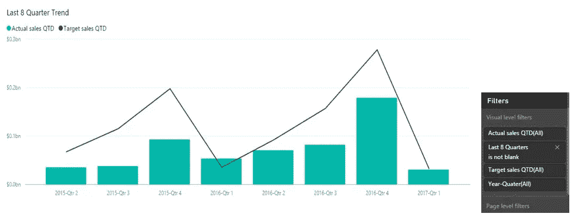

*Image Source:* [*visualbi.com*](https://visualbi.com/blogs/microsoft/powerbi/trend-analysis-power-bi/)

**个性化仪表盘:**

Power [BI 仪表板](https://www.spec-india.com/tech-in-200-words/what-is-bi-dashboards)被称为画布，其中所有报告都用片段突出显示。这些可视化来自报告，而报告基于数据集或不同数据集的集合。您可以单击任何可视化视图来查看完整的报告。这些个性化的仪表板充当报告、活动和数据集的 360 度视图。有了这个，你就可以用吸引人的主题、交互式磁贴和视觉上吸引人的布局来关注所有的活动、视觉效果和底层数据源。用户可以根据需要自定义或编辑仪表板。

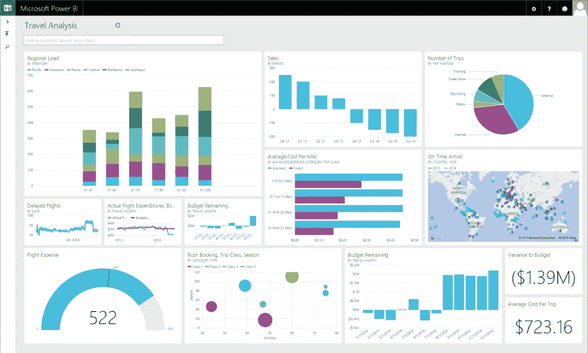

*Image Source:* [*Microsoft*](https://powerbi.microsoft.com/fr-fr/blog/new-power-bi-features-available-for-preview/)

[查看我们实时定制的 Power BI 仪表盘](https://www.spec-india.com/live-bi-visualization)

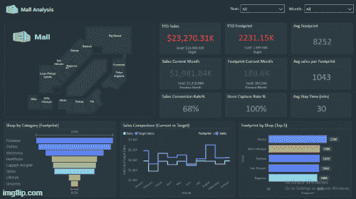

**警报**

Power BI 帮助分析师根据 KPI(关键绩效指标)设置警报。当仪表板或值的任何更改超出您设置的限制时，这些警报会通知您。

以下是 Power BI 社区的分步视频，可帮助您设置警报。

**各种图表:**

借助内置的自助服务和人工智能驱动的商业智能解决方案，Power BI 强大的算法有助于将数据转化为智能见解。它提供各种图表，如:

*   条形图和柱形图
*   折线图
*   饼图
*   桌子
*   面积图
*   圆环图
*   仪表图
*   漏斗图
*   散点图
*   多行卡
*   单一号码卡片
*   地图
*   树形地图
*   组合图表

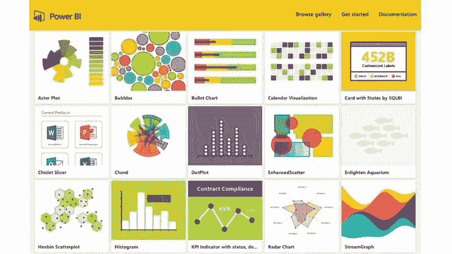

*Image Source: Microsoft*

## 模板和主题:用户体验是关键

您可以创建或定制主题和模板，以便在视觉效果和分析方面获得一致、吸引人和统一的用户体验。拖放功能、轻松的编辑和删除、更流畅的导航和以用户为中心的设计一起为用户和设计师创造了迷人的体验。

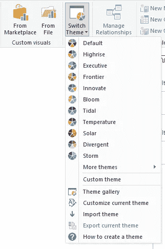

## 让合作变得更容易

企业是在一个合作更快、变化更快的时代运营的。Power BI 让共享变得前所未有的简单。只需点击几下鼠标，就可以与组织的其他成员共享仪表板或报告。Power BI 服务产品可用于内部或云中，从小型企业到企业级智能。

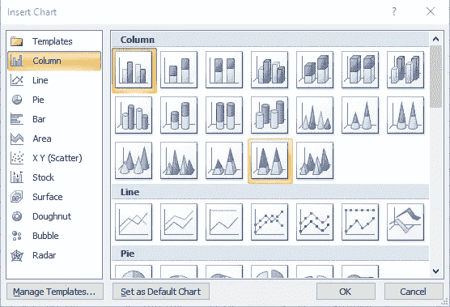

Excel 还提供可视化选项，如表格、折线图、条形图、饼图、柱形图等。作为一个传统的电子表格程序，它在集成、协作、功能和格式方面都有局限性。虽然，有了一套丰富的数学公式和数据透视表，用 Excel(高级版)组织复杂的数据结构和设置 KPI 都很容易。

## 数据安全是一项至关重要的任务

不管您使用的是什么工具和技术，数据安全已经让每个人都朝着这个方向思考，制定了战略路线图和预防措施。Power BI 具有内置的安全控制，包括基于角色的身份验证、行级安全功能、网络安全、风险缓解、会话监控、授权和基于云的安全配置。

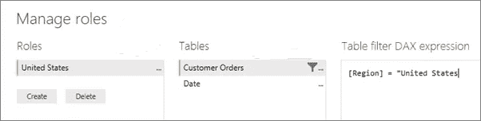

*Image Source:* [*docs.microsoft.com*](https://docs.microsoft.com/en-us/power-bi/service-admin-rls)

在 Excel 中，您可以限制对特定文件、工作表甚至工作簿的访问。您还可以锁定文件以隐藏可见性，或者授予只读访问权限以防止修改或编辑。

## 移动是前进的方向:

Power BI 为 Android、iOS 和 Windows 10 移动平台提供了几个应用程序。所有报告和仪表板，无论其位置(内部或云)如何，都可以在移动应用程序中获得。它允许查看并与他们互动，还通过移动应用程序为企业提供一些管理控制。

此外，Power BI 的定制可视化和与其他应用程序的轻松集成也是其优势。

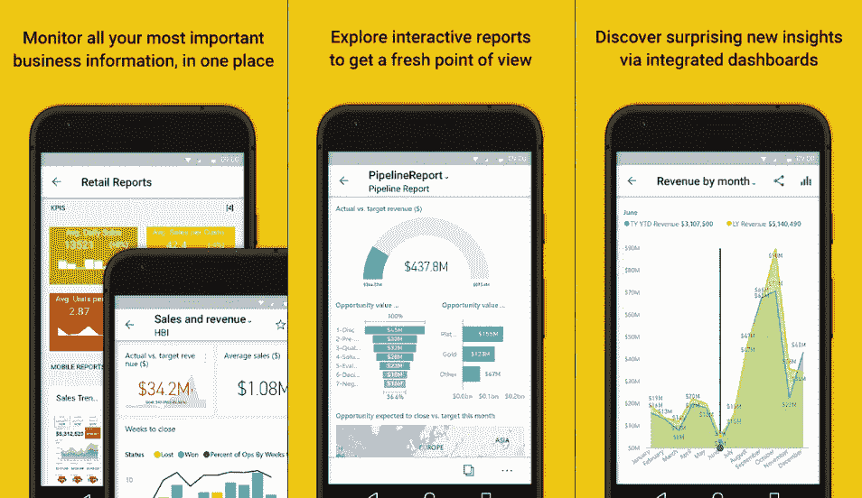

*Image Source:* [*Google Play*](https://play.google.com/store/apps/details?id=com.microsoft.powerbim&hl=en_US)

## Power BI 或 Excel:是时候将数据报告从 Excel 转移到 Power BI 了

数据具有巨大的潜力，可以帮助组织做出决定，塑造任何规模、任何类型的公司的美好未来。凭借自助服务能力，Power BI 改变了组织考虑数据及其优势的方式。Power BI 使人们能够轻松做出数据驱动的决策，而无需深入研究数据科学和分析，这证明了它的潜力。微软在分析师、商业智能专业人士、数据科学家和数据工程师的支持下，不断努力使 Power 阿碧成为功能丰富、安全和强大的商业智能工具。

> “一个组织的学习能力，以及快速将学习转化为行动的能力，是最终的竞争优势。”通用电气公司董事长兼首席执行官杰克·韦尔奇

深入研究数据以获得更好的可行见解似乎是必要的，而不是优势。您是否已将您的报告升级到 Power BI？

**注意** : [这篇文章之前发表在我们的博客上](https://www.spec-india.com/blog/power-bi-vs-excel-comparison)