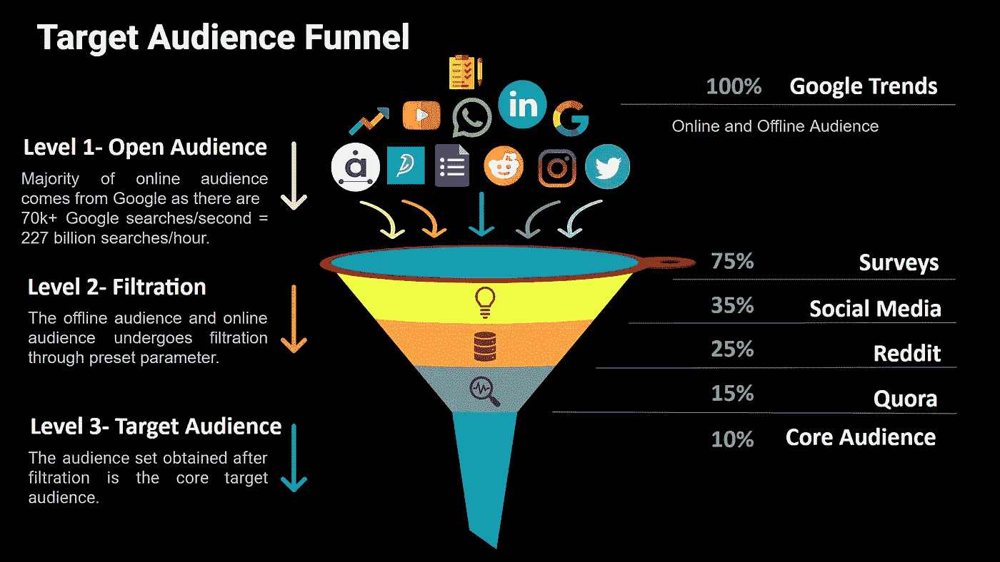
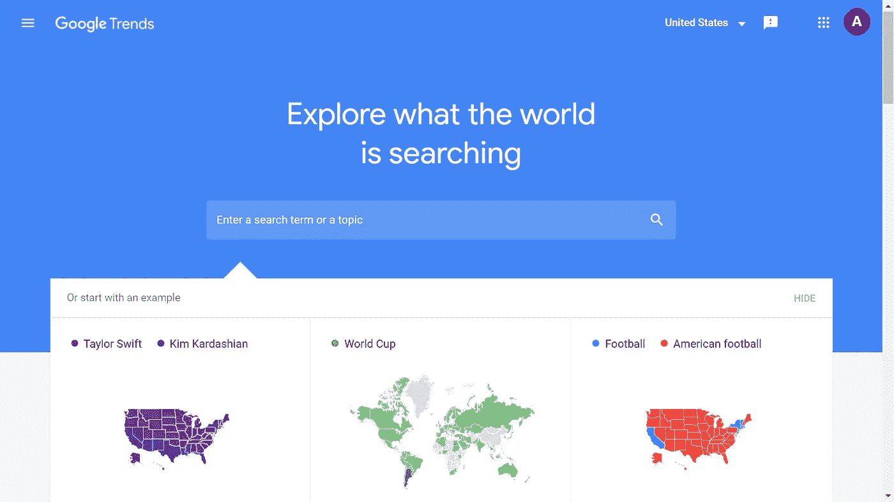
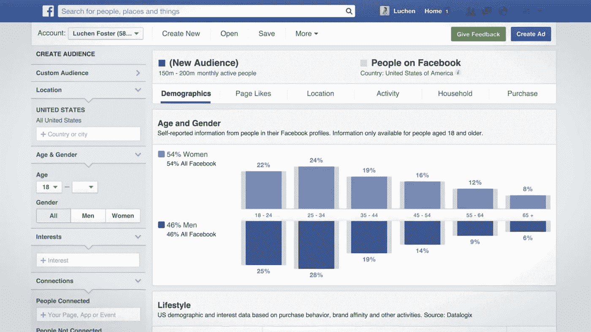
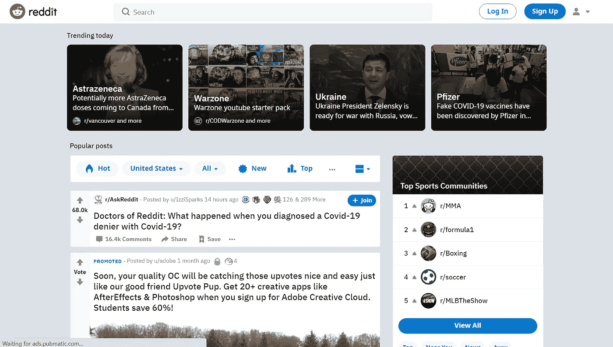
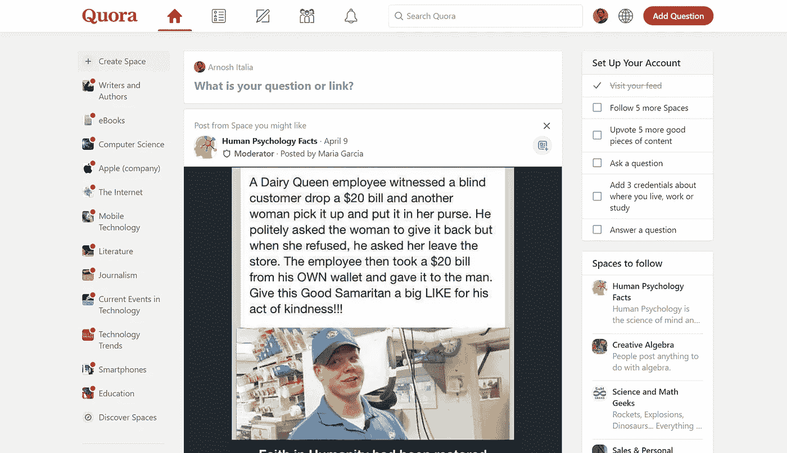

# 寻找目标受众的强大工具

> 原文：<https://medium.com/globant/powerful-tools-to-find-your-target-audience-e09898f8eb2a?source=collection_archive---------0----------------------->

你想知道你的目标受众是谁吗？

*Estimate the size of your audience.*

在这个数字革命的时代，品牌和消费者之间的关系得到了优化，以实现利润最大化。首先，在创建任何内容或策略之前，确定你的目标受众是至关重要的。例如，如果你正在写博客，你需要确定你的读者和吸引他们的语气。同样，确定与品牌产品相对应的受众偏好也很重要。

了解你的受众是至关重要的，因为他们的概况因地理位置、语言多样性、社会因素、人体测量多样性和技术无障碍挑战等各种因素而不同。

开放受众是您进行研究的受众总数，将他们转化为您的目标受众，并最终转化为潜在客户。公开的受众可以通过线上和线下两种方式接近，促使他们接受你的品牌。

获取目标受众的过程包括对公开受众进行细分，并通过各种工具进行筛选。

Target Audience Funnel.

为了分析你的目标受众，让我们来看看五个强大的工具，它们提供了对受众角色和个人资料的完整洞察。上面的图像也将让你对我们接下来要看到的工具的各个步骤的过滤有一个概念。

## 1.谷歌趋势

谷歌在搜索引擎中排名第一，因为它在全球每小时有超过 2 亿活跃用户询问他们的问题。搜索的主要部分，即 114%是由用户在谷歌上完成的。Google Trends 是 Google 提供的一种工具，它可以分析不同地区和语言的不同用户的热门搜索查询，并以图形和图表的形式显示，比较不同人口统计数据中不同查询的搜索量。

*Google Trends showing related search trends.*

在研究之初使用这一工具有助于你最大限度地提高曝光率，了解受众的参与度。谷歌趋势是免费的，搜索数据可以很容易地导出供进一步研究。

从 Google Trends 获得的数据来自用户执行的实时搜索，因此数据在本质上是不断更新和最新的。谷歌趋势只给出相对数字，没有办法得到绝对数字。因此，需要进行比较搜索，以获得可以比较的结果。

不可能通过谷歌趋势跟踪不上网的人。因此，搜索的上下文对于离线观众是不存在的。谷歌趋势给出的是相对的搜索数据，而不是具体的数据。因此，我们需要进一步过滤这些受众数据。

搜索频率相对较低的搜索项的数据不会被 Google Trends 显示。此外，需要验证从 Google Trends 获得的数据的认证，以消除数据重复和其他污染物，如虚假数据或未经验证的用户和机器人。

## 2.调查

调查是过滤线下受众的基础。一个简单而又受欢迎的老派信息来源是进行调查，以了解目标受众和你的受众喜欢的竞争品牌。

如今，调查更倾向于完全自主和保密，以保护个人隐私并提供更准确的结果，因为接受调查的受众享有保密性。

简单但最广泛使用的调查工具是 Google Forms，它允许在不需要很多技能的情况下灵活地构建一个调查工具，并且您还可以应用验证选项来控制数据输入的质量。

*Survey on SurveyMonkey.*

除了积极的一面之外，这个工具也有一些不好的一面，比如表单可以连接到互联网。因此，它们要求您在对其进行任何修改或收集数据时保持在线。当密码较弱时，安全性受到损害，并且在上传文件(JPG 和 pdf)和图像(2MB 限制)方面存在限制。

另一个流行的工具是 **SurveyMonkey** ，它已经被许多公司采用，因为它更容易访问，输入错误最小化，以及数据编码。基本版支持更快的分发，节省了成本和时间。

调查定制很简单，可以通过各种渠道共享。然而，不利的一面是，由于缺乏任何工具对被调查受众和问题大小的限制，回复率较低。SurveyMonkey 提供了一套多用途的不同类型的调查问卷，使定制变得容易且适应性强。

调查结果和谷歌趋势将把开放受众数据过滤为线下和线上受众数据的 75%。以上两个工具得到的受众数据还是比较模糊的，离你的核心受众还很远。

## 3.社交媒体分析

社交媒体是与你的目标受众沟通的关键。当你想收集关于你的受众的信息时，你需要了解你的受众来自哪个社交媒体渠道。

例如，如果你的网站包含许多照片，你想向年轻观众展示它们，那么你需要利用 Instagram、脸书、抖音和 WhatsApp 等渠道。

*   脸书:“脸书观众观察”仪表板非常简单易懂。此外，你可以直接获取你的帖子点赞和外部推荐的来源，这在谷歌分析中很常见。用户可以从仪表板上找到他们的脸书页面的见解，如印象、评论，并实施反馈以提高性能。

*Facebook Insights Dashboard.*

*   **Instagram:** 根据 h . Tankovska 2021 年 1 月的 Instagram 全球受众分布报告，全球 Instagram 受众中有三分之二的人年龄在 34 岁及以下。另一方面，很难将数据导出到 Excel，信息是百分比而不是实际数字，这需要进一步计算。
*   **YouTube:**35 岁以上的老年观众经常出现在 Twitter、YouTube、Pinterest 和 LinkedIn 上。如果我们考虑 YouTube Analytics，它的用户界面很容易解读，而且该工具是免费的。YouTube Analytics dashboard 提供了关于观众浏览量、收入、人口统计的详细信息，以及或多或少的观众的完整角色。分析数据也可以导出到电子表格中。
*   **第三方社交媒体管理:**Audiense、Agorapulse 和 Quick Sprout 等工具，识别与你的品牌或博客相关的目标受众，并有效地向他们发送个性化信息。
    这些工具，使用先进的机器学习 AI(人工智能)，在分析兴趣、行为和缩小你的受众目前正在追求的竞争品牌方面派上了用场。
    现代社交媒体分析工具使用“洞察力”来识别和分类他们的受众。
    这些工具中有许多是免费的，并提供付费广告来增加受众范围和参与度。社交媒体分析还强调了受众喜欢的广泛传播，并为未来的受众参与战略奠定了基础。
    该阶段获得的目标受众过滤缩减值约为 35%，需要过滤直至获得核心受众。

## 4.Reddit

Reddit 是互联网的一场现代革命，它赋予了社会新闻和网络内容评级权力。这也是一个公开讨论的论坛。全球超过 4.3 亿活跃的 Reddit 用户使该网站非常受欢迎，并有助于吸引更多的受众。

最近，Reddit 的生态系统还包括通过 Reddit 公共访问网络的直播内容，允许用户上传链接、文本帖子和图像等内容。

然后，这些内容由其他成员投票表决，形成按主题组织成用户创建的公告(称为“社区”或“子编辑”)的帖子，该公告包括各种主题，如政治新闻、电影、在线游戏、书籍、音乐、烹饪、体育和宠物。对帖子结果的投票有助于帖子出现在子编辑的顶部，并最终出现在网站的首页。

Reddit: the front page of the internet.

要在 Reddit 上找到你的目标受众，你只需要在 subreddit 搜索工具中键入关键词，然后查看搜索结果中弹出的相关对话。你会在帖子左侧的箭头之间看到“upvotes”的计数，这表明你的主题在 Reddit 观众中有多受欢迎。整理 subreddit 区域的座位，让它成为你的数据库。

这些数据将帮助您创建与您的观众同步的准确内容。预计的结果将帮助你了解你的目标受众的兴趣领域，使他们达到 15%的公开受众的价值。

## 5.Quora

Quora 是一个伟大的地方，观众可以在这里获得和分享他们的知识。这个平台使用户能够提出问题，并与提供独特见解和高质量答案的人联系。

谷歌和 Quora 的唯一区别在于，Quora 允许用户根据事实信息发表意见，让营销人员了解目标受众的实际需求。你可以直接向 Quora 的观众提问任何有助于你与观众互动的问题。

Quora Homepage.

比如，你可以问“我如何通过写博客成为百万富翁。”人们会试图用他们通常阅读的博客网站的链接/参考来回答，告诉你与品牌合作赚取利润的方法，提供一些流行和有趣的话题，并与他人分享这个问题以获得更多意见。

在这个阶段，咖啡的奶油浮在顶部，即 10%的过滤开放观众，它提供了核心目标观众。

确定目标受众的过程很复杂，因为情绪会随着所提供的产品或服务而变化。任何产品的受欢迎程度都与它所实现的感觉或它试图解决的问题直接相关。

本文中提到的工具一定会使这一过程变得更简单，并且会让你清楚地了解你计划为你的企业瞄准的受众。