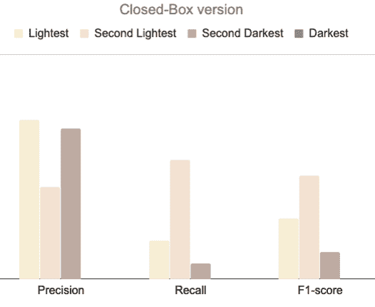

# 使用我们新的视觉肤色模型支持包容性搜索和推荐

> 原文：<https://medium.com/pinterest-engineering/powering-inclusive-search-recommendations-with-our-new-visual-skin-tone-model-1d3ba6eeffc7?source=collection_archive---------2----------------------->

Nadia Fawaz |应用科学研究科学家兼技术主管，Bhawna Juneja |软件工程师，搜索质量，David Xue |软件工程师，视觉搜索

为了真正地*给每个人***带来创造他们热爱的生活的灵感，* Pinterest 致力于内容多样性和开发包容性的搜索和推荐引擎。我们从 Pinners 那里听到的最高要求是，他们希望在产品中得到体现，这就是为什么我们在 2018 年建立了我们的[第一版肤色范围](/pinterest-engineering/building-a-more-inclusive-way-to-search-789f4c92fd73)，这是一个包容性的搜索功能。我们很自豪地介绍最新版本的肤色范围，一个新建立的内部技术。这些新的肤色范围为在搜索中推荐更具包容性的灵感铺平了道路，也为我们的增强现实技术 [Try on](https://newsroom.pinterest.com/en/post/pinterests-new-ar-tech-lets-you-try-on-makeup-before-you-buy) 铺平了道路，并推动了整个平台上更多样化的推荐举措。*

****

*Skin tone ranges in Beauty Search and in AR Try-on Similar Looks*

# *开发更具包容性的肤色范围*

*考虑到阴影、不同照明和各种其他障碍的影响，试图理解图像中的肤色范围对计算机视觉系统来说是一个复杂的挑战。开发包容性的肤色范围需要一个端到端的迭代过程来构建、评估和改进多个版本的性能。虽然定性评估有助于揭示问题，但为了取得进展，我们需要衡量不同肤色范围的表现差距，并了解每个范围的错误模式。*

**

*A variety of lighting conditions*

## *从多样化的数据开始*

*我们标记了一组**不同的美颜图像**，涵盖了广泛的肤色，以评估开发期间的系统性能。测量性能对于评估进展是重要的，但是对整个数据的粗集合度量(例如准确度)是不够的，因为集合可能隐藏肤色范围之间的性能差异。为了**量化性能偏差**，我们超越了总体总量，计算了**每种肤色范围的粒度指标**，包括精确度、召回率和 F1 分数。每个范围的度量将显示误差是否不成比例地影响某些范围。我们还使用**混淆矩阵**来分析每个范围的**错误模式**。矩阵将揭示模型是否未能预测某个范围内图像的肤色，从而导致该范围的召回率和 F1 分数非常低，或者模型是否未能区分不同范围的图像并将其错误分类，从而影响多个范围的召回率和精确度，如下例所示。*

******

*Examples of issues*

*为了了解问题的根本原因，我们根据输出对肤色系统的组件进行了**错误分析。在高层次上，肤色系统可以包括***

*   *一种检测模型，试图确定美容图像中面部的存在和位置，但不试图识别个人的面部*
*   *颜色提取模块*
*   *估计肤色范围的计分器和阈值器*

*分析多样化数据集上每个肤色范围的**分数分布**可以显示分数分布是可分离的还是重叠的，以及阈值是否与多样化数据异相，如上例所示。在充满挑战的照明条件下，**颜色提取失败**会放大这两个问题。研究面部检测误差可以揭示模型是否未能以比具有较浅肤色的图像高得多的速率检测具有较深肤色的美容图像中的面部，这将阻止系统为这些图像生成肤色范围。面部检测模型中的这种类型的**偏差可以延续到肤色系统，并且为了系统输出的公平性而进行的任何下游后处理都不能校正这种上游偏差。Joy Buolamwini 和 Timnit Gebru 在之前的性别差异研究中已经分析了人脸检测的偏差。需要面部检测来预测肤色也限制了系统的范围，因为它不能处理其他身体部位的图像，例如修剪过的手，并且它增加了整体系统延迟和可扩展性挑战。***

*通过分析，我们得出结论，为了提高所有肤色范围内的性能公平性，我们需要构建一个具有偏差缓解功能的端到端系统。*

# *通过减少偏见开发新的肤色范围*

## ***视觉肤色范围 V1:减轻偏见***

*我们根据视觉输入开发了新的视觉肤色 v1 范围，重点关注:*

*   *减轻偏见，使肤色在所有范围内表现出色*
*   *创建一个不需要正面全脸的信号，但也适用于部分脸或其他身体部位*
*   *延伸到美容以外的应用，如时尚*
*   *利用这个更可靠的信号作为构建模块来提高公平性并减少其他 ML 模型中的潜在偏差*

**

*视觉肤色 v1 利用几种计算机视觉技术来估计美容图像中的肤色范围。在曝光校正之后，面部检测模型识别面部区域和对应于诸如眼睛、眉毛、鼻子、嘴和面部边缘的面部特征的标志。该人脸检测模型对肤色较暗的图像具有更好的覆盖。然后裁剪出一些面部特征，如眼睛和嘴唇，并应用二元腐蚀来去除头发和边缘噪声，最终产生人脸皮肤面具。如果面部检测未能识别图像中的面部，例如在其他身体部位的图像中，色调饱和度值(HSV)处理尝试定位皮肤像素并产生皮肤遮罩。颜色提取模块然后基于皮肤遮罩像素的 RGB 分布来估计主色。主色被转换到 LAB 空间，并且单独的拓扑角度(ITA)被计算为 L 和 B 坐标的非线性函数。由此得出的 ITA 分数在不同范围内更容易区分。使用不同的图像数据集，对 ITA 分数执行公平感知调整以产生肤色预测，同时减轻范围之间的性能偏差。*

******

*对各种美容针上的视觉肤色 v1 的评估显示，预测肤色的准确度高出约 3 倍。此外，所有范围的每范围精度、召回率和 F1 分数度量都增加了。我们观察到深色皮肤的召回率高 10 倍，F1 值高 6 倍。新模型减少了肤色范围内的表现偏差，并导致我们的美容、女性和男性时尚语料库中数十亿张图像的肤色范围覆盖率大幅增加。*

*除了离线评估，让人类参与进来可以通过整合来自人类评估、用户和社区的反馈来显著提高性能。例如，当我们迭代模型时，我们对不同图像上的肤色推断结果进行了几轮定性审查和注释，以识别新的错误模式，并通知训练数据收集和建模选择。我们还利用不同参与者群体的包容性 bug bashes 的并排比较结果。定期的定量和定性评估有助于随着时间的推移提高质量。在生产中，我们进行了实验来评估新的皮肤色调 v1，并构建了仪表板来监控所提供内容的多样性。*

## ***视觉肤色范围 V2:继续学习***

*在对肤色 v1 进行迭代时，我们首先专注于正确处理更简单的情况，例如美妆人像图像中的正面人脸。随着我们后来扩展到更广泛的旋转人脸、不同照明条件、遮挡(如面部毛发、太阳镜、面罩、其他身体部位)的情况，以及整合来自不同社区的更多图像，我们从肤色 v1 的错误中学习，以开发更健壮的肤色 v2。我们与设计师密切合作，为成千上万张图片反复开发清晰的标签指南。通过积极整合来自早期版本的知识，对模型进行迭代并收集其训练和评估数据，使模型能够随着时间的推移而改进。这有助于将它的应用范围从美容图像扩展到更广泛的时尚领域。*

*处理更复杂图像的需求使我们放弃了人脸检测，并采用了一种基于原始图像的端到端 CNN 模型的新方法来处理肤色 v2。我们首先训练了一个 ResNet 模型，从美容和时尚的一组更多样化的图像中学习肤色，包括 v1 错误案例。在对更大、更具挑战性的数据进行评估时，该模型优于 v1。然后我们考虑在多任务[统一嵌入](/pinterest-engineering/unifying-visual-embeddings-for-visual-search-at-pinterest-74ea7ea103f0)模型中加入肤色预测作为新的联合训练头部。这种方法带来了进一步的性能改进，但代价是增加了复杂性以及与多头开发和发布时间表的耦合。最终，我们使用 2048 维二值化统一嵌入作为多层感知器(MLP)的输入，使用 dropout 和具有交叉熵损失的 softmax 进行训练，以预测肤色范围。这导致所有范围的显著性能增强，受益于我们现有嵌入中捕获的信息，同时需要更少的计算。*

# *大规模生产视觉肤色*

*为了对数十亿张美容和时尚图像生产肤色 v1，我们首先识别哪些大头针图像与肤色预测相关。我们利用几个 Pinterest 信号，如 [Pin2Interest](/pinterest-engineering/pin2interest-a-scalable-system-for-content-classification-41a586675ee7) 来收集美容和时尚内容，以及我们基于嵌入的视觉图像风格和购物风格信号，来过滤掉不相关的 Pin，如产品图像，这有助于缩小图像语料库的规模和精度。*

*为了生成肤色 v1 的现有和新图像的肤色范围，我们使用了基于图像的模型的 GPU 支持的 C++服务，该服务支持两个阶段的实时在线提取和离线提取，即临时回填和预定的增量工作流。*

*对于视觉肤色 v2，我们的基于嵌入的特征提取器利用预先计算的统一视觉嵌入作为 MLP 的输入特征。这种方法使用 Spark 和 CPU Hadoop 集群，以经济高效的方式显著加快肤色分类。由于无需处理图像像素，我们基于嵌入的方法将计算数十亿 Pin 图像回填所需的时间从近一周减少到不到一小时。*

# *应用程序*

## *改善肤色范围，寻找全球受众*

*肤色范围为 Pinners 提供了通过他们选择的肤色范围过滤美容结果的选项，由四个调色板表示。改进后的肤色模型让我们有信心在产品中更加突出肤色范围，并在国际搜索中推出。*

*为美容搜索查询部署新的肤色 v1 首先需要将肤色信号索引为四个范围中的离散特征和预测方法——面部检测或 HSV 处理。为了在搜索中评估肤色 v1，我们首先从不同的内部参与者那里收集了定性反馈，然后启动了一项实验来评估大规模的在线表现。内部评估和实验分析表明，新模型在查准率和查全率上有明显的提高。该模型更准确地将大头针图像分类到其各自的肤色范围，特别是较暗的范围，从而大大提高了搜索结果的精确度和覆盖率。我们还注意到，英语国家的肤色范围采用率与美国相当，并且随着重新设计的肤色范围 UI 和新肤色范围模型的联合推出，两者都有所增加。*

## *试戴时肤色范围相似*

*Try on 是在 Pinterest AR 的一开始就考虑到包容性而开发的，由视觉肤色 v1 支持。 [AR 试戴口红体验](https://newsroom.pinterest.com/en/post/pinterests-new-ar-tech-lets-you-try-on-makeup-before-you-buy)中的相似妆容模块允许用户发现相似唇型的妆容。通过在相似的外观中整合肤色范围，用户可以根据自己选择的肤色范围过滤灵感外观。*

*为了打造相似的外观，美妆别针的化妆参数由 DNN 模型进行估计，这些模型经过高质量的人类策划的多样化图像集的训练，这些图像涵盖各种肤色的数万张美妆图像。首先，使用 PyTorch 将统一嵌入作为输入，训练一个基于嵌入的 DNN 分类器，用于图像风格的试穿分类。使用由面部检测器、标志检测器和基于 DNN 的参数回归器组成的级联来执行口红参数提取。视觉肤色 v1 被索引并与轻量方法相结合，以在所选肤色范围内检索化妆外观图钉，其中口红参数与感知色彩空间中的查询化妆产品的颜色最相似。这些组件共同形成了一种新的化妆试戴视觉探索体验，将单个产品与一套灵感丰富、多样化的美容别针联系起来。*

## *内容多样性理解和多样化*

*利用肤色等多样性信号有助于我们分析和理解我们内容的多样性，以及它是如何出现和参与的。有了肤色 v1，我们的肤色范围扩大了四倍，涵盖了美容和时尚内容。[来源:Pinterest 内部数据，2020 年 4 月]我们的肤色信号现在在顶级搜索结果中检测多个肤色范围的可能性是以前的 3 倍[Pinterest 内部数据，2020 年 7 月]，允许更准确地测量所提供内容的多样性。这种分析有助于围绕内容库存的多样化及其在 Pinterest 上的分发开展工作。*

# *前方的路*

*通过我们开发肤色范围并将其集成到我们的搜索和 AR 产品中的经验，我们了解到了构建 ML 系统的重要性，通过设计包容并尊重用户隐私作为技术选择的核心。在跨越许多组织的工程和团队之间的多学科合作中，我们正在此基础上进一步改善肤色范围，开发多样性信号，在各种表面实现搜索结果和推荐的多样化，并将包容性产品体验扩展到全球更多的内容和领域。*

## **致谢**

*这项工作是许多团队跨职能合作的结果。非常感谢 Josh Beal、Laksh Bhasin、Lulu Cheng、Nadia Fawaz、Angela Guo、Edmarc Hedrick、Emma Herold、Ryan James、Nancy Jeng、Bhawna Juneja、Dmitry Kislyuk、Molly Marriner、Candice Morgan、Monica Pangilinan、Seth Dong Huk Park、Zhdan Philippov、Rajat、Chuck Rosenberg、Marta Scotto、Annie Ta、Michael Tran、Eric Tzeng、David Xue。*