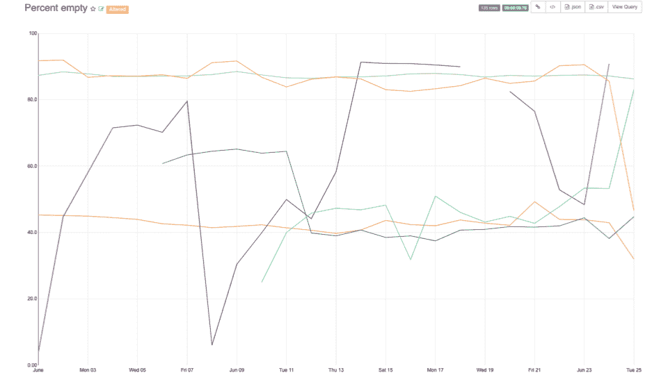

# 使用 Apache Druid 支持 Pinterest 广告分析

> 原文：<https://medium.com/pinterest-engineering/powering-pinterest-ads-analytics-with-apache-druid-51aa6ffb97c1?source=collection_archive---------1----------------------->

菲利普·亚罗什|软件工程师，合作伙伴工程部
王伟鸿|工程经理，合作伙伴工程部

## **变化**

当我们在 2014 年推出促销 pin 时，我们选择 Apache HBase 作为我们的数据库来存储和提供我们所有的报告指标。在我们广告业务的初期，这是一个合适的选择，因为所需的报道功能数量和整体流量都很低。此外，HBase 目前在业内已有良好的记录，我们知道如何成功运营 HBase 集群。

五年后，我们的业务已经成熟。随着我们的 ads 规模急剧增加，我们向合作伙伴报告的指标的复杂性也在增加，这使得 HBase 不足以满足我们的精细分析需求。因此，我们调查了可用的选项，并决定将德鲁伊作为我们下一次迭代的核心组件。

## **为什么是德鲁伊？**

HBase 在访问随机数据点时工作得非常好，但它不是为快速分组和聚合而构建的。过去，我们通过预先构建这些数据视图解决了这一问题，但随着我们报告所需功能的扩展，不再可能存储这么多不同的切片。Druid 允许我们绕过所有这些复杂的数据切片摄取逻辑，并且还支持:

*   通过卡夫卡实时摄取
*   摄取数据的自动版本控制
*   基于用户设置粒度的数据预聚合
*   计数型问题的近似算法
*   SQL 接口
*   易于理解的代码和一个非常支持的社区

## **数据摄取**

Druid 支持两种摄取模式:原生和 Hadoop。两者都是通过对霸王节点的 REST 调用来启动的。在本机摄取的情况下，直接在 MiddleManager 节点上生成一个线程来读取输入数据，而在 Hadoop 的情况下，Druid 启动一个 MapReduce 作业来并行读取输入。在这两种情况下，获取的数据会根据其输出数据源(表)和时间间隔自动进行版本控制。一旦最新版本的数据可用，Druid 将自动开始提供最新版本的数据，并使旧的数据段保持禁用状态，以防我们需要恢复到以前的版本。由于我们有几个不同的数据管道将相同维度的不同指标集生成到一个数据源中，这对我们来说是一个问题。我们如何保持数据版本化，但又不让每个独立的管道覆盖前一个管道的输出？

**命名空间** **碎片规格**被证明是答案。德鲁伊的标准版本管理方法是通过数据源名称、时间间隔和写入时间。我们扩展了这个系统，增加了一个名称空间标识符。然后，我们在数据源中为每个名称空间构建了一个单独的版本化时间间隔时间线，而不是每个数据源只有一个时间线:

这也意味着我们需要改变现有的摄取机制来创建带有名称空间的段，或者发明一种新的摄取机制。由于我们每天接收数十亿个事件，本机接收对我们来说太慢了，我们并不热衷于建立新的 Hadoop 集群和更改 Hadoop 索引代码以符合名称空间。

相反，我们选择改编[**meta MX/druid-spark-batch**](https://github.com/metamx/druid-spark-batch)**项目来使用 Spark 编写我们自己的数据摄取。**原始的 druid-spark-batch 项目以类似于 Hadoop 索引器的方式工作，但是它不是启动 Hadoop 作业，而是启动 spark 作业。我们的项目运行在一个独立的作业中，根本不需要使用 Druid 集群的任何资源。它的工作原理如下:

1.  过滤掉不属于输出间隔的事件
2.  根据配置的粒度和每个段文件的行数，将数据划分为多个间隔
3.  使用 Druid 的 IncrementalIndex 类池在磁盘上并行持久化中间索引文件
4.  使用最终合并过程将所有索引文件收集到一个段文件中
5.  推向深层存储
6.  构造元数据并将其写入 MySQL

一旦元数据被写入，Druid 协调器将在下一次拉元数据表时找到新的段，并将新的段分配给历史节点。

## **集群设置**

通常，查询广告数据的日期范围分为三类:

1.  要显示的最近时间段
2.  年度同比绩效报告
3.  旧的历史数据的随机即席查询。

最近一天的查询数量远远超过所有其他报告类型。基于这种理解，我们将德鲁伊集群划分为三个历史层级:

*   “热”层在昂贵的计算优化节点上提供最新数据，以处理大型 QPS。
*   中型计算上的“冷”层，大量磁盘空间优化节点。为热层中最后一年的无数据数据提供服务。
*   低计算节点上的“冰冷”层具有更多磁盘空间。提供所有其他历史数据。

热层中的每个历史记录都具有非常低的最大数据容量，以保证节点服务的所有数据段都加载到内存中，而无需进行页面交换。这确保了我们大多数用户驱动的查询的低延迟。对较旧数据的查询通常由自动化系统或报告导出进行，这种方式考虑到了较高的延迟，而不是较高的运营成本。

虽然这对于一般的查询模式非常有效，但也有意外高负载的情况，这需要集群具有更高的 QPS 容忍度。这里显而易见的解决方案是增加这些特定情况下的历史节点数量，但是 Druid 的数据再平衡算法在规模上非常慢。一旦一组新的服务器加入机群，数 TB 的集群可能需要数小时甚至数天来均衡地重新平衡数据。为了构建一个高效的自动扩展解决方案，我们等不起这么久。

由于优化重新平衡算法在大型生产系统上部署风险很大，因此我们决定为镜像层实施一个**解决方案。**该系统使用最大二分匹配将镜像层中的每个节点链接到主层中的一个节点。一旦链接建立，镜像历史不需要等待重新平衡算法分配段。相反，它将从主层提取链接节点所服务的数据段列表，并从深层存储下载这些数据段进行服务。它不需要担心复制，因为我们希望这些镜像层会非常频繁地打开和关闭，只在流量大的时候运行。有关更多信息，请参见下文:

在测试过程中，我们借助镜像层解决方案实现了显著的自动扩展改进。现在，从服务器启动到查询服务所花费的时间中，最重要的一部分是来自深层存储的有限 I/O 带宽。

*Time taken to load 31 TB of data. 2 hours for natural rebalancing. 5 minutes for mirroring tier.*

## **查询建筑**

我们的 Druid 部署是面向外部的，支持从我们的 ads 管理系统进行交互查询，以及通过我们的外部 API 进行编程查询。通常，这些查询模式在每个用例中看起来非常不同，但是在所有情况下，我们都需要一个服务来快速有效地构造 Druid 查询，并拒绝任何无效的查询。对我们的 API 的编程访问意味着我们会收到大量请求无效日期的查询，或者要求没有度量的实体的重复查询。

*Percent of queries returning empty results per API client. Some clients request non-existent metrics up to 90% of the time.*

构造并要求 Druid 执行这些查询是可能的，但是会增加开销，这在低延迟系统中是无法承受的。为了简化对不存在的实体的查询，我们**开发了一个元数据存储，列出了实体及其包含度量的时间间隔**。如果查询请求的实体在指定的时间间隔内没有度量，我们可以立即返回并减轻 Druid 的额外网络和 CPU 工作负载。

Druid 支持两种 API 来查询数据:native 和 SQL。SQL 支持是 Apache 方解石支持的新特性。在后端，它获取一个 Druid SQL 查询，解析它，分析它，并将其转换为一个 Druid 原生查询，然后执行该查询。SQL 支持有很多优点——它对用户更加友好，而且在构建更高效的特别查询方面肯定比用户使用一些不熟悉的 JSON 更好。

在实现我们的查询构造函数和执行服务时，SQL 是我们的第一选择，这是因为我们熟悉 SQL。它起作用了，但是我们很快发现了某些 Druid 无法完成的查询模式，并追踪问题到 SQL 解析器中的**性能瓶颈，对于具有数千个过滤器或许多复杂投影的查询。最后，我们选择了**，使用本地查询作为我们访问 Druid** 的主要路径，保持 SQL 对延迟不敏感的内部用例的支持。**

## **系统调谐**

来自一个键值世界，源自我们的 API 层的单个查询被定制为低复杂度，以允许最佳数量的点查找。这也意味着单独查询每个实体，导致后端的高 QPS。为了最大限度地减少对我们整个基础设施的破坏，我们希望保持我们的更改简单，并尽可能接近简单地将 HBase 换成 Druid。实际上，这被证明是完全不可能的。

Druid 以贪婪的方式保持服务器之间的网络连接，每个查询使用一组新的连接。它还会打开每个查询的对象句柄，这是高 QPS 系统中的主要瓶颈。为了减轻网络负载，我们**通过批量处理被请求实体的数量来增加每个查询的复杂性。**我们观察到我们的系统在过滤类型查询中处理 1，000 到 2，000 个请求的实体时表现最佳，尽管每个部署会有所不同。

*QPS after implementing query batching. 15,000 request / second peaks lowered by 10x*

在服务器端，我们发现 Druid 文档建议的**基本集群调优指南非常有用**。一个不明显的注意事项是，在给定所配置的合并缓冲区数量的情况下，随时可以执行多少个 GroupBy 查询。应尽可能避免 GroupBy 查询，而不是 Timeseries 和 TopN 查询。这些类型的查询不需要合并缓冲区，因此需要较少的资源来执行。在我们的堆栈中，我们可以选择**基于查询类型**施加速率限制，以避免在给定已配置的合并缓冲区数量的情况下一次执行太多的 GroupBy 查询。

## **未来**

我们很兴奋完成了将德鲁伊投入生产的漫长旅程，但是当然我们的工作还在继续。随着 Pinterest 业务的增长，我们在核心 Druid 分析平台上的工作也必须随之发展。将我们所有的努力无缝地贡献给主德鲁伊库可能是困难的，但是我们希望与社区分享我们的努力。即在一些特性上，比如 Druid 段的 Spark 写入器和读取器、用于自动伸缩的镜像层，以及开发一种新的多路复用 IPC 协议来代替 HTTP。随着 ads analytics 的成熟，我们也加入了其他团队的用例，帮助他们发现如何最好地大规模使用 Druid 来满足他们的需求。

## **致谢**

*这个项目是多个团队的共同努力:Ads 数据、Ads API 和存储缓存。撰稿人和顾问包括露西拉·查尔默、张天英、朱利安·贾菲、埃里克·阮、、、张和韦恩·赵。*

*这也要归功于 Imply.io 的领导者吉安·梅里诺和·杨，他们向我们介绍并帮助我们引导德鲁伊。*

> 我们正在建造世界上第一个视觉发现引擎。全球超过 3.2 亿人使用 Pinterest 来梦想、计划和准备他们在生活中想做的事情。来加入我们吧！