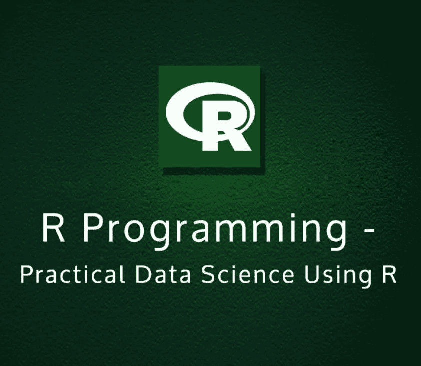

# 实用数据科学与 R

> 原文：<https://medium.com/quick-code/practical-data-science-with-r-c0c148dcd28?source=collection_archive---------0----------------------->

数据科学是在科学分析中对数据的研究。它有记录、存储和分析数据以获得有效有用信息的概念。

数据科学家必须收集、管理数据、选择建模方法、编写代码并检查结果。

## 让我们看看如何使用 r 快速获取数据并处理数据。

## 数据科学与 R 可以通过以下过程来完成

1.  **将数据加载到 R:**

在数据科学项目中，如果有大量数据需要分析，那么您可能会考虑使用电子表格或 shell 工具来过滤数据，但是使用工具的过程比分析数据花费的时间要多。欲了解更多信息，请访问 [**数据科学在线培训**](https://onlineitguru.com/data-science-course.html)

但是有一个比使用那些工具好得多的方法，就是通过使用 R 来分析数据。使用 R 来改变数据很容易，因为 R 的主数据框架适合处理结构化数据，并且 R 拥有可以从不同数据模式读取数据的设备。

**2** 。**探索数据:**

让我们假设我们的目标是形成一个模型来看看，我们的客户中谁没有健康保险？。所以你想向他们推销更便宜的健康保险。

如果您从客户那里收集数据，并发现诸如年龄、收入、就业状况等属性。将所有数据保存在一个称为成本数据的数据框中，您需要将它输入到 r。

数据探索专注于了解您的数据，并使用汇总统计、图形和可视化等技术了解任何主要问题。

**3** 。**管理数据**

在收集和发现数据中的任何问题后，下一个重要步骤是管理数据，包括为进一步的步骤安排数据。首先，我们将找到任何丢失的值，然后进行数据转换。

在数据转换中，我们将使数据以一种容易理解的方式来表示。

**选择和评估模型:**

重要的是找到合适的建模方法，解决特定的业务问题，并找到模型的质量和有用性。

**记忆方法:**

这些方法主要是预测，从你的数据汇总统计。

这些方法包括查找表、最近邻技术、朴素贝叶斯分类和决策树。

> 通过 [**数据科学在线课程**](https://onlineitguru.com/data-science-course.html) 将您的职业生涯推向新的成功高度

**线性和逻辑回归:**

该方法为您提供了输入值和结果之间的相似性信息，以及来自数据的计划。

**无监督方法:**

像聚类和关联规则挖掘这样的非监督方法，不给出精确的计划，而是发现数据中的相似性和内部结构。

**探索先进方法:**

我们还使用不同的高级方法，如广义额外模型、内核、决策树、随机森林和支持向量机。

**交付结果:**

记录结果对于将您的输出共享给将使用您的模型的其他人非常重要。交付结果包括文档、演示位置、版本控制报告和代码注释。

**文档和部署:**

我们将使用 Knitr 设计有意义的项目文档，获得计算机化的图表和结果。我们还将使用 Git 进行性能管理，连接和部署模型，比如 HTTP 和处理模型结果。

**制作有效的演示文稿**

在准备好日常项目的文档、有效地工作并为生产放置模型之后，向感兴趣的人展示您的工作成果是很重要的。

> 深入了解 [**数据科学课程**](https://onlineitguru.com/data-science-course.html)

为此，我们需要简要记录背后的灵感、项目及其目标，然后解释项目的结果，保留所需结果细节的备份，最后谈谈建议、重要问题以及未来可能出现的情况。

为了在 R 中运行数据科学项目，我们需要 RStudio 和另一个数据库，即版本控制工具。Java 对于 RStudio 和数据库工具很重要。

克兰是最受欢迎的图书馆。它是 r 的核心角色，最好在使用 r 之前安装 RStudio 和 Git。