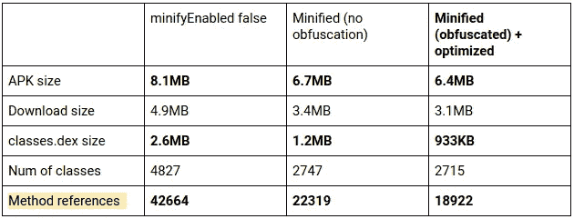

# 实用程序规则示例

> 原文：<https://medium.com/androiddevelopers/practical-proguard-rules-examples-5640a3907dc9?source=collection_archive---------0----------------------->

在我之前的文章中，我解释了[为什么每个人都应该为他们的 Android 应用程序](/google-developers/troubleshooting-proguard-issues-on-android-bce9de4f8a74)使用 ProGuard，如何启用它，以及这样做时你可能会遇到什么样的错误。这涉及到很多理论，因为我认为为了准备好处理任何潜在的问题，理解潜在的原则是很重要的。

我还在另一篇文章中谈到了为即时应用构建配置 ProGuard 的具体问题。

在这一部分，我想谈谈在一个中等大小的示例应用程序上 ProGuard 规则的实际例子:[格子](https://github.com/nickbutcher/plaid)作者[尼克·布彻](https://medium.com/u/22c02a30ae04?source=post_page-----5640a3907dc9--------------------------------)。

# 格子呢的经验教训

事实证明，Plaid 是研究 ProGuard 问题的一个很好的主题，因为它包含了使用注释处理和代码生成、反射、java 资源加载和本地代码(JNI)的第三方库。我提取并记下了一些实用的建议，这些建议应该普遍适用于其他应用程序:

# 数据类别

```
public class User {
  String name;
  int age;
  ...
}
```

大概每个 app 都有某种数据类(也叫 DMO，models 等。取决于上下文以及它们在应用程序架构中的位置)。数据对象通常会在某个时候被加载或保存(序列化)到其他介质中，比如网络(HTTP 请求)、数据库(通过 ORM)、磁盘上的 JSON 文件或 Firebase 数据存储中。

许多简化序列化和反序列化这些字段的工具都依赖于反射。GSON、Retrofit、Firebase——它们都检查数据类中的字段名，并将它们转换成另一种表示形式(例如:`{“name”: “Sue”, “age”: 28}`),用于传输或存储。当他们将数据读入 Java 对象时，也会发生同样的事情——他们看到一个键值对`“name”:”John”`,并试图通过查找一个`String name` 字段将其应用到 Java 对象。

**结论**:我们不能让 ProGuard 重命名或删除这些数据类上的任何字段，因为它们必须匹配序列化格式。在整个类上添加一个`@Keep`注释或者在所有模型上添加一个通配符规则是一个稳妥的选择:

```
-keep class io.plaidapp.data.api.dribbble.model.** { *; }
```

> ***警告*** *:如果你的 app 易受此问题影响，测试时可能会出错。例如，如果您将一个对象序列化为 JSON，并在没有适当的 keep 规则的情况下将其保存到您的应用程序版本 N 中的磁盘，则保存的数据可能如下所示:* `*{“a”: “Sue”, “b”: 28}*` *。因为 ProGuard 将您的字段重命名为* `*a*` *和* `*b*` *，一切似乎都正常，数据将被正确保存和加载。*
> 
> *然而，当你再次构建你的应用程序并发布版本* N+1 *时，ProGuard 可能会决定将你的字段重命名为不同的名称，比如* `*c*` *和* `*d*` *。因此，先前保存的数据将无法加载。*
> 
> *你* ***必须*** *首先保证你有正当的守规。*

# 从本机调用 Java 代码(JNI)

Android 的[默认 ProGuard 文件](https://developer.android.com/studio/build/shrink-code.html#shrink-code)(你应该总是包含它们，它们有一些真正有用的规则)已经包含了一个用于在本机端*实现*(`-keepclasseswithmembernames class * { native <methods>; }`)的方法的规则。不幸的是，没有一种万能的方法来保持代码在相反的方向被调用:从 JNI 到 Java。

使用 JNI，完全有可能从 C/C++代码中构造一个 JVM 对象或在 JVM 句柄上找到并调用一个方法，事实上，[Plaid 中使用的一个库就是这么做的](https://github.com/Uncodin/bypass/blob/master/platform/android/library/jni/bypass.cpp#L61)。

**结论**:因为 ProGuard 只能检查 Java 类，它不会知道任何发生在本机代码中的用法。我们必须通过一个`@Keep`注释或者`-keep`规则明确地保留类和成员的这种用法。

```
-keep, includedescriptorclasses 
            class in.uncod.android.bypass.Document { *; }
-keep, includedescriptorclasses 
            class in.uncod.android.bypass.Element { *; }
```

# 从 JAR/APK 打开资源

Android 有自己的资源和资产系统，这对于 ProGuard 来说应该不是问题。然而，在普通 Java 中，有另一种直接从 JAR 文件加载资源的[机制，一些第三方库可能会使用它，即使是在 Android 应用程序中编译时(在这种情况下，他们会尝试从 APK 加载)。](https://docs.oracle.com/javase/8/docs/technotes/guides/lang/resources.html)

问题是，通常这些类会在它们自己的包名下寻找资源(这转化为 JAR 或 APK 中的文件路径)。ProGuard 可以在混淆时重命名包名，所以在编译后，在最终的 APK 中，类和它的资源文件可能不再在同一个包中。

为了以这种方式识别加载资源，您可以在您的代码和您所依赖的任何第三方库中寻找对`Class.getResourceAsStream / getResource`和`ClassLoader.getResourceAsStream / getResource`的调用。

**结论**:我们应该保留任何使用这种机制从 APK 加载资源的类的名称。

在 Plaid 中，实际上有两个——一个在 *OkHttp* 库中，一个在 *Jsoup* 中:

```
-keepnames class okhttp3.internal.publicsuffix.PublicSuffixDatabase
-keepnames class org.jsoup.nodes.Entities
```

# 如何为第三方库制定规则

在理想的情况下，您使用的每个依赖项都会在 AAR 中提供它们所需的 ProGuard 规则。有时他们会忘记这样做，或者只发布 jar，这些 jar 没有标准化的方式来提供 ProGuard 规则。

在这种情况下，在你开始调试你的应用程序和制定规则之前，记得查看文档。一些库的作者提供了推荐的 ProGuard 规则(比如在 Plaid 中使用的 reform ),这可以为您节省大量的时间和精力。不幸的是，许多库并没有这样做(比如本文中提到的 Jsoup 和 Bypass)。还要注意，在某些情况下，库提供的配置只能在禁用优化的情况下工作，所以如果您打开了优化，您可能会处于未知的领域。

那么在图书馆不供应的情况下，如何想出规则呢？
我只能给你一些指点:

1.  读取构建输出和 logcat！
2.  构建警告会告诉你添加哪些`-dontwarn`规则
3.  `ClassNotFoundException`、`MethodNotFoundException`和`FieldNotFoundException`会告诉你要添加哪些`-keep`规则

> 当你的应用在启用 ProGuard 的情况下崩溃时，你应该感到高兴——你将有地方开始你的调查:)
> 
> 最糟糕的一类问题是当你的应用程序工作时，例如，不显示屏幕或不从网络加载数据。
> 
> 这就是你需要考虑我在本文中描述的一些场景并动手的地方，甚至是深入第三方代码并理解它为什么可能失败，比如当它使用反射、内省或 JNI 时。

# 调试和堆栈跟踪

默认情况下，ProGuard 将删除许多程序执行不需要的代码属性和隐藏的元数据。其中一些对开发人员非常有用，例如，您可能希望保留源文件名和堆栈跟踪的行号，以便于调试:

```
-keepattributes SourceFile, LineNumberTable
```

> 您还应该记得[保存您构建发布版本时生成的 ProGuard 映射文件，并将它们上传到 Play](https://developer.android.com/studio/build/shrink-code.html#decode-stack-trace) 以从您的用户遇到的任何崩溃中获得反混淆的堆栈跟踪。

如果您打算在应用程序的受保护版本中附加一个调试器来逐句通过方法代码，您还应该保留以下属性来保留一些关于局部变量的调试信息(您只需要在您的`debug`版本类型中使用这一行):

```
-keepattributes LocalVariableTable, LocalVariableTypeTable
```

# 缩小的调试版本类型

默认的构建类型被配置为 *debug* 不运行 ProGuard。这是有意义的，因为我们希望在开发时快速迭代和编译，但仍然希望使用 ProGuard 的发布版本尽可能小并优化。

但是，为了全面测试和调试任何 ProGuard 问题，最好建立一个单独的小型调试版本，如下所示:

```
buildTypes {
  debugMini {
    initWith debug
    minifyEnabled true
    shrinkResources true
    proguardFiles getDefaultProguardFile('proguard-android.txt'), 
                  'proguard-rules.pro'
    matchingFallbacks = ['debug']
  }
}
```

有了这种构建类型，您将能够[连接调试器](https://developer.android.com/studio/debug/index.html)，[运行 UI 测试](https://developer.android.com/training/testing/ui-testing/espresso-testing.html)(也在 CI 服务器上)或者[猴子测试](https://developer.android.com/studio/test/monkey.html)您的应用程序，在尽可能接近您的发布版本的构建上寻找可能的问题。

**结论**:当你使用 ProGuard 时，你应该对你的发布版本进行全面的质量保证，要么进行端到端测试，要么手动检查你的应用程序的所有屏幕，看看是否有任何东西丢失或崩溃。

# 运行时批注，类型自省

默认情况下，ProGuard 会从代码中移除所有注释，甚至一些多余的类型信息。对于一些库来说，这不是问题——那些在编译时处理注释和生成代码的库(比如 *Dagger 2* 或 *Glide* 等等)在程序运行时可能不需要这些注释。

还有另一类工具在运行时实际检查注释或查看参数和异常的类型信息。例如，通过使用一个`Proxy`对象拦截您的方法调用，然后查看注释和类型信息来决定在 HTTP 请求中放入或读取什么内容，从而实现这一点。

**结论**:与编译时相反，有时需要保留在运行时读取的类型信息和注释。您可以查看 ProGuard 手册中的[属性列表。](https://www.guardsquare.com/en/proguard/manual/attributes)

```
-keepattributes *Annotation*, Signature, Exception
```

> 如果您使用的是默认的 Android ProGuard 配置文件(`*getDefaultProguardFile('proguard-android.txt')*`)，那么前两个选项——注释和签名——是为您指定的。如果你没有使用默认设置，你必须确保自己添加它们(如果你知道你的应用程序需要它们，复制它们也无妨)。

# 将所有内容移动到默认包中

ProGuard 配置中默认不添加`[-repackageclasses](https://www.guardsquare.com/en/proguard/manual/usage#repackageclasses)`选项。如果您已经对代码进行了模糊处理，并且已经修复了任何与适当的 keep 规则有关的问题，那么您可以添加这个选项来进一步减小 DEX 的大小。它的工作方式是将所有类移动到默认(根)包中，实质上释放了由类似于"*com . example . myapp . some package*"的字符串所占用的空间。

```
-repackageclasses
```

# 何时使用`@Keep`和`-keep`

`@Keep`支持实际上是作为默认 Android ProGuard 规则文件中的一堆`-keep`规则实现的，所以它们本质上是等价的。指定`-keep`规则更加灵活，因为它提供了通配符，您还可以使用不同的变量来做稍微不同的事情(`-keepnames`、`-keepclasseswithmembers`、[和更多的](https://www.guardsquare.com/en/proguard/manual/usage#keepoverview))。

然而，每当需要一个简单的“保留这个类”或“保留这个方法”规则时，我实际上更喜欢在类或成员上添加一个`@Keep`注释的简单性，因为它接近代码，就像文档一样。

如果在我之后的某个开发人员想要重构代码，他们会立即知道标有`@Keep`的类/成员需要特殊处理，而不必记得查阅 ProGuard 配置并冒着破坏某些东西的风险。此外，IDE 中的大多数代码重构应该自动保留类的`@Keep`注释。

# 格子统计

这里有一些来自 Plaid 的统计数据，显示了我使用 ProGuard 删除了多少代码。对于依赖关系更多、索引更大的更复杂的应用程序，节省的成本可能更大。

