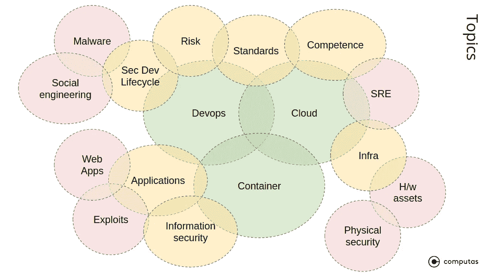
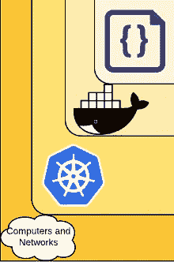

# Kubernetes、DevOps 和云的核心实用安全性

> 原文：<https://medium.com/compendium/practical-security-at-the-nexus-of-kubernetes-devops-and-cloud-3415acbfcf76?source=collection_archive---------2----------------------->

A not so untypical Kubernetes solution

我们的许多客户都在构建基于 Kubernetes 的云解决方案。他们有现代的软件开发方法，所以敏捷实践是他们的天赋，如果他们还没有这样做，他们正在尝试实现 DevOps。但是这三个概念——Kubernetes 容器、云和 devo PS——中的每一个都是*能力密集型学科*,有相当大的变化。他们需要持续的关注和努力来掌握最新的更新。

然后你就有了安全感。安全本身是一个快速发展的领域，也需要持续关注。但是试图保护建立在快速变化的技术上的东西是一个相当大的挑战。因此，毫不奇怪，我们的许多客户每天都在努力应对新发现的漏洞，并更新和改变安全机制和最佳实践来保护他们的解决方案。

处理所有这些挑战的一个可能的策略是强制遵守公司制定的标准、一套原则或者一系列要求。或者，或者除此之外，可以进行安全评估，甚至可以定期进行，可以是内部的，也可以由外部合作伙伴进行。

对于一个软件开发团队来说，这种评估的结果通常只会增加头痛。该团队现在有一个已知漏洞和不符合性的列表。通常，这份清单很长，而且在许多情况下是多种多样的。但是团队应该从哪里开始呢？即使你只看一个项目，怎样的努力才能把它从清单上划掉呢？这些项目中的哪些需要检查，哪些可以作为一个你可以忍受的问题留在列表上？当你完成清单的时候，你脱离险境了吗？往往不会。添加了新功能。供应链已经改变。你需要决定什么时候重新开始。由于这种练习将精力从其他事情上转移开，比如创建功能，团队有一种内在的动机很少进行安全审查或评估，并且只需很少的努力。

有一个更好的方法来解决这个问题。

在 [Computas](https://computas.com/en) ，当我们与项目网络安全合作或为软件团队提供建议时，我们努力使列表简短并区分优先顺序。更重要的是:列表项不属于检查表的种类；我们提供的方法不仅仅是陈述一个目标，而不是说如何达到目标或者付出多少努力就足够了。

我们称之为“6C”的实践框架受云原生安全性的[Kubernetes“4C”的启发，包括以下内容:](https://kubernetes.io/docs/concepts/security/overview/)

*   这是一个**演进的、可操作的**框架，
*   它专注于 nexus **云、DevOps** 和**容器**，并附带关注与这三个核心领域相关的主题。
*   它源于**的实际工作**与**软件开发**中的安全。
*   它可以作为运营能力适应各种安全管理和风险框架**标准**。

How the “6C” cybersecurity framework relates to other security topics. Green is core focus, yellow is peripheral, and red not a focus.

鉴于对主题的关注，参见上图，我们通常会在协助项目时对不同的“C”进行广泛、简要的调查:

*   **核心**:这些是*基础安全问题*，我们通过项目设置、所有权、组织、网络、监控、文化、能力、预防与遏制、灾难管理、项目如何处理风险和事件、职责分离、身份和角色来工作。这个 C 的口号是*“知道自己在做什么。坦白吧。”*
*   **链**:这就是我们关注*过程安全*的地方:管道、反复做事情、自动化和辛劳。常见的审查主题是软件交付渠道、供应链(第三方依赖)、基础设施即代码、测试、运营/开发运营、风险+事故+积压关系和持续质量。这个 C 的口号是*“都做，每次都做。睡个好觉。”*
*   **集群**:在这里，我们处理*节点、网络和虚拟机*的安全问题。常见的主题有集群强化、API 访问、映像管理、零信任、深度防御、网格、秘密、日志记录、监控、隔离、攻击面和服务帐户/访问令牌管理。这个 C 的口号是"*保障虚拟机的安全。*”
*   **容器**:这通常是关于 *Dockerfiles* 、依赖项、*映像*、存储库、强化和特权。这个 C 的口号是“*保护图像。*
*   **代码:**这是关于业务应用本身的*内部。重点领域是 API 漏洞、弹性、机密性和信息完整性、应用程序逻辑、客户端、身份验证和授权。这个 C 的口号是*“保护应用程序。”**
*   **组件**:在这里，我们为架构中重要的*运行和构建时组件*解决安全问题。这些通常是解决方案所依赖的托管云组件，如数据库、API 管理、发布/订阅、防火墙、构建器和 SaaS 服务。因为这是关于组件的，所以核心话题集中在*接口和组件生命周期*上。这通常意味着访问控制、身份验证、治理、加密、信息完整性和机密性。这个 C 的口号是*“保护组件。”*

Excerpt from Kubernetes “4C”, which inspired Computas “6C” ([https://kubernetes.io/docs/concepts/security/overview/](https://kubernetes.io/docs/concepts/security/overview/))

虽然主题列表可能看起来很累，但我们有三种方法来约束范围。 **(a)** 如前所述，“6C”的重点是*云、容器和 DevOps* 。如上图所示，其他主题以更粗略的方式处理。 **(b)** 如前所述，在我们可能对特定领域进行“深入研究”之前，我们通常会对项目的安全状态进行一个*广泛而简短的*评估，意思是几天而不是几周。这导致问题的**(c)***优先化*。我们研究最重要的问题。

(b)中提到的简要评估的结果可以是咨询性的，即陈述或报告。内容不是指标准或公司检查表的*合规目标*，而是一组推荐的*行动*。做这个，实现这个，改进这个，等等。通常情况下，建议的措施更适合于流程—例如，制定一种方法来决定是否将事件转换为产品待办事项，或者引入一个步骤来中断构建(如果映像依赖关系未列入白名单)—而不是修复单个安全缺陷。如果一个团队选择进行“深度潜水”，我们可能会安排团队的临时扩展，允许安全专家与团队一起工作一段时间。这里的重点更多的是操作能力，即*做事*，而不是写下行动让别人去做。

我希望这是鼓舞人心的。下面，我列出了一些我们经常依赖的资源。

—

链条:

*   吉姆·伯德的《DevOpsSec 》，[https://learning . oreilly . com/library/view/DevOpsSec/9781491971413/](https://learning.oreilly.com/library/view/devopssec/9781491971413/)
*   [https://www . Microsoft . com/en-us/security engineering/devsecops](https://www.microsoft.com/en-us/securityengineering/devsecops)

核心:

*   [https://docs . Microsoft . com/en-us/azure/security/fundamentals/best-practices-and-patterns](https://docs.microsoft.com/en-us/azure/security/fundamentals/best-practices-and-patterns)
*   [https://cloud . Google . com/blog/products/networking/Google-cloud-networking-in-deep-three-defense-in-deep-defense-principles-for-securing-your-environment](https://cloud.google.com/blog/products/networking/google-cloud-networking-in-depth-three-defense-in-depth-principles-for-securing-your-environment)

组件:

*   [https://Azure . Microsoft . com/media handler/files/resource files/security-best-practices-for-Azure-solutions/Azure % 20 security % 20 best % 20 practices . pdf](https://azure.microsoft.com/mediahandler/files/resourcefiles/security-best-practices-for-azure-solutions/Azure%20Security%20Best%20Practices.pdf)

群集:

*   [https://kubernetes . io/docs/tasks/administer-cluster/securing-a-cluster/](https://kubernetes.io/docs/tasks/administer-cluster/securing-a-cluster/)
*   【https://www.cisecurity.org/benchmark/kubernetes/ 
*   [https://cloud . Google . com/kubernetes-engine/docs/how-to/hardening-your-cluster](https://cloud.google.com/kubernetes-engine/docs/how-to/hardening-your-cluster)
*   [https://docs . Microsoft . com/en-us/azure/aks/concepts-security](https://docs.microsoft.com/en-us/azure/aks/concepts-security)
*   [https://www . CVE details . com/vulnerability-list/vendor _ id-15867/product _ id-34016/Kubernetes-Kubernetes . html](https://www.cvedetails.com/vulnerability-list/vendor_id-15867/product_id-34016/Kubernetes-Kubernetes.html)

容器:

*   [https://nvlpubs.nist.gov/nistpubs/SpecialPublications/NIST.SP.800-190.pdf](https://nvlpubs.nist.gov/nistpubs/SpecialPublications/NIST.SP.800-190.pdf)
*   [https://github.com/aquasecurity](https://github.com/aquasecurity)
*   *集装箱安全*”作者 Liz Rice，[https://learning . oreilly . com/library/view/Container-Security/9781492056690/](https://learning.oreilly.com/library/view/container-security/9781492056690/)

代码:

*   [https://github.com/OWASP/wstg/tree/master/document](https://github.com/OWASP/wstg/tree/master/document)
*   [https://mobile-security . git book . io/mobile-security-testing-guide/](https://mobile-security.gitbook.io/mobile-security-testing-guide/)
*   [https://owasp.org/www-project-proactive-controls/](https://owasp.org/www-project-proactive-controls/)
*   [https://www . Microsoft . com/en-us/security engineering/SDL/practices](https://www.microsoft.com/en-us/securityengineering/sdl/practices)