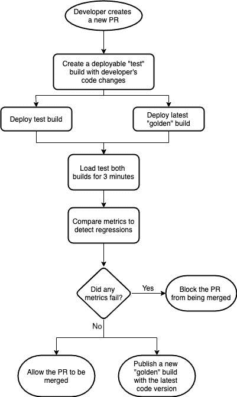
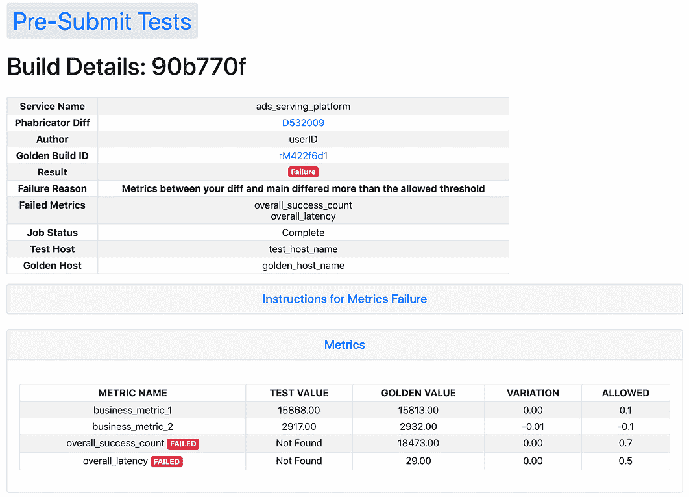
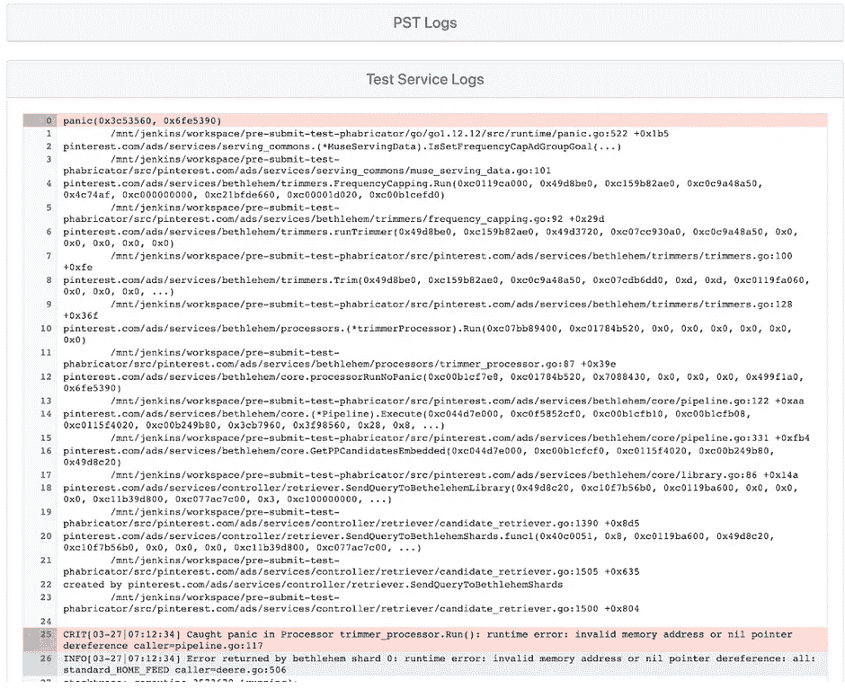

# 广告服务的预提交集成测试

> 原文：<https://medium.com/pinterest-engineering/pre-submit-integration-tests-for-ads-serving-a07b5a12ea3f?source=collection_archive---------3----------------------->

Nishant Roy |广告服务

# 简介和背景

广告服务平台是 Pinterest 上规模最大、最复杂、速度最快的推荐服务。我们的广告业务正在增长和扩大，广告工程团队正在快速迭代，以继续改善系统。因此，保持系统健康是至关重要的，以便保护 Pinner 体验、业务健康，并保持高开发速度。

自从第一个广告在 Pinterest 上展示以来，我们所有的广告服务后端服务都是自动持续部署的。变更首先被部署到一台机器上，我们监控这台机器是否存在非常明显的问题，比如服务崩溃，或者错误日志的大量增加。接下来，我们推出 1%的生产设备，让这些变化休息两个小时，这使我们能够检测到更多细微的问题，如某一类型广告的下降，或来自某一候选来源的广告的巨大变化。编写单元测试来捕捉这些错误是非常困难的，因为症状通常只在系统每秒处理数千个请求时才会大规模出现。当指标出现这种变化时，将向随叫随到的工程师发出警报，该工程师负责暂停向整个生产设备群的部署。

这个系统在早期工作得非常好，但随着广告服务团队发展到近 100 名开发人员，一个随叫随到的工程师在如此多的代码变更中找到漏洞变得更加困难。我们也遇到过一些部署没有及时暂停的情况，有问题的代码会扩展到所有生产主机，这会对我们的业务造成影响。随着代码相关事件数量的增加，以及待命工程师的负担加重，我们决定投资改进我们的部署流程。我们意识到，我们需要让开发人员对修复他们的错误负责，在类似生产的环境中对他们的代码进行压力测试，以在他们合并代码之前识别回归。

我们成功的标准是该工具能够:

*   捕捉单元测试或本地测试可能捕捉不到的更细微的问题
*   将调试有问题代码的责任从随叫随到的工程师转移到代码作者身上

# 设计

我们已经有了一套关键指标，如成功率、延迟、广告插入等。我们通过监控来确定代码变更是否有问题。驱动问题是，*我们如何在代码被合并到产品中之前捕获这些度量的变化？*

我们构建了一个部署两个服务版本的管道(用户的本地分支和最新提交的版本)。我们假设最近的提交是好的，不会导致任何度量回归，因为它已经被我们的框架测试过了。然后，管道使用生产流量的副本执行负载测试，并比较延迟、成功率、广告插入数量等关键业务指标。我们还构建了一个 web 界面，以便工程师可以看到度量值，以及他们的代码更改没有通过测试的确切原因。

*Figure 1: End-to-end workflow for pre-submit-test*

现在，调试糟糕代码的责任从随叫随到的工程师转移到了代码作者身上。每次开发者创建一个新的 PR，这个测试就会自动触发，如果测试失败就会阻止 PR 被合并。这是一种更健康的工作分配，因为:

1.  我们在 PR 级别捕获问题，而不是在可能包含多个 PR 的部署级别捕获问题
2.  与随叫随到的工程师相比，开发人员对自己的变更有更多的了解，这使得调试更加容易
3.  随叫随到的工程师现在可以将注意力集中在更紧迫的生产问题上

该框架的一些有趣方面如下:

## **测试环境隔离**

*我们对测试环境有三个主要需求:*

*   不服务面向 Pinner 的实时流量
*   **解决方案**:不允许这些主机注册到生产服务器集
*   如果可能，不要与提供实时流量的系统进行交互
*   **解决方案**:调整配置，以便我们将请求发送到“操场”或测试环境
*   不要污染生产指标
*   **解决方案:**禁用向 openTSDB 发布指标的后台线程

## **测试流量**

*由于我们不提供面向 Pinner 的实时流量，我们如何对系统进行负载测试以生成指标？*

我们记录一个 Kafka 主题的所有生产请求的小样本。当运行测试时，我们跟踪这个主题，并将这些请求发送给我们的测试和黄金主机。通过这种方式，我们知道我们的测试流量是生产请求的一个合理近似值，并且两个代码版本都接收相同的请求，从测试中消除了潜在的偏差。我们还可以控制流量负载(请求/秒)，并过滤掉不符合特定标准的请求。

## **指标比较**

*如果我们不向 openTSDB 发布指标，我们如何比较测试指标和黄金指标？*

我们的广告服务平台使用 Go [*expvar*](https://golang.org/pkg/expvar/) 包来计算指标。这个包通过 HTTP 在 */debug/vars* 端点公开了 JSON 格式的所有度量变量。一旦负载测试完成，我们就可以从这个端点访问指标，并比较测试主机和黄金主机的指标，以查看是否有显著的变化(基于每个指标的预定义阈值)。

## **网页界面**

*我们如何让这个新的测试框架尽可能简单和自助？*

我们为开发人员提供了一个 web 界面来查看他们需要的所有信息，以了解为什么他们的代码更改没有通过测试。他们可以看到关于他们测试的细节，包括哪些指标失败，以及服务日志以了解系统行为。开发人员可以将日志消息添加到他们的 PR 中，他们将能够在预提交测试 web UI 中看到它们，这在调试问题时非常有帮助。

*Figure 2: Web interface showing test details, metrics, and logs to help developers understand their results*

# 影响

这种测试框架使得捕捉通过单元测试和本地测试难以发现的问题和缺陷变得容易。在部署和稳定该框架后，我们能够将从 2018 年第四季度到 2019 年 Q1 的回滚次数减少 30%。对于新功能发布和事件事后鉴定，最重要的建议之一是添加可通过提交前测试进行监控的指标，以确保稳定性并防止将来发生同样的问题。

今天，我们针对广告服务平台的提交前测试监控大约 60 个关键服务指标。我们从总体成功率和延迟等顶级指标开始，现在对广告服务请求的各个阶段有了更细粒度的指标，使我们能够捕捉更多细微的错误，如广告插入的峰值或下降、日志记录量、昂贵的 RPC 调用、goroutine 泄漏、错误日志、流程崩溃等。

由于我们在广告服务方面的成功，我们为一些同行团队调整了这一工具，提高了整个广告堆栈的生产稳定性。广告索引团队利用这一框架为每次代码更改验证几百万个广告的索引，防止产生损坏的索引，这可能会产生严重的影响，并需要几个小时才能解决。同样，广告市场团队使用该框架来确保分配和定价逻辑稳定，这可能会对收入产生重大影响。

# 未来的改进

当前提交前测试系统的一个限制是它只能用于测试代码变更。如果某人的改变包括开始一个新的实验，很可能他们的实验要么关闭，要么以极低的流量百分比运行，因此由这些改变引起的问题可能会被忽略。开发人员可以更改他们的代码，总是触发实验更改，并通过提交前测试运行它，然后在合并他们的代码之前将其更改回来。然而，这容易出错并且难以实施。

我们还希望利用 Go 提供的强大工具，通过这个测试框架来描述我们系统的性能。这将允许我们捕获并可视化随时间推移的性能下降，从而更容易查明根本原因。

# 承认

如果没有 ads-基础设施和发布-工程团队几个成员的帮助，这个项目是不可能完成的。在此，我要感谢扎克·德拉克、、、胡成成、、张、项和，感谢他们在这个项目的设计和执行过程中所给予的指导！