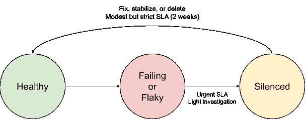
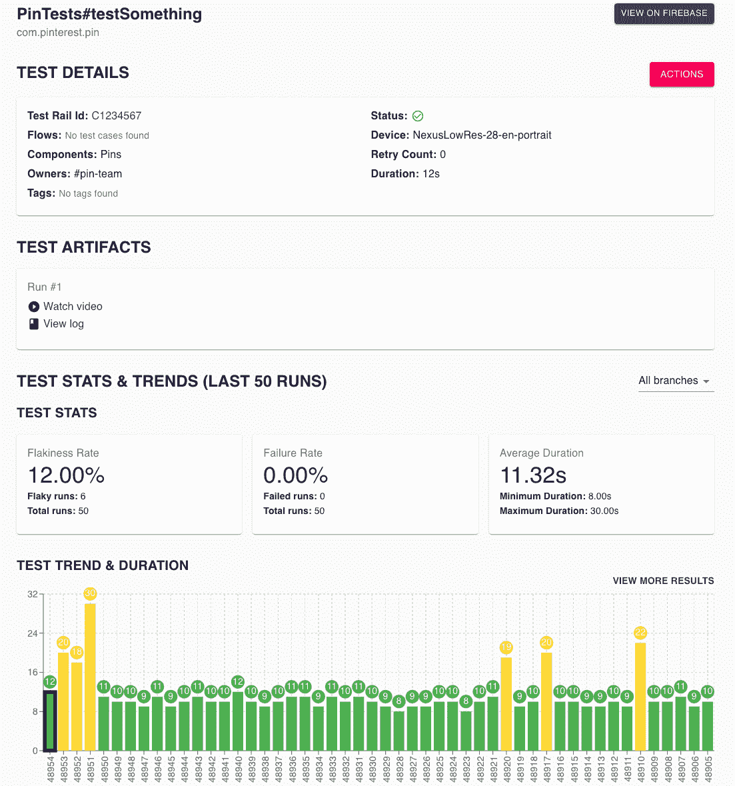

# 在 Pinterest 预先提交用户界面测试

> 原文：<https://medium.com/pinterest-engineering/pre-submit-ui-tests-at-pinterest-556be1611be?source=collection_archive---------1----------------------->

Mansfield Mark |移动测试工具领导、度量质量和测试工具

# 摘要

在我们努力[左移](https://en.wikipedia.org/wiki/Shift-left_testing)(其中测试执行得更早，或者在项目时间线上左移)的过程中，这篇博客涵盖了我们如何在每次提交我们的 Android 和 iOS 存储库之前开始运行一个大型的端到端 UI 测试套件。这个项目涉及 UI 测试、测试基础设施和开发人员生产力的仔细协调。

发货后，我们能够

*   减少调查和故障解决时间
*   将我们的测试套件的通过率从<50% to >的 90%提高
*   让我们的 UI 测试平台支持更多团队的更多测试

# 代码变更生命周期

让我们将变更生命周期分为 4 个步骤:

1.  **代码评审**:分享一个拉取请求，处理评论
2.  **提交前检查** : 示例:单元测试，linters，根据应用于某些基本提交的 pull 请求运行
3.  **提交*** :差异提交到主分支
4.  **提交后检查**:示例:集成测试，发布版本

(*)有些组织除了简单的合并冲突检测之外，还在“提交”步骤中进行检查，例如优步的 [SubmitQueue](https://eng.uber.com/research/keeping-master-green-at-scale/) 。虽然这超出了本文的范围，但是这些检查作为运行测试的地方是值得考虑的，尽管它们有自己的复杂性和权衡。

# 动机

随着我们 UI 测试套件的增长，我们发现维护测试非常困难。非关键路径上的故障往往得不到及时处理，造成不可持续的后果。例如:

*   修复测试的人通常不是处理失败代码的人
*   修复测试的人经常是在几天后，在许多上下文切换之后才开始工作
*   故障可能会相互叠加，使修复变得复杂，使问题变得模糊

一个有很多失败测试的测试套件很快就会失去它的价值。测试用例要么由发布团队手工验证，要么被忽略。随着测试套件的恶化，越来越少的回归被捕获，任何未来在 UI 测试上的投资似乎都不值得。

UI 测试缓慢、昂贵且不稳定。因此，它们通常在提交后步骤中运行。这使他们脱离了开发人员的关键路径，并避免了由于速度或不稳定性造成的延迟。

这篇文章记录了我们如何将 UI 测试套件转移到**预提交**中运行，而不是**后提交**。这一变化极大地降低了我们的测试维护成本，并且更好地保护了我们的发布。

# 挑战 1——所有权

我们要求测试只有一个团队负责维护测试。

所有者将:

*   监控警报通道以响应他们的测试问题
*   决定如何修复一个测试，什么时候更新它，什么时候可以删除它，等等。

为了确保问责，我们利用了**沉默**测试的能力，这意味着我们忽略他们的失败。每个沉默的测试必须在两周内由拥有的团队解决。****

****沉默测试意味着有人决定这些失败可以被忽略。这个决定通常是明确的，比如一个明显过时的测试。否则，测试所有者应该对是否保持沉默拥有最终决定权。****

****测试静音创建了一个生命周期，可实现:****

*   ****快速缓解主分支上的故障，无需向前修复或回滚****
*   ****测试套件中要恢复的测试的确定性 SLA****

********

****Lifecycle of a problematic test****

# ****挑战 2 —平衡速度和成本****

****我们对每个发布的差异进行测试。对我们来说，这意味着每次 diff 大约运行 2.5 次。我们还从主分支每小时运行一次测试，作为健康检查。在 Pinterest，这意味着每周大约 700 次构建，每次构建 300 次测试。****

****对代码提交关键路径的测试平均速度直接影响开发人员的速度。我们希望在合理的时间内(比如 30 分钟)保持测试套件的运行，而不会产生过多的成本。****

## ****低垂的果实****

****我们发现我们的速度可以通过一些简单的测试级修正来提高。****

*   ****测试超时下限(5 分钟)****
*   ****快速失败(例如，如果出现问题，没有无限期等待或无限滚动)****
*   ****简化测试(例如，直接链接到被测试的页面，而不是导航到它)****
*   ****跳过对静默测试的重试(它被忽略，我们不需要再次运行它)****

## ****并行化****

****并行运行测试对于提高速度至关重要。然而，在 300 个片段中运行 300 个测试通常非常昂贵。在并行化中，有许多工具可以用来平衡测试速度和成本。****

******安卓******

****我们通过名为 [Flank](https://github.com/Flank/flank) 的分片工具在 Firebase 测试实验室上运行我们的 Android 测试。Flank 支持一个名为“ [Smart Flank](https://flank.github.io/flank/smart_flank/) 的特性，该特性将基于历史运行数据智能地对测试进行分片，以确保所有分片都有望同时完成。****

******iOS******

****我们通过一个叫做 [bluepill](https://github.com/MobileNativeFoundation/bluepill) 的工具在 AWS EC2 的 macOS 实例上运行我们的 iOS 测试。高度并行化会降低稳定性，因为模拟器会争夺系统资源，从而导致不可预测的网络不稳定和帧丢失。为了补偿我们受限的并行化，我们在 bluepill 之上构建了一个定制的调度器 [pinpill](https://github.com/rainnapper/bluepill/tree/mmark/pinpill) ，以便在测试完成时更有效地利用可用的模拟器。****

# ****挑战 3 —开发者体验****

****在提交后运行 UI 测试意味着许多开发人员在与 UI 测试及其结果交互方面经验不足。测试的碎片化也意味着你可能会遇到与你的领域完全不相关的测试。我们在开发人员使用 UI 测试的经验上进行投资，以最大限度地减少流失和挫折。****

## ****可调试性****

****每个测试结果都应该有日志和视频记录。视频记录对于使 UI 测试更容易理解是至关重要的。****

****发现测试失败应该只需点击几下鼠标。在 Pinterest，我们有一个工具可以收集一个构建的测试结果，并将它们全部显示在一个地方。测试结果与以下内容一起显示:****

*   ****测试工件的链接****
*   ****测试历史****
*   ****测试所有权信息(松弛渠道、团队)****
*   ****按钮使测试静音****

********

****Screenshot of a test result summary page from Pinterest’s internal tool****

## ****支持和缓解****

******知识******

****我们的团队成员随叫随到，帮助工程师了解阻碍他们提交的 UI 测试失败。我们安排办公时间和预算时间来处理特殊问题。****

****记录工程师将会遇到的所有关键场景，例如:****

*   ****何时让测试静音****
*   ****如何调查故障和常见故障****
*   ****如何处理假阴性，确定下一步，并重复之前的测试。****

******结果缓存******

****不可避免地，工程师会在某个时候被错误地阻止。前面提到的“回收”机制让他们跳过不必要的重播。如果一个构建的测试失败了，并且这个测试被确定为一个假阴性，那么这个测试可以并且应该被沉默。在重新运行时，所有以前的失败现在都消失了，所以我们可以跳过整个测试运行。****

****这是保持团队对他们的测试负责的第二个目的。如果他们的测试突然出现片状剥落并阻碍了工程师，他们的测试将被停止，迫使他们调查原因。****

# ****挑战 4——使主分支免受故障影响****

## ****实验斜坡****

****我们的客户端 A/B 测试实验每 30 分钟拍摄一次快照，并合并到应用程序代码中。这在源代码控制中创建了一个密封的实验状态。****

****通过在这些更新之前运行测试，我们在实验上升和下降时“预提交”运行我们的测试。如果测试失败，我们建议阻塞实验斜坡。****

****这种模式应该应用于任何有中断风险的自动提交。****

## ****稳定性实施者****

****Stability Enforcer 是一个工具，当测试显示出不稳定的迹象时，它会自动停止测试。例如，如果一个测试在过去的 20 次运行中变得> 20%,它将被静音。如果它一直失败，它不会沉默。****

****这有助于减轻监控问题的负担，并防止过多的碎片到达开发人员手中。****

## ****监视****

****我们的随叫随到轮值会在工作时间监控主要分支机构的所有故障。这些失败并不总是与特定的提交相关联，所以提交前测试并不总是能够防止它们。常见的原因是 API 中断、服务器响应变化和工具故障。我们的团队帮助筛选或解决这些问题，以最大限度地降低阻碍开发人员的风险。****

# ****韵律学****

****为了确保测试套件随着测试的变化和应用的发展而保持健康，必须跟踪和维护一些关键指标。****

## ****主干通过率%****

****这是一个核心指标，表明你多久会错误地阻止一个开发人员的变更。****

****我们建议只在工作时间计算测试运行，以避免对隔夜或周末的失败进行过度索引，从而扭曲您的成功率。****

****除了测试稳定性之外，这还可以衡量您的流程对失败的响应效率。****

## ****测试速度****

****我们建议使用 P90 时间来确保开发人员有一致的体验，不会让他们等待构建完成。我们最初的目标是 30 分钟，端到端。我们认为投资越多，时间越短是可能的。****

## ****无声测试****

****有了不稳定的测试套件，许多测试会变得沉默。你不应该让你的大部分测试保持沉默。大量的沉默测试可能意味着:****

*   ****您的工程组织没有配备合适的工具或指南来编写稳定的测试。****
*   ****团队没有满足其解决失败的 SLA****
*   ****太少的人拥有太多的测试，他们无法跟上所有的测试****

## ****测试次数****

****随着应用程序复杂性的增加，测试套件也会增加。跟踪测试套件的规模将有助于您提前解决可伸缩性和可维护性的问题。****

****太多的 UI 测试通常不是一个好现象。UI 测试是捕捉明显故障的最后一道防线。然而，与其他形式的测试不同，它们对于用户行为的每一种排列都太慢、太贵了。****

# ****加速****

****从提交后切换到提交前对生产率和客户流失来说是一个很大的风险，应该小心处理。我们建议以下阶段:****

## ****润色你的测试和过程****

****花几周时间格外关注测试质量和可靠性。找到并解决您在测试运行中看到的每个问题。****

****尽快运行您的流程来捕捉和解决故障。在切换到预提交之后，工作量会明显减少，并且会分配给其他团队，但是最初，您应该做一些跑腿的工作，以确保流程顺利进行。****

****进行沟通，以确保拥有测试的团队在转向预提交后了解更严格的 SLA。这让他们有机会提出问题、删除测试等。****

## ****选择加入****

****与少数团队合作，并对这些团队成员提交的 diffs 运行预提交测试套件。****

****编写通知或文档，告知工程师他们的差异正在运行 UI 测试套件，并将其链接到相关资源。****

****在继续之前，我们将选择加入阶段延长至所有差异的 10–15%，为期 2 周。****

## ****选择退出****

****类似于强制提交，如果出了问题，建立一个绕过测试的机制。确保工程师了解这个机制以及何时使用它是合适的。现在，您可以翻转开关:对所有更改运行提交前测试，并关闭提交后运行。****

****既然故障是分阶段发生的，你就不知道主分支是否稳定。主分支上的故障需要紧急处理，因为它们表示剥落或破损。****

# ****结论****

****在这一变化之前，我们努力保持测试套件的通过率在 50%以上。这是一个不断追赶、发现问题、识别所有者和调试的游戏。现在，我们的通过率约为 90%，且待命负担显著减轻。****

****展望未来，仍有许多工作要做。误报和测试速度慢是开发人员速度的一大风险。我们在考虑接下来的步骤:****

*   ****根据更改的代码有选择地运行用户界面测试****
*   ****模拟或控制 API 响应，以限制测试方差****
*   ****处理测试失败日志，以检测基础架构级别的趋势和问题****

# ****承认****

*   ****Alice Yang，Doruk，Freddy，Jennifer Uvina，Joseph smols-Mantey，Matt Mo 和 Ryan Cooke:感谢你们为支持这个项目而建设 Pinterest 测试基础设施，并感谢你们就如何设计我们的流程进行了无数次讨论。****
*   ****Sha Sha Chu 和 Garrett Moon:感谢他们支持将这一变化引入我们的 Android 和 iOS 团队，并让我们对良好的开发者体验负责。****
*   ****[蓝丸](https://github.com/MobileNativeFoundation/bluepill)和[的维护者在](https://github.com/Flank/flank)的侧面构建使之成为可能的工具，并支持特性请求和 bug。****
*   ****[Firebase 社区 slack](https://firebase.community/) 帮助调查和设计基础设施问题****

*****要在 Pinterest 了解更多工程知识，请查看我们的* [*工程博客*](https://medium.com/pinterest-engineering) *，并访问我们的*[*Pinterest Labs*](https://www.pinterestlabs.com/?utm_source=medium&utm_medium=article-link&utm_campaign=mark-january-10-2022)*网站。要查看和申请空缺职位，请访问我们的* [*职业*](https://www.pinterestcareers.com/?utm_source=medium&utm_medium=article-link&utm_campaign=mark-january-10-2022) *页面。*****