# 预测我的消息—使用透视 API 在线停止仇恨言论

> 原文：<https://medium.com/mendix/predict-my-message-stop-hateful-comments-online-with-google-perspective-api-165ad7a0eda2?source=collection_archive---------2----------------------->

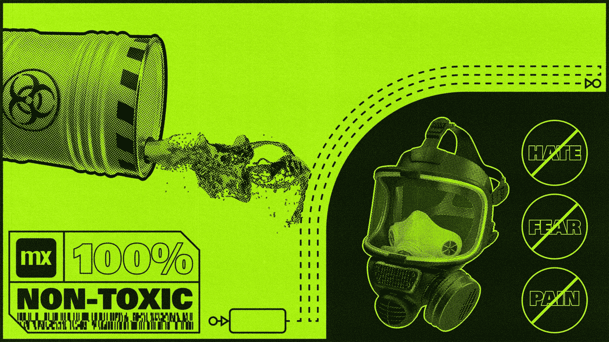

Predict My Message — Stopping Hateful Comments Online (Banner Image)

## 沟通对地球上的每一件事和每一个人都至关重要，因为我们都相互依存。有效的沟通有助于我们变得亲切，和平共处。然而，同样重要的是，我们在交流时要非常细致，不要用我们的言语给别人造成伤害。你不必搜索很长时间，你就会发现有毒的评论和仇恨言论在线。人工智能和情感分析的最新进展让我们能够在这篇可恨的演讲发表之前阻止它。

## 问候！

大家好，庄家

我希望你们都做得很好。这是我在 Mendix 社区平台上发布的第一个博客。我非常兴奋和高兴地与世界各地的制造商分享我的知识和经验！

首先，让我介绍一下自己；我的名字是维贾亚博拉提。我是门第克斯高级认证顾问，很荣幸能与 APAC 最大的门第克斯技术服务提供商 MX techies 的一些最优秀的人才共事！现在，让我们进入博客没有进一步的麻烦。

## 接下来

以下是我将在本博客中讨论的内容的简要总结:

1)沟通的演变以及为什么健康的对话非常重要。

2)Perspective API 以及如何在 Mendix 中使用 Perspective API 的服务。

泰米尔有句老话:

> “即使没有其他可以克制，一个必须控制自己的舌头；如果没有，
> 
> 他会因为他的话所造成的伤害而遭受痛苦。"
> 
> *——古代泰米尔诗人蒂鲁瓦勒瓦。*

## 传播演进述略

开始的时候，谈话是面对面的。在适当的时候，他们改为书面和电话沟通。在数字革命之后，电子邮件和视频聊天通信成为当今的主流。

你现在可能已经听说了，某个巨大的社交媒体公司目前正在元宇宙开展工作，这被认为是未来的沟通！


Mark Zuckerberg — Metaverse concept animation

## 什么是元宇宙？

> *“在未来主义和科幻小说中，元宇宙是互联网作为一个单一的、通用的、沉浸式的虚拟世界的假想迭代，其由虚拟现实和增强现实耳机的使用来促进。通俗地说，元宇宙就是一个专注于社交联系的 3D 虚拟世界网络。”——*[维基百科](https://en.wikipedia.org/wiki/Metaverse)

## 为什么健康的对话很重要？

举个例子，让我们看看游戏。谁不爱玩游戏？20 世纪 90 年代，像《超级马里奥》(Super Mario)、《门》(Contra)等街机游戏相当流行。


Arcade game — Contra

我们没有办法和朋友们聊天。我们只能与游戏中的人物互动。随着游戏的发展，我们可以通过文本、语音聊天等方式与朋友们一起玩游戏。

像 Valorant 和 PUBG mobile 这样的热门游戏都有一个举报有毒玩家的选项。职业游戏玩家通过 Twitch、YouTube 等流媒体平台播放内容。很多孩子都在看游戏视频。根据一项调查，16 至 24 岁的孩子经常观看游戏流。在群聊中，有些人可能会发送有毒信息。

在这种情况下，每个观看视频的人，包括孩子，都会受到这些有害信息的影响。在大多数流媒体平台上，频道主持人都会留意这些“巨魔”。但是，我们不能指望一个版主把大部分时间都用来当看门狗。


如果我们可以选择自动删除或屏蔽有毒聊天，这对流媒体和观众都有很大的帮助。这就是透视图 API 的用武之地。

## **Mendix 中的透视图 API:**

Perspective API 使用机器学习模型来识别辱骂性评论。它将根据评论返回毒性分数。如果毒性分数很高，我们可以认为该评论是有毒的。让我们深入了解集成，以及我们如何在 Mendix 中实现这一点。

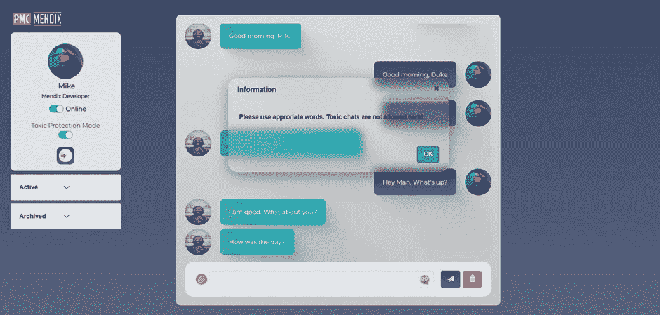

Predict My Chat Mendix application Chat Interface

这里我已经使用 Mendix 创建了示例聊天界面应用程序。为了使用 Perspective API 的服务，我们需要一个 API 键来继续。在现阶段，我们的努力对于取得预期结果至关重要。甚至爱迪生在 1000 次不成功的尝试后也找到了灯泡。对吗？

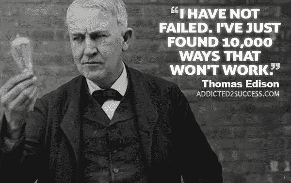

Thomas Alva Edison Motivation Quotes

https://en.wikipedia.org/wiki/Thomas_Edison

**集成 API:**

点击下面的链接**去 perspectiveapi.com**

[](https://perspectiveapi.com/how-it-works/) [## 透视 API——工作原理

### 了解 API 是如何工作的。

perspectiveapi.com](https://perspectiveapi.com/how-it-works/) 

向下滚动一点，然后**找到“转到开发者网站”按钮**。现在点击按钮。

 [## 视角|开发者

### 编辑描述

developers.perspectiveapi.com](https://developers.perspectiveapi.com/s/) 

一旦你点击链接，它将在一个新的标签页中打开开发者网站。接下来，**点击【开始】按钮**。它将重定向到 Perspective API 文档站点。在这里，您可以看到请求访问 API 密钥的分步文档。

 [## 视角|开发者

### 编辑描述

developers.perspectiveapi.com](https://developers.perspectiveapi.com/s/docs-get-started) 

## *先决条件:*

*   google 帐户:如果你没有 Google 帐户，**点击下面的链接**在 Google 中创建一个帐户。只需要 2 到 5 分钟。

 [## 创建一个 Gmail 帐户

### 要注册 Gmail，请创建一个 Google 帐户。您可以使用用户名和密码登录 Gmail 和其他…

support.google.com](https://support.google.com/mail/answer/56256?hl=en) 

创建 Google 帐户后，**点击此链接进入 Google cloud 开发者控制台仪表板**页面。

[https://console.cloud.google.com/getting-started?pli=1](https://console.cloud.google.com/getting-started?pli=1)

接下来，我们需要**在我们的谷歌云平台**中创建一个项目，以利用透视图评论分析器 API。

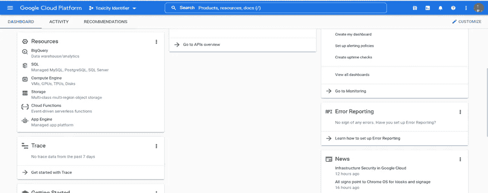

Google Cloud Platform Dashboard

透视图 API 文档页面上已经提供了创建 GCP 项目的步骤。

 [## 视角|开发者

### 编辑描述

developers.perspectiveapi.com](https://developers.perspectiveapi.com/s/docs-get-started) 

创建完项目后，单击左上角的菜单图标。这将打开侧面导航菜单。**点击 API 和服务>启用 API&服务。**

接下来点击导航菜单顶部的 **+启用 API &服务** **按钮**。然后**搜索视角评论分析器 API** 。

 [## 视角|开发者

### 编辑描述

developers.perspectiveapi.com](https://developers.perspectiveapi.com/s/docs-enable-the-api) 

一旦您找到该服务，**点击并打开该服务以启用它**。你可能会想，我们已经完成了获得一个 API 密匙的所有步骤。但这还没有完成。我们需要**填写 Perspective API 申请表，通过电子邮件获得 API 密钥(一小时内)**。因为它需要一个启用了透视图注释分析器 API 服务的 GCP 项目 ID。

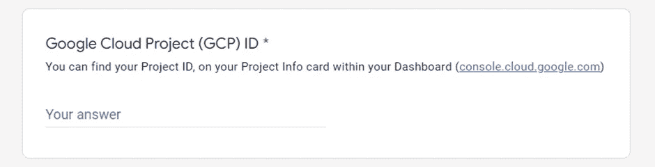

现在只需点击下面的链接，即可在一小时内获得 API 密钥。

[https://docs . Google . com/forms/d/e/1 faipqlsdhbwbnvvbxselby-jhNnEj-zwpt 5 to qscfsjergfpxw 66 cuq/view form](https://docs.google.com/forms/d/e/1FAIpQLSdhBBnVVVbXSElby-jhNnEj-Zwpt5toQSCFsJerGfpXW66CuQ/viewform)

现在已经完成了，我们已经完成了几乎 50%的工作制造者！太棒了&太棒了！现在，让我们回到我们的 Mendix 聊天应用程序！

这是我之前开发的简单聊天界面布局。我只是调用发送按钮中的简单 nanoflow 来请求我们的透视图 API 分析给定的聊天是否有害。

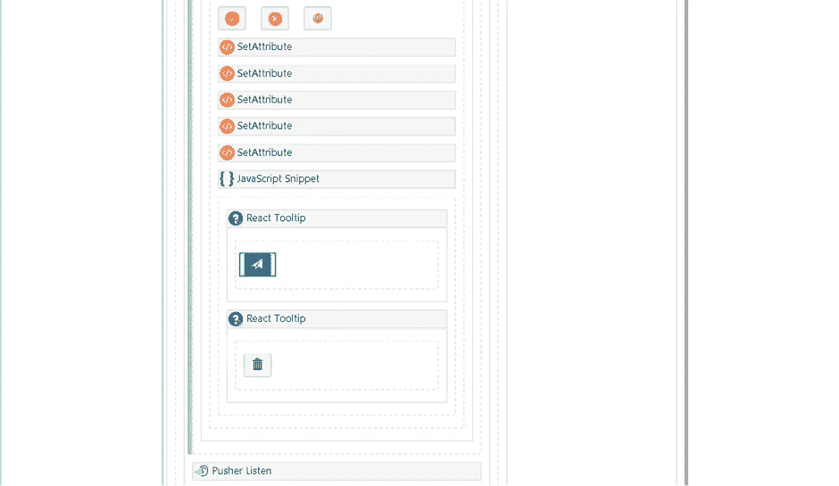

PMC Chat Interface Layout — Mendix

这是我的纳米流的样子。很简单吧？😉

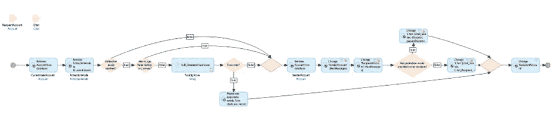

Send button Nanoflow image

对于所有开发人员来说，这是调试流程的有趣部分。在之前的 Mendix 版本 V8 和之前的版本中，我们没有调试纳流的选项。就像 Thor 用 Storm breaker 来对抗灭霸一样，我们的 Mendix 团队在 Mendix v 9 及更高版本中提出了 Nanoflow 调试器。


Thor, the Son of Odin — Avengers Infinity war climax scene

作为 Mendix 开发者，我们能感受到。这是我们期待已久的，并在我们的 Mendix 论坛创意部分投了赞成票。

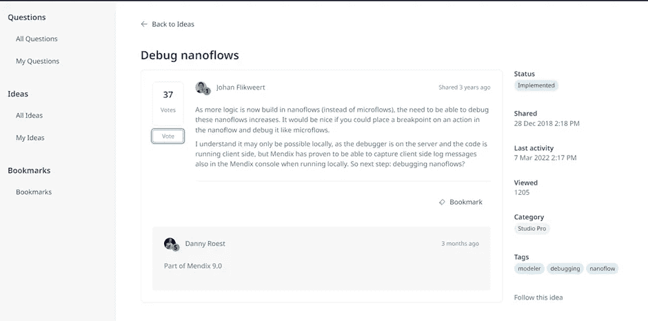

Mendix forum idea — Nanoflow debugging

在这个 nanoflow 中，我得到了两个输入参数**它们是**接收者帐户对象和聊天对象。****

首先，我只是在检索活动的帮助下检索当前登录的用户帐户。我知道这不是使用系统令牌的最佳做法。相反，我们可以使用一般化方法来获取当前登录的用户帐户。我暂时使用这种方法。

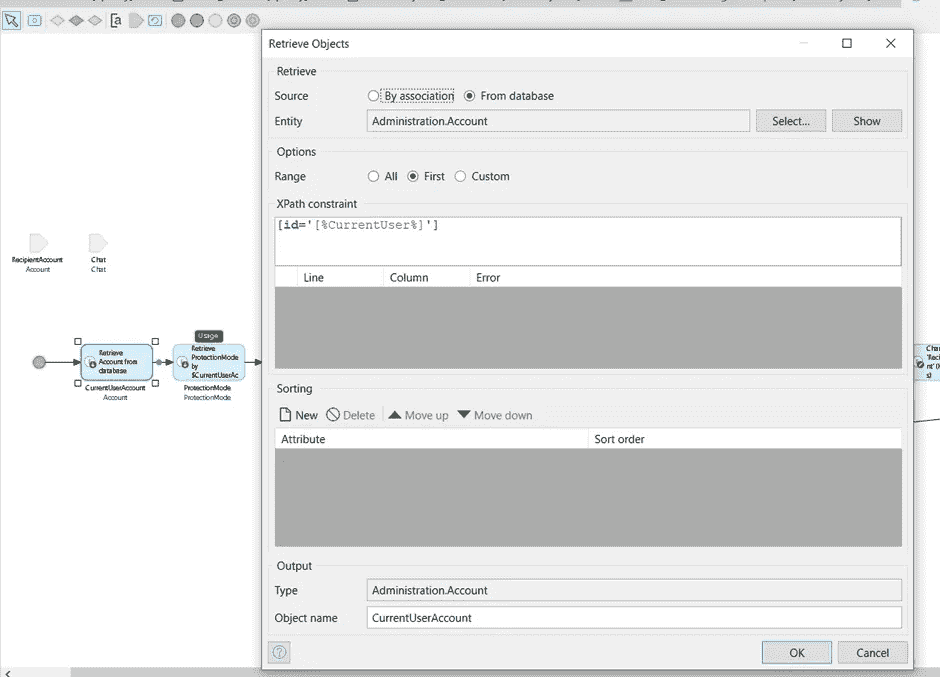

接下来，**保护模式和账户实体**之间有**一对一关联**。在保护模式实体中，我们有一个**布尔属性**来控制我们是否需要借助这个(IsEnabled)布尔属性来检查有毒注释。为了改善用户体验，我们将这种控制权交给了用户。他们可以决定是否发送有害信息。但是，另一方面，如果收件人启用了这种保护，他们将不会收到有毒邮件。很酷，对吧？

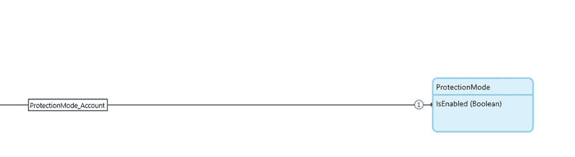

在下一个决策活动中，我将检查用户是否启用了保护模式。如果为假，它将检查用户是否在布尔属性的帮助下发送任何图像或文本消息。如果为真，它将继续下一个 SUB_GenerateToxicScore 子微流调用活动。

这是将请求我们的透视图 API 的微流。首先，我检查这个聊天是否有图像。为了避免 REST 调用错误，我只是添加了这个验证，以便只向这个 API 调用发送文本消息。

我们的输入体 JSON 结构如下所示。

```
*{
     "comment": {
         "text": "'+$Chat/Message+'"
     },
     "languages": [
         "en"
     ],
     "requestedAttributes": {
         "TOXICITY": {}
     }
 }*
```

在评论对象中，在文本属性上，我们需要传递我们的文本消息来检查它是否有毒。在 languages 数组中，我们需要提到文本消息的语言代码。因为 Perspective API 支持像阿拉伯语、西班牙语、英语等多语言。

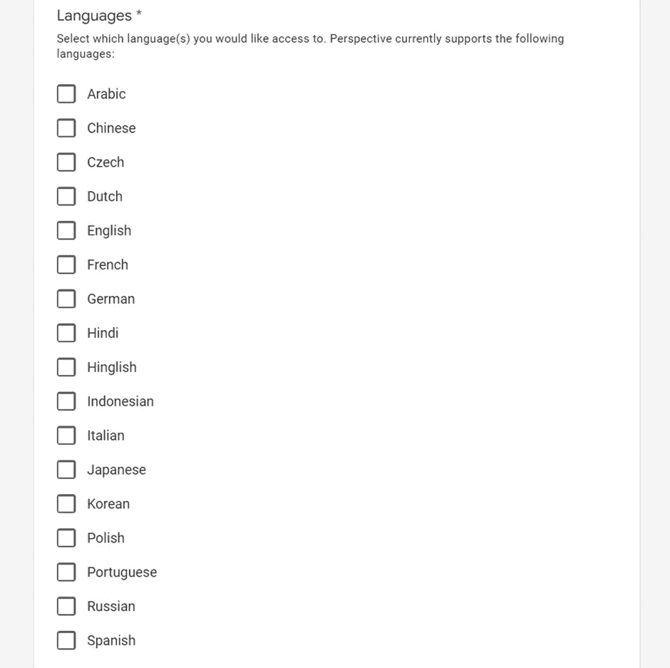

Perspective API supports multi-languages

我测试了英语，因为我不知道任何其他语言中有任何有毒的单词(开玩笑😉).

我们可以让请求的属性对象保持原样。**一旦我们的 JSON 主体准备就绪**，我们需要将这个字符串变量发送给**下一个调用 REST API 活动。**

## *透视 API 端点:*

[https://commentanalyzer . Google APIs . com/v1 alpha 1/评论:分析？key='+@ToxicityDetector。CONST_APIKey](https://commentanalyzer.googleapis.com/v1alpha1/comments:analyze?key='+@ToxicityDetector.CONST_APIKey)

这是我们需要用 API 键向 Perspective API 发送 POST 请求的端点。我只是**将我的 API 键存储在一个常量变量** (CONST_APIKey)中。

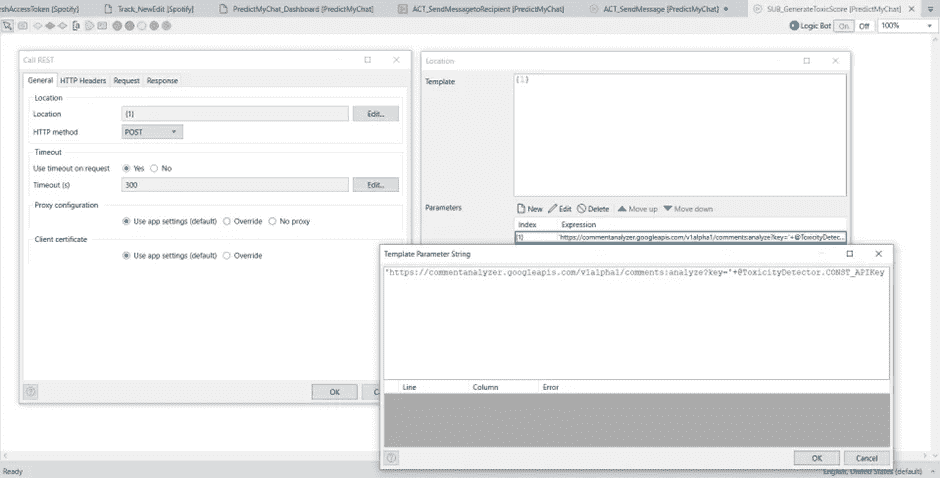

在 **HTTP headers** 部分，我们需要添加**Content-Type:“Application/JSON”**。在上一节中，我们刚刚创建了 JSON 主体字符串变量。所以，我在那个输入 HTTP 头中提到了相同的 JSON 类型。

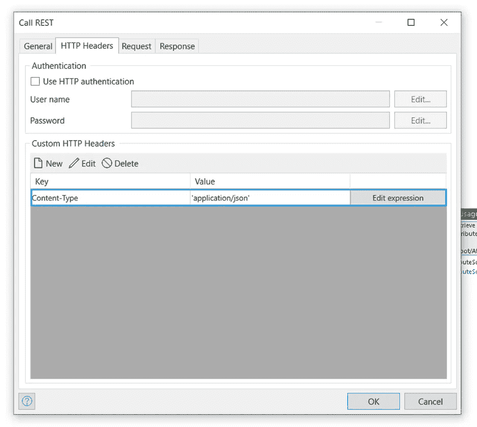

在 Request 选项卡中，我只是在 parameters 部分传递了 JSON 字符串变量，如下所示:

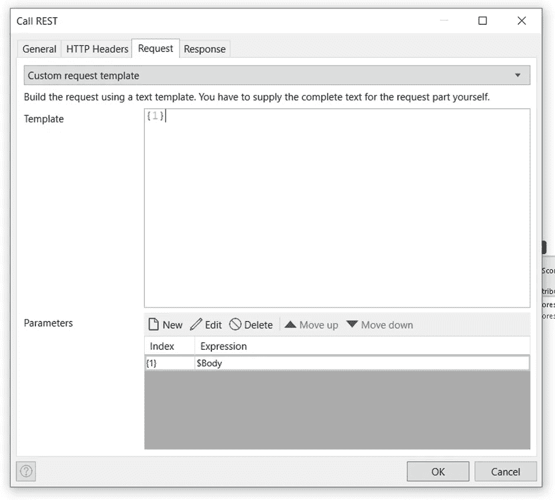

我们几乎已经完成了这个配置。最后一部分是回应部分。我们可以使用 **Import_Mapping 流程**从 Perspective API 获得响应。

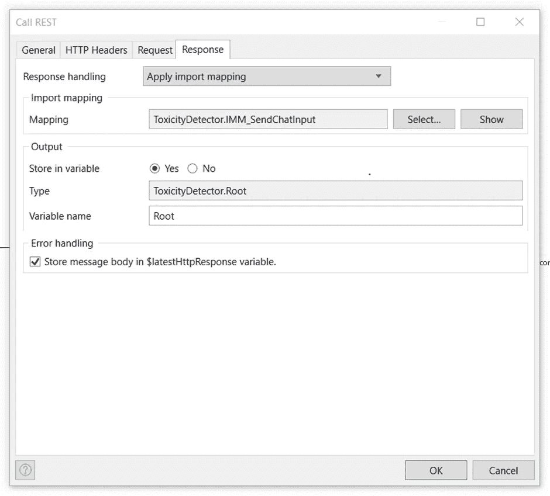

透视图 API 响应 JSON 结构如下图所示。

```
{
   "attributeScores":{
      "TOXICITY":{
         "spanScores":[
            {
               "begin":0,
               "end":6,
               "score":{
                  "value":0.10428705,
                  "type":"PROBABILITY"
               }
            }
         ],
         "summaryScore":{
            "value":0.10428705,
            "type":"PROBABILITY"
         }
      }
   },
   "languages":[
      "en"
   ],
   "detectedLanguages":[
      "ar"
   ]
}
```

我们可以**从 SummaryScore 对象值属性**中获得毒性分数。一旦我们从 SummaryScore 对象中获得毒性分数，我们只需要使用 formatDecimal 函数将这个值转换成百分比格式的**。**

```
**formatDecimal((($SummaryScore/Value)*100),’##.##’)**
```

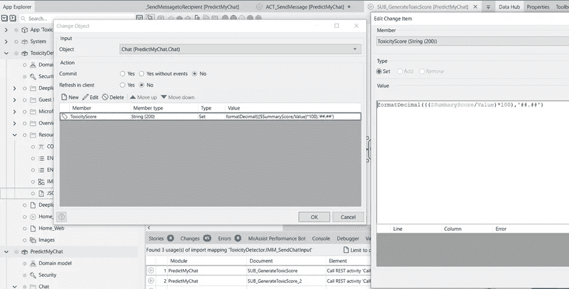

一旦我们从子微流返回毒性分数，我们就可以使用这个分数来验证它是否超过了我们在决策活动上设置的限制。在这种情况下，**我设置了 70 作为限制**。如果返回的毒性分数大于或等于 70 (x ≥ 70)，我们可以认为该文本是有毒的。

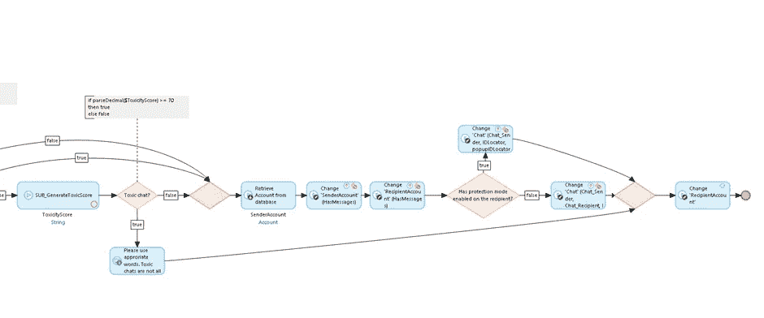

**如果条件为真**，我们可以向用户显示一条警告消息，要求他们使用适当的词语，而不是提交聊天对象。**如果条件为假**，我们可以使用检索活动获取 SenderAccount 对象，并将该对象映射到 Chat_SenderAccount 关联中。通过这种方法，我们可以自动阻止有害的评论或消息。

下面，我附上了示例聊天界面应用程序的工作演示。在这里，Duke 试图向 Mike 发送一条有毒的消息，但我们的 Perspective API 在后端的机器学习模型的帮助下很容易识别出这条有毒的聊天。预期的邮件将不会发送到 Mike 的帐户。

 [## PMC 屏幕录制. webm

### 编辑描述

drive.google.com](https://drive.google.com/file/d/1BG00sPZ8IR8TmRoU94gOZZY9yrRpT4qe/view?usp=sharing) 

## 最后的想法

我们可以在机器学习训练模型的帮助下得出结论，我们将能够识别有毒信息，并可以自动阻止它们。只需轻轻一点，我们就可以过滤并删除所有有害信息。这在与陌生人一对一的对话或社区间的群聊中非常有用。

感谢您宝贵的时间。我希望你们喜欢这个博客，并希望它对你们未来的项目有所帮助。我很快会在另一个有趣的博客中见到你。祝你有美好的一天，去创造吧😊！！

## 阅读更多

[](https://developers.google.com/codelabs/setup-perspective-api) [## Perspective API | Google 开发者入门

### 了解如何构建透视图 API。

developers.google.com](https://developers.google.com/codelabs/setup-perspective-api)  [## 消费休息服务

### 描述如何从 REST 服务获取信息。

docs.mendix.com](https://docs.mendix.com/howto/integration/consume-a-rest-service/) 

*来自发布者-*

如果你喜欢这篇文章，你可以在我们的 [*中页*](https://medium.com/mendix) *找到更多喜欢的。对于精彩的视频和直播会话，您可以前往*[*MxLive*](https://www.mendix.com/live/)*或我们的社区*[*Youtube PAG*](https://www.youtube.com/c/MendixCommunity/community)*e .*

*希望入门的创客，可以注册一个* [*免费账号*](https://signup.mendix.com/link/signup/?source=direct) *，通过我们的* [*学苑*](https://academy.mendix.com/link/home) *即时获取学习。*

有兴趣更多地参与我们的社区吗？加入我们的 [*Slack 社区频道*](https://join.slack.com/t/mendixcommunity/shared_invite/zt-hwhwkcxu-~59ywyjqHlUHXmrw5heqpQ) *。*