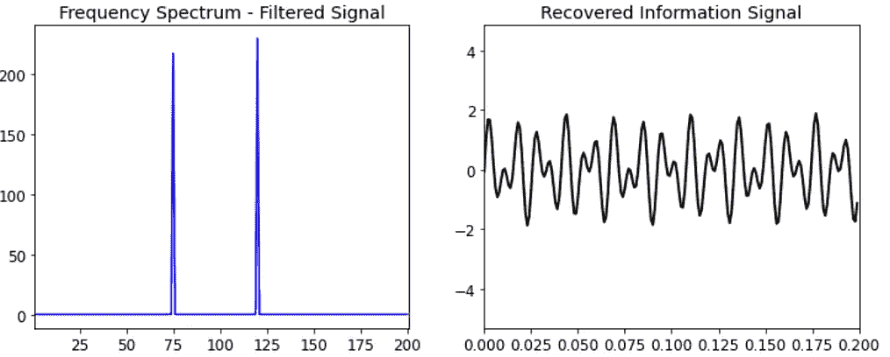

# 用傅里叶变换预测沃尔玛冷藏柜的除霜

> 原文：<https://medium.com/walmartglobaltech/predicting-defrost-in-refrigeration-cases-at-walmart-using-fourier-transform-e64c0c59323?source=collection_archive---------0----------------------->


[https://www.pexels.com/ru-ru/photo/828658/](https://www.pexels.com/ru-ru/photo/828658/)

# **简介**

作为美国最大的杂货商，沃尔玛在全国各地的商店中拥有大型超市制冷系统。食品质量是我们顾客体验的重要组成部分，沃尔玛每年花费大量资金用于维护其庞大的冷藏系统组合。为了改善整体维护实践，我们采用预防性和主动维护策略。我们沃尔玛全球技术公司使用物联网数据并构建算法来研究和[主动检测沃尔玛制冷系统](/walmartglobaltech/forecast-anomalies-in-refrigeration-with-pyspark-sensor-data-195f23ae24e2)中的异常事件。

识别制冷异常的一个关键因素是除霜。制冷系统会定期除霜，以清除正常运行过程中积累的霜和冰。根据冰箱的类型和里面的东西，冰箱可能会在一天内经历多次除霜。在除霜过程中，制冷机组变热，其温度显著高于稳态。因此，正确识别壳体温度的上升是否是由于异常事件或除霜而变得很重要。

在这篇博客中，我将讨论一种使用傅立叶变换概念来识别和预测制冷情况下除霜的技术。这里的目标是在高层次上介绍这个概念，研究一个玩具示例及其 python 实现，并查看我们除霜预测工作的方法和结果。

为了理解傅立叶变换背后的思想，让我们回顾历史，参观宇宙最早的数学模型之一，称为**托勒密体系**。托勒密和其他希腊物理学家试图以地球为中心，行星以圆周运动的方式来模拟宇宙。然而，从地球上观察到的太阳、月亮、行星和恒星的路径并不是圆形的。所以托勒密在他的模型中加入了“偏心率”,他的想法是——行星绕着一个大圆运动，但同时也绕着一个小圆运动，就像轮子边缘的一个点。这个模型仍然没有正确地解释行星运动，最终通过在圆的顶部添加更多的圆来完善它，看起来像这样:


[https://math.stackexchange.com/questions/1002/fourier-transform-for-dummies](https://math.stackexchange.com/questions/1002/fourier-transform-for-dummies)

现在我们知道这个概念是不准确的，行星运动比简单的圆的组合更复杂。然而，这个希腊系统展示了一个强大的概念- **我们可以通过添加足够多的不同大小和速度的圆来近似任何曲线**。这个想法构成了傅立叶变换的主干:任何给定的信号都可以被分解成一组不同的圆形路径。

> 有趣的一面——注:用托勒密的本轮体系画荷马·辛普森的脸:[托勒密和荷马(辛普森)](https://www.youtube.com/watch?v=QVuU2YCwHjw)

# 窗帘后面:

现在，我们已经对傅里叶变换有了较高的理解，让我们更深入地了解它的工作原理。让我们先来看看圆形路径的特征。任何圆形路径都可以用三个东西来描述——**大小**、**速度**和**起始角度**。通过改变这些，我们可以创造不同的圆周运动。


**Left**: Describing a circular path. [https://betterexplained.com/articles/an-interactive-guide-to-the-fourier-transform/](https://betterexplained.com/articles/an-interactive-guide-to-the-fourier-transform/). **Right**: If a time component (x_axis) is added to such a circular path, then we get a sinusoidal signal as shown. [https://www.kdnuggets.com/2020/02/fourier-transformation-data-scientist.html](https://www.kdnuggets.com/2020/02/fourier-transformation-data-scientist.html)

通过混合多个这样的信号，我们可以创建一个复杂的信号。从另一个角度来看，我们可以说，任何信号都可以近似为不同频率的正弦信号之和。傅立叶变换过程就是这么做的——它提取任何信号，并将其分解成其组成频率。这样，它将时域信号转换到频域。

总而言之，傅立叶变换将给定的基于时间的信号分解成一串具有不同速度、幅度和相位的正弦波。数学上可以这样表示。


credit:[https://www.thefouriertransform.com/series/fourier.php](https://www.thefouriertransform.com/series/fourier.php)

系数 **ak** 和 **bk** 将决定系列中每个正弦波的相对重要性。精确的数学可能会变得令人毛骨悚然，我们将在这个博客中避免它。

从实现的角度来看，让我们看看如何实现这个 Python。我们将创建一个简单的正弦信号，并使用 FFT (FFT 是傅立叶变换的更快实现)查看其频率分布

```
import numpy as np
import matplotlib.pyplot as plt ## Create a simple signal 
# sampling rate and frequency
dt = 0.01
f = 10
t = np.arange(0,1,dt)# signal
f = np.sin(2*np.pi*f*t)## Compute the Fast Fourier Transform (FFT)
n = len(t)# Compute the FFT
fhat = np.fft.fft(f,n) # Compute the Amplitude
A = fhat * np.conj(fhat) / n# Create frequencies
freq = (1/(dt*n)) * np.arange(n) # Only plot the first half of freqs
l = np.arange(1,np.floor(n/2),dtype='int') ## Plots
fig,axs = plt.subplots(1,2)
plt.sca(axs[0])
plt.plot(t,f)
plt.sca(axs[1])
plt.stem(freq[l],A[l])
```


**Left**: Time domain signal. **Right**: Positive half of the Fourier Transformed signal. It can be verified that the signal is comprised of only 1 frequency and all others frequencies are zero. *The frequency spectrum is symmetric around zero and contains both negative and positive frequencies as the output of Fourier Transform contains complex numbers. You can read more about it here :* [*https://realpython.com/python-scipy-fft/*](https://realpython.com/python-scipy-fft/)

类似地，通过进行傅里叶逆变换，我们可以从频谱中得到一个信号，再回到时域信号

```
# Inverse FFT for filtered time signal
inv_fft = np.fft.ifft(fhat)
```


Inverse Fourier Transform converts a signal in frequency domain back to time domain

本质上，利用傅立叶变换，我们可以设计一个通用的信号处理框架，如下所示:

*   取一个基于时间的信号
*   将其分成正弦信号成分
*   根据需要分离和分析单个成分信号

# **玩具示例:去噪信息信号**

让我们如上所述扩展我们对傅立叶变换的理解，并演示如何使用它来解决信息系统中的一个经典问题— **信号去噪**。在信号去噪中，目标是从给定的传输信号中恢复原始信息信号，该信号在传输中会被一些噪声破坏。我们将尝试使用傅立叶变换来实现这一点。我们在此做出的一个关键假设是，噪声传输信号由两部分组成:

-对应于原始干净信号的高幅度频率

-对应于添加到信号中的噪声的低幅度和不规则频率

一旦我们做出这一假设，那么剩下的就是从噪声信号中滤除这些低幅度频率，以恢复原始信息内容。这可以通过以下方式完成:

*   使用傅立叶变换将噪声信号从时域分解成其组成频率
*   使用合适的阈值过滤掉所有低频成分*
*   使用傅立叶逆变换将频域中的滤波信号转换回时域

*阈值可以根据经验或使用领域知识来决定。

```
import numpy as np## Create a sample information signal as a sum of two frequencies
dt = 0.001
t = np.arange(0,1,dt)
f = np.sin(2*np.pi*75*t) + np.sin(2*np.pi*120*t) 
f_clean = f# Add some noise
f = f + 1.5*np.random.randn(len(t)) ## Compute the Fast Fourier Transform (FFT)
n = len(t)# Compute the FFT
fhat = np.fft.fft(f,n)# Compute the Amplitude
A = fhat * np.conj(fhat) / n# Compute the frequencies
freq = (1/(dt*n)) * np.arange(n) # Create an index to filter large frequencies
idx = A >= 50# Zero out smaller frequencies
fhat = idx * fhat # Take inverse FFT to retrieve the original signal
inv_fft = np.fft.ifft(fhat) 
```



# **预测沃尔玛冷藏柜的除霜情况**

让我们回到预测制冷情况下除霜时间的目标上来。如前所述，能够描绘制冷情况下的除霜是预测制冷异常的关键输入。出于本博客的目的，我们将依赖一个制冷案例的单变量案例温度数据。


Typical temperature profile of a refrigeration case and how it can be thought of as a combination of **defrost** **signal**, **steady state signal** and **random fluctuations (error)**.

上面显示的机箱温度信号是典型的需要保持稳定温度并定期除霜的制冷机箱。这里的挑战是，这些除霜周期随着时间的推移逐渐变化，这取决于外部天气、箱内物品、商店客流量、维修等因素。因此，我们需要一个强大的逻辑来检测短期内周期性但在较长时间范围内缓慢变化的解冻。

我们将利用傅立叶变换对箱体温度信号进行处理，从中提取除霜信号。为此，我们将机箱温度简化为由三部分组成:**除霜**、**稳态温度**和**误差**。一旦我们做出这个假设，剩下的就是从傅立叶变换的温度信号中过滤对应于除霜的频率分量。

以下是这一过程的概述:

1.  将壳体温度信号从时域转换到频域。
2.  研究频谱并识别相关组件。对于我们的用例，我们能够识别:稳态温度具有零频率(dc 信号)和最高幅度，除霜信号属于具有第二高幅度**的频率**。
3.  过滤频谱，仅包含属于除霜的频率，并过滤掉其余的频率。
4.  对滤波后的频谱进行傅里叶逆变换，得到除霜信号。
5.  通过推断识别的除霜信号预测未来几天的除霜周期。

```
# Function to extract defrost signal from case temperature datadef get_defrost(x):

    ## Calculate fast fourier transform
    fhat = np.fft.fft(x,len(x))
    A = fhat * np.conj(fhat) / len(x) ## Get the second highest amplitude in frequency domain 
    #  that will belong to the defrost signal
    idx = A >= sorted(A)[-2] 

    # filter out remaining frequencies 
    fhat = idx*fhat    

    ## Inverse FFT to extract the defrost signal
    ffilt = np.fft.ifft(fhat) 

    return abs(ffilt)
```


提取的除霜信号需要被转换成用于下游建模的二进制指示器。这可以通过在合适的点对正弦除霜信号设定阈值并将信号的上部分类为除霜指示器来实现。这个阈值是一个超参数，在我们的例子中，我们经过一些实验后决定使用一个合适的值。

如前所述，我们有一些制冷案例，其中除霜命令是准确的，并且在物联网传感器数据中随时可用。我们根据这些案例来衡量我们的结果。下面是建模设置和一些好的和坏的模型拟合的例子:


**Example #1 : Good Model Fit**


**Example #2 : Bad Model Fit, Low Precision & Recall**


**Example #3 : Bad Model Fit, Zero Precision & Zero Recall**

示例 3 特别有趣，因为这里看起来模型性能很差，但是通过检查可以看出这是一个数据质量问题。虽然预测的除霜看起来是正确的，但实际命令与除霜周期不同步(在除霜后**达到峰值)。因此，模型表现非常差的情况可以被认为是潜在的数据质量问题，并被标记以供进一步检查。**

总的来说，最初的结果是令人鼓舞的，傅立叶变换似乎在除霜周期有规律的情况下做得不错。在这样的情况下，准确率和召回率平均都是 **> 80%** 。在除霜不定期或缺乏一般模式的情况下，性能较低。在这里，我们将在当前逻辑的基础上，使用基于冷藏箱类型、内容和领域专家意见的定制方法。

总之，当前的方法允许我们做以下事情:

*   在数据中不存在命令的情况下，生成除霜命令
*   预测未来除霜时间表
*   识别并纠正物联网数据中除霜命令不准确的情况下的历史除霜命令

# 参考

[](https://betterexplained.com/articles/an-interactive-guide-to-the-fourier-transform/) [## 傅立叶变换的交互式指南

### 傅立叶变换是有史以来最深刻的见解之一。不幸的是，意义被埋没在密集…

betterexplained.com](https://betterexplained.com/articles/an-interactive-guide-to-the-fourier-transform/) 

用 FFT 去噪数据【Python】-【https://www.youtube.com/watch?v=s2K1JfNR7Sc 

但是什么是傅立叶变换呢？视觉介绍-[https://www.youtube.com/watch?v=spUNpyF58BY](https://www.youtube.com/watch?v=spUNpyF58BY)