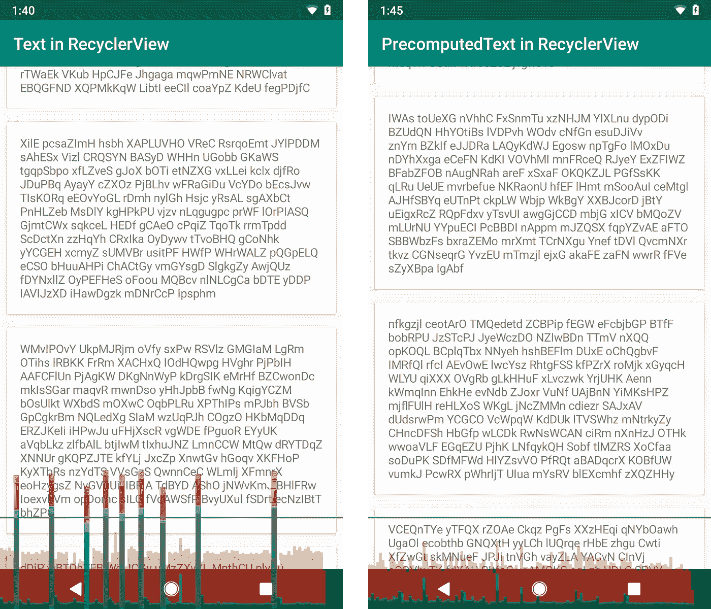

# RecyclerView 中的预取文本布局

> 原文：<https://medium.com/androiddevelopers/prefetch-text-layout-in-recyclerview-4acf9103f438?source=collection_archive---------1----------------------->


为了在 Android 上布局文本，系统做了大量的工作。每个字形都被解析——取决于字体、地区、大小、字体特征(比如**粗体**或*斜体*)。然后，系统将解析它们在形成单词时如何排列、组合或合并的规则。在所有这些之后，单词终于可以被包装到可用的空间中。

出于这些原因，对文本进行布局可能会很昂贵是有道理的。Android 使用每个单词的缓存来避免重新计算这些数据，但这只能有所帮助——屏幕上显示的新单词，甚至只是新的字体和文本大小都限制了这种优化。

**recycle view 对布局性能特别敏感。当新项目出现在屏幕上时，它们必须作为显示它们的第一帧的一部分进行布局。因此，如果 RecyclerView 项目中一段复杂的文本需要 12 毫秒来测量，几乎肯定会导致抖动和丢帧。**

在本文中，我们将讨论如何使用新的 PrecomputedText APIs 在 UI 线程需要它之前计算文本布局。我们还将介绍 Jetpack 中专门为在 RecyclerView 中显示大量文本而设计的新文本预取 API，以及它们如何**将 UI 线程文本测量成本降低 95%！**

# 复杂文本布局

下图显示了一个简单的 RecyclerView，它显示了大块的文本。在 Pixel2(运行 Android P，CPU 为 1GHz)上，测量 80 个单词(~520 个字符)需要 TextView **15.6ms** 。这是一个巨大的时间量！每一帧的截止时间是 16.67 毫秒，所以如果 UI 线程必须测量哪怕一个如此复杂的 TextView，它就会超过截止时间。

你的文本视图中可能没有那么多文本，但如果你在低端手机上运行，显示比罗马字符更复杂的内容，或者使用各种字体和样式，这样的时候可能会很现实。

使用[开发者选项>监控> Profile GPU 渲染](https://developer.android.com/studio/profile/inspect-gpu-rendering)，可以直观的看到这个问题。绿色的水平条显示了 16.67 毫秒的理想值，帧根据它们花费的时间垂直堆叠。使用左边的常规文本视图，会有许多丢失的帧——当新项目出现在屏幕上时，图形中会出现大尖峰。



Regular TextView measurement on the left, with PrecomputedText on the right.

右边的截图显示了同一个应用程序，但是使用了 PrecomputedText 来避免 UI 线程上昂贵的测量工作。剩下的测量工作还在，造成小尖峰，但不再造成 jank。`TextView.onMeasure`缩短为**0.9 毫秒** —比**快了 16 倍多！**

# 预计算文本

今年 I/O 上宣布的 [PrecomputedText](https://developer.android.com/reference/android/text/PrecomputedText) 是 Android P 中的[新 API，Jetpack](https://android-developers.googleblog.com/2018/07/whats-new-for-text-in-android-p.html) 中的 [compat 版本降低了文本的 UI 线程成本。它允许您在后台线程上预计算绝大多数测量/布局工作。](https://developer.android.com/reference/androidx/core/text/PrecomputedTextCompat)

在 UI 线程中，从 TextView 确定布局参数:

```
val params : PrecomputedTextCompat.Params =
        TextViewCompat.getTextMetricsParams(myTextView)
```

在后台线程上计算一段开销很大的文本:

```
val precomputedText : Spannable =
        PrecomputedTextCompat.create(expensiveText, params)
```

在文本视图中使用生成的预计算文本:

```
TextViewCompat.setPrecomputedText(myTextView, precomputedText)
```

这将超过 90%的工作从 UI 线程中移走——一个巨大的性能胜利！AndroidX 实现`[PrecomputedTextCompat](https://developer.android.com/reference/androidx/core/text/PrecomputedTextCompat)`在 L (API 21)和更高版本上工作，因此性能提升适用于大约 85%的活动设备([截至今年 5 月](https://developer.android.com/about/dashboards/))。

这是一个很大的改进，但是上面的异步模式对于显示文本来说不是很好。例如，在 RecyclerView 中，项目中的文本应该立即可见，而不是在滚动到屏幕一半时才可见。为了实现这一点，我们需要尽早知道文本参数，并在显示 TextView 之前做后台线程工作。

我们如何尽早开始这个预计算文本的工作，这样我们就不需要推迟文本的显示了？

# 第一种方法—预计算布局

当您已经在异步加载文本数据时，使用后台线程来预处理文本非常有用。例如，从网络上加载数据并反序列化它是很常见的，可能在发送到 UI 线程之前用 spans 对它进行样式化。

就在反序列化之后，在这里使用 PrecomputedText 是非常诱人的。我们希望在将文本发送到 UI 之前对其进行充分的预处理，以最大限度地减少 UI 线程工作:

```
/* Worker Thread */// resolve spans on worker thread to reduce load on UI thread
val expensiveSpanned = resolveIntoSpans(networkData.item.textData)

// pre-compute measurement work to reduce load on UI thread
val textParams: PrecomputedTextCompat.Params = **// we’ll get to this** val precomputedText: PrecomputedTextCompat = 
    PrecomputedTextCompat.create(expensiveSpanned, params)
```

然后，您可以在 UI 中显示从加载线程发送的预计算文本:

```
/* UI Thread */myTextView.setTextMetricParams(precomputedText.getParams())
myTextView.setPrecomputedText(precomputedText)
```

然而，我们跳过了如何获得`[PrecomputedTextCompat.Params](https://developer.android.com/reference/androidx/core/text/PrecomputedTextCompat.Params)`，这是棘手的部分。

## 尺寸问题

预计算文本需要知道字形大小来进行测量。这意味着它需要知道尺寸，不是以 **sp** (通常在 XML 中指定)，而是以**像素**为单位，根据文本密度进行调整。将 **sp** 转换为**像素**使用`[DisplayMetrics.scaledDensity](https://developer.android.com/reference/android/util/DisplayMetrics.html#scaledDensity)`，这不容易简单地传递给后台线程。

平台在运行时改变`scaledDensity`以支持用户定义的文本缩放。如果您只查询 DisplayMetrics 一次，并将它们传递给一个后台线程，您的用户可能会从更改系统范围的字体大小返回到一个只有一半 TextViews 大小正确的应用程序——这不是一个很好的体验。

正确处理这一点是可能的，但是您需要非常小心——任何时候重新创建活动时，一定要查询`scaledDensity`,如果它发生了变化，删除并重新构建任何缓存的 PrecomputedText。

# 第二种方法—未来预取<>

在不改变太多代码的情况下获得 PrecomputedText 的好处，或者不必担心跨线程反弹文本大小信息，这将是一件好事。让我们来看看一些典型的 RecyclerView 绑定代码，它设置了一个 TextView:

```
override fun onBindViewHolder(vh: ViewHolder, position: Int) {
    val itemData = getData(position) vh.textView.textSize = if (item.isImportant) 14 else 10
    vh.textView.text = itemData.text
}
```

理想情况下，这种代码很容易适应使用 PrecomputedText。

让预计算文本变得困难的是，Android TextViews 几乎在调用`setText()`之后立即执行布局，而文本样式直到那之前才完成(注意动态`textSize`属性)。这意味着我们没有足够的时间来放置背景文本布局。

然而，有一个重要的特性打破了这种预期— [回收视图预取](/google-developers/recyclerview-prefetch-c2f269075710)。因为预取，RecyclerView 实际上比 item layout 早几帧调用`onBindViewHolder()`。这样做是为了避免在最后一刻，也就是内容将要显示的时候，做昂贵的工作。

幸运的是，对于 PrecomputedText 来说，这有一个很好的副作用，即在绑定和布局之间留出几十毫秒的时间，这是在后台线程上预计算文本的理想间隔！

在最近的 Jetpack 测试版中，我们添加了额外的功能来支持这种使用情况。现在可以产生一个`[Future<PrecomputedTextCompat>](https://developer.android.com/reference/androidx/core/text/PrecomputedTextCompat#getTextFuture(java.lang.CharSequence,%20androidx.core.text.PrecomputedTextCompat.Params,%20java.util.concurrent.Executor))`，[通知 AppCompatTextView 在下一个 measure()过程中阻塞未来的](https://developer.android.com/reference/androidx/appcompat/widget/AppCompatTextView#setTextFuture(java.util.concurrent.Future%3Candroidx.core.text.PrecomputedTextCompat%3E))。

```
override fun onBindViewHolder(vh: ViewHolder, position: Int) {
    val itemData = getData(position) // first, modify item-dependent properties
    vh.textView.textSize = if (item.isImportant) 14 else 10 // Pass text computation future to AppCompatTextView,
    // which awaits result before measuring.
    textView.**setTextFuture**(PrecomputedTextCompat.**getTextFuture**(
            item.text,
            TextViewCompat.getTextMetricsParams(textView),
            /*optional custom executor*/ null))
}
```

通过创造未来，应用程序启动了后台线程预计算文本工作。我们告诉 TextView 等待，而不是等待绑定代码中的工作，并且只在测量结果之前阻塞结果。当 RecyclerView 滚动时，项目会提前膨胀/绑定，PrecomputedText 利用这一点来隐藏文本的开销。

只需几行代码，我们就添加了文本预取，将 TextView 测量时间减少了 95%！

# 警告

注意，您正在查询`[TextViewCompat.getTextMetricsParams()](https://developer.android.com/reference/androidx/core/widget/TextViewCompat.html#getTextMetricsParams(android.widget.TextView))`并将其传递给一个后台线程。因此，在`setTextFuture()`之后不要改变 TextView 属性是很重要的，(除非你正在重新绑定，并在之后立即调用`setTextFuture()`)。修改属性会导致 PrecomputedText 与 TextView 不兼容，在这种情况下，测量过程中将会引发异常。

PrecomputedTextCompat 依赖于 Android 的 word 布局缓存，这在 Lollipop 发布(API 21)之前并不存在。因此，PrecomputedTextCompat 不会在 Lollipop 之前的平台版本上进行预计算。

如果您禁用了[预取](https://developer.android.com/reference/android/support/v7/widget/RecyclerView.LayoutManager#setitemprefetchenabled)，或者如果您正在使用一个不明确支持预取的自定义布局管理器，这种方法将没有帮助。如果您使用自定义 LayoutManager，请确保它实现了`[collectAdjacentPrefetchPositions()](https://developer.android.com/reference/android/support/v7/widget/RecyclerView.LayoutManager#collectAdjacentPrefetchPositions%28int,%20int,%20android.support.v7.widget.RecyclerView.State,%20android.support.v7.widget.RecyclerView.LayoutManager.LayoutPrefetchRegistry%29)`，以便 RecyclerView 知道要预取哪些项目。还要注意，预取只适用于在屏幕上滚动的视图，但幸运的是，这是性能最重要的时候。

# 数据绑定

如果你是 Android 数据绑定的用户，你可以通过定制的[绑定适配器](https://developer.android.com/reference/android/databinding/BindingAdapter)获得预计算文本未来的同样好处。首先，我们将像在 XML 中一样使用数据绑定，但是使用“asyncText”属性:

```
<layout
    xmlns:tools="http://schemas.android.com/tools"
    xmlns:android="http://schemas.android.com/apk/res/android">
    <data>
        <variable name="item" type="com.example.ItemData"/>
    </data>
    <TextView
        android:id="@+id/item_text"
        android:layout_width="wrap_content"
        android:layout_height="wrap_content"
        android:textSize="@{item.isImportant ? 14 : 10}"
        **app:asyncText**="@{item.text}"/>
</layout>
```

现在，在我们的 BindingAdapter 中，我们可以定义`asyncText`属性，并实现它以使用预先计算的文本和`setTextFuture`:

```
[@BindingAdapter](http://twitter.com/BindingAdapter)(
        "app:asyncText",
        "android:textSize",
        requireAll = false)
fun asyncText(view: TextView, text: CharSequence, textSize: Int?) {
    // first, set all measurement affecting properties of the text
    // (size, locale, typeface, direction, etc)
    if (textSize != null) {
        // interpret the text size as SP
        view.textSize = textSize.toFloat()
    }
    val params = TextViewCompat.getTextMetricsParams(view)
   (view as AppCompatTextView).setTextFuture(
           PrecomputedTextCompat.getTextFuture(text, params, null)
}
```

注意，我们小心地在 BindingAdapter 中使用所有与文本布局相关的属性，以避免其他 binding adapter 处理它们。我们需要保证对 getTextMetricsParams 的调用在 TextView 绑定了所有其他属性之后运行，并且数据绑定不保证何时调用哪个适配器。为了安全起见，我们采用任何可能由数据绑定控制的 TextView 属性，并在适配器的开头应用所有这些属性。

```
override fun onBindViewHolder(holder: Holder, position: Int) {
    holder.binding.item = getItem(position)
    holder.binding.executePendingBindings()
}
```

最后，我们将调用`executePendingBindings()`，以便更新列表项，而无需等待下一个布局阶段。在 RecyclerView 中使用数据绑定时，这是必需的，即使您没有使用 PrecomputedText。

# 结论

PrecomputedText 解决了 RecyclerView 中的文本布局性能，这是滚动性能中最主要的性能问题之一。只需几行代码，和最新的 Jetpack，就可以降低 95%的文本测量成本！

目前，我们建议使用通常显示 200 个或更多字符的列表项文本视图来尝试 PrecomputedText。我们希望了解您的使用体验，以及它在您的应用程序中的哪些地方最有帮助。这是 Jetpack 测试版的一部分，所以请尝试一下，并[让我们知道你的想法](https://issuetracker.google.com/issues/new?component=192731&template=842428)！

# 笔记

性能测量在 Pixel 2，Android P 上完成，锁定到 1GHz 以获得测量稳定性。应用程序运行时可调试=假，因此艺术运行时具有真实(发布)性能。

在 Nexus 5，Android M，1.2GHz 上运行相同的应用程序，同样的 80 个单词输入的前/后时间分别为 20.3 毫秒和 1.2 毫秒，这是一个非常相似的约 94%的成本降低。

从 AndroidX `1.0.0-beta01`(或者如果您还没有迁移到 AndroidX)开始，上面的 API 是可用的。*套餐，`28.0.0-beta01`)。