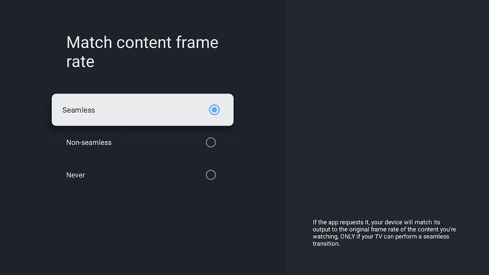
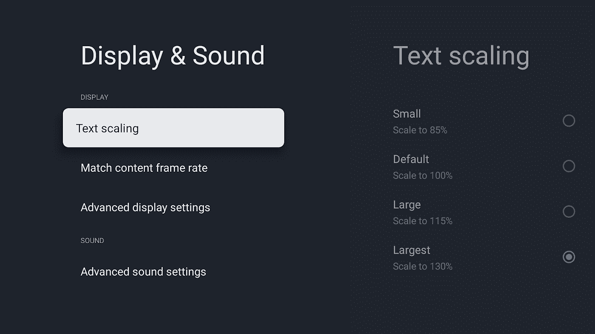
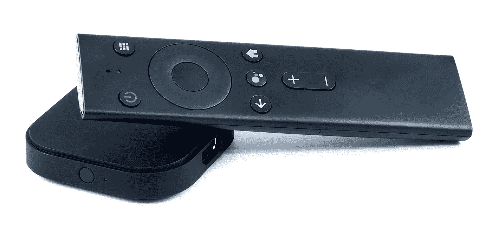

# 为 Android 12 准备您的电视应用

> 原文：<https://medium.com/androiddevelopers/prep-your-tv-app-for-android-12-9a859d9bb967?source=collection_archive---------1----------------------->

## 刷新率切换、文本缩放和 4K UI 支持是 Android 12 电视应用中需要重点关注的领域。

# 刷新率切换

[**刷新率切换**](https://developer.android.com/about/versions/12/behavior-changes-all?hl=de#refresh-rate) **允许 app 指示电视面板在不同频率之间切换，比如 24、25、30Hz 的倍数。**例如，如果您的视频内容是以 24 fps 创建的，那么您的应用程序可以通过在支持的面板上切换到 48Hz 或 120Hz 来确保更流畅的播放，同时允许流畅的 UI 动画。



一些面板支持 HDMI 2.1 VRR，实现无缝的刷新率过渡，没有任何视觉干扰(比如显示几秒钟的黑屏)，Android 可以通过`[getAlternativeRefreshRates()](https://developer.android.com/reference/android/view/Display.Mode?hl=de#getAlternativeRefreshRates%28%29)`通知你这些。

## 播放期间切换

从您的回放界面，您可以使用`[setFrameRate()](https://developer.android.com/reference/android/view/Surface?hl=de#setFrameRate%28float,%20int,%20boolean%29)`请求所需的刷新率。例如，无缝地或根据用户的偏好这样做:

如果您使用的是 ExoPlayer，默认情况下会处理无缝帧速率切换。如果您希望始终使用 CHANGE_FRAME_RATE_ALWAYS 来更改帧速率，请在实施上述方法之前，通过`[ExoPlayer.setVideoChangeFrameRateStrategy()](https://exoplayer.dev/doc/reference/com/google/android/exoplayer2/ExoPlayer.html#setVideoChangeFrameRateStrategy(int))`禁用该策略。

## 切换应用程序焦点

如果您的所有视频内容都是相同的帧速率(例如 50Hz)，那么当您的应用程序启动时，允许无法无缝切换的面板执行刷新率切换可能会更明智。在这种情况下，您可以选择通过`[Display.getSupportedModes()](https://developer.android.com/reference/android/view/Display#getSupportedModes())`枚举所有支持的显示模式，找到最适合您需求的模式，并在窗口管理器的属性中将其指定为`preferredDisplayModeId`。例如:

# 文本缩放

**Android 12 中新的辅助功能选项屏幕允许用户调整屏幕上文本的大小，因此现在更加重要的是** [**支持文本缩放**](https://developer.android.com/training/tv/accessibility#text_scaling) **。**以可缩放像素指定文本大小是必要的，但也要特别注意确保布局随着组件尺寸的变化而重新排列组件，并且当文本比例增加或减少时，所有内容仍然适合屏幕。



文本缩放一直是 Android 中的一个可访问性设置，在 Android 12 中，我们在 Android TV 中引入了一个设置屏幕，因此用户可以根据自己的喜好进行调整。你不必等到拿到 Android 12 才能找到这个新的设置屏幕；可以通过亚行进行调整:

```
adb shell settings put system font_scale 1.2f
```

通常建议使用动态布局，组件使用`wrap_content`作为尺寸，并允许用户滚动访问不适合屏幕的内容。你可以随时从`resources.configuration.fontScale`查询`FONT_SCALE`的值。

# 4K 用户界面支持

Android 本身将开始在 4K 本地支持的设备上呈现用户界面。就像从 720p 到 1080p 的迁移一样，电视应用不应该对屏幕的尺寸做出假设。通过设计响应性 ui 和支持不同屏幕尺寸的[避免硬编码像素值](https://developer.android.com/training/multiscreen/screensizes)。

在我们的电视布局构建建议中，阅读更多关于[管理布局资源的信息。](https://developer.android.com/training/tv/start/layouts.html#density-resources)

# 适用于 Android TV 的 Android 12 开发者预览版



The Android 12 developer preview is available for the ADT-3.

Android 12 在 [ADT-3 开发者套件](https://store.askey.com/adt-3.html)上作为开发者预览版提供；Android 12 developer preview for TV 会通过 OTA 自动安装，你也可以手动安装最新的映像。

或者，你可以使用 [Android Emulator for TV](https://developer.android.com/training/tv/start/start#run-on-a-virtual-device) ，它允许你尝试这些和其他新的用户界面功能，如[窗口模糊](https://source.android.com/devices/tech/display/window-blurs)。

Android 12 将于今年晚些时候开始出现在电视上，所以现在是时候开始评估你的应用程序的兼容性了。

编者按:这篇报道的前一个版本称，Android 12 将于今年年初开始出现在电视上。