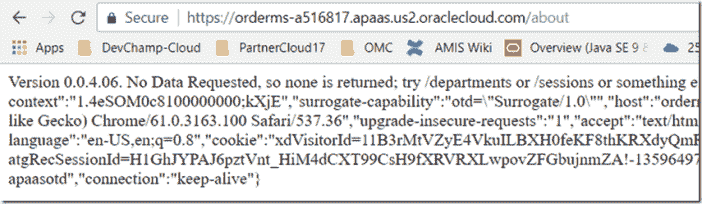

# 准备并链接绑定 Oracle 数据库云、应用容器云、应用容器缓存和事件中心

> 原文：<https://medium.com/oracledevs/prepare-and-link-bind-oracle-database-cloud-application-container-cloud-application-container-627ce5e63374?source=collection_archive---------0----------------------->

我经常一起使用的 Oracle 公共云服务组合(例如用于实施微服务的组合)是 DBaaS、应用容器云、应用[容器]缓存和事件中心。

在本文中，我展示了几天前我在 Oracle 公共云控制台中完成的一系列步骤，为我在卡萨布兰卡的摩洛哥 Devoxx 上的演示准备了一个演示环境。或者，我可以使用命令行 [*psm*](https://docs.oracle.com/en/cloud/paas/java-cloud/pscli/abouit-paas-service-manager-command-line-interface.html) 工具和一些简单的脚本来创建云环境。我着手创建的设置看起来像这样:

几个节点应用程序将在应用程序容器云上运行。每个都将有服务绑定到同一个应用程序容器缓存(一个由 Oracle Coherence 提供支持的黑盒子)，一个 Oracle 数据库实例中的指定可插拔数据库中的特定模式和[一个特定主题]事件中心(内部有 Apache Kafka)。应用容器云上的应用需要公共 ip 地址，事件中心上的主题也是如此。在这个演示中，为了方便起见，我还希望能够通过公共 IP 地址从我的笔记本电脑上直接访问数据库。

本文将展示提供以下云服务的步骤，并展示如何从公共互联网访问网络:

*   [数据库云](http://cloud.oracle.com/database)
*   [应用容器云](http://cloud.oracle.com/application-container-cloud)
*   [活动中心](http://cloud.oracle.com/event-hub)
*   应用容器缓存(应用容器云的一部分)

本文还展示了如何为应用程序容器云上的应用程序创建到缓存、事件中心和 DBaaS 实例的服务绑定。

# 数据库云

过了一段时间，我收到一封电子邮件，通知我数据库实例的创建已经完成:

这反映在服务控制台中:

我可以深入了解服务实例

查看细节——比如已经分配的 150 GB 存储空间(对于我的小演示环境来说有点多)和已经分配的公共 IP 地址

为了在端口 1521 上启用从公共互联网到数据库的网络访问，我需要启用网络访问规则。

在这种情况下，启用端口 1521 的访问规则:

此时，我可以从运行在我笔记本电脑上的 SQL Developer 中检查数据库云实例是否确实可以访问:

请注意服务名的组成，包括数据库名、身份域名和固定字符串 oraclecloud.internal。

类似地，通过 SQL 连接表明云中的数据库已经启动并运行，可以访问:

# 应用容器云

我为节点运行时创建了一个应用程序[容器]:

在本例中，我上传了一个准系统节点应用程序——打包在一个 zip 文件 order-ms.zip 中——以及一个 manifest.json 文件，该文件描述了几件事情，其中包括如何运行这个应用程序(“node order-ms.js”)

上传完成后，应用程序的创建就开始了

现在，创建工作已经完成:

并且可以检查应用程序的当前状态:

应用程序的 URL 已被分配，可供公众访问:

我可以对 order-ms 应用程序进行测试调用:

为了方便地从应用程序容器中访问日志记录(写入我的存储云环境),我使用 Cloudberry for OpenStack(参见博客文章[Oracle Storage Cloud Service 之上的图形文件浏览器工具——Cloud berry for easy file inspection and manipulation](https://technology.amis.nl/2016/05/15/graphical-file-explorer-tool-on-top-of-oracle-storage-cloud-service-cloudberry-for-easy-file-inspection-and-manipulation/)),它支持 Oracle Storage Cloud:

现在可以在桌面工具中访问日志文件:

此时，我们已经完成了环境设置的一半:

接下来是从应用程序容器到 DBaaS 的服务绑定，用于将数据库访问细节注入到节点应用程序中，而不必在节点应用程序本身中显式硬编码数据库名称、网络地址和其他访问细节。服务绑定为这些应用程序可以简单读取的细节产生环境变量。

必须重新启动应用程序，才能应用服务绑定或环境变量中的更改。

# 活动中心和主题

这篇早期的博客文章— [从本地节点 Kafka 客户端](https://technology.amis.nl/2017/09/21/setting-up-oracle-event-hub-apache-kafka-cloud-service-and-pub-sub-from-local-node-kafka-client/)设置 Oracle Event Hub (Apache Kafka)云服务和 Pub&Sub—详细描述了 Event Hub 平台服务的供应。在这种特殊情况下，我使用其中一个预定义的堆栈，通过 Oracle Cloud Stack Manager 创建了一个包含事件中心和大数据计算云的环境:

不幸的是，这个堆栈的创建运行了很多个小时(超过 7 个小时)，最终失败了。然而，它提供了事件中心平台——一个非常大的 Apache Kafka 集群。

对我来说，下一步是在这个平台上创建一个主题，并允许从公共互联网访问该平台，以便 Kafka 客户可以发布和消费该主题。

Zookeeper 端口(2181)和 Kafka 服务器端口(6667)需要访问规则。

接下来，创建一个主题 devoxx-topic:

新主题的详细信息——包括其完全限定的名称(包括身份域名，这意味着某种形式的多租户正在幕后进行)

这就是我们现在所处的环境:

下一步是创建从应用程序容器云上的 order-ms 应用程序到事件中心实例的服务绑定:

现在，基于这个服务绑定，通过几个额外的环境变量，可以在节点应用程序中获得事件中心的详细信息:

# 应用程序容器缓存

最后需要的服务是应用程序容器缓存——一个内存网格，充当非常快速的键值存储。使用简单的 HTTP 调用，我们可以将东西(比如 JSON 文档、简单值、图像和其他二进制块)放在缓存中，以便在多个请求、一个应用程序的多个实例以及多个应用程序之间进行安全保存。在我们的无状态微服务架构中，缓存可用于保存最接近会话状态或应用状态的内容。

现在缓存已经准备好了:

注意:不能在 Oracle 公共云中的身份域之外直接访问缓存。事实上，只有运行在应用程序容器云上的应用程序才能访问这个缓存。

首次创建应用程序时，可以创建从应用程序容器云上的应用程序绑定到缓存的服务:

或者以更平常的方式。

这意味着现在我们需要的环境已经完全配置和绑定，并且可以在其上运行我们的服务。

*原载于 2017 年 11 月 19 日*[*technology . amis . nl*](https://technology.amis.nl/2017/11/19/prepare-and-link-bind-oracle-database-cloud-application-container-cloud-application-container-cache-and-event-hub/)*。*