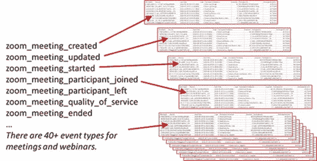
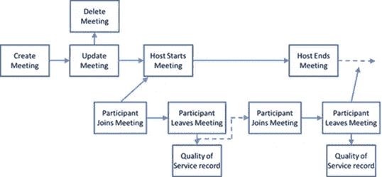
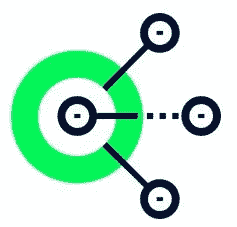

# 准备用于分析的事件驱动数据

> 原文：<https://medium.com/walmartglobaltech/preparing-event-driven-data-for-analysis-3010da7416d7?source=collection_archive---------0----------------------->

**简介**

从历史上看，数据是以易于分析的漂亮行的形式出现的。如今，*事件驱动架构* (EDA)可以创建几个不相关的事件流，这让数据科学家绞尽脑汁想出正确的方法来整合数据。通常，这些数据将保持未分析状态，直到将其转换为更简单的格式。本文将演示一个简单的过程，将事件驱动的数据整合到可以在 Spark 环境中轻松分析的数据集中。业务示例是将几个事件流汇集成一个数据集，数据科学家可以使用该数据集来了解 Zoom 使用情况。


Image source from https://publicdomainvectors.org/en/free-clipart/Female-manager/70861.html (Text is mine)

当工程师天真地第一次查看缩放数据时，他们希望找到一个显示时间和出席情况的简单会议记录。相反，工程师会发现缩放会议数据分布在许多(40+个)不同的事件流中。缩放会议数据需要将几个不同的事件流连接在一起，然后才能导出可用的数据集。

为了清楚地定义术语，每个“事件流”跟踪特定事件类型的单个事件。而大部分公司消费者数据可以被认为是事件流(事件包括“查看的页面”、“添加到购物车”、“购买的商品”、“创建的账户”等。)，许多内部系统正迅速变得越来越基于事件，例如服务标签、位置更新、目录服务……企业缩放数据是“事件流”数据的一个很好的例子。例如，*zoom _ meeting _ participant _ joined*事件流记录了每次有人参加会议。因此，如果一个人参加(然后离开)一个会议三次，那么在那个表中有三个记录。

每个事件流将数据存储在一个单独的表中，其中每行代表一个事件。



**流程**

将事件流组合成一个可用的数据集遵循一个通用过程。

1.  **了解业务流程** —我知道这听起来很老套，但“了解业务流程”是第一步。在查看缩放数据时，这可能很容易，因为我们每天都在使用它。但是，如果我们正在分析一个我们不熟悉的数据集，比如事件/问题跟踪数据，我们会希望开发一个流程图来显示事件何时被触发。类似于下面的缩放事件流:

缩放事件流—(简化视图。实际上，会议和网络研讨会有 40 多种缩放事件类型。)



*Image created inside Walmart by Mike Roberts*

**2。确定从哪个数据集开始。**

为了得到"*谁参加了哪些会议的表格"*我们需要合并几个不同的事件流。自然，第一个问题，“哪组事件应该是我们构建表的基础”

当创建会议时，逻辑起点应该是事件流流程的起点。虽然按时间顺序组合事件流对于事件流来说是一个很好的策略，但是由于事件结构的原因，这种方法对于事件缩放事件数据来说并不是最好的。如果我们从 *meeting_created* 开始，我们会发现许多会议被更新或删除，这就产生了质量问题。因此，在这种情况下，更好的起点是*participant _ joins _ meeting*，因为这给了我们某人参加的每个会议的记录。该表还包含对 meetingID 的引用，这将有助于从上游或下游事件获取数据。例如，我们可以使用*participant _ joins _ meeting*表中的 meetingID 来过滤 *meeting_created* 表以查找主持人和创建日期。

当开始联接和合并不同事件流的过程时，请考虑以下事项:

*   哪个数据集是事件流的起点？这是事件发生的时间顺序。
*   哪个数据集的事务最多？从包含许多事件的基表开始，当基表连接到其他数据集时，可以建立更多的连接。
*   哪个数据集与其他类型的事件关联最多？具有其他数据集的键的事件数据集可以简化数据之间的连接。
*   特定的事件类型是否与业务需求紧密相关？有没有一个数据集包含了商业问题的大部分答案？

**3。将数据放在一起**

连接事件流的一般问题是，上游或下游事件并不总是一对一的关系。

在缩放数据的情况下，一个会议可能有同一个人在同一个会议上的许多加入/离开事件。此事件流因一个人可能在会议开始前加入会议或在会议结束后离开会议而变得复杂。通过与商业伙伴合作，我们可以制定一套规则来处理这类情况。例如，*“如果一个人已经加入多次，只保留第一次加入会议的人。假设他们在最后离开时间或会议结束时间离开会议，以较早者为准*。

为了满足业务需求，如果"*只保留某人第一次参加会议的时间*，我们将需要为每个参与者创建一个“窗口”，然后选择他们参加会议的最早记录。阿帕奇火花。窗口函数允许用户计算一系列输入行的结果。它类似于 groupBy()功能，但没有聚合。对于缩放数据，我们将使用创建一个参与者加入时间窗口，然后选择最早的记录。关于 Windows 的信息太多，本文无法一一介绍，但是[这里有一篇文章可以让你开始使用 Spark windows。](https://databricks.com/blog/2015/07/15/introducing-window-functions-in-spark-sql.html)代码通常有两个步骤，首先设置窗口，然后将其应用于数据框。下面是一个简单的例子，它使用一个窗口获取数据帧中的第一项。

```
from pyspark.sql import DataFrame, Window
from pyspark.sql.functions import first
# Example dataframe
df = spark.createDataFrame([("A", 1),("A", 2),("A", 3),("B", 10),("B", 20),("B", 30)],   ("id", "count")  )# Define the Window for each 'id', and the order by the 'count'
windowSpec = Window.partitionBy("id").orderBy("count")  

# use window to select the first value in the window
df.select("*", 
         first('count').over(windowSpec).alias("first_in_window"))
         .show()+---+ -----+ ---------------+
| id| count| first_in_window|
+---+ -----+ ---------------+
|  B|    10|              10|
|  B|    20|              10|
|  B|    30|              10|
|  A|     1|               1|
|  A|     2|               1|
|  A|     3|               1|
+---+ -----+ ---------------+
```

一旦您为*participant _ joins _ meeting*表设置了适当的数据窗口，以获得每个人的第一次加入，那么您将需要对*participant _ leaves _ meeting*表应用类似的逻辑来获得最后一次离开事件。虽然此示例显示了窗口，但可能有些表需要聚合。例如，每当有人离开会议时，就会创建一个*服务质量*事件。作为分析的一部分，可能希望聚集会议中特定人的服务质量问题。

**4。连接和验证**

接下来连接和合并许多表的步骤是一个标准过程。加入数据，保留你需要的字段，重复直到你有最终的表格。

因为不同的事件流是不相关的，所以我发现在每个不同的连接上运行各种统计数据是很有用的，所以我很清楚在每个连接上丢失了什么记录。事件表通常会有丢失或重复的值，这会产生奇怪的结果。我们希望看到绝大多数的事件都被加入。因为不同的事件流不相关，所以我们预计会有一些项目被遗漏。如果事件不能很好地结合，那么我们需要开始调查根本原因。类似地，查看在窗口过程中丢失的记录也是有用的。例如，我们知道有时人们很难参加缩放会议，因此看到 5–15%的人因为计算机问题多次参加会议并不奇怪。然而，如果我们发现窗口处理减少了 50%的数据集，那么我们应该调查为什么。

**5。准备好讨论模型中没有的内容。**
当将事件流聚合到其他人将要使用的数据集中时，能够识别**而不是**进入模型的内容是很重要的。业务合作伙伴需要以数据的优势和局限性为导向。例如，如果我们组合上图中显示的缩放事件流，我们就可以很好地总结“谁参加了哪些会议”。然而，这种分析并没有告诉我们:

*   谁被邀请参加会议但没有出席？
*   创建后又取消的会议数量？
*   那些安排好但没人参加的会议？

如果您在这一步中是积极主动的，您可以使用这一分析来提出新的想法，提供工作量估计，并帮助指导业务用户。

**总结**

随着现代应用程序架构产生流事件，需要将这些事件合并到更简单的表中，以便分析师和数据科学家可以使用它们。将事件流整合在一起不是“火箭科学”，而是“数据科学”，如果您使用的是一个清晰的流程:

*   了解活动工作流程
*   确定一个数据集作为基础，然后在此基础上进行构建
*   对重复数据删除和加入步骤的清晰分析
*   记录模型的未知信息

