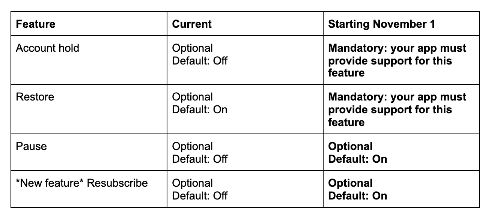

# 为您的应用程序准备 Google Play 计费系统的最新功能

> 原文：<https://medium.com/androiddevelopers/preparing-your-apps-for-the-latest-features-in-google-plays-billing-system-210ed5e50eaa?source=collection_archive---------0----------------------->

作为 Android 11 发布的一部分， [Google Play 团队宣布了新功能](https://android-developers.googleblog.com/2020/06/new-features-to-acquire-and-retain-subscribers.html)来帮助你[获得和保留你的 Android 应用的订户](https://developer.android.com/google/play/billing/subs)。作为这项工作的一部分，Google Play 将改变一些订阅功能的默认设置。在本帖中，我们将看看这些变化，以及如何确保您的应用程序准备就绪。

首先，让我们看看从 2020 年 11 月 1 日开始将会发生的变化。

在本文的其余部分，我们将深入探讨这些变化如何影响你的应用或游戏。对于每个功能，我们将基于两种不同的情况讨论它如何影响您的应用程序:1)您的应用程序不使用后端服务器跟踪订阅状态 2)您的应用程序有一个后端服务器，它也利用实时开发者通知来跟踪订阅状态。

# 账户持有

**此功能的含义**:当用户尝试续订，但由于付款问题而导致续订失败时，用户将进入*帐户冻结*期。此期限最长为 30 天，在此期间，用户将失去对订阅的访问权限。

**如果你的应用没有跟踪后端服务器的订阅状态**:如果你的应用依赖于`queryPurchases()`的结果来获得最新的订阅状态，你就不需要做任何额外的事情来支持账户持有。`[BillingClient.queryPurchases()](https://developer.android.com/reference/com/android/billingclient/api/BillingClient#queryPurchases(java.lang.String))`如果套餐处于账户持有期，将不会退还套餐。一旦用户确定他们的支付方式，订阅将作为`queryPurchases()`的一部分再次返还。

**如果你的应用有一个利用 RTDN 跟踪订阅状态的后端服务器**:一旦用户进入账户持有期，就会发送`SUBSCRIPTION_ON_HOLD`通知。一旦用户解决了支付问题并再次成功订阅，将会发送`SUBSCRIPTION_RECOVERED`通知。确保您的后端处理这些[通知](https://developer.android.com/google/play/billing/rtdn-reference)以获得用户订阅的最新状态。

在[官方文档](https://developer.android.com/google/play/billing/subs#account-hold)中阅读更多关于账户冻结以及如何正确处理这种状态的信息。

# 帐户恢复

**此功能的含义**:用户可以在当前计费周期的订阅到期之前取消续订。当帐户恢复打开时，用户可以在订阅到期前通过点击 Play Store 应用程序中的**重新订阅**选项来恢复他们已取消的订阅。这将恢复订阅，就像用户从未取消过它一样。如果订阅已过期，用户必须重新订阅。

**如果你的应用没有通过后端服务器**跟踪订阅状态:如果你的应用依靠`queryPurchases()`的结果来获得最新的订阅状态，你就不需要做任何额外的事情来支持账户恢复。`[BillingClient.queryPurchases()](https://developer.android.com/reference/com/android/billingclient/api/BillingClient#queryPurchases(java.lang.String))`将继续返还套餐，直到套餐到期，即使用户在下一个计费周期之前提前取消了套餐。

**如果你的应用有一个利用 RTDN 跟踪订阅状态的后端服务器**:当用户恢复订阅时会发送`SUBSCRIPTION_RESTARTED`通知。如果你的应用程序显示用户界面来通知用户一个即将到期的订阅，请确保在你的后端收到这个通知后更新用户界面。

在[官方文档](https://developer.android.com/google/play/billing/subs#restore)中阅读更多关于账户恢复以及如何正确处理这种状态的信息。

# 帐户暂停

**该功能的含义**:用户可以选择将订阅暂停一周到三个月。只有在当前计费周期结束后，套餐暂停才会生效。当订阅暂停时，用户不应访问订阅的功能。`[queryPurchases()](https://developer.android.com/reference/com/android/billingclient/api/BillingClient#queryPurchases(java.lang.String))`中不返回暂停的订阅。

目前在 Play Console 中默认不开启账号暂停，但从 2020 年 11 月 1 日开始会自动开启。如果您的应用程序尚未准备好处理帐户暂停，您可以在 Play Console 中手动关闭该功能。

**如果你的应用没有通过后端服务器**跟踪订阅状态:如果你的应用依靠`queryPurchases()`的结果来获得最新的订阅状态，你就不需要做任何额外的事情。`[BillingClient.queryPurchases()](https://developer.android.com/reference/com/android/billingclient/api/BillingClient#queryPurchases(java.lang.String))`不返回暂停的订阅。

**如果你的应用有一个利用 RTDN 跟踪订阅状态的后端服务器**:当用户开始暂停订阅时，会发送`SUBSCRIPTION_PAUSE_SCHEDULE_CHANGED`通知。此时，在当前计费周期结束之前，订阅仍然有效。当订阅进入暂停状态时，会发送一个`SUBSCRIPTION_PAUSED` 通知。当订阅自动恢复或者如果用户手动恢复订阅，则发送`SUBSCRIPTION_RENEWED` 通知。

在[官方文档](https://developer.android.com/google/play/billing/subs#pause)中阅读更多关于账户暂停以及如何正确处理这种状态的信息。

# 重新订阅

**此功能的含义**:开启重新订阅功能允许您的用户在订阅处于非活动状态后的一年内购买相同的订阅。此功能还允许用户在当前订阅到期前再次购买订阅。

Play Console 中的重新订阅功能目前默认不打开，但将从 2020 年 11 月 1 日起自动打开。如果您的应用程序尚未准备好在该日期之前处理重新订阅，您可以在 Play 控制台中手动关闭该功能。

**如果你的应用没有通过后端服务器**跟踪订阅状态:如果你的应用依靠`queryPurchases()` 的结果来获得最新的订阅状态，你就不需要做任何额外的事情。`[BillingClient.queryPurchases()](https://developer.android.com/reference/com/android/billingclient/api/BillingClient#queryPurchases(java.lang.String))`将继续返还套餐，直到套餐到期。

**如果你的应用有一个利用 RTDN 跟踪订阅状态的后端服务器**:当用户重新订阅时，会发送`SUBSCRIPTION_RESTARTED`通知。收到此通知后，您的应用程序应处理恢复用户对订阅功能的访问。

在[官方文档](https://developer.android.com/google/play/billing/subs#resubscribe)中阅读更多关于重新订阅以及如何正确处理这种状态的信息。

**对这些订阅功能的更改将于 2020 年 11 月 1 日生效，请仔细检查以确保您的应用已准备就绪！**