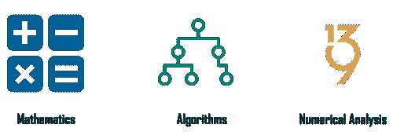
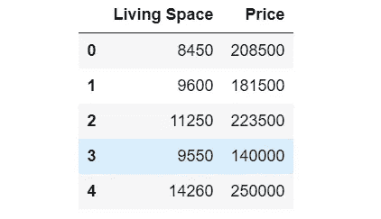
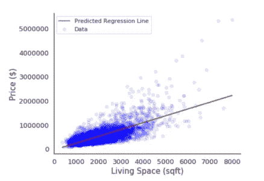
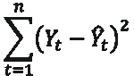
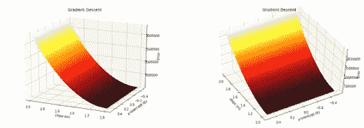

# 机器学习的前提条件是什么？

> 原文：<https://medium.com/edureka/prerequisites-for-machine-learning-68430f467427?source=collection_archive---------2----------------------->

Prerequisites for Machine Learning — Edureka

机器学习无疑是这个时代最抢手的技术！如果你是刚开始学习机器的初学者，了解机器学习的先决条件很重要。这个博客将帮助你理解在开始机器学习之前你需要知道的不同概念。

以下是这篇博客中涉及的主题列表:

1.  机器学习的先决条件
2.  用一个用例理解机器学习

# 机器学习的先决条件

要开始学习机器，您必须熟悉以下概念:

1.  统计数字
2.  线性代数
3.  结石
4.  可能性
5.  编程语言

## 统计数字

统计数据包含可用于从数据中获得某种结果的工具。有描述性统计，它是用来转换原始数据中的一些重要信息。此外，推理统计可用于从数据样本中获取重要信息，而不是使用完整的数据集。

## 线性代数

线性代数处理向量、矩阵和线性变换。它在机器学习中非常重要，因为它可以用于对数据集进行转换和执行操作。

## 结石

微积分是数学中的一个重要领域，它在许多机器学习算法中起着不可或缺的作用。具有多个特征的数据集用于建立机器学习模型，因为特征是多个的。多变量演算在建立机器学习模型中起着重要作用。整合和差异化是必须的。

## 可能性

概率有助于预测事件发生的可能性，它有助于我们推理这种情况是否会再次发生。对于机器学习来说，概率是一个基础。

## 程序设计语言

为了实现整个机器学习过程，了解像 R 和 Python 这样的编程语言是必不可少的。Python 和 R 都提供了内置库，使得实现机器学习算法变得非常容易。

除了具备基本的编程知识，知道如何提取、处理和分析数据也很重要。这是机器学习需要的最重要的技能之一。

# 机器学习用例

机器学习就是创建一种算法，可以从数据中学习，以做出预测，如图片中有什么样的对象，或推荐引擎，治疗某种疾病的最佳药物组合或垃圾邮件过滤。

机器学习是建立在数学先决条件之上的，如果你知道为什么数学会被用在机器学习中，它会变得有趣。你需要知道你将使用的函数背后的数学原理，以及哪个模型适合这些数据，为什么。

让我们从预测房价的有趣问题开始，有一个包含不同特征和价格历史的数据集，现在，我们将考虑居住空间的平方英尺面积和价格。

现在我们有一个包含两列的数据集，如下所示:

这两个变量之间一定有某种关联，我们需要建立一个模型来预测房价，我们该怎么做呢？

让我们用图表显示这些数据，看看它是什么样子的:

在这里，我们试图创建一条线，称为:

***Y = mX+c***

这种预测目标(因变量)和预测变量(自变量)之间线性关系的方法称为线性回归。它允许我们研究和总结两个变量之间的关系。

*   X =独立变量
*   Y =因变量
*   c = y 轴截距
*   m =直线斜率

如果我们考虑这个方程，我们有独立变量 X 的值，所以我们要做的就是计算 m 和 c 的值，来预测 y 的值。

那么我们如何找到这些变量呢？

为了找到这些变量，我们可以尝试一堆值，并尝试找出一条与最大数量的数据点相交的线。但是，我们如何找到最佳拟合线呢？

因此，为了找到最佳拟合线，我们可以使用最小二乘误差函数来找出 y 的真实值和预测值 y’之间的误差。

最小二乘误差函数可以用以下公式表示:

使用该函数，我们可以通过与数据点的实际值进行比较，找出每个预测数据点的误差。然后，你将所有这些误差求和，将它们平方，找出预测中的偏差。

如果我们将第三个轴添加到包含所有可能误差值的图表中，并在三维空间中绘制它，它将看起来像这样:

在上图中，理想值位于底部黑色部分，这将预测接近实际数据点的价格。下一步是找到 m 和 c 的最佳可能值，这可以通过使用称为梯度下降的优化技术来完成。

梯度下降是一种迭代方法，我们首先初始化变量的一些值，然后通过最小化实际值和预测值之间的误差来慢慢改进它们。

现在，如果我们认为公寓的价格实际上不仅仅取决于每平方英尺的价格，还有许多因素，如卧室、浴室等的数量。如果我们也考虑这些特征，那么等式看起来会像这样

***Y = b0 + b1x1 + b2x2 + …..+bnxn + c***

这是多线性回归，属于线性代数，这里我们可以使用大小为 mxn 的矩阵，其中 m 是特征，n 是数据点。

让我们考虑另一种情况，在这种情况下，我们可以使用概率来找到房子的状况，以便根据房子的状况是好还是坏来对它进行分类。为此，我们将不得不使用一种称为逻辑回归的技术，这种技术对由 sigmoid 函数表示的发生概率起作用。

在本文中，我们讨论了机器学习的先决条件，以及如何在机器学习中应用它们。所以基本上，它由统计学、微积分、线性代数和概率论组成。微积分有用于优化的技术，线性代数有可以在巨大数据集上工作的算法，通过概率我们可以预测发生的可能性，统计帮助我们从数据集的样本中推断有用的见解。

如果你想查看更多关于 Python、DevOps、Ethical Hacking 等市场最热门技术的文章，你可以参考 Edureka 的官方网站。

请留意本系列中的其他文章，它们将解释数据科学的各个方面。

> *1。* [*数据科学教程*](/edureka/data-science-tutorial-484da1ff952b)
> 
> *2。* [*数据科学的数学与统计*](/edureka/math-and-statistics-for-data-science-1152e30cee73)
> 
> *3。*[*R 中的线性回归*](/edureka/linear-regression-in-r-da3e42f16dd3)
> 
> *4。* [*机器学习算法*](/edureka/machine-learning-algorithms-29eea8b69a54)
> 
> *5。*[*R 中的逻辑回归*](/edureka/logistic-regression-in-r-2d08ac51cd4f)
> 
> *6。* [*分类算法*](/edureka/classification-algorithms-ba27044f28f1)
> 
> *7。* [*随机森林中的 R*](/edureka/random-forest-classifier-92123fd2b5f9)
> 
> *8。* [*决策树中的 R*](/edureka/a-complete-guide-on-decision-tree-algorithm-3245e269ece)
> 
> *9。* [*机器学习入门*](/edureka/introduction-to-machine-learning-97973c43e776)
> 
> *10。* [*朴素贝叶斯在 R*](/edureka/naive-bayes-in-r-37ca73f3e85c)
> 
> *11。* [*统计与概率*](/edureka/statistics-and-probability-cf736d703703)
> 
> *12。* [*如何创建一个完美的决策树？*](/edureka/decision-trees-b00348e0ac89)
> 
> *13。* [*关于数据科学家角色的 10 大误区*](/edureka/data-scientists-myths-14acade1f6f7)
> 
> *14。* [*顶级数据科学项目*](/edureka/data-science-projects-b32f1328eed8)
> 
> 15。 [*数据分析师 vs 数据工程师 vs 数据科学家*](/edureka/data-analyst-vs-data-engineer-vs-data-scientist-27aacdcaffa5)
> 
> *16。* [*人工智能的种类*](/edureka/types-of-artificial-intelligence-4c40a35f784)
> 
> *17。*[*R vs Python*](/edureka/r-vs-python-48eb86b7b40f)
> 
> 18。 [*人工智能 vs 机器学习 vs 深度学习*](/edureka/ai-vs-machine-learning-vs-deep-learning-1725e8b30b2e)
> 
> 19。 [*机器学习项目*](/edureka/machine-learning-projects-cb0130d0606f)
> 
> 20。 [*数据分析师面试问答*](/edureka/data-analyst-interview-questions-867756f37e3d)
> 
> *21。* [*面向非程序员的数据科学和机器学习工具*](/edureka/data-science-and-machine-learning-for-non-programmers-c9366f4ac3fb)
> 
> *22。* [*十大机器学习框架*](/edureka/top-10-machine-learning-frameworks-72459e902ebb)
> 
> *23。* [*用于机器学习的统计*](/edureka/statistics-for-machine-learning-c8bc158bb3c8)
> 
> *24。* [*随机森林中的 R*](/edureka/random-forest-classifier-92123fd2b5f9)
> 
> *25。* [*广度优先搜索算法*](/edureka/breadth-first-search-algorithm-17d2c72f0eaa)
> 
> *26。*[*R 中的线性判别分析*](/edureka/linear-discriminant-analysis-88fa8ad59d0f)
> 
> *27。* [*监督学习*](/edureka/supervised-learning-5a72987484d0)
> 
> *28。* [*互动 WebApps 使用 R 闪亮*](/edureka/r-shiny-tutorial-47b050927bd2)
> 
> *29。* [*机器学习十大书籍*](/edureka/top-10-machine-learning-books-541f011d824e)
> 
> *30。* [*无监督学习*](/edureka/unsupervised-learning-40a82b0bac64)
> 
> 31。 [*10 本最好的数据科学书籍*](/edureka/10-best-books-data-science-9161f8e82aca)
> 
> 32。 [*机器学习使用 R*](/edureka/machine-learning-with-r-c7d3edf1f7b)

*原载于 2019 年 8 月 6 日*[*https://www.edureka.co*](https://www.edureka.co/blog/prerequisites-for-machine-learning/)*。*