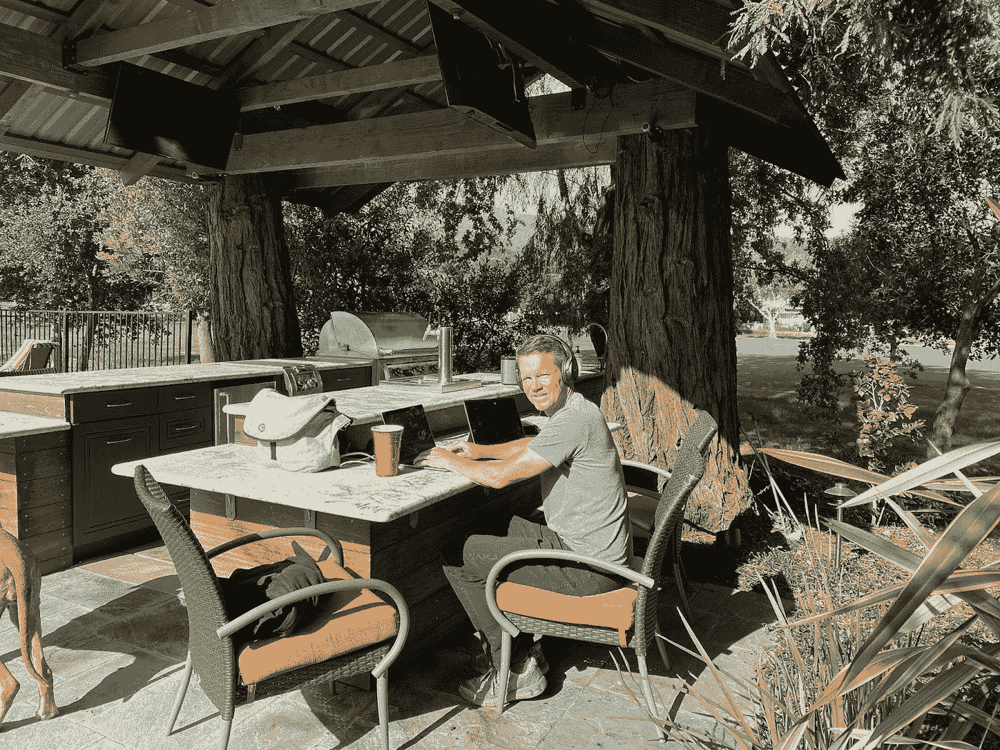
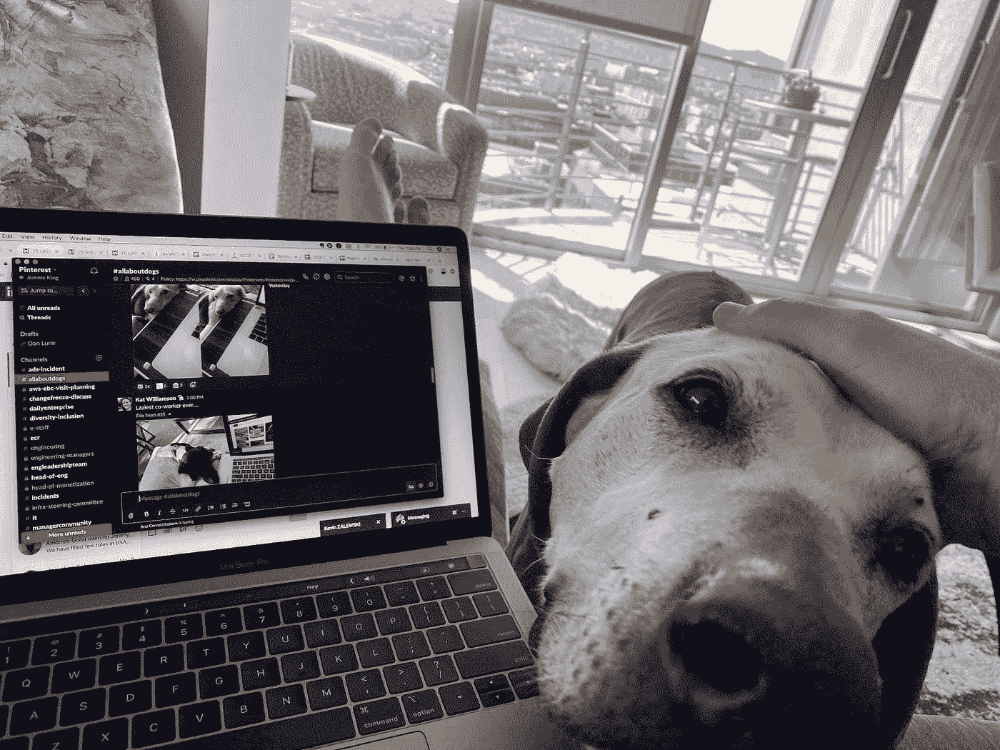

# PinFlex:Pinterest 的未来工作模式

> 原文：<https://medium.com/pinterest-engineering/presentamos-pinflex-el-modelo-de-pinterest-para-el-futuro-en-el-trabajo-68d09fc9e106?source=collection_archive---------3----------------------->

Jeremy King | 工程副总裁

*这篇文章最初发表于 英语.Read the English version* [*here*](/pinterest-engineering/introducing-pinflex-pinterests-model-for-the-future-of-work-437731fabde) *(T7 )*

两年前,我在 Pinterest 担任高级副总裁的第一年即将结束。我们的办公室关闭了,我们所知道的工作和生活突然发生了变化。通过适应我们周围的剧烈变化,我们了解了很多关于工作和工作场所的知识。灵活工作的好处和我们从任何地方高效工作的能力为我们的工作带来了很多好处,因为长途旅行被消除了,我们可以在家庭的重要时刻更多地参与其中。我们还认识到与同事有意识地整合以建立协作文化的价值。两年后,自从我加入 Pinterest 以来,现在已经三年了,我非常高兴地推出[**PinFlex**](https://newsroom.pinterest.com/es/post/presentamos-pinflex-un-modelo-de-trabajo-inspirador-para-nuestros-empleados)**Pinterest 独特的工作模式,让员工可以灵活地生活和工作,并优先考虑面对面的协作,作为一个团队一起工作。**

****

# **T14 灵活性和全球化 (T15)**

**Pinterest 在大流行期间在全球范围内发展壮大,在多伦多、墨西哥城 (CDMX) 和都柏林建立了工程中心,补充了我们在西雅图、旧金山和帕洛阿尔托的办事处。所有这些地区都能够跨越国界成功地进行协作,并为全球的 Pinterest 用户提供服务,证明了分布式员工队伍的价值和有效性。我们还认识到能够从任何地方招募人员以建立多元化员工队伍的价值。通过 PinFlex,我们可以在美国所有 50 个州招聘员工。我们继续在全球范围内招聘,我们的非美国员工可以居住在他们工作的国家或地区的任何地方。Pinterest 将支付我们在过去两年中无法进行的必要面对面协作的差旅费用。**

# ****亲自连接以推动创新(T17)****

**虽然远程工作有明显的好处,但流行病告诉我们,在某些时刻,我们团队的价值和重要性在于能够创新并继续建立强大的文化。PinFlex 使工作能够遵循协作风格,确保我们在现实生活中了解我们的联系人,并最大限度地利用我们在办公室内外的时间。**

**例如,在过去的两年里,我错过了“五分钟会议”,这是一个非常重要且非常容易亲自解决的问题,但不像安排 15 或 30 分钟的会议那样重要。最近,我在旧金山的办公室里,在走廊里碰到我们的基础设施财务主管。我们谈了一会儿关于预测报告的复杂性,我已经花了几个星期。我们花了五分钟在走廊里解决这个问题。它在下周就被修复了。虽然有许多虚拟的替代方案可以进行 5 分钟的会议(Slack,Documents,Comments,Git 等)。偶尔的个人遭遇所产生的生产力是非常有价值的。使用 PinFlex,我们在个人身上花费的时间将是有意的,所有这些都是为了实现协作,连接和生产力。**

# ****适用于工程、产品和设计团队的 PinFlex****

**在规划 PinFlex 时,我们认为在所有工程、产品和设计团队中采用一种方法非常重要。我们会要求员工最多有 25%的时间出现在办公室。为了平衡这段时间,员工可以在他们喜欢的地方,在办公室里或办公室外。使用 PinFlex,我们真正想要节省员工在办公室的时间,当我们要求他们走动时,他们真的很有意识。我们将谨慎行事,并亲自计划好时间,以便员工真正感受到时间被充分利用。例如,个人时间将集中在:**

*   **深入合作**
*   **战略规划**
*   **整合设备**
*   **学习与发展**

**团队将聚集在一起,告诉我们它在实践中是如何工作的。我们已经制定了总体指导方针,但我们将共同努力使其成为现实。我们将听取团队的反馈和经验教训,并根据需要对 PinFlex 进行调整。重要的是,每个人都能够共同设计我们的未来工作。**

****

# ****我们从世界各地招募工程师****

**Pinterest 在全球拥有数百个工程、产品和设计职位,我们正在寻找能够接受鼓舞人心挑战的人才,这些挑战将继续推动 Pinterest 的发展。 **了解更多信息并申请我们的工作机会** [**点击这里**](https://www.pinterestcareers.com/?utm_source=medium&utm_medium=blog-article&utm_campaign=pinflex-announcement&utm_content=jeremy-blog-spanish)。**

**我们对 PinFlex 为全球员工创造的机会感到兴奋。在 Pinterest,我们的使命是为人们提供所需的灵感,以创造他们想要的生活,而这始于我们的员工,他们履行这一使命,每天激励我们。**