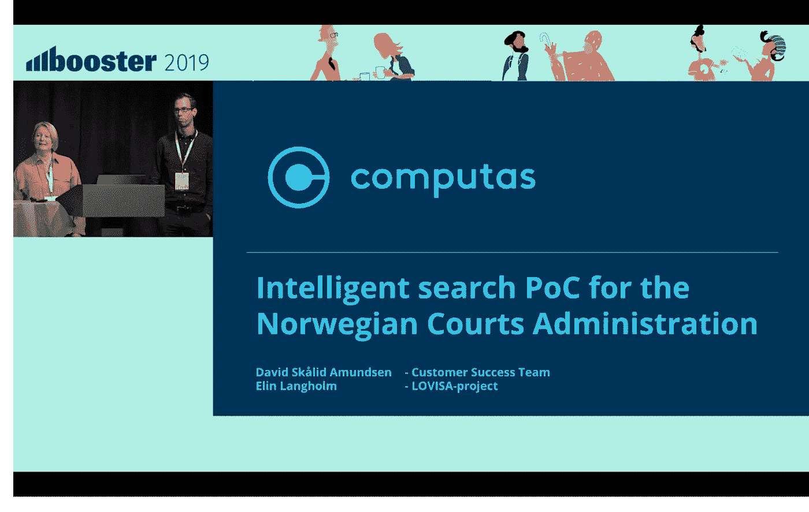

# 在 Booster 2019 上展示我们为挪威法院管理局提供的文档搜索概念证明

> 原文：<https://medium.com/compendium/presenting-our-poc-on-document-search-for-the-norwegian-courts-administration-at-booster-2019-9bb0397f42a6?source=collection_archive---------3----------------------->

这是我第一次参加 [Booster](http://boosterconf.no) ，也是我第一次参加 IT 会议。Booster 的一个好处是，从开发人员到功能架构师和项目负责人，它对每个人都有好处。我只能在会议的第二天和第三天参加，但发现与我以前参加过的学术会议相比，研讨会的数量令人耳目一新。

在会议的第一天， [Elin Langholm](https://medium.com/u/94061b4022b8?source=post_page-----9bb0397f42a6--------------------------------) [谈到了“概念验证”(PoCs)](/grensesnittet/mitt-første-foredrag-på-booster-2019-b9f905a35227) ，以及如何使用 PoCs 来快速检查一个想法是否会创造商业价值，如果你失败了，你会快速安全地失败，而不会付出巨大的代价。第二天，Elin 和我讲述了我们在 2018 年夏天为挪威法院管理局制作的关于智能搜索的具体 PoC，以及我们在这个过程中吸取的经验教训。你可以在下面观看我们谈话的录音。

# 构建智能搜索 PoC

> Elin Langholm 和 David sklid Amundsen(30 分钟简短谈话)

挪威最高法院的所有判决都必须在 [lovdata.no](https://lovdata.no/) 上公布和搜索，但对地区法院(Tingretten)和上诉法院(Lagmannsretten)的判决没有这种要求。这两个法院的判决只有一小部分公布在 Lovdata 上。2018 年初夏，地区法院的一名法官找到我们，问我们是否可以帮助他们在所有判决中搜索，而不仅仅是在 Lovdata 上发布的判决。从第一次讨论这个想法到我们开始进行概念验证，时间并不长。我们希望表明，我们不仅可以制作传统的搜索解决方案，还可以使用机器学习来提高文档的排名，并根据执行搜索的人来个性化排名，从而进一步增加商业价值。

在我们的谈话中，我们介绍了我们如何在内部工作，将具有不同背景和技能的人聚集在一起，并与客户一起工作。我们还讨论了我们的解决方案及其背后的技术，展示了一个现场演示，并讨论了我们学到的对其他人进行 POC 有用的东西。这是我们谈话的录音。

 [## 2019 年卑尔根助推器大会

### Booster 会议将于 2019 年 3 月 13 日至 15 日在挪威卑尔根举行。该会议面向所有寻求…

2019.boosterconf.no](https://2019.boosterconf.no/)