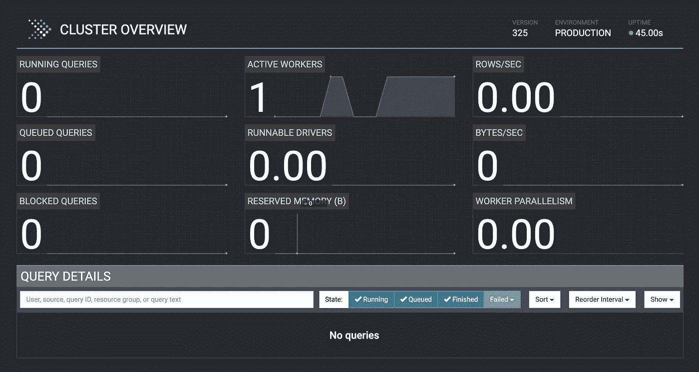
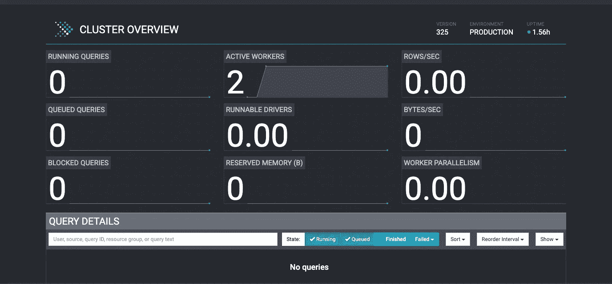

# Azure 上的 Presto

> 原文：<https://medium.com/walmartglobaltech/presto-on-azure-c9bb8357a50a?source=collection_archive---------1----------------------->

Source: [Presto](https://github.com/prestosql/presto/blob/master/presto-docs/src/main/resources/logo/web/main/blue/Presto_Logo_DarkBlueBG.svg), [Azure](https://commons.wikimedia.org/wiki/File:Microsoft_Azure_Logo.svg)

resto 是一个分布式 SQL 查询引擎，旨在通过使用分布式执行来高效地查询大量数据。由于它的分布式内存处理架构，它已经成为发展最快的 SQL 查询引擎。

像其他数据处理引擎一样，Presto 可以部署在多个平台上。当谈到解耦计算和数据的系统时，Presto 非常适合，这也是 Presto 非常适合云的主要原因。

在本文中，我们将计划做三件事，

*我们将在 Azure 上建立 3 个节点的自动扩展的 Presto 集群。*

*配置配置单元目录以访问多种类型的 Azure 存储。*

在 Azure 上创建 Presto 集群的其他可用选项。

# 在 Azure 虚拟机上运行 Presto

**我们要做的是建立一个集群—**

1.启动 2 个虚拟机，设置 Presto 协调器和 Presto worker。

2.从我们在上一步中设置的 Presto worker VM 创建一个映像。

3.使用 Presto worker 虚拟机映像为 Presto worker 创建一个比例集。

4.配置自动缩放策略。

5.验证设置。

# 让我们为 Presto 设置创建 2 个虚拟机

我们首先需要 2 个 Azure 虚拟机，在虚拟机上安装 java，然后我们将分别设置 Presto 协调器和工作器。

你可以在这里找到设置 azure-cli 的步骤。

您可以使用以下命令来启动 Azure VM，

Presto coordinator 和 worker 至少需要在其 coordinator 和 worker 上安装 Java8。我推荐使用 Java11 来获得更好的 GC。

# 快速协调器和工人设置

按照以下步骤在虚拟机上设置 Presto 协调器，

按照以下步骤在虚拟机上设置 Presto Worker，

以防万一，如果您在启动 Presto 协调器或工作器时遇到任何问题，那么您可以在各个虚拟机上的'**/var/Presto/data/var/log/server . log**'位置找到日志。

在这一点上，我们已经设置好用 1 个 worker count 来检查我们的 Presto UI。您可以在*http:://{ Presto-coordinator-IP }:8080*启动 Presto UI

Figure 1: Presto Coordinator UI

# 让我们准备一个快速的工人图像

我们已经设置了 Presto worker 虚拟机，我们将使用它来创建一个 Presto worker 映像，我们将使用它进行自动扩展部署。

首先，我们必须登录到上一步中设置的 Presto worker VM，然后运行下面的脚本，

一旦我们运行了上面的脚本，我们就为定制映像虚拟机的创建做好了云初始化安装的准备。输入 exit 关闭 SSH 客户机，并按照下面脚本中的步骤创建 Presto worker 映像，

# 我们现在准备使用 Presto worker 映像为集群创建我们的规模集

在此步骤中，我们将为我们的群集创建一个扩展集，开始时最少包含 2 个节点，并将为其设置自动扩展规则。

作为此设置的一部分，当 5 分钟内实例间的 CPU 百分比平均值大于 75%时，autoscaler 将向上扩展 2 个实例，当 5 分钟内实例间的 CPU 百分比平均值小于 30%时，autoscaler 将向下扩展 1 个实例。

这取决于你想如何为你的设置配置自动缩放规则。

我们有 3 个节点(1 个协调器和 2 个工作器),可以根据 CPU 使用情况进行自动扩展。

# 确认

让我们在*http:://{ Presto-coordinator-IP }:8080*打开 Presto UI 进行验证

Figure 2:Presto coordinator UI

# 快速为配置单元目录准备配置

假设你已经有一个 Azure 存储帐户，并且 Azure 注册应用程序被授予访问权限。

如果您需要对存储的**只读访问权限**，向 Azure 注册的应用程序提供 IAM 访问权限**存储 Blob 数据读取器**角色。

如果您需要对存储的读写访问权限，请向 Azure 注册的应用程序提供 IAM 访问权限。

接下来的步骤是为 Presto 集群配置配置单元目录。让我们把下面的配置放在 Azure 注册应用程序的手边，

应用程序(客户端)ID

可在应用内生成的客户端密码

Oauth 2.0 令牌端点(v1)

占位符{Oauth2.0-endpoint}、{client-id}和{client-secret}在使用前必须替换为 azure-site.xml 中的应用信息。

将您配置的 azure-site.xml 放在所有主机(Presto coordinator 和 workers)上的 Presto 安装目录中(默认位置是/usr/lib/presto/etc/)。

## 正在配置配置单元目录

是时候让您的配置单元目录配置为通过 Presto 访问在 Azure 存储上创建的表了。这将需要重新启动集群。

不要忘记用您的配置替换占位符。

# 最后，是时候通过 Presto 进行查询了

Presto 与 Presto-CLI 捆绑在一起，它提供了一个基于终端的交互式 shell 来运行查询。您可以登录到协调器并安装 Presto-CLI 来运行您的查询。

Presto 与 Presto-CLI 捆绑在一起，它提供了一个基于终端的交互式 shell 来运行查询。您可以通过运行命令“presto”来启动 CLI。

您可以登录到协调器并登录到 Presto-Cli，然后您就可以通过 Presto 进行查询了。

访问 Presto 不仅限于 Presto-cli。它可以通过你选择的任何 BI 工具访问，可以是 Superset、DBeaver、Looker、Tableau、Power BI 等等。

# Azure 上 Presto 设置的其他可用选项

使用 Azure HDInsight 可以运行 Presto，您可以使用 bash 脚本 URI 在现有或新的 HDInsight *Hadoop* 集群(版本 3.5 或更高)上运行自定义[脚本操作](https://docs.microsoft.com/en-us/azure/hdinsight/hdinsight-hadoop-customize-cluster-linux)。

使用 Azure HDInsight 运行 Presto 会很好，但 Presto 已经是一个资源密集型进程，与 HDInsight 进程共享 Presto 资源不会有效。如果你想为 Presto 有效地管理你的资源，我强烈建议在 Azure vanilla 虚拟机上设置 Presto。