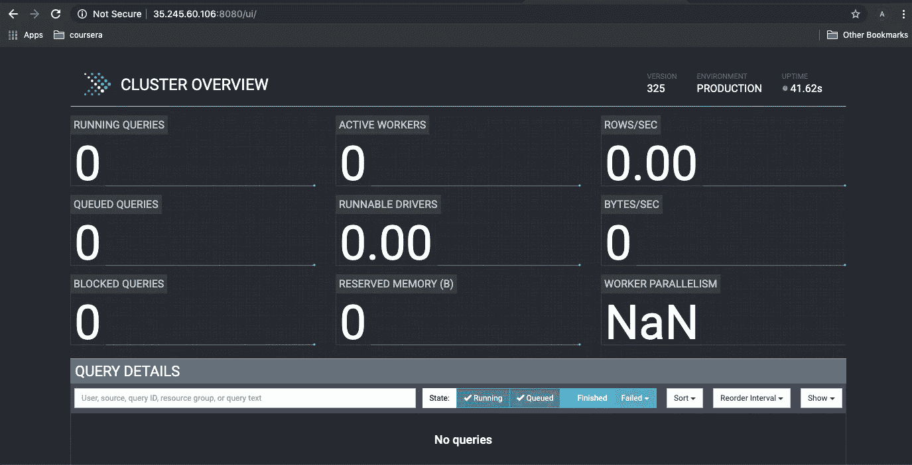
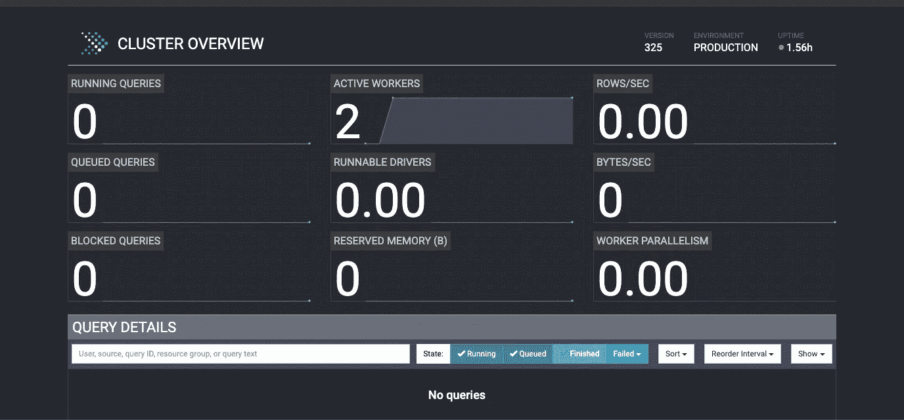
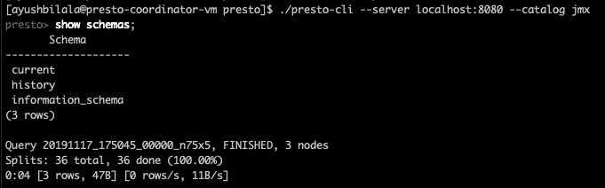
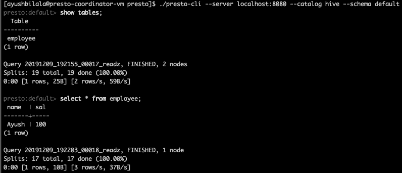

# 谷歌云平台上的 Presto

> 原文：<https://medium.com/walmartglobaltech/presto-on-google-cloud-platform-d3c2187c4880?source=collection_archive---------4----------------------->

Source: [Presto](https://github.com/prestosql/presto/blob/master/presto-docs/src/main/resources/logo/web/main/black/Presto_Logo_BlackBG-01.svg), [Google Cloud](https://cloud.google.com/press/)

Presto 无疑是发展最快的分布式 SQL 查询引擎，它使用的架构类似于经典的大规模并行处理(MPP)数据库管理系统。

Presto 可以部署在许多不同的平台和位置上。无论是在云中还是在内部，该技术都是真正的平台无关性。将 Presto 与 GCP 提供的云计算服务相结合，让您永远不会被剥夺资源，并继续从您的数据中获得有用的见解。

这篇文章讲的是在**谷歌云平台**上建立 3 节点自动化**自动伸缩** **Presto** 集群。我们将利用[谷歌计算引擎](https://cloud.google.com/compute/docs/)、[实例组](https://cloud.google.com/compute/docs/instance-groups/)和[自动缩放器](https://cloud.google.com/compute/docs/autoscaler/)。

**免责声明**:这里使用的 Presto 配置绝对不适合生产设置。您可以按照本文快速设置开发环境。

# 环境

1.  我们需要 3 台虚拟机，一台用于 Presto 协调员，两台用于 Presto 工作人员
2.  在所有的机器上设置 Presto
3.  创建一个 Presto 工人图像和模板
4.  创建预存储工人管理的实例组
5.  设置自动缩放策略
6.  验证设置

# 让我们从 3 台虚拟机开始

我们至少需要 3 台虚拟机，一台用于 Presto 协调员，两台用于 Presto 工作人员。

# 安装 Java

嗯，您需要在协调器和工作器上都安装 Java。Presto 至少需要 Java 8，尽管我建议您使用 Java 11 来获得更好的 GC。

***如何安装 Java？？互联网上有大量关于设置 Java 的文章。按照一个安装。***

# 接下来，配置 Presto 协调器

# 启动协调器

在这个时候，你已经和你的 Presto 协调器准备好了。运行 Presto 启动器脚本并检查 Presto UI，网址为[http://{ coordinator _ IP }:8080](http://{coordinator_ip}:8080)

Presto UI: [http://{coordinator_ip}:8080](http://{coordinator_ip}:8080)

# 嘿！我们是不是错过了什么？

正如您在 Presto UI 中看到的，活动的 Workers 计数是 0。我们还没有设置快速工人！！接下来让我们设置它们。

步骤 1 和 2 与协调器设置说明相同。第 3 步是使工人不同于协调者的地方。

# 然后...为工作人员创建托管实例组

此时，如果你刷新 Presto UI 网页，下面是你将看到的！

Presto UI: [http://{coordinator_ip}:8080](http://{coordinator_ip}:8080)

瞧啊。我们已经准备好了一个 Presto 集群。

# 让我们继续玩，并设置自动缩放

当对资源的需求较低时，自动缩放有助于您的应用适度处理流量的增加并降低成本。

根据下面的自动扩展策略，当有更多负载时，GCP 将向您的实例组添加多达 10 个实例(向上扩展)，当实例需求降低时，删除实例(向下扩展)。

# Presto CLI 怎么样？

您可以使用 Presto CLI 从 Presto 中查询数据。我们已经配置了 JMX 目录，因此您可以查询 JMX 指标。

Presto CLI

如果您想连接到 hive，您很可能会这样做，请继续配置一个 Hive 目录并重新启动集群。

既然配置了配置单元目录，让我们从 Presto CLI 查询配置单元数据。

Presto CLI

# CLI 不是唯一的选择！

Presto 让您可以自由地使用最适合您的 BI 工具。您可以选择自己喜欢的任何 BI 工具。它可以是超集，Tableau，Power BI，Zeppelin，Jupyter notebook，等等...

良好的..这就是了。您已经在 GCP 上为所有分析需求设置了启用自动缩放的 Presto 集群。

请继续关注关于 GCP 的神奇内幕，我正计划发布更多这样的帖子。