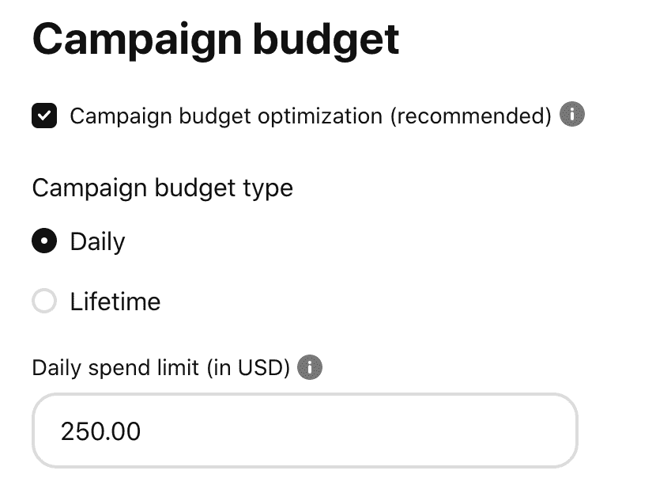
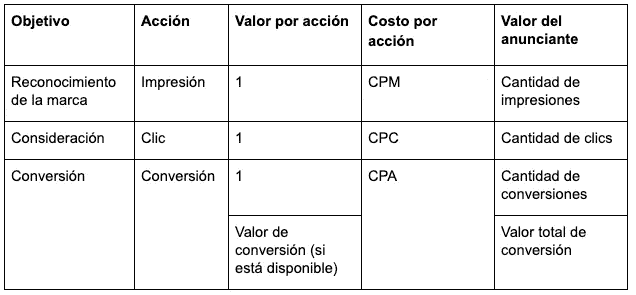
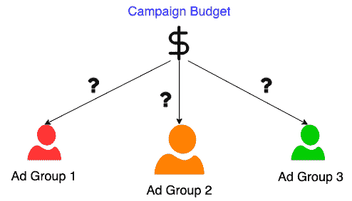
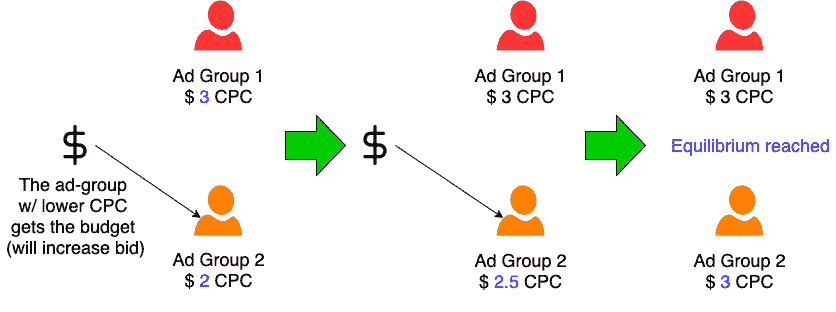
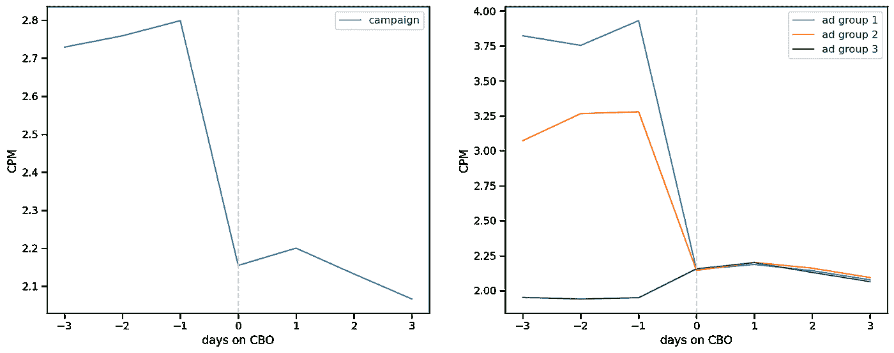
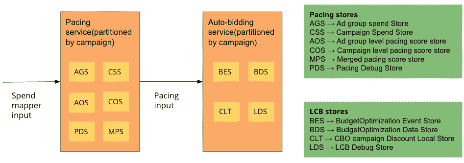
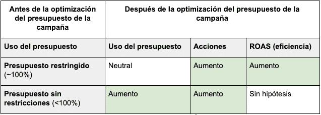
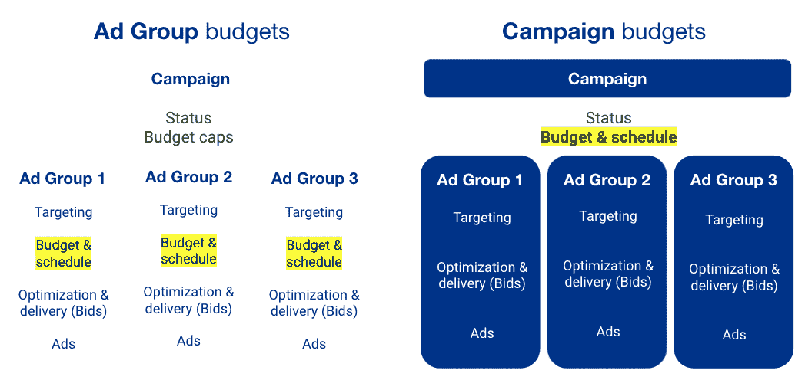
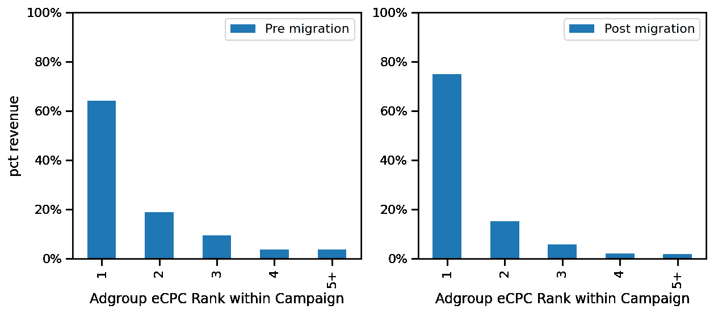

# Pinterest 竞选预算

> 原文：<https://medium.com/pinterest-engineering/presupuestos-de-campa%C3%B1a-de-pinterest-560330d54694?source=collection_archive---------6----------------------->

Kevin Jiang | 广告智能软件工程师 Keshava Subrhaya | 广告智能工程经理;and Yeming Shi | 广告智能软件工程师

*这篇文章最初发表于 英语.Read the English version* [*here*](/pinterest-engineering/campaign-budgets-at-pinterest-be94f15a4527) *(T7 )*

# 导言

Pinterest 是一个视觉发现引擎,帮助用户找到鼓舞人心的想法。广告商使用 Pinterest 在这些灵感搜索中与用户联系,他们的目标是有效地推广产品或服务。

Pinterest 的广告情报团队开发的产品可帮助广告商最大限度地发挥其广告活动的价值。作为该计划的一部分,我们最近推出了 Pinterest 广告活动预算优化产品。

广告系列预算优化是一种自动化广告产品,通过在基础广告组之间自动分配每个广告系列的广告预算,使广告客户受益。优化竞选预算的目标是:

*   **最大化广告客户价值**,例如通过生成点击或基于广告系列的转化
*   **通过允许在广告组之间共享预算,提高广告系列预算** 的使用率
*   **简化广告客户体验**并消除手动预算调整的需要

# 问题和动机的介绍

广告客户使用多个广告组创建广告系列,并分别为每个广告组设置预算金额。预算分配是一项重要任务,因为广告客户通常对每个广告组的规模和表现知之甚少,协调广告组的预算可能是一个手动和重复的过程。广告系列预算优化尝试通过将预算移动到广告系列级别并自动将预算实时分配到广告组来解决此问题。

解决广告系列预算优化的问题可以制定为有限优化问题:通过在广告组之间优化预算分配,同时使用固定总预算金额,最大限度地提高广告系列的 *广告主值* 。广告商的价值是一个概念,根据广告活动的目标而变化。显然,并非所有操作都是相同的(例如:,购买操作比添加到购物车的操作更有价值),解决方案应该提供一种表示这些差异的方法。

活动的目标各不相同,可能侧重于建立品牌知名度,鼓励用户考虑购买,或鼓励他们完成购买(或其他形式的转换)。创建品牌认可或考虑购买被认为是漏斗的顶部,而激励实际购买被认为是漏斗的底部。他们每个人都会对广告商有不同的价值观。

对于品牌识别或考虑漏斗顶部的目标,活动预算优化试图最大限度地提高由此产生的操作量,例如印象或点击的总数。对于底层转化目标,促销活动预算优化还会计算与每个转化操作关联的潜在转化值(如果可用且由广告商提供),并寻求最大化促销活动的总转化值。

# 我们的焦点

广告系列预算优化背后的总体思路是逐步将广告系列总预算中的每一美元分配给边际回报率最高的广告组。一旦我们分配了每一美元的预算,我们将达到最佳平衡状态,每个广告组的边际回报相等。

自动竞价是 Pinterest 广告的一项产品,可自动调整每个广告组的竞价,以尽可能低的每结果成本获得结果,同时充分利用预算。一般来说,增加广告组的报价会增加其支出能力,但会降低其效率和广告投资回报率(ROAS),因为由于收益下降的影响,我们会增加支出,因此预期的结果(例如点击或转化)会减少。这种效应背后的直觉是,每个广告的目标受众是有限的,随着支出的增加,吸引下一个客户的成本也会增加。

在实践中,广告系列预算优化算法通过操纵每个广告组的优惠来自动连续地将广告系列预算分配给广告组,以达到上述最佳状态,其中每个广告组的效率相同或具有相同的成本。这可以用下面的例子来说明,这是一个试图最大化点击次数的考虑活动。以下是使用自动投标的两组广告:

在广告系列预算优化算法的第一阶段,下一个增量广告系列预算金额将分配给橙色广告组(广告组 2),因为它具有较低的每次点击成本 (CPC)。为此,它增加了橙色广告组的报价,将其 CPC 提高到$ 2.50。在第二部分中,下一个增量广告系列预算金额也将分配给橙色广告组,达到两个广告组均等成本或 $3.00 CPC 的平衡后。此时,如果您增加相同数量的促销活动,则任何剩余的促销活动预算将平均分配给两个广告组。

通过调整每个广告组的报价,使所有广告组的效率和成本相等,促销活动预算优化能够优化促销活动的整体效率,如切换到促销活动预算优化之前和之后的实际品牌感知促销活动的表现所示:

从本质上讲,广告系列预算优化算法通过实时控制系统实时进行预算分配,这些系统可以设置每个广告组应该花费的时间(频率)和数量(自动竞价)。

# 基础设施

下图描述了活动预算优化基础结构的主要组件,该基础结构由使用 Apache Kafka 的多个流处理服务组成:

为了控制每个广告系列的广告组中的优惠,我们创建了新的广告系列级存储方式,以存储广告系列级别的频率和优惠值。为了以可扩展的方式开发系统,自动竞价和频率服务按广告系列进行分配,以便同一台机器可以处理同一广告系列的广告组。

# 实验

我们为每个目标创建并测试了活动预算优化产品,并进行了数月的受控 A/B 实验(阿尔法阶段),然后进行了数月的公开测试,广告客户可以选择参与活动预算优化。

从 Alpha 和 Beta 实验阶段开始,我们制定了一系列假设,并使用实验结果进行验证。一般来说,这些假设可以分为两组:对于具有预算约束的活动,在采用活动预算优化之前,预算已(几乎)全部使用;对于没有预算约束的活动。

我们制定了以下假设,并能够使用实验阶段的结果对每个目标进行验证:

# 产品实施

在每个目标的测试阶段之后,我们会将所有尚未通过广告系列预算的广告系列迁移到广告系列预算优化。这项工作涉及根据广告组设置推断广告系列的新预算值、开始日期和结束日期,以便在使用广告系列预算优化之前尽可能接近广告客户的意图。

对于迁移过程,我们还通过比较迁移前后的活动表现进行了详细的影响分析。我们观察到广告系列性能的一致变化,平均而言,假设矩阵在实验阶段得到验证。

例如,在迁移目标后,我们发现每个广告系列的广告组之间的收入分配转移到效率更高或成本更低的广告组 (CPC):

对于 Pinterest 的销售团队和广告商来说,迁移到多个活动目标非常成功,因为现在要管理、维护和调整的预算要少得多(大约一半),而且这些团队的重点可以转移到整个活动或其他目标的预算分配上。

# 工作到未来

这种广告系列预算优化产品的实施只是提高广告商在预算优化空间中的价值的第一步。展望未来,我们计划继续改进广告系列预算优化算法,探索使用交换比例来区分控制每个广告组使用的优惠;并应用广告组间频率策略来控制支出和其他方式,以进一步提高广告系列的整体效率。

如果您觉得这类工作很有趣,请写信给我们并查看我们的招聘帖子。

1Pinterest 内部数据,2021 年 3 月(考虑迁移)和 2021 年 9 月(品牌识别迁移,转换和购买)迁移前后平台预算总数(广告组或广告系列)的比较。

***有关 Pinterest 工程的更多信息,请访问我们的***[***工程博客***](https://medium.com/pinterest-engineering) ***并访问***[***Pinterest Labs***](https://www.pinterestlabs.com?utm_source=medium&utm_medium=blog-article&utm_campaign=jiang-et-al-march-9-2022&utm_content=spanish) ***。要查看可用和申请的机会,请访问我们的*** [***就业***](https://www.pinterestcareers.com/locations/mexico-city/?primary_category=Engineering&primary_city=Mexico+City&utm_source=medium&utm_medium=blog-article&utm_campaign=jiang-et-al-march-9-2022&utm_content=spanish) ***页面。(T32) (T33)***

## 致谢

我们要感谢以下多学科团队(并非详尽列表)的贡献:

Yeming Shi,Tianyuan Cui,Ruixin Qiang,Kelvin Jiang,Flavio Bossolan,Keshava Subrattan,Sungro Yoon,Yu Hao

Michael Lam,Brittany Herr,Grace Si,Randy Perez,Manuel Lara,Frannie Huang,Allan Rezende,Ravi Dharawat,Jayanth Mettu,Kate Liu,Dani Gnibus

作者 : Niket Arora, Roman Chen

作者 : Sreshta Vijayaraghavan, Shawn Nguyen, Aniket Ketkar

饰 Zeyu Wang

作者 : Sameer Bhide, Edward Zhou, Haoyu He, Shu Zhang, Alonso Garcia

亚历克斯·穆恩,Malav Shah

饰 Simeon Duong

曲名 : Huiqing Zhou

阿希姆·达塔,Daniel Karwoski

彼得·艾伦,Jay Zuniga,Janani Vijaykumar

饰 Julie Piskin

哈泽姆·尤尼斯,Rita Kamil,Dovik Nissim

凯蒂·凯特吉斯,Patrick Dillon-Hughes

作者 : Fidel Calderon, Amy Compeau, Kaitlin O'Donnell, Greg Lindley

饰 Kelly Anneken

作者 : Kimmie O'Callaghan

导演: Perrye Ogunwole Mark Otuteye

作者 : Mao Ye, Roelof van Zwol

作者 : Dan Xie, Alex Rhee, Andrei Curelea, Yiwei Sun, Jeff Wu