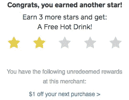
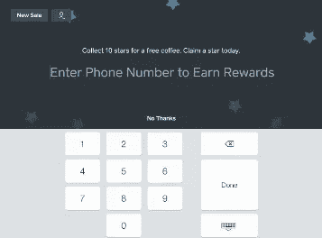
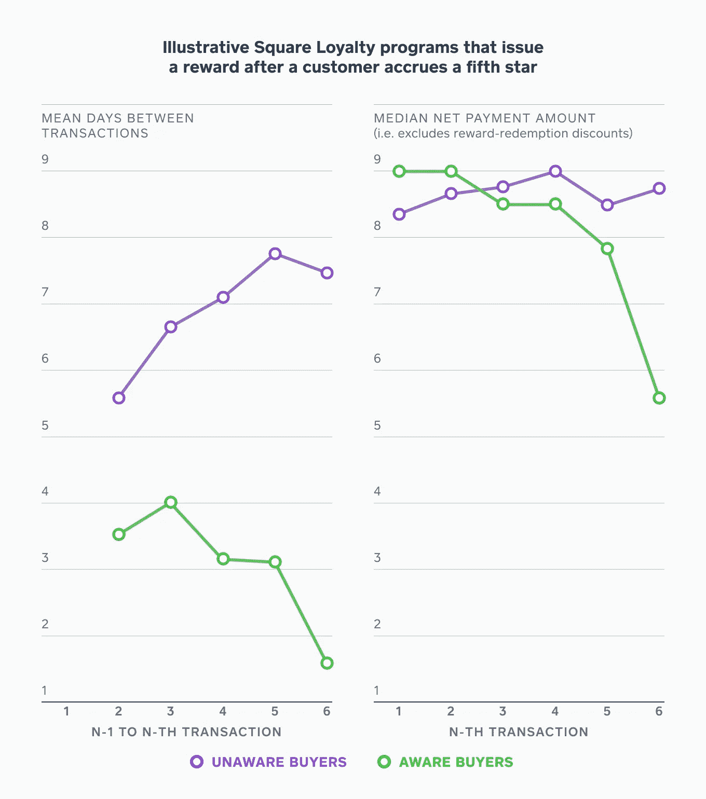
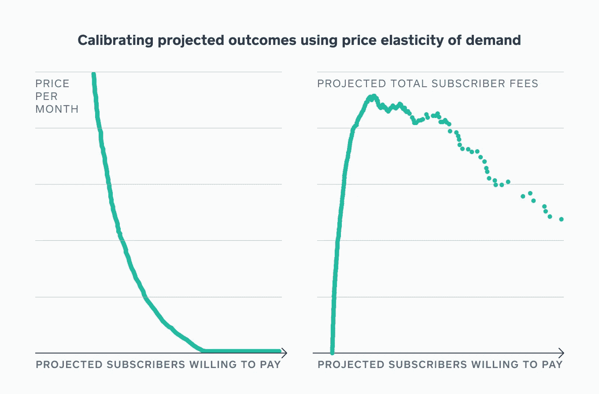

# 以数据驱动的良知为订阅产品定价

> 原文：<https://medium.com/square-corner-blog/pricing-subscription-products-with-a-data-driven-conscience-f85ae11613dc?source=collection_archive---------4----------------------->

> 注意，我们已经行动了！如果您想继续了解 Square 的最新技术内容，请访问我们的新家[https://developer.squareup.com/blog](https://developer.squareup.com/blog)

*在 Square，产品分析嵌入到全栈产品团队中，这使得我们每个人都可以成为各自产品的数据专家。我们在每个产品中的高可见性地位使我们能够利用整个分析工具包来推动决策过程:咨询、管道、分析、科学和宣传。下面是一个典型的例子:明智而最优地给产品定价。*

# 背景

第一个 [Square 忠诚度](https://squareup.com/loyalty)于 2013 年发布，它使 Square 卖家能够向客户提供数字奖励计划(如数字化打卡)。这篇文章详细介绍了我们采取的数据驱动的步骤，为我们的卖家提供价格合理、高价值的产品，帮助他们经营和发展业务。

## **产品生命周期:从免费到付费**

当推出一个产品时，我们一开始的主要目标是推动采用。考虑到这一点，我们在 2013 年推出了 Square Loyalty，它具有非常基本的功能(也称为*最低可行产品*或 *MVP* ),卖家无需支付任何费用，以鼓励所有人尝试它。我们跟踪了 Square 忠诚度的衡量标准，包括有多少卖家在使用它(收购)、使用频率(参与度)和持续时间(保留度)，以及他们从中获得了多少价值(产品与市场的契合度)。

随着我们不断提高 Square 忠诚度，我们看到我们的卖家通过使用它在自己的业务中获得了更多价值，从而提高了卖家的参与度和忠诚度。我们知道我们有一个可靠的产品，它将受益于更多的资源(例如，工程和产品管理时间)来推动我们的销售人员的重大改进。

例如，通过研究我们记录的数据和听取顾客的反馈，我们惊讶地发现，Square 忠诚度系统过于自动化，因此在结账过程中很容易被忽略。它被建在收据的底部，但可能如此顺利，以至于买家没有意识到他们有奖励可以争取和兑现。我们欠我们的卖家一个更智能、更有用的工具到他们的销售点。为此，我们加倍努力，重新构想产品体验。

Loyalty v1: At the bottom of a digital receipt

Loyalty v2: Enroll at the Point of Sale

结果是 2016 年 6 月 Square Loyalty 重新上线。奖励计划与收据脱钩，提高了买家的意识。此外，切换到一个纯粹的基于短信的系统允许更无缝的体验(提供您的电话号码，而不是查找您的优惠券代码)。通过电子邮件收集工具跟踪短信通知，确保现有卖家可以继续取消匿名、识别、吸引和奖励他们的顶级客户。

在这一点上，我们也知道对该产品收费可以帮助我们创造收入，以支持构建产品功能和处理卖家反馈的工作。为什么？如果对产品收费意味着增加营销、产品改进的资源，最重要的是，优先考虑和处理客户反馈，那么它会增加对产品的总体满意度。但是，为了确保我们的销售人员获得最高的投资回报，该产品的最佳价格是多少呢？

# **确定价格:利用 Square 的独特数据**

在 Square，我们的卖家工具套件为我们提供了对支付归属数据的“T2”闭环的独特访问:Square 卖家的每笔交易都通过我们的信用卡读卡器或支付 API，这使我们能够以非常精确的方式确定 Square 忠诚度数字奖励计划(以及我们的 Square 卖家开展的其他营销活动)的有效性。我们可以确定有多少购买者因为忠诚计划而再次光顾一家企业，以及那些无论如何都会再次光顾的人。有了我们的*闭环*，代理少了，猜测少了，知道多了。

## **方法和结果**

在确定收费多少之前，我们首先必须评估和衡量卖家从 Square 忠诚度等数字奖励计划中获得的*增量*价值。对所有事情的通常回答——运行 A/B 测试——是不可行的，因为它会干扰我们卖家的业务，并可能造成混乱。相反，我们发挥了创造力，定义了一个自然实验，将知道并兑现其 Square 忠诚度奖励的买家与不知道并没有兑现其奖励的买家进行比较。

我们将**意识**定义为:

*   如果买家在任何时候从某个特定卖家处兑换了奖励，或者代表该卖家打开了通过 Square 发送的奖励通知或欢迎电子邮件，我们可以假设买家**知道**Square 忠诚度是如何运作的。
*   如果一个买家从一个特定的卖家那里获得了奖励，后来又回来了，但是没有兑现他们的奖励，我们可以假设这个买家**不知道**Square 忠诚度是如何运作的。

有了这种区分，它只是对两个买家群体的度量标准的测量。“意识到”并加入 Square 忠诚度系统的买家返回的次数至少是“不知道”的两倍。虽然由于奖励-赎回折扣，支付金额有所下降，但购买者经常回来两次的前者效果要大得多。甚至在对产品进行重大改进之前，我们就可以看到这已经是一个值得购买的销售工具了。

Aware buyers returned more frequently and paid less only when redeeming their reward.

另一个关键假设是决定两个买家群体之间的增量提升是否可以推广到所有买家、所有注册 Square 忠诚度的买家或所有获得奖励并返回的买家。因为我们知道答案介于两者之间，所以我们简单地尝试了所有这些方法，并考虑了最好和最坏的情况。但是现在先把这个放在一边，我们已经用我们的*闭环*和机会主义运营直觉证明了 Square 忠诚度给我们的卖家带来的增值。

## 定价优化

既然我们已经确定我们的卖家从 Square 忠诚度系统中获得了很多，下一个问题就是收取多少费用。我们使用我们的*闭环*来生成对我们潜在价格的‘多世界’解读，模拟零售环境。由于我们知道卖家从我们的产品中获得的价值，我们可以假设这是他们的边际支付意愿，减去对毛利润和感知差异的假设。然后，我们可以为卖方构建一条价格弹性曲线，显示价格上涨如何导致订户减少。这使我们能够根据我们预期的收费来调整价格。

Square 的收入最大化价格不是正确的答案，因为这是从保留的价格弹性中得出的，它假设卖方可以像我们一样感受到价值，并且实际上尝试产品的时间足够长。如果一开始就吓得每个人都不敢注册，那么即使产品值那么多钱，收取高价也不是个好主意。然而，这是一个有用的练习，说明了我们在作出定价这样重要和敏感的决定时可用的上限和权衡。

# 结论

定价测试于 2016 年 4 月开始，到时代广场忠诚度计划于 6 月重新启动时，我们已准备好做出最终定价决定。结果是非常积极的:Square 忠诚度系统是我们见过的流失率最低的系统之一，我们对卖家从产品中获得的价值的监测(再次通过我们的*闭环*)显示，价值自推出以来一直在单调增加，我们的 Square 忠诚度系统用户获得了巨大的投资回报。

我们说完了吗？从来没有。定价永远不应该被认为是一个已经解决的问题。我们的目标始终是给每一个卖家一个公平的价格，与价值相当，但仍然容易解释，对所有人透明。同时，我们支持我们产品的已证明价值，并继续以惊人的节奏进行改进。我们只是挖掘了广场忠诚的表面，我们希望你能加入我们的旅程。