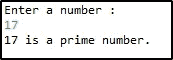
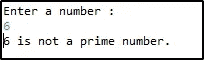
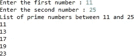
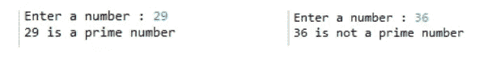
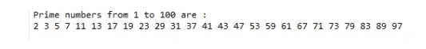

# Java 中的质数程序

> 原文：<https://medium.com/edureka/prime-number-program-in-java-14fcba07dc9d?source=collection_archive---------0----------------------->


质数是大于 1 的自然数，只能被 1 和它本身整除。例如，2，3，5，7，11…是质数，因为它们既不能被除，也不是乘法的结果。素数方面的程序是大一新生最常被问到的 Java 面试问题之一。在这篇文章中，我收集了一些重要的素数程序

让我们从第一个节目开始。

*   检查给定数字是否为质数的程序
*   程序找出两个给定数字之间的所有质数
*   使用递归检查给定数字是否为质数的程序
*   使用标志变量检查数字是否是质数的程序
*   打印 1 到 100 之间的质数的程序

# 程序检查给定的数是否是质数？

在这个 java 程序中，我会取一个数字变量，检查这个数字是否是质数。

*   isPrime(int n)方法用于检查传递给它的参数是否是素数。如果传递的参数是质数，则返回 True，否则返回 False。
*   如果数字小于 1，if(inputNumber <= 1) it returns false.
*   If the number is not less than or equal to 1, performs division operation.
*   If the remainder is zero, it returns false, meaning it is not a prime number.
*   If it is a non-zero number, it returns true, resulting in a prime number.

```
**package** prime;
**import** java.util.Scanner;
**public** **class** PrimeNumberProgram
{
**static** **boolean** checkForPrime(**int** inputNumber)
{
**boolean** isItPrime = **true**;
**if**(inputNumber <= 1)
{
isItPrime = **false**;
**return** isItPrime;
}
**else** {
**for** (**int** i = 2; i<= inputNumber/2; i++)
{
**if** ((inputNumber % i) == 0)
{
isItPrime = **false**;
**break**;
}
}
**return** isItPrime;
}
}
**public** **static** **void** main(String[] args)
{
Scanner sc = **new** Scanner(System.in);
System.out.println("Enter a number :");
**int** inputNumber = sc.nextInt();
**boolean** isItPrime = checkForPrime(inputNumber);
**if** (isItPrime)
{
System.out.println(inputNumber+" is a prime number.");
}
**else** {
System.out.println(inputNumber+" is not a prime number.");
}
sc.close();
}
}
```

*注:0 和 1 不是质数。*

这个程序的输出是:



让我们转到下一个程序，用 Java 来检查质数程序。

# 找出两个给定数之间所有质数的程序

为了找出两个自然数之间的质数，

*   检查数字是否是自然数。
*   使用 IsPrime 方法检查数字是否是质数。
*   指定起始编号和结束编号。
*   For 循环打印质数。
*   您可以对一系列数字执行此操作，只需指定范围(开始和结束)。

```
**import** java.util.Scanner;
**public** **class** PrimeNumberProgram
{
**static** **boolean** checkForPrime(**int** inputNumber)
{
**boolean** isItPrime = **true**;
**if**(inputNumber<= 1)
{
isItPrime = **false**;
**return** isItPrime;
}
**else** {
**for** (**int** i = 2; i= inputNumber/2; i++){
**if** ((inputNumber % i) == 0){
IsItPrime = **false**;
**break**;
}
}
**return** isItPrime;
}
}
**public** **static** **void** main(String[] args)
{
Scanner sc = **new** Scanner(System.in);
System.out.println("Enter the start value :");
**int** start = sc.nextInt();
System.out.println("Enter the end value :");
**int** end = sc.nextInt();
System.out.println("Prime numbers between "+start+" and "+end+" : ");
**for** (**int** i = start; i <= end; i++)
{
**if**(checkForPrime(i))
{
System.out.println(i);
}
}
sc.close();
}
}
```

输出:



让我们进入下一个程序，检查 Java 中的质数程序。

# 使用递归检查数字是否是质数的程序

*   在这种情况下，让我们使用递归来打印素数。
*   Scanner 类是存在于 java 中的一个类。util 包，允许用户读取各种类型的值。
*   首先使用 if 条件检查数字是否是自然数，如果(n <= 1)，返回 false 并打印出该数字不是质数。
*   检查另一个条件，就是除法，检查余数是否为 0。如果余数是 0，那么它就不是素数。

```
**package** prime;
**import** java.util.Scanner;
**import** java.util.Scanner;
**public** **class** Recursion {
**public** **static** **void** main(String[] args) {
Scanner s = **new** Scanner(System.in);
System.out.print("Enter a number : ");
**int** n = s.nextInt();
**if** (isPrime(n)) {
System.out.println(n + " is a prime number");
} **else** {
System.out.println(n + " is not a prime number");
}
}
**public** **static** **boolean** isPrime(**int** n) {
**if** (n<= 1) {
**return** **false**;
}
**for** (**int** i = 2; i< n; i++) {
**if** (n % i == 0) {
**return** **false**;
}
}
**return** **true**;
}
}
```

输出:



# 使用标志变量检查数字是否是质数的程序

*   这个程序使用一个标志变量来帮助打印质数。
*   标志变量在编程中用作信号，让用户/程序知道某个条件已经满足。
*   创建一个静态方法 check prime(int n ),并添加验证该数字是否为素数的条件。
*   通过传递参数(整数)在主类中调用这个函数。
*   打印质数。

```
**package** prime;
**public** **class** Program{
**static** **void** checkPrime(**int** n){
**int** i,m=0,flag=0;
m=n/2;
**if**(n==0||n==1){
System.out.println(n+" is not prime number");
}**else**{
**for**(i=2;i<=m;i++){
**if**(n%i==0){
System.out.println(n+" is not prime number");
flag=1;
**break**;
}
}
**if**(flag==0) { System.out.println(n+" is prime number"); }
}//end of else
}
**public** **static** **void** main(String args[]){
checkPrime(1);
checkPrime(3);
checkPrime(17);
checkPrime(20);
}
}
```

让我们来看看 Java 中关于质数程序的最后一个问题。

# 显示从 1 到 100 的质数的程序

*   在这种情况下，使用*计数器*，它经常需要从数据库或文本文件中了解某个东西的频率。
*   声明一个空字符串，字符串质数= " "；
*   使用 for 循环直接指定实际数字。for(num = I；数量> = 1；num-)并检查这个范围内的质数。
*   如果给定的数字能被输入的数字整除，它就增加计数器的值。|
*   如果计数器值为 2，则以字符串形式追加质数。

```
**package** prime;**public** **class** OneToN {
**public** **static** **void** main (String[] args)
{
**int** i =0;
**int** num =0;
//Empty String
String primeNumbers = "";
**for** (i = 1; i <= 100; i++) { **int** counter=0; **for**(num =i; num>=1; num--)
{
**if**(i%num==0)
{
counter = counter + 1;
}
}
**if** (counter ==2)
{
//Appended the Prime number to the String
primeNumbers = primeNumbers + i + " ";
}
}
System.out.println("Prime numbers from 1 to 100 are :");
System.out.println(primeNumbers);
}
}
```

输出:



这就把我们带到了本文的结尾，在这里我们学习了 Java 中素数程序的常见问题。希望你清楚本教程中与你分享的所有内容。

***一定要尽可能多的练习，还原自己的体验。***

这就把我们带到了高级 Java 教程博客的结尾。我希望你发现这个博客信息丰富，增加了你的知识价值。如果你想查看更多关于人工智能、DevOps、道德黑客等市场最热门技术的文章，你可以参考 Edureka 的官方网站。

请留意本系列中的其他文章，它们将解释 Java 的各个方面。

> *1。* [*面向对象编程*](/edureka/object-oriented-programming-b29cfd50eca0)
> 
> *2。*[*Java 中的继承*](/edureka/inheritance-in-java-f638d3ed559e)
> 
> *3。*[*Java 中的多态性*](/edureka/polymorphism-in-java-9559e3641b9b)
> 
> *4。*[*Java 中的抽象*](/edureka/java-abstraction-d2d790c09037)
> 
> *5。* [*Java 字符串*](/edureka/java-string-68e5d0ca331f)
> 
> *6。* [*Java 数组*](/edureka/java-array-tutorial-50299ef85e5)
> 
> *7。* [*Java 集合*](/edureka/java-collections-6d50b013aef8)
> 
> *8。* [*Java 线程*](/edureka/java-thread-bfb08e4eb691)
> 
> *9。*[*Java servlet 简介*](/edureka/java-servlets-62f583d69c7e)
> 
> 10。 [*Servlet 和 JSP 教程*](/edureka/servlet-and-jsp-tutorial-ef2e2ab9ee2a)
> 
> 11。[*Java 中的异常处理*](/edureka/java-exception-handling-7bd07435508c)
> 
> *12。* [*Java 教程*](/edureka/java-tutorial-bbdd28a2acd7)
> 
> *13。* [*Java 面试题*](/edureka/java-interview-questions-1d59b9c53973)
> 
> 14。 [*Java 程序*](/edureka/java-programs-1e3220df2e76)
> 
> 15。 [*科特林 vs Java*](/edureka/kotlin-vs-java-4f8653f38c04)
> 
> 16 岁。 [*依赖注入使用 Spring Boot*](/edureka/what-is-dependency-injection-5006b53af782)
> 
> *17。* [*堪比 Java 中的*](/edureka/comparable-in-java-e9cfa7be7ff7)
> 
> *18。* [*十大 Java 框架*](/edureka/java-frameworks-5d52f3211f39)
> 
> *19。* [*Java 反射 API*](/edureka/java-reflection-api-d38f3f5513fc)
> 
> *20。*[*Java 中的 30 大模式*](/edureka/pattern-programs-in-java-f33186c711c8)
> 
> *21。* [*核心 Java 备忘单*](/edureka/java-cheat-sheet-3ad4d174012c)
> 
> *22。*[*Java 中的套接字编程*](/edureka/socket-programming-in-java-f09b82facd0)
> 
> *23。* [*Java OOP 备忘单*](/edureka/java-oop-cheat-sheet-9c6ebb5e1175)
> 
> *24。*[*Java 中的注释*](/edureka/annotations-in-java-9847d531d2bb)
> 
> *25。*[*Java 中的库管理系统项目*](/edureka/library-management-system-project-in-java-b003acba7f17)
> 
> *26。*[*Java 中的树*](/edureka/java-binary-tree-caede8dfada5)
> 
> *27。*[*Java 中的机器学习*](/edureka/machine-learning-in-java-db872998f368)
> 
> *28。* [*顶层数据结构&Java 中的算法*](/edureka/data-structures-algorithms-in-java-d27e915db1c5)
> 
> *29。* [*Java 开发者技能*](/edureka/java-developer-skills-83983e3d3b92)
> 
> 三十岁。 [*前 55 名 Servlet 面试问题*](/edureka/servlet-interview-questions-266b8fbb4b2d)
> 
> *31。*[](/edureka/java-exception-handling-7bd07435508c)*[*顶级 Java 项目*](/edureka/java-projects-db51097281e3)*
> 
> *32。 [*Java 字符串备忘单*](/edureka/java-string-cheat-sheet-9a91a6b46540)*
> 
> *33。[*Java 中的嵌套类*](/edureka/nested-classes-java-f1987805e7e3)*
> 
> **34。* [*Java 集合面试问答*](/edureka/java-collections-interview-questions-162c5d7ef078)*
> 
> **35。*[*Java 中如何处理死锁？*](/edureka/deadlock-in-java-5d1e4f0338d5)*
> 
> **36。* [*你需要知道的 50 个 Java 合集面试问题*](/edureka/java-collections-interview-questions-6d20f552773e)*
> 
> *37。[*Java 中的字符串池是什么概念？*](/edureka/java-string-pool-5b5b3b327bdf)*
> 
> *38。[*C、C++和 Java 有什么区别？*](/edureka/difference-between-c-cpp-and-java-625c4e91fb95)*
> 
> **39。*[*Java 中的回文——如何检查一个数字或字符串？*](/edureka/palindrome-in-java-5d116eb8755a)*
> 
> **四十。* [*你需要知道的顶级 MVC 面试问答*](/edureka/mvc-interview-questions-cd568f6d7c2e)*
> 
> **41。*[*Java 编程语言的十大应用*](/edureka/applications-of-java-11e64f9588b0)*
> 
> **42。*[*Java 中的死锁*](/edureka/deadlock-in-java-5d1e4f0338d5)*
> 
> **43。*[*Java 中的平方和平方根*](/edureka/java-sqrt-method-59354a700571)*
> 
> **44。*[*Java 中的类型转换*](/edureka/type-casting-in-java-ac4cd7e0bbe1)*
> 
> **45。*[*Java 中的运算符及其类型*](/edureka/operators-in-java-fd05a7445c0a)*
> 
> **46。*[*Java 中的析构函数*](/edureka/destructor-in-java-21cc46ed48fc)*
> 
> *47。[*Java 中的二分搜索法*](/edureka/binary-search-in-java-cf40e927a8d3)*
> 
> **48。*[*Java 中的 MVC 架构*](/edureka/mvc-architecture-in-java-a85952ae2684)*
> 
> *49。 [*冬眠面试问答*](/edureka/hibernate-interview-questions-78b45ec5cce8)*

**原载于 2019 年 6 月 13 日*[*https://www.edureka.co*](https://www.edureka.co/blog/prime-number-program-in-java/)*。**