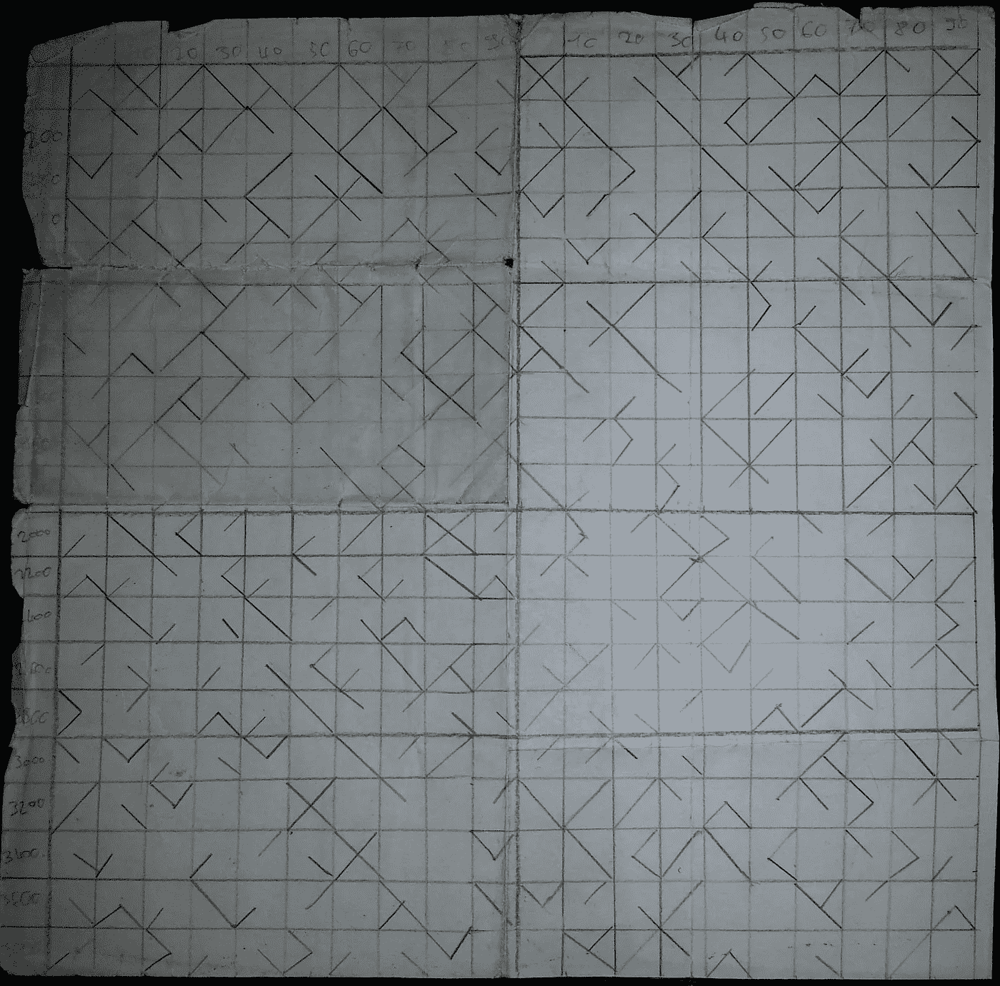
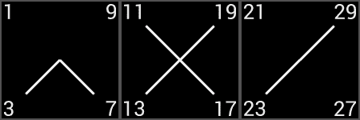
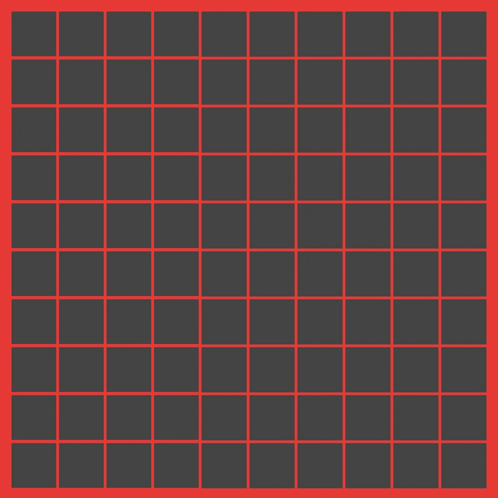
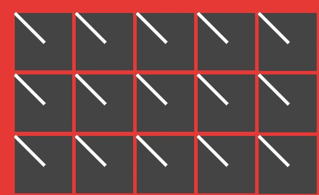
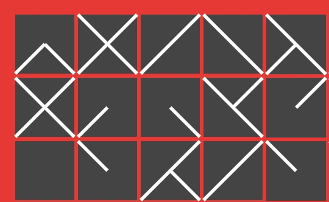
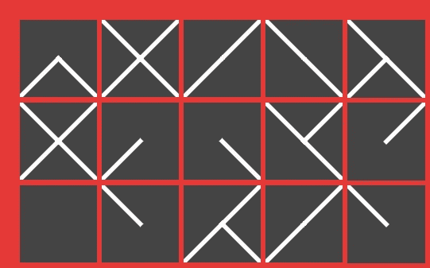

# Jetpack 编写中的主表生成器

> 原文：<https://medium.com/google-developer-experts/prime-table-generator-in-jetpack-compose-21a87c1b78c0?source=collection_archive---------7----------------------->

*最初发表于*[](https://zsmb.co/prime-table-generator-jetpack-compose/)**。**

*距离我写这个素数表生成器的原始版本已经过去 6 年多了。那是在我编程生涯的最开始，在大学第一学期学习了 C 和 SDL 之后。这个原始项目的存档版本[在这里](https://zsmbprogsite.netlify.app/projects/primetable/)可以找到，包括源代码、 [120 行优秀的 C 代码](https://zsmbprogsite.netlify.app/projects/primetable/primetable.c)。*

# ***前提***

*从上面链接的文章中简单概括一下:这个项目的重点是创建一个视觉上令人愉快和简洁的质数表示。最初的纸质版本包含 4000 以内的质数，看起来像这样:*

**

*它是如何工作的？每个方块代表一组十个数字。因为素数(大于 2)可能只以数字 1、3、7 或 9 结尾，所以正方形的每个角可以指示给定结尾数字在 10 数字宽的块内是否是素数。*

**

*例如，表中的第三个块对应于数字 21-30，两个相连的角表示只有 23 和 29 是这个范围内的素数。*

*现在，让我们开始为 Android 编写代码！*

**你可以在 GitHub* *上找到已完成项目* [*的代码。*](https://github.com/zsmb13/PrimeTableGenerator)*

# ***创建网格***

*在之前的 Jetpack Compose 文章中，我们用自底向上的方法创建了一个动画时钟。这一次，我们将自顶向下进行设计，并从在 Compose 中渲染网格开始。为此，我们将使用实验性的`[LazyVerticalGrid](https://developer.android.com/jetpack/compose/lists#grids)`API。*

```
*@OptIn(ExperimentalFoundationApi::class)
@Composable
fun Primes() {
    LazyVerticalGrid(
        modifier = Modifier // 1
            .fillMaxSize()
            .background(Color(0xFFE53935))
            .padding(8.dp),
        cells = GridCells.Fixed(10), // 2
    ) {
        items(count = 100) { // 3
            Box( 
                Modifier // 4
                    .aspectRatio(1f)
                    .padding(1.dp)
                    .background(Color.DarkGray)
            )
        }
    }
}*
```

*分解上面的代码:*

*1.`LazyVerticalGrid` composable 填充了整个屏幕，有一个红色背景和一点点填充。*

*2.它显示一个固定列数的网格。*

*3.该网格包含 100 个项目。*

*4.一开始，每件物品都是一个简单的`Box`,被限定为一个正方形，有一点填充，有一个深色的背景色。*

**注意我们如何选择使用带有* `*@OptIn*` *注释的实验 API，这也需要一些额外的项目级配置来启用它。你可以在 Kotlin* *中的* [*掌握 API 可见性中了解更多关于这个语言特性的内容。*](https://zsmb.co/mastering-api-visibility-in-kotlin/#opt-in-apis)*

*运行上面的代码会呈现(可滚动的)正方形网格:*

**

# ***一个单一的正方形***

*让我们稍微重构一下，为网格的每一项创建一个`PrimeSquare` composable。这将接收它应该呈现素数的当前偏移量。*

```
*@OptIn(ExperimentalFoundationApi::class)
@Composable
fun Primes() {
    LazyVerticalGrid(...) {
        items(count = 100) { index ->
            PrimeSquare(offset = index * 10)
        }
    }
}@Composable
fun PrimeSquare(offset: Int) {
    Box(
        Modifier
            .aspectRatio(1f)
            .padding(1.dp)
            .background(Color.DarkGray)
    ) {
        CornerLine()
    }
}*
```

*对于单个`PrimeSquare`的内容，我们将只渲染从左上角到中心的一行，使用我们自己的`CornerLine` composable。我们可以使用`Canvas` API 在 Compose 中实现这一点:*

```
*@Composable
fun CornerLine() {
    Canvas(Modifier.fillMaxSize()) {
        drawLine(
            color = Color.White,
            start = Offset.Zero,
            end = Offset(size.width / 2, size.height / 2),
            strokeWidth = 2.dp.toPx(),
        )
    }
}*
```

*这给了我们下面的样子——一个好的开始！*

**

# ***旋转和堆叠方块***

*为了让这条线进入正确的角落，我们可以在画布上画画的同时旋转画布。一个简单的`rotate`函数调用为我们解决了这个问题。我们将旋转量作为参数传递给`CornerLine`。*

```
*@Composable
fun CornerLine(degrees: Float) {
    Canvas(Modifier.fillMaxSize()) {
        rotate(degrees) {
            drawLine(
                color = Color.White,
                start = Offset.Zero,
                end = Offset(size.width / 2, size.height / 2),
                strokeWidth = 2.dp.toPx(),
            )
        }
    }
}*
```

*为了使事情变得非常简单，我们将为每个角创建一个命名的可组合对象，并进行适当的旋转:*

```
*@Composable fun One() = CornerLine(degrees = 0f)
@Composable fun Three() = CornerLine(degrees = -90f)
@Composable fun Seven() = CornerLine(degrees = -180f)
@Composable fun Nine() = CornerLine(degrees = -270f)*
```

*我们必须知道哪个数是质数，为此我们将使用一个非常基本的实现。*

```
*fun Int.isPrime(): Boolean {
    if (this < 2) return false
    return (2 until this).none { this % it == 0 }
}*
```

*有没有一个更短的实现，至少和检查素数一样正确？ [*朝我推特吧！*](https://twitter.com/zsmb13)*

*现在我们可以检查一个数是否是质数，并且可以在每个角上画线，我们可以简单地实现`PrimeSquare`:*

```
*@Composable
fun PrimeSquare(offset: Int) {
    Box(
        Modifier
            .aspectRatio(1f)
            .padding(1.dp)
            .background(Color.DarkGray)
    ) {
        if ((offset + 1).isPrime()) One()
        if ((offset + 3).isPrime()) Three()
        if ((offset + 7).isPrime()) Seven()
        if ((offset + 9).isPrime()) Nine()
    }
}*
```

*当然，我们在这里堆叠画布的方式并不完全是最佳的，但是它很好地展示了一个`Box`如何作为一个容器工作。如果我们把质数计算移得更低一级，我们可以在一张画布上画出所有的线以获得更好的性能——试着把这作为练习。*

*尽管如此，我们的非最佳实现工作得很好:*

**

# ***最后的润色***

*在我们的渲染中有两个问题，如果你仔细看上面的图像，你会发现。*

*   *所画线条的端点超出了灰色方框。*
*   *中间相交的线没有像预期的那样相交。*

*对于第一个问题，我们可以使`PrimeSquare`中的`Box`可组合*剪辑*到其边界:*

```
*Box(
    Modifier
        .aspectRatio(1f)
        .padding(1.dp)
        .background(Color.DarkGray)
        .clipToBounds()
) { ... }*
```

*为了让线条在中间重叠得更多，我们可以把它们画得稍微长一点— `2f`似乎就是这么做的:*

```
*end = Offset(size.width / 2 + 2f, size.height / 2 + 2f),*
```

*再次运行应用程序会给出我们的最终结果。*

**

# ***结论***

*同样，这个项目的完整源代码可以在 GitHub 的[上找到。](https://github.com/zsmb13/PrimeTableGenerator)*

*如果您正在寻找更多类似的撰写内容，请查看以下文章:*

*   *[使用 Jetpack Compose 构建 Android 聊天应用](https://proandroiddev.com/android-chat-app-jetpack-compose-dec472140ff1)*
*   *[构成时钟](https://zsmb.co/compose-o-clock/)*
*   *[Jetpack 撰写:第一印象和学习资源](https://blog.kotlin-academy.com/jetpack-compose-first-impressions-and-learning-resources-4101bff9f04)*