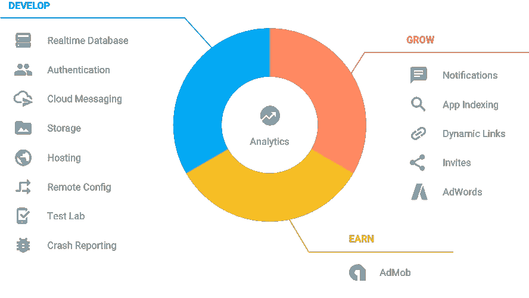

# “新”Firebase 的第一印象

> 原文：<https://medium.com/google-developer-experts/primeira-impress%C3%A3o-do-novo-firebase-afaeaeaa1395?source=collection_archive---------1----------------------->

Todos os serviços oferecidos pelo Firebase. fonte : firebase.google.com

5 月 18 日,我有机会第一次参加 Google IO,到目前为止,我一直在尝试处理我在加利福尼亚州山景城的 Shoreline Amphiteather 的 7000 宇宙活动中遇到的所有信息和有趣的开发人员的新接触。

由于它无法逃避规则,因此在活动期间宣布了几项新功能,从名为**Google Home**的新家居助手到 Allo 和 Duo 等新应用程序,这些应用程序将“机器学习”作为其承诺的卓越体验的关键组成部分。
如果您还没有机会观看[主题演讲](https://www.youtube.com/watch?v=862r3XS2YB0),我建议您暂停约 2 小时观看。

在 IO 期间宣布的所有主题中,我发现最受关注和最有趣的主题之一是新 Firebase 的发布。

对于那些不了解 Firebase 的人来说,简单地说,它是一项服务,它提供我们所需的工具和基础设施,使我们能够从第一天开始开发、测试和发布高质量、可扩展的应用程序。

为了更好地理解这个定义,我将介绍我发现有趣的 4 个 Firebase 服务。

# 实时数据库(T6)

要谈论实时数据库,我们必须先退后一步,了解我们在没有 Firebase 的情况下是如何做事的。当我们有构建应用程序的想法并且需要将数据保留在某个地方时,我们的第一个本能就是想出一个框架,在框架上开发一个 REST API,定义数据的结构方式以及要使用的数据库类型(SQL,MongoDB 等)。所有这一切都非常有趣和美丽,直到我们必须实现更多的功能,这些功能可能需要在用户的所有设备上同步数据,并且我们发现自己处于不得不在 Android 和其他平台上编写大量代码的情况,以便做一些非常简单的事情。

实时数据库只是一个云数据库,其中使用 Javascript 对象表示法(JSON)保存数据,并且随着数据的变化,所有 Web 客户端应用程序(T8)、Android 应用程序(T9)和 iOS 应用程序(T11)都会立即更新,我们唯一要做的就是填充和构建我们想要保存数据的方式。

# **认证(T13 )**

回到上一个创建新应用程序的例子,在某些时候,我们需要开始允许用户根据自己的喜好定制应用程序,为此,我们需要实施身份验证系统,以便每个用户只能访问他们授权的数据。

这是另一个问题,首先让我们怀疑实现根认证系统*与使用社交网络集成之间的区别,例如在用户决定对所有这些帐户进行“*合并”*的情况下进行适当的管理。
Firebase 身份验证服务提供的 API 允许您与 Google+、Twitter、Facebook、Github 或电子邮件/密码组合进行集成,而无需担心每种机制的具体细节,因为当您独立于提供商注册新用户时,Firebase 会创建一个包含唯一 ID 的 FirebaseUser,该 ID 可用于将其存储在与其他用户数据关联的实时数据库中。*

# **存储(T6)**

为了补充实时数据库的功能,帮助我们以结构化的方式存储和同步数据,Firebase 提供了存储文件(照片,音乐等)所需的位置和机制。

如果我们以用户决定将照片添加到其个人资料的用例为例,您可以从 firebase 的 API 上传图像,获取链接并将其保存到实时数据库以及您的个人资料中的其他数据。
这些 API 更深入地解决了处理文件上传和下载的常见问题,例如连接性差,并在任何类型的故障后自动恢复操作。

# 云消息传递和分析(T13)

在 Firebase 中,我很高兴能在同一个平台上使用这两个组件,以便分析用户行为并轻松、适当地发送通知。

整个过程始于 Firebase 分析,通过添加应用程序依赖性,您可以读取有关用户如何使用应用程序的基本信息,并且只需几行代码,我们就可以跟踪事件、屏幕和其他类型的指标,这些指标可能因项目而异。
通过获取有关用户如何使用应用程序的信息,Cloud Messaging 开始提供简单通知用户的机制。
Firebase Cloud Messaging 通常是 Google Cloud Messaging 的改进版本,它使我们能够根据开发团队的需求和创造力,轻松设置一些参数,例如我们想要的用户细分(基于分析),通知的重复性以及许多其他参数。

虽然我只提到了 Firebase 提供的 4 项服务,我一直在研究并发现它很有趣,但 Firebase 还有更多,我认为它来到了留下来并改变传统的方式,因为我们一直在寻找特定产品的传统后端开发。

通过这篇第一篇文章,我将按照以下顺序开始 Firebase 和 Android 系列:

**实时数据库第 1 部分 简介**

(T2)2。实时数据库第 2 部分 - 与 Android 应用程序互连

(T4)3。身份验证 : Firebase + Google Sign in Android

(T6) 4。实时数据库第 3 部分:安全规则(T7)

# 【篇八:感谢您的阅读】(T9 )

我是来自莫桑比克的 Android GDE 开发者 Dario Mungoi,也是 [Moovi](https://medium.com/u/1996687cc9e?source=post_page-----afaeaeaa1395--------------------------------) 的联合创始人。
我写每个星期二和星期五,如果你有任何疑问,建议,问题不要犹豫,留下评论,我会很乐意进行对话。