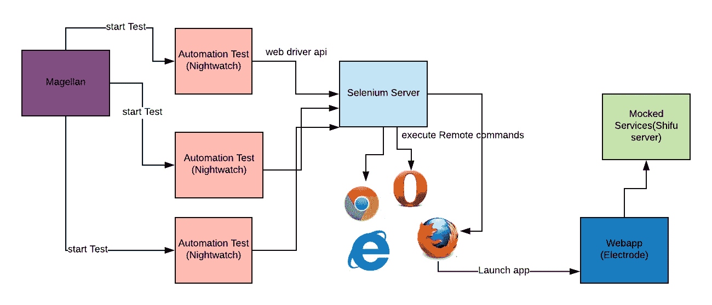

# 前端自动化入门

> 原文：<https://medium.com/walmartglobaltech/primer-on-front-end-automation-a9eee2c6bc1?source=collection_archive---------1----------------------->


Courtesy Pixabay: [https://pixabay.com/en/cog-wheels-gear-wheel-machine-2125169/](https://pixabay.com/en/cog-wheels-gear-wheel-machine-2125169/)

自动化测试是一项专门的工作，由熟悉相关框架的 QE 工程师来完成。在我的团队中，今年我们有一个雄心勃勃的目标，让开发人员编写这些自动化测试作为开发过程的一部分，从而使测试覆盖率(单元和自动化)成为代码质量的一个度量。

作为沃尔玛前端团队中的一名开发人员，我对自动化设置和开发流程一无所知，我正在分享我如何着手设置自动化代码库并执行它的经验。我的团队致力于沃尔玛的在线退货体验，我们的前端响应 web 框架使用了由沃尔玛开源的框架[电极](http://www.electrode.io/)，用于大规模前端开发，移动应用体验使用了 [React Native](https://facebook.github.io/react-native/) 。这篇文章围绕 WalmartLabs 使用的框架展开，主要面向进入自动化测试开发的开发人员。

# 首先是框架

自动化在沃尔玛实验室已经存在一段时间了，我们有一个很棒的团队致力于开发工具( [TestArmada](http://testarmada.io/) )。所以我真的不需要走很远就能找到我需要使用的工具。对于那些对自动化世界完全陌生的人来说，知道 Selenium 是最普遍的测试自动化框架(开始于 ThoughtWorks，后来由 Google 增强)和许多各种语言的工具都是在 top Selenium 的 web 驱动程序 API 上开发的是很有用的。

Selenium —它是一个基于 Java 的服务器，实现了 WebDriver 协议(这是一个基于 Rest 的协议，接收在浏览器上执行的命令)。服务器产生单独的进程，这些进程启动启用了远程调试的浏览器，并通过该浏览器向浏览器发出命令。

[**Magellan**](https://github.com/TestArmada/magellan) —这是并行运行测试的测试运行程序。与 KarmaJS 相似的是，运行测试与实际定义测试是分开的。Magellan 的工作方式是找到文件或标签，并产生新的工作进程来处理这些测试。每个文件都是一个新的测试用例，将在一个工人内部执行。工作环境是每个测试的沙箱。根据所提供的设置，它可以以并行或串行模式工作。

[**NightwatchJS**](http://nightwatchjs.org/) —是 BDD 框架，它抽象出了 Seleniums webdriver apis，并提供了定义测试的框架。它支持一种被称为[页面对象模型](https://github.com/nightwatchjs/nightwatch/wiki/Page-Object-API)的设计模式，通过这种模式，一个 HTML 页面或移动页面可以被抽象为带有`commands`、`sections`、`elements`和`pages`的页面片段。

[**Appium**](http://appium.io/) —是手机 app 测试的硒当量。Nightwatch 使用 Appium 与移动设备进行交互。Appium 实现了 Web 驱动规范，使其与任何使用 Web 驱动 api 的客户端兼容。

[**Shifu**](https://www.npmjs.com/package/shifu) —是一个用 [HapiJS](https://hapijs.com/) 作为插件开发的嘲讽框架。它本质上提供了一种简单的方法来检测和配置特定 URI 路由的模拟。对于本地或开发端到端测试，您可能希望从模仿 webapp 的所有依赖下游服务开始。因此，当您启动自动化设置时，您也启动了一个模拟服务器，它将处理您所有的下游 api 调用并返回一个模拟响应。Shifu 很酷的一点是它有一个会话的概念，允许在每个会话中为一条路由发送不同的响应。您可以通过为会话调用变量来实现这一点。变体是对同一路线的不同响应，标记不同。`shifu-magellan-nightwatch` npm 模块已经与 Shifu 进行了开箱即用的集成，因此它可以很容易地插入到您的自动化设置中。

# 页面对象模型

*   元素—这些是您将使用 CSS 或 XPath 查询选择器在页面上查询的元素的逻辑占位符

elements

*   命令——这些是作用于元素的抽象概念

commands

*   页面—页面由页面对象可用的元素和命令组成。

page

# 我们场景中的演员



Entities in an automation

> 关于演员的说明

1.  模拟服务是可选的——您也可以在现场或生产前设置上进行自动化测试
2.  每个自动化测试都在它自己的沙箱中运行，沙箱在那个进程空间中启动一个 Webapp。
3.  整个设置可以在一台本地机器上运行，也可以分布在网络上。您可以在本地机器上执行测试，与远程 selenium 服务器对话，后者从另一个域加载 webapps。

# 设置它

因此，如果您正在自动化一个完整的前端应用程序，您需要能够加载页面，单击元素，设置输入值，单击按钮，断言元素值等。从一开始，为元素提供一个`data-automation-id`或类似的标识符是一个好主意，这样就不必依赖于 CSS 和元素 id。此外，在动态生成元素的地方(比如网格或列表)，如果网格上的所有元素都有相同的类属性，那么使用 CSS 父子层次结构选择元素几乎是不可能的。在幕后，Selenium 使用`document.querySelectorAll` 来获取元素并断言这些元素。如果您没有唯一 id 或 css 选择器，当查询有多个匹配项时，它将返回一个列表。在这种情况下，单击元素将不起作用，Nightwatch Extra 将给出一个类似于

```
21:39:35 [WARN] [Nightwatch Extra] getEl saw selector .new-order-item-select-container but result length was 26, with 26 of those :visible
```

一旦您的前端页面为自动化做好了准备，您就可以开始定义一个文件夹结构来保存您的自动化测试。我们把这个放在`project_root/test/automation`名下。

这是我们遵循的示例文件夹结构—这只是指示性的。只要页面找到了它的`elements`和`commands`——它应该可以正常工作。

```
project_root/test/automation
--conf (for configuration files)
--lib (for pageobject models)
---pages
   ----commands
   ----elements
   ----sections--mocks (for mocks if applicable)
--scripts (bash/csh scripts for command line)
--tests (where the actual tests are) 
```

以下是实现这一点所需的 npm 依赖项(在`optionalDependencies`下配置)。

```
"async": "0.9.2",
"chromedriver": "2.35.0",
"config": "1.30.0",
"dpro": "1.2.0",
"event-stream": "3.3.4",
"jsonlint": "1.6.2",
"nightwatch": "0.9.9",
"phantomjs": "^2.1.7",
"phantomjs-prebuilt": "2.1.16",
"ps-tree": "1.1.0",
"selenium-server": "3.9.1",
"testarmada-magellan": "10.1.1",
"testarmada-magellan-admiral-plugin": "^3.0.0",
"testarmada-magellan-local-executor": "2.0.0",
"testarmada-magellan-nightwatch-plugin": "7.0.0",
"testarmada-nightwatch-extra": "5.0.0",
"testarmada-renv": "4.1.0",
"webpack-dev-server": "1.16.2"
```

两个最重要的配置文件是

**magellan.json** —描述 magellan 应该如何执行。Magellan 提供了生命周期挂钩，我们可以从这里添加引导代码来启动 Webapp 和 mocks(如果需要的话)——这在`setup_teardown`中定义。

magellan.json — snippet

**nightwatch.json** —描述测试和 selenium 应该如何交互。

nightwatch.json

*关于 Nightwatch.json 的说明*

1.  src 文件夹—指示测试所在的目录
2.  输出文件夹—用于测试运行报告
3.  custom_commands_path —指示页面对象命令所在的文件夹—可选，具体取决于是否将其分离出来
4.  custom_assertions_path —指示自定义断言(如果有)的路径—根据它们是否是自定义断言而可选
5.  页面对象路径—页面对象所在的目录
6.  全局路径—任何全局变量文件所在的页面
7.  selenium 配置— selenium 服务器和驱动程序配置

# 测试！

这个测试是用 BDD 风格函数编写的`BaseTest`的一个实例。

Sample Test

# 测试继承

我们可以向测试对象添加额外的功能，通过继承测试并向其原型添加功能。这对于在所有测试中使用一些公共函数是很有用的。此外，测试原型具有可以被覆盖的`before`、`beforeEach`、`afterEach`和`after`功能。

# 调试测试失败

如果测试失败，并且您不确定原因，您可以通过安装 Chrome 的 Selenium IDE 插件来验证 CSS 查询选择器的正确性，并从那里运行测试。所有的 WebDriver api 调用都是异步的。因此检查调用的结果有助于验证测试的正确性。

# 使用 SauceLabs 进行大规模测试

测试大量的并行测试需要本地工作站可能无法满足的基础设施和资源。在沃尔玛，我们使用 SauceLabs 进行测试，作为 CI CD 渠道的一部分。这是一个托管平台，您可以在其上运行测试。

# 最后

在 WalmartLabs，我们将自动化测试作为开发的首要要求，开发人员将为他们开发的每个功能添加自动化测试用例。这需要一种正在形成势头的文化转变。希望这篇文章有助于理解底层组件如何协同工作，并为自动化测试提供一个快速的引导指南。