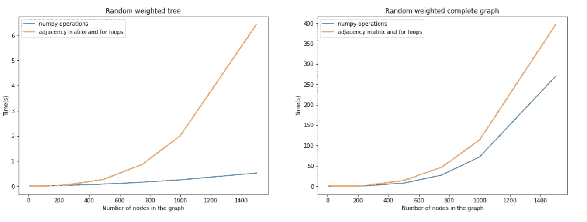

# 用 Numpy 数组实现 Prim 算法

> 原文：<https://medium.com/quick-code/prims-algorithm-with-numpy-arrays-a9ea3d3f112a?source=collection_archive---------2----------------------->

# 普里姆算法

[普里姆的算法](https://en.wikipedia.org/wiki/Prim's_algorithm)和克鲁斯卡尔的算法是一种贪婪算法，为一个[加权的](https://en.wikipedia.org/wiki/Weighted_graph) [无向图](https://en.wikipedia.org/wiki/Undirected_graph)寻找一棵[最小生成树](https://en.wikipedia.org/wiki/Minimum_spanning_tree)。

一些教程描述了这个问题和算法。我想引用[这个](https://coderbyte.com/algorithm/find-minimum-spanning-tree-using-prims-algorithm)作为比较，因为我使用了那里描述的 python 实现。

Prim 算法的伪代码是:

```
00 Let's represent the vertices of the graph with **V**, the vertices of
   the spanning tree with **X**, and the edges of the tree with **E** and 
   the weight of an edge e is **w**(e).
01 Select a random vertex **v**.
02 Initialize the variables as: X:={v}, Y=V-X, E={}
03 **while** X != V **do**:
04     Select e{x,y} edge of the graph where x ∈ X, y ∈ Y
       and w(e) is minimal.
05     X:=X ∪ {y}; E:=E ∪ {(x,y)}; Y:=Y-y
06 Return with the (X,E) tree
```

前面提到的实现使用邻接矩阵和 lop。python 代码见[链接](https://coderbyte.com/algorithm/find-minimum-spanning-tree-using-prims-algorithm)。

# Numpy 实现

这个实现使用 numpy 数组操作。在每次迭代中，它用`np.isin()`和`np.not_equal()`搜索边( **e** )之间，并用`np.argmin()`找到最小权重。

numpy `isin()`函数不能处理集合，因此，每次都必须进行转换。但是，由于列表和集合元素移除之间的性能差异，它仍然是首选方法。

# 测试图表

为了测试实现的性能，我使用了两种类型的图:随机加权树和随机加权完全图。

具有 *V* 个顶点的随机加权树具有 *V-1 条*边(并且最终生成树是原始树)。

具有 *V* 个顶点的完全图在每对节点之间有一条边，因此它有 *V(V-1)/2* 条边。

小树和完全图(V=10):

```
Tree:
Prim with numpy arrays:                   0.0007793903350830078
Prim with adjacency matrix and for loops: 0.00010991096496582031
Complete graph:
Prim with numpy arrays:                   0.0007245540618896484
Prim with adjacency matrix and for loops: 0.00020265579223632812
```

中等树和完全图(V=100):

```
Tree:
Prim with numpy arrays:                   0.01504063606262207
Prim with adjacency matrix and for loops: 0.004843235015869141
Complete graph:
Prim with numpy arrays:                   0.05809807777404785
Prim with adjacency matrix and for loops: 0.1437060832977295
```

大树和完整图(V=500):

```
Tree:
Prim with numpy arrays:                   0.08289432525634766
Prim with adjacency matrix and for loops: 0.28101420402526855
Complete graph:
Prim with numpy arrays:                    7.81583309173584
Prim with adjacency matrix and for loops: 13.361848592758179
```

最后，测试图显示了两种实现的可伸缩性:



Timing tests of the two implementation