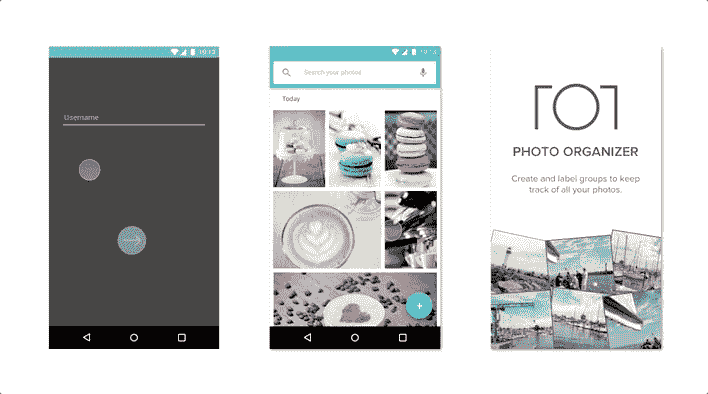

# 原理原型:一步一步来

> 原文：<https://medium.com/capital-one-tech/principle-play-by-play-4de8e50d84c7?source=collection_archive---------8----------------------->

我在 Capital One 做设计师已经快 4 年了。不用说，在这段时间里，我已经使用了相当多的原型工具。然而，自从发布了[原则](http://principleformac.com/)之后，我的交互设计工作流程有了显著的改进。我可以在几分钟内创建初始原型，然后在概念最终确定时，轻松地将特定的动画细节(如延迟、曲线类型和持续时间)翻译给开发人员。由于该工具的速度和直观性，我可以从我的团队获得关于早期概念的反馈，并比以前更快地迭代设计。

Principle 的极简界面让第一次跳进去很容易。其实看起来很像[素描](https://www.sketchapp.com/)，很多快捷键甚至一样……’**R**创建矩形， **T** 创建文本， **Control + C** 让你采样颜色等等。您可以在 Principle 中创建简单的形状和文本字段，引入外部图像，甚至直接从工作草图文件中导入资源。

有这么多的原型工具，很难知道你应该花时间和精力去学习哪一个。这也是我第一次听说 Principle 时的感觉，但正如我已经提到的，它非常直观，允许自定义过渡和微交互，这是其他工具所不具备的。与其他设计师和工程师分享你的互动也非常容易——你可以将它们导出为. mov 或。gif 文件或使用 [Principle Mirror app](https://itunes.apple.com/us/app/principle-mirror-interaction-ui-design/id991911319?mt=8) 直接下载到 iOS 设备上。这一点尤其重要，这样我的团队就能体验到在自然环境中的互动(甚至是在他们自己的设备上！)而不是仅仅看着我在电脑屏幕上点击它们。

好了，说够了…让我给你看看它有多容易使用。

A simple shape scale on a tap gesture.

点击与任何对象相关联的闪电图标会显示所有基于事件的选项，包括点击和长按等基本操作，以及滚动开始、滚动释放和滚动结束等更复杂的手势。悬停手势也包括在你使用网络应用程序的情况下。

一个有用的功能是画板之间的自动事件转换。Principle 检测事件过渡时画板之间的变化，任何具有相同层名称的对象都会自动为您制作动画。没错，您只需将对象的属性从一个画板更改为另一个画板，即可创建动画。

Changing the cursor opacity between artboards creates a flashing cursor using the auto event transition. [Create this interaction yourself](https://www.principletutorials.com/portfolio-item/auto-transition-hack/).

如果您想变得有趣，您可以通过单击画板上方画布上的过渡箭头来自定义动画的持续时间、曲线或延迟。

Using the Spring curve adds more bounce to the white related action buttons when they fling out. [Create this interaction yourself](https://www.principletutorials.com/portfolio-item/button-tap-gesture/).

如果您想让*变得真正*有趣，您甚至可以使用驱动程序通过关键帧将画板中的属性相互连接起来。驱动程序的工作有点像动画时间轴，除了它们是基于变化的属性而不是时间。例如，你可以使用驱动程序来创建一个自定义的垂直滚动交互。在这种情况下，更改的属性将是滚动的 Y 值。

Using drivers on the Scroll Y property allows you to create a custom vertical scroll interaction. [Create this interaction yourself](https://www.principletutorials.com/portfolio-item/custom-scroll-interaction/).

如果你有兴趣加入，看看我的[原理教程网站](https://www.principletutorials.com/)。我策划了一些短视频(都不到 3 分钟)，展示如何创建上面显示的所有三个移动交互。如果你真的很有野心，你甚至可以下载资源并跟随。

***声明:以上观点仅代表作者个人观点。除非本帖中另有说明，否则 Capital One 不属于所提及的任何公司，也不被其认可。使用或展示的所有商标和其他知识产权都是其各自所有者的所有权。本文为 2017 首都一。***

## 相关链接

*   [通过开发人员和设计师的合作，将令人愉快的微交互和 UI 动画带入生活](/capital-one-developers/bringing-delightful-micro-interaction-and-ui-animation-to-life-through-developer-designer-3c409bc326f)
*   [动态二人组:开发者+设计师](/capital-one-developers/the-dynamic-duo-developer-designer-cbd495dd393f)