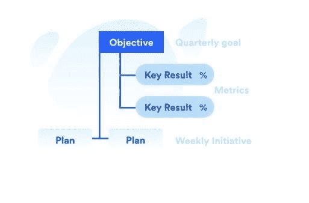
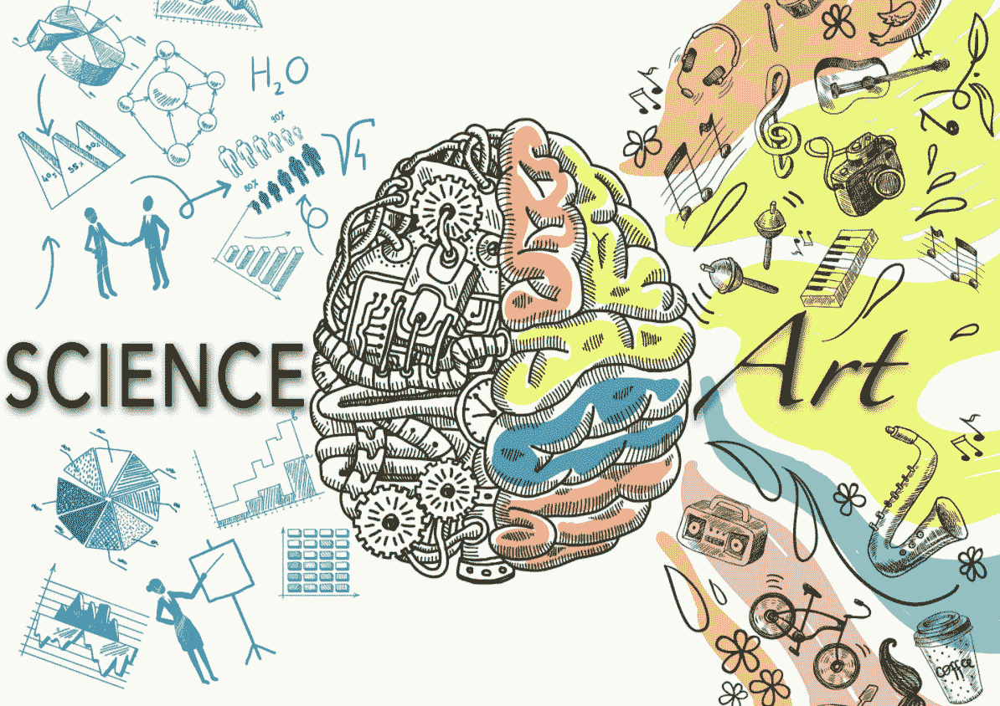

# 产品开发的优先顺序

> 原文：<https://medium.com/globant/prioritization-for-product-development-6c1c9e202d27?source=collection_archive---------0----------------------->

产品经理必须面对的主要挑战之一是优先级。即使你是一个经验丰富的人，在扮演你的角色时，你也应该记住这篇文章中描述的事情。

**1| *OKRs:目标和关键成果***

***英特尔创建的标准，由谷歌或 Linkedin*** 等公司使用

人们普遍认为，成功的项目始于战略联盟。我们可以用来为我们的产品创建它的工具之一是 OKRs。

okr 旨在设定战略和目标，并帮助公司的每个部门，包括业务和产品部门，协同工作。目标是我们想去的地方，关键的结果会让我们知道我们是否已经到达那里。

KPI 是关于已经运行的过程的性能的指标，okr 帮助你在你的最终目标和当前状态之间建立一座桥梁，帮助你到达那里。让我们创建一个示例:

假设你是一个新产品的产品经理，你必须规划出前进的道路:
**目标:**我们要去哪里？获得市场渗透和社交媒体的存在，以确保未来的收入。
**关键结果:**我们如何知道我们已经在那里了？将
产品渗透率提高到 5% /将我们今年的网络资料访问量提高到 10，000 次
**计划:**我们将如何实现这一目标？在推荐我们的产品时，为现有用户实施新的奖励
系统。

*衡量关键
结果并不断调整它们是很重要的。
如果一个关键结果总是接近 1，
大概是 KR 不够
有野心。*

我们想要解决的问题是什么？

***找出产品管理方面的主要问题***

*   **想法以解决方案的形式呈现:** *“我想要一个涂成橙色、背景为蓝色的 CTA”* 允许它，你就会成为一个简单的需求挑选者。始终尝试
    找到问题的真正根源，并提出各种可能的
    解决方案。
*   **不清楚产品团队在做什么:** *“我不明白为什么产品团队要做这个项目。* 过时的数据对我的团队没有帮助，内部的分裂，一场利己主义的争斗，会使产品错位受益。
*   很难对来自高层的想法说不。
    *来自河马(薪酬最高的人的意见)的想法不一定是最好的。*
*   产品创意只来自少数人。
    公司里的每个人都应该参与创造最好的产品。确保实施适当的渠道来识别和收集想法。
*   **挑战堆栈等级** *“我们几乎 80%的待办事项都是优先级 1！”*避免混淆。设定一个顺序，必要时更改。

我们确信，作为一名产品经理，你会在日常工作中发现其中一些问题，甚至所有这些问题。但是，如何逃离这种情况呢？你的优先级够高吗？请看看这些。

**3|优先化指导原则:**

***成功确定优先顺序的技巧***

*   优先级是由商业案例决定的，而不是由谁提出的想法决定的。显示出**理性**的优先决策
*   最好的想法来自与问题更接近的人。
*   优先级不是一成不变的，它们可以根据新的数据而改变。
*   让客户或内部利益相关者失望是可以的:**说不**如果有必要！
*   不认同优先级。**不同意并提交**

**结论**

可能到这个时候，你已经意识到，作为一个产品经理，和工匠比和数学专家有更多的共同点。如果你怀疑，后退一步，运用常识。