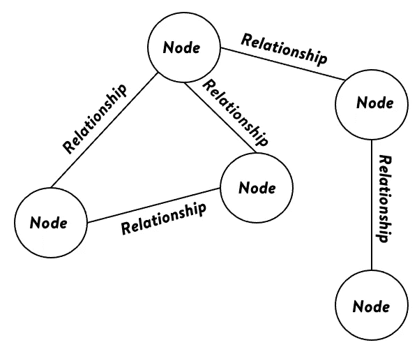
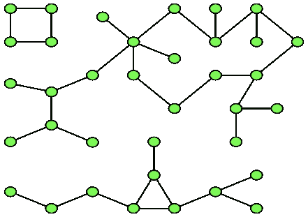
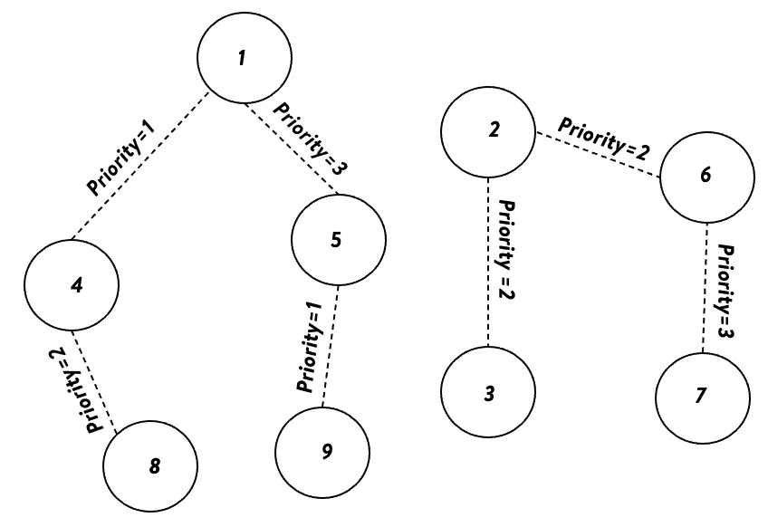
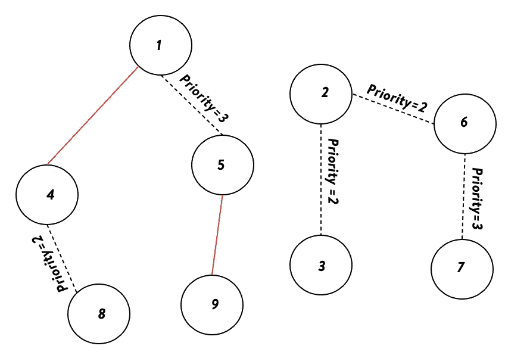
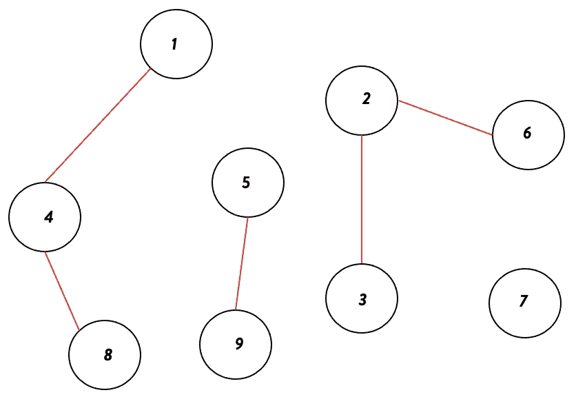

# 基于优先级的连通分量

> 原文：<https://medium.com/walmartglobaltech/priority-based-connected-components-8b762fda7d2f?source=collection_archive---------7----------------------->

## 具有边优先级和大小限制的细化连通分量


Source: Picture by [Macrovector](https://www.freepik.com/macrovector) on [Freepik](https://www.freepik.com/free-vector/glowing-network-sign_1528929.htm)

图形理论是对图形的研究，图形是用来模拟对象之间成对关系的数学结构。图由节点/顶点和边组成。节点表示图形数据中的实体，而边表示节点之间的关系。

节点可以是城市、商品/产品或实体(图中的**绿色**点)。边(图中**绿色**点之间的**线**是链接这些节点的关系，比如节点可以是产品，产品之间的边可以是它们的类别。



Graph-Structure

## 连接组件并需要对其进行优化

在图论中，无向图的一个分支是一个子图，其中任意两个顶点通过路径相连，并且在图的其余部分不与任何额外的顶点相连。广度优先搜索或深度优先搜索用于在线性时间内计算图的组件。



Source: Wikipedia, Graph with three connected-components

到目前为止，我们已经看到了图形和连通分量。在许多领域中利用连通分量算法来根据链接边连接实体。连接的组件在[计算机视觉](https://en.wikipedia.org/wiki/Computer_vision)中具有它们的应用，用于[区域检测/斑点提取](https://en.wikipedia.org/wiki/Connected-component_labeling)。在[拓扑排序](https://en.wikipedia.org/wiki/Topological_sorting)中，连接的组件也用于解决问题，如根据给定的依赖关系安排作业。连接组件也可用于[检测图中的循环](https://en.wikipedia.org/wiki/Cycle_(graph_theory))并解决金融部门的循环支付或洗钱等问题。

虽然这绝对是一个非常有用的算法，但有时我们看到有必要改进算法，以调整边的优先级并限制组件的大小。让我列出几个可以实现这一点的场景，并阐明我们所说的优先级和限制组件大小的含义。

## 场景-1

对于零售公司来说，可能需要对相似的商品进行分组，以便在缺货的情况下为客户提供更好的商品替代选择。为此，我们需要定义相似项目的组。被认为是一个组的项目可以由下面的标准来定义。

1.  项目描述相似性(优先级-1，最高优先级)
2.  类别描述相似性和定价相似性(优先级-2)
3.  部门描述相似性和购买模式相似性(优先级-3，优先级最低)

> 项目可以通过上述任何一个标准进行链接，但优先选择通过优先级标准链接项目。除此之外，还可以有额外的约束，例如一个组中最多有“X”个项目(避免组变得太宽或太笨重)，以及一个项目只能是一个组的一部分(确保组是互斥的)。

如果我们使用限制为“X”(当大小达到“X”时断开连接组件)的普通连接组件算法，如 [DFS](https://en.wikipedia.org/wiki/Depth-first_search) (深度优先搜索)或 [BFS](https://en.wikipedia.org/wiki/Breadth-first_search) (广度优先搜索)，我们可能会以异构组结束，即部门内跨类别的许多项目可能会被链接。我们需要尽量减少这种情况，并优化确定的优先事项。


Product from [walmart.com](https://www.walmart.com/ip/Garanimals-Baby-Toddler-Girls-Unicorn-Mix-N-Match-Kid-Pack-Gift-Box-10-Piece-Outfit-Set-12-Months-5T/122624760?athcpid=122624760&athpgid=athenaItemPage&athcgid=null&athznid=PWVUB&athieid=v0&athstid=CS020&athguid=3702ca5f-007-17bb5af72f5add&athancid=null&athena=true)

## 其他场景

在客户服务中心也会出现类似的用例，在那里，公司根据他们的技能和定义的优先级来分配服务代理。上述场景是[智能代理分配](https://getawesomesupport.com/documentation/smart-agent-assignment/smart-agent-assignment-algorithms/%29)问题的类型。


Picture on [Freepik](https://www.freepik.com/free-vector/organic-flat-customer-support-illustration_13184981.htm)

> 在上面的场景中，我们看到需要运行连接的组件，但是首先连接具有较高优先级边的实体，然后移动到较低优先级的实体。此外，除此之外，每个群体都需要有一个规模限制。

为了解决上述类似的分析挑战，我们提出了一种算法来调整边的优先级并限制组件的大小。

## 基于优先级的连通分量算法细节

1.  该算法为用户提供了一个选项来输入节点的访问顺序，“T6”visit _ order。如果用户没有提供任何顺序，节点将按照图中输入边的顺序被访问。
2.  该算法以降序迭代优先级，即(优先级 1 >优先级 2 > …>优先级 n)。在每次迭代中，在步骤 1 中定义的“visit_order”中选择节点。
3.  对于节点' *X* '，与其具有优先级' *p'* '的相邻节点(此节点与' *X* '之间存在一条边)进行并运算(连接节点)，使得' *p* '为当前最高优先级。这是使用[不相交集联合](https://en.wikipedia.org/wiki/Disjoint-set_data_structure)数据结构有效完成的。可能在某个点，'*' X '*和邻居不是单独的节点，而是子图。在这种情况下，两个子图将合并，成为一个组件的一部分。
4.  如果“ *X* ”没有边连接优先级为“ *p* 的邻居，则移动到“ *visit_order* 中的下一个节点。
5.  访问完所有节点后，执行第-3 步和第-4 步，获取下一个最高优先级。
6.  如果在任何阶段组件中的元素数量达到阈值(默认值= 100，可由用户修改)，则该组件将不会有任何更多的更改/链接。

```
for priority in priorities:
    for X in visit_order:
        for Y in neighbour_of_X:
            if edge_priority[X,Y] == priority:
                Union(X,Y)
```

让我们通过一个例子来看看这个算法是如何工作的。此处的阈值设置为 3，限制了组件的大小。虚线边缘表示相关的链接和优先级。



Graph and Linkages, Threshold=3

在第一次迭代中，所有具有优先级为-1 的边的节点被连接起来。



1–4 and 5–9 gets connected

在下一次迭代中，该算法连接优先级为-2 的节点和它们之间的边。



1–4–8 gets connected, 2–3–6 gets connected and both reach the threshold

当达到组件的阈值且不再有边缘时，算法停止。以上是具有设定阈值和提供边缘优先级的最终连接组件。

# 我们可以利用的开源库

我们已经将这项工作开源到了[沃尔玛公共 GitHub](https://github.com/walmartlabs) 。这里是[项目库](https://github.com/walmartlabs/priorityY)的链接。

[](https://github.com/walmartlabs/priorityY) [## GitHub — walmartlabs/priorityY:基于优先级的连接组件

### 在许多情况下，我们看到需要运行连接的组件，但首先，连接优先级更高的实体…

github.com](https://github.com/walmartlabs/priorityY) 

我们还发布了 pypi.org 的库作为可安装 pip 的软件包，可以在这里下载[。](https://pypi.org/project/priorityY/)

## 装置

```
pip install priorityY
```

## 使用

如果我们要使用 [priorityY 包](https://pypi.org/project/priorityY/)实现前面显示的示例，那么我们将使用以下语法。

```
from priorityY import *
G = [(1,4,1),(1,5,3),(2,3,2),(2,6,2),(6,7,3),(4,8,2),(5,9,1)]
threshold = 3
components = priority_based_linkage(G,threshold)
print(components)
```

## 输出

```
[[1, 4, 8], [2, 3, 6], [5, 9], [7]]
```

节点的*访视顺序*为可选参数。该算法以递减的顺序迭代优先级，并且在每次迭代中，如果按照图中输入边的顺序提供其他选项，则以“ *visit_order* 的顺序选择节点。

```
# visit_order provided
components = priority_based_linkage(G,threshold,[3,4,1,5,2,9,8,7,6])
```

[](https://pypi.org/project/priorityY/) [## 优先权

### 它将一个整数作为输入，并将其打印为正方形。从优先级导入的 pip 安装优先级* G =…

pypi.org](https://pypi.org/project/priorityY/) 

# 利益实现

在我们的一个数据科学应用程序中，我们使用现有的基于 DFS 的方法对基于优先级的连接算法进行了基线化，该方法被设计为当达到阈值时停止连接节点，而不考虑优先级。我们计算了 3 个指标，并发现每个指标都有显著改善。

1.  *质量增益百分比*:该指标计算连接组件的质量改进百分比。在形成连通分量中起作用的高优先级边的数量越多，质量就越高。
2.  *每个组件的平均质量增益百分比*:这个度量计算每个组件的百分比改进，并取所有组件的质量增益百分比的平均值。
3.  *达到阈值的组件数量的百分比减少*:我们想要最小化明确达到阈值的组件数量。

# 结论

这篇博文着眼于连通组件的改进版本，它考虑了边的优先级，并根据用例需求限制了组件的大小。

我们已经将该功能公开为一个[开源包](https://pypi.org/project/priorityY/)，可以在工作中使用。[源代码](https://github.com/walmartlabs/priorityY)也可供团队在需要时扩展功能。我要感谢我的团队 [Pravesh Garg](https://medium.com/u/d9a59eaeb7f3?source=post_page-----8b762fda7d2f--------------------------------) 、 [Somedip Karmakar](https://medium.com/u/7665d86d0f5f?source=post_page-----8b762fda7d2f--------------------------------) 和 [Subhasish Misra](https://medium.com/u/90cea4f6b9df?source=post_page-----8b762fda7d2f--------------------------------) 在构思和验证工作的整个过程中一直在那里。此外，我们非常感谢我们的工程同行在管道方面给予我们的帮助，并使该功能在 Dashboard 上可用。

感谢 Oscar Blass、Cory Stegemoller 和 Meriah Montondo 帮助我们完成开源过程。

# 参考

[](https://en.wikipedia.org/wiki/Graph_theory) [## 图论

### 在数学中，图论是对数学结构的研究，这些数学结构用于模拟成对关系…

en.wikipedia.org](https://en.wikipedia.org/wiki/Graph_theory) [](https://en.wikipedia.org/wiki/Disjoint-set_data_structure) [## 不相交集数据结构

### 在计算机科学中，不相交集数据结构，也称为联合查找数据结构或合并查找集，是一种…

en.wikipedia.org](https://en.wikipedia.org/wiki/Disjoint-set_data_structure) [](https://en.wikipedia.org/wiki/Component_%28graph_theory%29) [## 组件(图论)

### 在图论中，无向图的一个分支是一个诱导子图，其中任意两个顶点都连接到…

en.wikipedia.org](https://en.wikipedia.org/wiki/Component_%28graph_theory%29) [](https://www.hackerearth.com/practice/notes/disjoint-set-union-union-find/) [## 不相交集合联合(联合查找)— Prateek Garg

### 算法的效率有时取决于使用有效的数据结构。一个很好的数据结构选择…

www.hackerearth.com](https://www.hackerearth.com/practice/notes/disjoint-set-union-union-find/) [](https://www.geeksforgeeks.org/disjoint-set-data-structures/) [## 不相交的集合数据结构— GeeksforGeeks

### 考虑一个有几个人的情况，以及要对他们执行的以下任务。添加新的友谊…

www.geeksforgeeks.org](https://www.geeksforgeeks.org/disjoint-set-data-structures/)