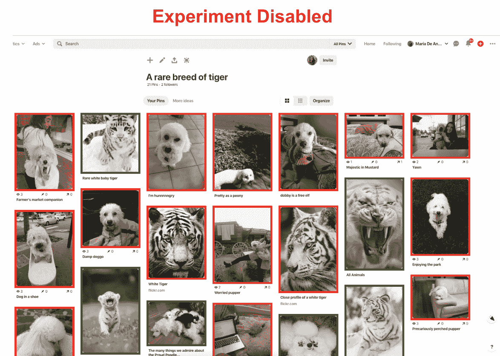
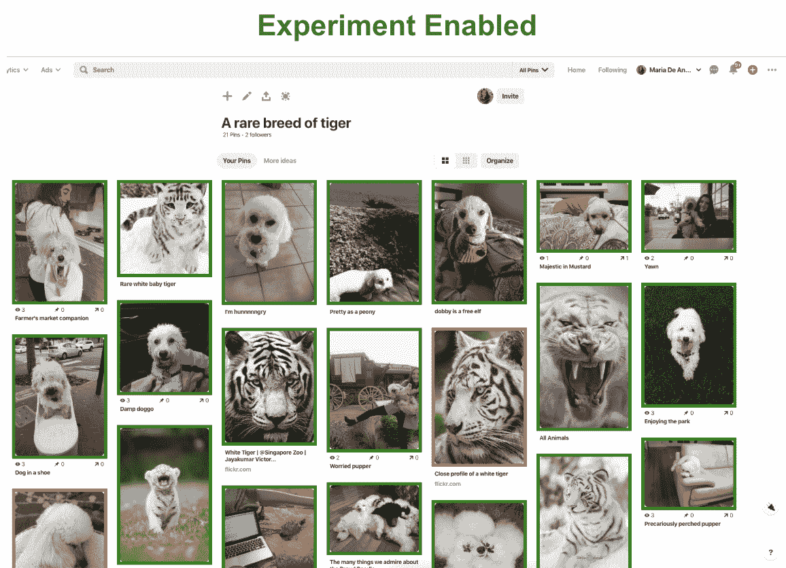
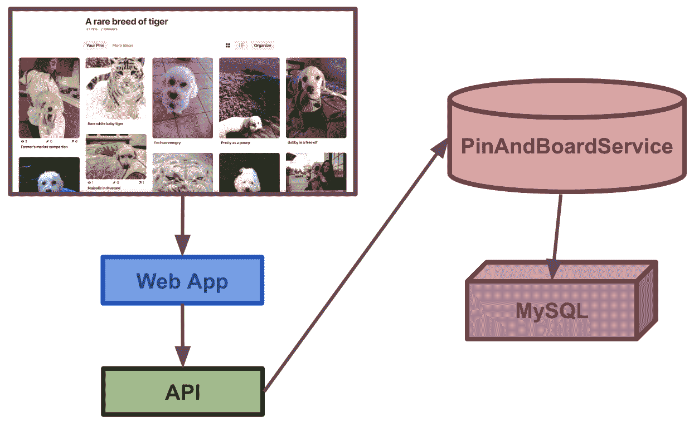

# 隐私启动:将 Pin 链接从 HTTP 升级到 HTTPS

> 原文：<https://medium.com/pinterest-engineering/privacy-power-up-upgrading-pin-links-from-http-to-https-9f3cd32a132c?source=collection_archive---------3----------------------->

玛利亚·德·安杰利斯组合| 2019 年夏季 Pinterest 工程师实习生

HTTPS 应该无处不在。你的网站可能运行在 HTTPS 上，给你的用户一个安全的、加密的连接，但是所有的出站链接呢？你能保证他们都用 HTTPS 吗？在这篇文章中，我们描述了通过利用 [DuckDuckGo 更智能的加密技术](https://spreadprivacy.com/duckduckgo-smarter-encryption)将 Pin 链接从 HTTP 升级到 HTTPS 的步骤。

**为什么是 HTTPS？**

虽然 Pinterest 完全在 HTTPS 上运行，但它并不是大多数用户的最终目的地。作为 Pinners 发现和做他们喜欢的事情的地方，Pinterest 是到达其他网站的发射台。因此，我们有责任尽可能将 Pinners 重定向到 HTTPS 站点，包括在可能的情况下将出站 Pin 链接从 HTTP 升级到 HTTPS，并最大化通过 HTTPS 的流量百分比。

任何 HTTP 流量存在的原因只是因为许多 pin 都是以这种方式创建的。当 Pinner 点击一个 Pin 链接时，如果内容是用 HTTP URL 创建的，她将被发送到 HTTP 站点。然而，如果该网站支持 HTTPS，我们想把用户发送到 HTTPS 版本。我们决定对 HTTPS 进行在线升级，这样我们就可以在所有 Pinterest 界面上最大化搜索结果。

经过改进后，现在大约 80%的对外交通通过 HTTPS，增加了 30%以上。

为了确保这种变化不会干扰重要的指标，我们进行了一个实验，将这些变化发布给 1%的用户，并将他们与同等的控制组进行比较。我们发现 Pinterest 的基准指标没有变化，所以我们将继续向更多的 Pinterest 用户发布实验。

图 1:这个 Pinterest 板的管脚通过它们链接的协议进行颜色编码。HTTPS 链接是绿色的，HTTP 链接是红色的。当实验在第二张图中启用时，大多数红色引脚变成绿色，因为它们的链接可以升级到 HTTPS。

**duck duck go 的智能加密**

为了尽可能高效地工作，我们集成了 [DuckDuckGo 更智能的加密技术](https://spreadprivacy.com/duckduckgo-smarter-encryption)，该技术会在可用时自动使用加密的网站连接。DuckDuckGo 对我们来说是完美的选择，因为他们有一个全面的可升级网站列表，通过比较网站的 HTTP 和 HTTPS 版本来生成，如果两个版本相同，就将一个网站添加到 HTTPS 升级列表中。然后，我们可以定期提取和摄取他们的列表。

**Pinterest 架构**

当用户滚动他们的 Pinterest home feed 时，在 API 层发出获取 pin 的请求，然后调用 Apache Thrift 服务 PinAndBoardService，后者随后从 MySQL 数据库获取 pin。

图 2:引脚获取架构的简化表示。API 层向 PinAndBoardService 发出请求，然后 PinAndBoardService 从缓存或 MySQL 中获取 Pin。

**概述**

为了实现 Pin 链接转换，我们:

1.  触发是否在 API 层运行实验。
2.  如果启用了实验，则调用 API 层中 PinAndBoardService 中新添加的端点。
3.  在新的 PinAndBoardService 端点中，当从数据库或缓存中提取 Pin 时，检查它的 URL 是否以 HTTP 开头，如果是这种情况，应该尽可能将其升级到 HTTPS。
4.  通过从 URL 中剥离域并检查该域是否包含在 DuckDuckGo 的智能加密提供的安全域列表中，检查 Pin 是否能够升级到 HTTPS。
5.  执行转换并升级链接，以便所有下游服务都将收到安全版本。
6.  我们选择在 PinAndBoardService 中执行链接转换，而不是直接在 MySQL 数据库中执行，原因如下:
7.  如果我们在 MySQL 层将一个 HTTP 链接升级到 HTTPS，后来该域不再支持 HTTPS，Pin 链接将断开，我们将无法跟踪更改，因为链接将被永久修改。为了解决这个问题，我们可以在 MySQL 中同时存储新旧链接，但是这样会比当前的方法空间效率低。
8.  虽然我们必须在每次从数据库中获取 Pin 时执行转换(不管它是否已经升级)，但是我们通常可以避免冗余获取，因为 Pin 被高度缓存。

**下一步**

随着我们的发展，我们正在探索永久升级 pin 以确保 HTTPS 链接的安全，这是向 HTTPS 的普遍使用和增加我们平台上所有用户的安全性迈出的一大步。我们还在跟踪我们目前无法升级的链接，以便为 DuckDuckGo 的智能加密做出潜在贡献，从而改善所有用户的用户体验。

**致谢**

非常感谢伊曼纽·切塞纳(我的优秀实习导师)和 Pinterest 安全团队的其他成员！也非常感谢 CoreService、Storage & Caching 和 API 团队提供的支持，以及 DuckDuckGo 提供的对他们更智能的加密技术的早期访问。