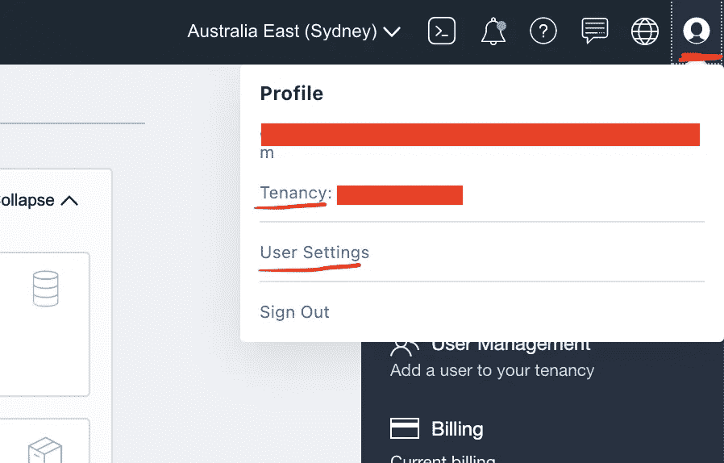

# 与新一代 Oracle 集成云的私有连接

> 原文：<https://medium.com/oracledevs/private-connectivity-to-oracle-integration-cloud-next-generation-d0bfae1d0804?source=collection_archive---------0----------------------->


# **简介**

OCI 上的 Oracle 集成云(OIC)下一代(第二代),作为公共服务部署，在公共互联网上提供。您可以使用 OIC 公共 URL(* . integration . OPC . Oracle cloud . com)从任何地方执行 OIC 中的集成。

此外，作为一项新功能，您可以将对 OIC 实例的访问限制到特定的 IP 或 CIDR 块，甚至虚拟云网络(VCN)(请参考[限制对实例的访问](https://docs.oracle.com/en/cloud/paas/integration-cloud/oracle-integration-oci/restrict-access-instance.html))。

在大多数情况下，客户希望私下(通过 OCI 和内部网络之间的 VPN 或 FastConnect 链接，而不通过公共互联网发送数据)与内部应用之间的 OIC 实例(入站和出站集成)进行通信。在本文中，我将讨论实现私有连接的可用解决方案。

# **OCI 私有连接解决方案**

Oracle 集成云部署在 *Oracle 服务网络(OSN)。*

Oracle 服务是 Oracle 云基础架构中为 Oracle 服务保留的概念网络(与 OIC 和 Oracle 分析云相同)。这些服务拥有公共 IP 地址，您通常可以通过公共互联网访问这些地址。然而，你可以不通过公共互联网访问 OSN。

对于每个 OCI 地区，Oracle 服务网络都有一个保留的公共 IP 范围。如果你点击[这个](https://docs.oracle.com/en-us/iaas/tools/public_ip_ranges.json)链接，你可以找到每个地区的公共 IP 范围。

当您的主机在本地网络中时，有不同的方式:

*   **通过具有 FastConnect 私有对等或 VPN 连接的 VCN 进行私有访问**:本地主机使用私有 IP 地址，并通过 VCN 和 VCN 的服务网关到达 Oracle 服务网络。服务网关是区域性的，仅允许访问与 VCN 位于同一地区的受支持 Oracle 服务。

> 服务网关使用了*服务 CIDR 标签*的概念，这是一个字符串，表示感兴趣的服务或服务组的所有区域公共 IP 地址范围。*服务网关不允许来自 OSN 的连接请求进入 VCN 或您的内部网络。来自 Oracle 服务的任何连接请求都必须通过公共路径，如互联网或快速连接公共对等网络*。


Transit routing directly through gateways

在这种情况下，应用程序使用 Oracle 服务的公共 DNS(例如对象存储)，流量将通过 VPN 或 FastConnect(私有对等)路由到连接到 OCI VCN 的 DRG。连接到 DRG 的路由表将流量(到对象存储或其他 OSN 服务)路由到连接到 VCN 的服务网关。连接到服务网关的路由表将流量路由回本地 CIDR 到 DRG，DRG 将流量通过 VPN 路由到本地网络进行快速连接(有关更多信息，请参考[Oracle 服务的私有访问](https://docs.oracle.com/en-us/iaas/Content/Network/Tasks/transitroutingoracleservices.htm)文档)。

*   **通过 FastConnect 公共对等进行公共访问:**本地主机使用公共 IP 地址。


在这个场景(蓝线)中，流量将使用 FastConnect 公共对等路由到 Oracle 服务(这个场景超出了本文的范围)。

> 请记住，在这两种情况下，内部软件应使用 OSN 内部 Oracle Services 的公共 DNS(公共 IP 地址)(公共 IP 地址将使用 BGP 或静态路由通过 FastConnect 或 VPN 进行路由)。

在大多数情况下，客户不喜欢将 Oracle 服务的公共 IP 从他们的网络路由到 OCI(通过 VPN 或 FastConnect 公共对等)。想象一下这样的场景:客户在第三方云提供商(与 Google 或 AWS 相同)中部署了应用程序，并且他们在内部网络和第三方云帐户之间建立了私有连接(VPN 或直接连接)。在本例中，如果部署在第三方云提供商内部私有网络上的应用程序希望与 Oracle 服务(在我们的示例 OIC 中)通信，它们应该将 OIC 的公共 IP 地址从第三方云帐户内部的私有网络路由到内部网络，然后将该流量从内部网络路由到 OCI。在 OCI，客户喜欢使用私有 IP 地址而不是公共 IP 地址进行通信。在本文中，我将解释如何在私有 IP 上存档这种私有连接。

# **与 OIC 实例通信的私有连接解决方案**

1.  **对外集成(OIC 呼叫内部服务)**

对于这个场景，我们使用 OIC 连接代理与内部软件进行通信。


红线表示出站集成流程

以下是实现出站专用连接的步骤:

*   **下载连接代理**

导航到 OIC 控制台中的集成->代理选项卡，并选择下载“连接代理”


从 OIC 实例下载连接代理

*   **创建代理组**

导航到 OIC 控制台中的集成->代理选项卡，并创建新的代理组


*   **在 VCN 内部供应一个计算实例(以运行连接代理)并配置和运行连接代理**

在 VCN 内部的私有子网中配置计算实例(VCN 需要直接连接到内部网络或通过 VCN 中心连接，我们需要将所有区域服务的服务网关连接到 VCN)。


调配计算保险后，您需要将连接代理 zip 文件传输到计算实例，并在特定文件夹中提取 zip 文件。

用 OIC 实例信息更新 InstallerProfile.cfg 文件


```
oic_URL=https://<<oic instance DNS>>:443agnet_GROUP_IDENTIFIER=<<connectivity agent group name>>oic_USER=<<OIC User>>oic_PASSWORD=<<OIC Password>>
```

运行代理后，OIC 用户和密码将在配置文件中编码。如果您使用代理，您需要在配置文件中填充 proxy_xxx 信息。

此外，如果您有本地软件的特定证书，则需要将证书导入连接代理密钥库中(在< <agent home="">>/agnet/cert 文件夹中)。</agent>

最后，使用以下命令运行代理:

```
nohup java -jar connectivityagent.jar &
```

此外，通过在两个或更多计算实例中运行连接代理(使用同一个代理组)，可以在高可用性模式下运行连接代理。

有关更多信息，请参考以下文档:

```
[https://docs.oracle.com/en/cloud/paas/integration-cloud/integrations-user/agent-download-and-installation.html#GUID-B72F9768-C3E9-4B59-BEC0-ACB03CC12C19](https://docs.oracle.com/en/cloud/paas/integration-cloud/integrations-user/agent-download-and-installation.html#GUID-B72F9768-C3E9-4B59-BEC0-ACB03CC12C19)
```

*   **在 OIC 中创建连接并将代理添加到连接中**

导航到 OIC 控制台中的集成->连接选项卡，并创建新的连接。为连接提供所有必需信息(取决于连接类型)后，将代理组添加到连接中。


在上面的示例中，我创建了 REST 连接，该连接指向本地网络中的 REST 服务(运行在主机 10.0.1.127 和端口 8080 上)。

> *请记住，连接代理仅汇集来自 OIC 的信息，OIC 实例与连接代理之间没有任何连接(连接代理和 OIC 实例之间是单向连接)。*

2.**入站集成(内部应用程序称为 OIC 集成)**

入站集成(使用私有 IP 而不是 OIC 实例公共 IP 从内部到 OIC 实例的流量)是更复杂的解决方案。

OIC 产品在 2021 年 2 月发布时宣布了新功能，我们可以在 OCI 内部的私有子网中的 OCI API 网关中部署[应用集成](https://www.oracle.com/integration/application-integration/what-is-application-integration/)。在此功能之前，有一种替代解决方案可以在 VCN 内部的专用子网中部署反向代理(例如，您可以使用专用 OCI 负载平衡器作为反向代理)。在本节中，我将讨论 API 网关解决方案。


红线表示入站集成流程

要实施此解决方案，我们需要执行以下步骤:

*   **在 VCN 内部提供私有 API 网关**

首先，您需要在 VCN 内部提供专用子网(在中心/分支架构中，在 VCN 分支内部提供)。

导航到 OCI 控制台，选择开发人员服务-> API 管理->网关


选择隔离专区后，输入网关名称、类型(应为专用)、隔离专区、VCN 和专用子网。


填充网关名称、类型、隔离舱、VCN 和子网

API 网关配置成功后，您可以在网关详细信息页面中找到 API 网关主机名和私有 IP 地址。


*   **将 OCI 地区所有服务的服务网关附加到托管 API 网关的 VCN**

因为 API 网关通过服务网关与 OIC 实例进行私有通信，所以您需要将服务网关附加到您部署网关的 VCN。


将服务网关连接到 VCN

*   **将 OIC 实例与拥有 API 网关实例的 OCI 租户集成**

您需要将 OIC 实例与您提供的 API 网关的 OCI 租用相集成。为此，您需要导航到 OIC 控制台并选择设置->集成-> API 管理，然后选择 API 网关单选按钮。最后，在 OIC 中填充 API 网关信息并保存配置。


在此页面中，您需要填充租赁 OCID(从 OCI 控制台找到它，选择用户图标，然后选择租赁)、用户 OCID(从 OCI 控制台找到它，选择用户图标，然后选择用户设置)、私钥、私钥密码和公钥指纹(您需要首先[生成公钥/私钥对](https://docs.oracle.com/en-us/iaas/Content/Functions/Tasks/functionssetupapikey.htm)，并导入您用于集成到 OIC 的用户的公钥)。



选择租赁和用户详细信息


OCID 租赁


用户 OCID


为用户生成或导入公钥

此外，您需要在 OCI 根隔离专区中创建一个策略，将 api 网关系列中的管理权限分配给 IAM 组，该 IAM 组包含您用于集成到 OIC 的用户，并将该策略附加到包含 API 网关实例的隔离专区。

政策声明:

```
Allow group <<IAM Group name>> to manage api-gateway-family in compartment <<Compartment Name>>
```

要创建策略，请导航到 OIC 控制台并选择身份->策略并创建新策略。


创建策略以管理选定隔离专区中的 API 系列

*   **从 OCI 控制台在 API 网关中部署集成(仅适用于 REST 集成)**

在您将 OIC 实例与 OCI 租户集成之后，您可以简单地在 API Gateway 中部署集成。为此，选择集成(仅 REST 触发集成)并从 hamburger 菜单中选择 API 管理。


为 REST 集成选择 API 管理

在下一页中，选择 API 网关隔离专区、网关实例和部署名称和路径，然后选择部署。


选择隔离专区、网关和 API 部署名称和路径前缀

在网关中成功部署 API 后，导航到 API 网关并选择 deployment 以查看部署的 API。


然后选择 deployment 以查看有关 API Gateway 中部署的更多信息。


您可以在此页面中找到部署端点

现在，您可以在内部软件中使用这个部署端点来调用 OIC 集成。

*   **在 API 网关中为 SOAP 集成手动创建部署**

目前，API 网关与 OIC 的集成仅支持 REST 集成(从 OIC 控制台直接部署到 API 网关)。如果您有任何 SOAP 集成(集成触发连接是基于 SOAP 的连接)，您不会在 OIC 控制台中获得 API 管理菜单项。


StockQuote_Int 是基于 SOAP 的集成，你不会得到这个集成的 API 管理菜单项

对于这种类型的集成，您应该在 API Gateway 中手动创建部署。为此，导航到 OCI 控制台并选择 API 网关。然后选择“部署”选项卡并创建新部署。


为部署填充名称和路径前缀

在下一页中，选择“/”作为路径，选择“POST”作为方法，选择“HTTP”作为路由类型，并输入 OIC 集成 URL。

```
Integration URL: https://<<OIC Instance DNS>>:443/ic/ws/integration/v1/flows/soap/<<integration id>>/<<integration version>>
```


> 请记住，您不能直接从 OIC 控制台从 API Gateway 中取消部署集成。为此，您需要导航到 API 网关部署并删除部署。
> 
> 注意—免费层用户可能会体验到其帐户所含服务的变化。

# 参考资料:

*   [https://docs . Oracle . com/en-us/iaas/Content/Network/Tasks/transiroutingoracleservices . htm](https://docs.oracle.com/en-us/iaas/Content/Network/Tasks/transitroutingoracleservices.htm)
*   [https://docs . Oracle . com/en-us/iaas/Content/Network/Tasks/service gateway . htm](https://docs.oracle.com/en-us/iaas/Content/Network/Tasks/servicegateway.htm)
*   [https://docs . Oracle . com/en/cloud/PAAs/integration-cloud/integrations-user/managing-agent-groups-and-connectivity-agent . html](https://docs.oracle.com/en/cloud/paas/integration-cloud/integrations-user/managing-agent-groups-and-connectivity-agent.html)
*   [https://docs . Oracle . com/en-us/iaas/Content/API gateway/Concepts/API gateway overview . htm](https://docs.oracle.com/en-us/iaas/Content/APIGateway/Concepts/apigatewayoverview.htm)
*   [https://docs . Oracle . com/en-us/iaas/Content/Functions/Tasks/Functions setapikey . htm](https://docs.oracle.com/en-us/iaas/Content/Functions/Tasks/functionssetupapikey.htm)