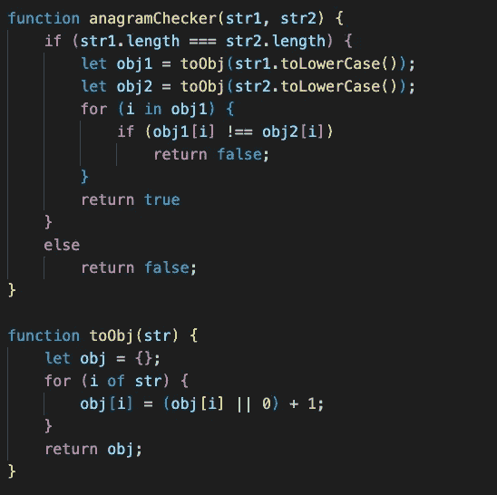

# 用 JavaScript 解决问题——第 1 部分(字谜)

> 原文：<https://medium.com/globant/problem-solving-with-javascript-part-1-anagram-abc22e601881?source=collection_archive---------0----------------------->

在本系列中，我们将以不同的思维方式(复杂性和各种实现方式)使用 JavaScript 解决一些常见/不常见的问题。对于第 1 部分，让我们从一个简单的问题开始，比如字谜。

## 解决字谜问题的最佳方法:

[Anagram Examples](https://learnetutorials.com/php/programs/anagram-strings)

首先让我们理解这个问题，

为了检查两个字符串是否构成一个变位词，我们将采用一个 JavaScript 函数，该函数将有两个(或更多)字符串作为参数，如果它们有相同的字符实例，它应该返回 true，否则应该返回 false。

举个例子，

*我)anagramChecker(朋友，发现者)= >真*

*ii) anagramChecker(种族，职业)= >真*

*iii) anagramChecker (Park，Tree) = > False*

*iv) anagramChecker (Trap，Part) = >真*

*v) anagramChecker (Draw，Drawing) = > False*

*vi) anagramChecker (Height，Width) = > False*

让我们一步一步地思考解决方案:

**第一步:**

每当你必须比较字符串时，你首先想到的是什么？是的，你是对的，长度检查..
让我们来比较两个字符串的长度:

只有在长度匹配的情况下，我们才会进行比较。

**第二步:**

现在我们有不同的路径:

I)使用**回路** (O(n)):

我的一个同事建议我这样做，我们直接启动循环的**来比较字符串的每个实例，如下所示:**

如果我们有最好的字符串场景，如: *Height，Width*-当字符“e”不在第二个字符串中时，循环将停止，上述技术将有效地工作。
然而，以字符串“Part”和“Trap”为例，它将通过 4 次迭代来检查字符“P”是否出现在第二个字符串中。

由于 2 个同时进行的 for 循环& find()，其复杂性将为 **n** 。

ii)使用**字符串和数组操作**方法(O(n logn)):

我们可以使用 split()、sort()和 join()方法编写一个易于理解的**通用解决方案**:

由于 Array.sort()操作，此解决方案的复杂性将为 **n log(n)** 。

iii)使用**对象比较** (O(3n)):

我们可以将两个字符串都转换为对象
，例如，anagramChecker('Trap '，' Part ')将首先转换
，' Trap'= > {a: 1，p: 1，r: 1，t: 1}和' Part' = > {a: 1，p: 1，r: 1，t: 1}
，然后比较这两个对象:

由于有 3 个循环(2 个用于将字符串转换为对象，1 个用于对象比较)，因此复杂度为 **3(n)** 。
然而，这将需要更多的空间复杂度，因为我们要将字符串转换成对象。因此，如果我们没有空间紧缩，这将是一个最好的解决方案。

[Time Complexity matrix graph notation](http://science.slc.edu/jmarshall/courses/2002/spring/cs50/BigO/index.html)

通过查看图表，您可能已经明白，由于时间复杂性非常高，我们不能选择解决方案 1。但是，我们可以根据便利性和选择的复杂性从解决方案 2 和 3 中进行选择。

请在评论区让我知道哪个最适合你，为什么。

谢谢大家！！！