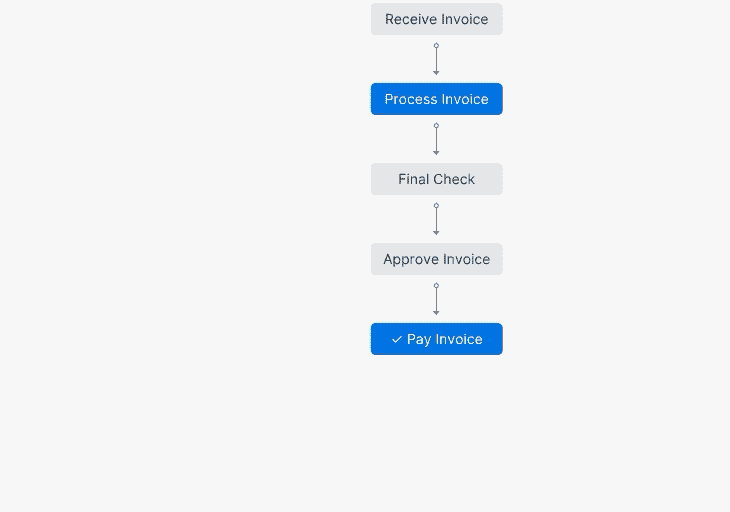
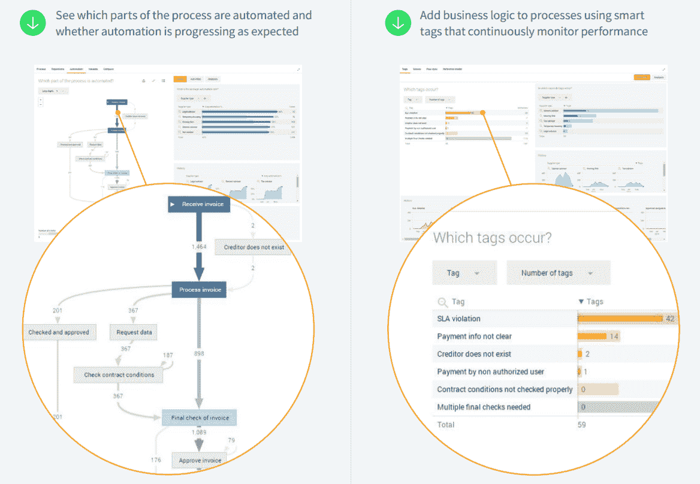

# 流程挖掘和 RPA

> 原文：<https://medium.com/globant/process-mining-rpa-9a16c724c162?source=collection_archive---------0----------------------->

> 流程挖掘作为 RPA 战略的推动者。

# RPA 够好吗？

众所周知，今天的业务运营在很大程度上是由流程驱动的，并由各种相互交织的 IT 系统支持。

在最近几年，我们已经看到数字化转型浪潮推动每个行业将技术融入到他们的运营中，追求效率，并试图改善做生意的方式。由于新冠肺炎效应，这种趋势甚至加速了。

然而，大多数转变并没有达到预期的效果。幕后的复杂性使得简化与业务运营相关的流程变得非常困难。

> 机器人流程自动化(RPA)工具作为一种治标解决方案出现，以消除这些流程中的操作摩擦，重点是尽可能多地自动化任务，从而影响相关成本并提高效率，不仅是流程的效率，也是员工日常工作的效率。

现实情况是，仅仅自动化实际上对业务没有足够的帮助。如今，纵向扩展 RPA 实施面临的主要挑战来自于确定要自动化或应用任何其他优化的正确流程/任务。并且能够监测和测量所产生的影响。

这就是流程挖掘作为自动化策略的推动者出现的地方。

# 什么是流程挖掘，为什么它是一项有前途的技术？

发现流程如何执行或流程端到端看起来如何的传统途径主要依赖于用户访谈、糟糕的文档和传统的咨询方法，如六适马或任何其他手动密集型技术。

这导致了团队成员之间潜在的分歧和**关于真相**的不和——说实话，我们都曾面对满墙的便利贴和一些偶尔的争论。但是不要误解我，这本身并不是一个恶意的立场，而是主观性和自然人类偏见的产物。

不用说，这是一个耗时的过程(根据我的经验，理解和绘制不到 50%的过程可能需要几个星期)，而且几乎不准确。

所有这些限制使得涉众很难理解过程的“现状”,更不容易发现潜在的自动化。只要有可能，就有必要消除矛盾并获得一个关于过程的**客观视角**。这正是流程采矿所做的。

流程挖掘提供了一个基于事实的视图，显示流程在生产中是如何执行的，提供了一个客观的输入，而不是模糊的视觉。

它是如何工作的？—嗯，挖掘工具依靠任何企业系统(SAP、ServiceNow、Salesforce 等)记录的数字足迹(事件日志)，提取与流程相关的信息，**自动发现** **流程蓝图**。

因此，到目前为止，我们保留了关于过程定义的第一个约束。—您可能已经注意到，事件日志成熟度是挖掘流程的关键组成部分。

当然，这不是 process mining 拥有的唯一能力。一旦我们知道了这个过程实际上是什么样子，我们就必须使用这个工具来理解正在发生什么，以及我们如何能够增强那些行为。

这种技术强调处理“传统的”业务流程(采购到支付、订单到现金、来源到支付等等)。但是，注意到物联网的当前趋势，并考虑到多个事件几乎立即被生成和存储，使我们认为过程挖掘技术的潜在应用有几个新的领域。

到目前为止，我们可以说流程挖掘既是一种数据驱动的方法，也是一种以流程为中心的方法，在图形界面中再现现实。

# 业务运营如何从流程挖掘技术中获益？

让我们退一步看一下流程采矿目前提供的机会。

首先，让我们把重点放在任何过程的“现状”上，用矿工的俚语来说就是“过程发现”。

正如我前面已经提到的，基于 SME(主题专家)知识的过程理解甚至重新设计是不够的。业务决策必须得到数据驱动技术的支持，这种技术可以记录事件日志,**会自动显示业务流程的形状**,一眨眼的功夫就能完全了解流程中涉及的步骤。

因此，在这一点上节省的时间和资源已经是值得的了。但是“增强过程发现”只是实现无摩擦操作的第一步。

UiPath Process Discovery — Conformance Checking

第二个重要方面是数据解释或数据科学。这一切都是为了解释工具显示的数据，并识别预期过程行为的潜在偏差。

换句话说，就是以一种有意义的方式利用事件数据。

一旦我们对流程有了全面的了解，我们就可以提供见解、识别瓶颈、预测问题、记录违反政策的情况、建议对策并简化流程。事件日志越丰富，我们就能应用越有意义的分析。

值得一提的是，它还使我们能够看到**数据如何在整个流程中实时流动。**

最后但同样重要的是，增强。

在有信息的情况下和没有信息的情况下，对任何流程应用更改是不一样的。拥有关于过程及其约束或障碍的有意义的信息，允许所有者估计那些变化的影响。还有助于量化节约，以确定路线图中执行的优先顺序。

请记住，为了在这一旅程中取得成功，我们必须将流程挖掘视为一种迭代方法，其中**每次迭代都会释放并提高业务潜力**。

# 流程挖掘如何推动 RPA 战略

在过去几年中，RPA 在一些组织中产生了成功的故事。但同时也滋生了怀疑和恐惧。考虑到这是一项新技术，可以理解。

现在，RPA 战略面临的主要挑战是什么？

基本上，这一切都是为了扩展和能够管理这种新的虚拟劳动力。要在任何自动化策略中取得成功，我们至少要考虑两件事。

一方面，我们需要积压的明确倡议。这将证明投资是合理的，我们生成的自动化越多，我们将获得越多的投资回报(任何 TCO 方案中的 OPEX 方面)。

另一方面，我们需要强大的治理来跟踪正在进行的计划，监控它们的性能，分析 KPI，等等。但与此同时，继续寻找其他业务部门的优化机会。

后者不是微不足道的，识别优化机会可能是一个真正的劳动密集型和主观的任务。必须考虑许多变量来评估它的可行性(技术的和面向业务的),使一个计划既适合自动化，同时又对业务有价值。

通常很难揭示可行性，这里我看到了围绕 RPA 战略经常出现的两种主要情形。

有些组织成功地完成了第一个试点项目，但是当他们试图将该项目推广到整个公司时，他们会很吃力。但是也有公司面临着麻烦，由于选择合适项目的障碍，他们只能从 RPA 计划开始

所有这些障碍都需要额外的努力，这使得我们为 RPA 工作**，而不是让 RPA 为我们工作以实现期望的流畅操作。**

即使是那些确定了合适的自动化流程的公司，也面临着自动化而不是优化流程的问题。考虑到通常的(也是可以理解的)尽快开始使用 RPA 的冲动，整个计划最终自动化了“糟糕的流程”,并产生了可预见的糟糕结果。

> 用比尔·盖茨的话来说:“自动化应用于低效率的操作会放大低效率”

当然，这远不是 RPA 战略面临的唯一挑战。然而，它有助于说明流程挖掘如何像指南针一样准确地显示自动化在哪里有意义，以及在哪里必须考虑其他类型的解决方案(例如，首先重新设计流程)。

这项技术改变了视角，使 RPA 更加准确，并设置了一个数据驱动的决策工具，可以直观地了解问题所在。

# 结论

因此，流程挖掘软件通过内置连接器直接从您的 IT 系统(如 CRM、ERP、BPMs 等)中提取数据，从而带来洞察力。

由于其分析业务流程的科学方法，该工具揭示了效率低下的根本原因，并使我们能够通过揭示需要改进的点来真正控制流程，从而为任何业务案例提供强大的基础。

RPA 技术不应被视为能够单独解决所有问题的灵丹妙药。但是与过程挖掘技术一起提供了一个在机器人实现之前调查、分析和重新设计过程的好机会。这些项目成功的关键在于首先优化，然后自动化。

概括起来，流程挖掘在 4 个方面帮助我们:

1.为了识别过程的实际状态

2.评估和优化流程的动态。

3.确定 RPA 有意义并显示潜在回报的地方。

4.持续监控自动化率、流程合规性和其他 KPI

感谢您抽出时间阅读我的文章！

干杯！