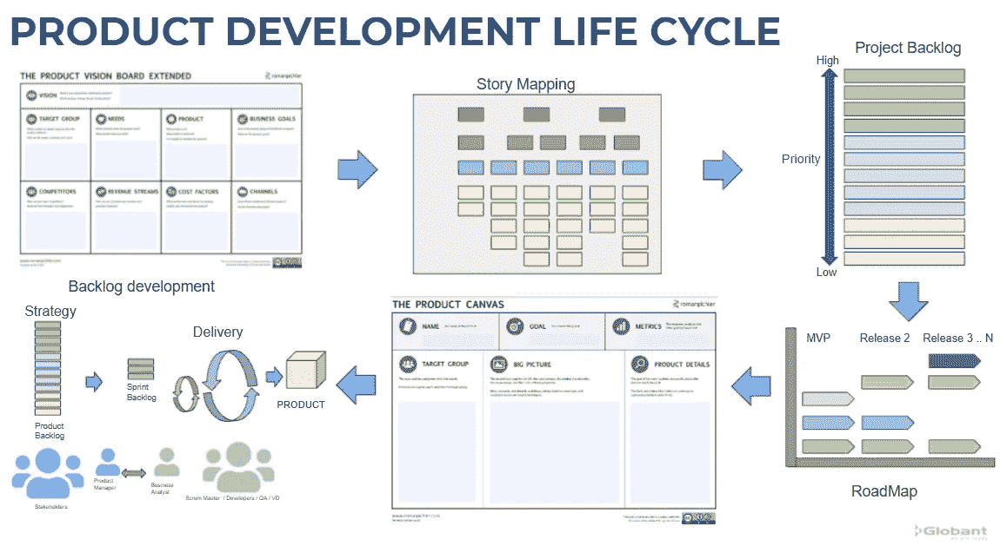
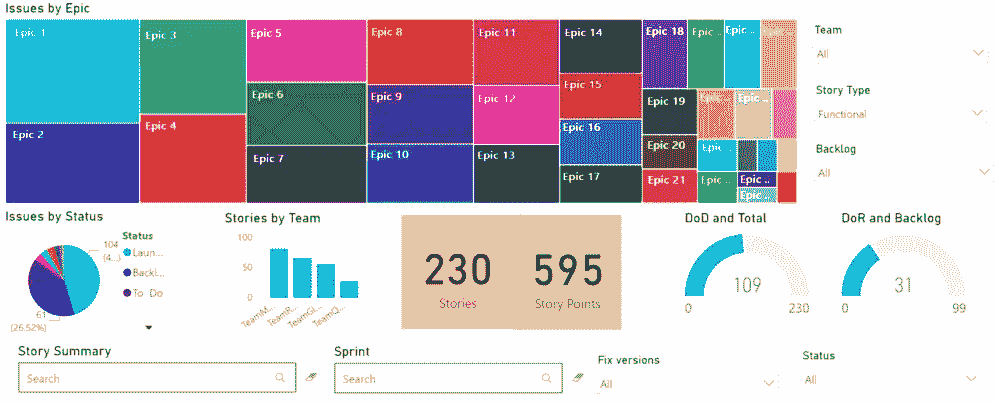

# 产品积压发布指标

> 原文：<https://medium.com/globant/product-backlog-release-metrics-ec0130922165?source=collection_archive---------0----------------------->

产品 backlog 所有者的职责包括跟踪每个产品版本的用户故事，以确保除了与业务部门协商并与团队达成一致的优先级之外，承诺已经交付。

作为产品 backlog 所有者，我们扮演着至关重要的角色。将愿景和路线图与产品的整体知识结合起来是很重要的，包括产品的发展和用户故事如何适应每个特性。编写用户故事是开始产品开发的一个关键因素，但这不是唯一需要关注的任务。作为业务和团队之间的联络人，是产品团队成员的另一个重要职责，以便对产品积压进行优先排序，并完成每个发布目标。

## 从不同的产品开发生命周期阶段开始，作为展示成果和为团队创造价值的挑战

Product Development Life Cycle. Based on tools (Pichler, 2021)

敏捷项目中的产品开发生命周期大多始于使用产品愿景(Pichler，2021)等工具的发现，以定义产品的目标、需求、目标群体、商业价值和产品特性。这些功能可以通过不同的工具来分解，比如 story mapping，通常会生成一个 MVP 产品 backlog，允许您向最终客户提供一个可用的产品，并根据用户的反馈继续工作，以增加产品功能并获得产品发展的正确路线图。

作为一名产品团队成员，您可以在产品生命周期的不同阶段作为项目的一部分开始，理解即将到来的工作的愿景以完成每个版本中的积压工作并向团队传达这一策略是很重要的。

> 验证基于业务目标的特性优先级为项目提供了一个战略远景。

每个版本都有一组必须开发的特性来完成发布目标。产品画布(Pichler，2021)可以帮助您审查发布范围，了解将用于衡量产品目标的指标，审查与发布相关的产品的大图，查看每个 sprint 中交付的产品细节，并根据用户需求定义产品的正确路径。为了跟进发布待定产品积压，您可以通过仪表板、报告或个性化工具使用不同工具生成的指标，如吉拉( *Radigan* ，2021)。

# 仪表板和报告是跟踪产品积压发布度量的工具

Product Backlog Dashboard. Worked on Power Bi Desktop (Microsoft, 2021)

仪表板是一种工具，可以用来跟踪发布计划，并促进与涉众的沟通。仪表板可以包括 KPI 来分析所有产品积压项目，如按功能和状态的故事、完成功能的待定故事、每个状态的故事数量(分析中、准备开发、待定 PO 批准、完成等)。)、团队的故事、每个 sprint 中记录的故事，以及更多与产品 backlog 相关的信息，以方便地显示与实现每个承诺项的 DoD(完成的定义)的未完成工作相关的所有信息。这些信息有助于决定在能力分配范围内按时完成未完成工作的最佳方式。

健康的 backlog 与 DoR(就绪的定义)相关联，DoR 可以被描述为具有团队需要开发的所有定义的用户故事，包括像叙述、接受标准、描述、附件、估计、完成投资(独立的、可协商的、有价值的、可估计的、小的、可测试的)检查，以及团队同意的更多项目。在准备阶段与团队一起验证 PBI 是一个很好的实践，以便为开发准备好这些项目。

当您在计划会议之前根据团队速度准备好足够的 PBI 工作时，您可以认为您的积压工作是健康的。为了有一种方法来度量它，健康的 backlog KPI 是有用的，它显示了为开发人员准备的待定项和团队的速度之间的关系。如果这个关系大于 1，则表示我们有足够的项目供团队进行下一次冲刺。

健康积压 KPI = *(SPS / SPV)*

*SPS:* 完成 DoR
的优先故事的故事点 *SPV* :故事点表示的团队速度

> 如果健康的 backlog 的结果大于 1，那么团队就有足够的工作来完成一个 sprint，但是如果团队提高了速度，有时间处理 backlog 的另一个项目，但是我们还没有准备好项目，那该怎么办呢？

由于优先级的变化或用户的反馈，总是为开发人员准备好项目是一个挑战，但是考虑到这个指标是控制团队积压工作的一种方式，如果这个指标接近 2 或更大，会给产品团队更多的信心，并降低团队没有工作的风险。

在一些项目中，我们一直在使用报告工具，如 PowerBi Microsoft (2021)或吉拉仪表板，在 sprint review 等会议中向利益相关者展示产品发布积压。这可以最大限度地减少花费在解释每个特性的范围、展示已经完成 DoR 的故事以进行下一个 sprints，以及根据发布承诺交流完成每个特性的未完成工作上的时间。

最后，管理团队可以使用不同的指标来控制项目，根据最终的用户反馈，还有与产品相关的指标。在我们作为产品待办事项所有者的角色中，我们必须集中精力确保每个记录的故事完成 DoR，并根据定义的路线图进行优先级排序，以便拥有健康的待办事项列表，并为客户产生价值。

**参考文献**

*皮希勒，R. (2021)。战略工具。从 https://www.romanpichler.com/tools/*T4 取回

微软(2021)。借助 Power BI Desktop *，从数据到洞察再到行动。检索自*[https://powerbi.microsoft.com/en-us/desktop/](https://powerbi.microsoft.com/en-us/desktop/)

*拉迪甘 D. (2021)。产品积压:你最终的待办事项清单。检索自 https://www.atlassian.com*[*/*](https://www.atlassian.com/agile/scrum/backlogs)*敏捷/scrum/积压*

*福曼答(2021)。*吉拉核心仪表板:项目状态一览*。检索自*[https://www . atlassian . com/blog/jira-core/jira-core-dashboard-project-status-glance](https://www.atlassian.com/blog/jira-core/jira-core-dashboard-project-status-glance)